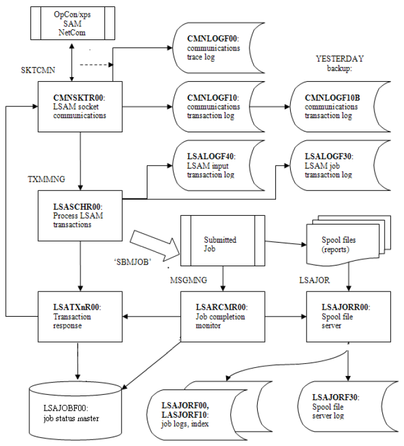

# Log File and Database Management

  -------------------------------------------------------------------------------------------------------------------------------- ----------------------------------------------------------------------------------------------------------------------------------------------------------------------------------------------------------------------------------------------------------------------------------------------------------------------------------------------------------
  .png "Note icon")   **REVISION NOTE:** [This topic was previously titled \"Debug Mode.\" It still describes how to turn debug/audit logging on and off, but the LSAM debug/audit file management has been enhanced with additional tools that help maintain disk utilization and that make it easier to extract log and/or master files to send to SMA Support.]
  -------------------------------------------------------------------------------------------------------------------------------- ----------------------------------------------------------------------------------------------------------------------------------------------------------------------------------------------------------------------------------------------------------------------------------------------------------------------------------------------------------

 

This topic is focused on the log files that the LSAM records as it
performs its automation functions. It describes how to start and stop
debug/audit logging, which is separate from the daily operational log
files that are always used. It also explains the tools that can be used
to control disk space utilization of all LSAM files, including the logs,
and how to extract log and master files so they can be submitted to SMA
Support for problem analysis.

## What\'s New with Log File Management

The improvements introduced to the LSAM with this online help edition
are highlighted temporarily in this document because of their importance
to the existing product users. These changes introduce major
improvements in the ease of file management as well as important
reductions in disk space utilization.

 

  ------------------------------------------------------------------------------------------------------------------------------------- ----------------------------------------------------------------------------------------------------------------------------------------------------------------------------------------------------------------------------------------------------------------------------------------------------------------------------------------------------------------------------------------------------------------------------------------------------------------------------------------------------------------------------------------------------------------------------------------------------------------------------------------------------------
  .png "Caution icon")   **CAUTION:** [Although there are default settings implemented for all the log file management features in the LSAM, SMA strongly recommends that each site carefully review the LSAM Parameters, as described in Configuration. Many sites may wish to change the number of days that log file content is preserved, as well as the number of days that the (new) save files that hold pre-purging backups of the files are retained in the SMALOG library. Please also note that it remains important to adopt a strategy for the execution of the SMARGZ command in order to fully recover disk space after log file records are deleted.]
  ------------------------------------------------------------------------------------------------------------------------------------- ----------------------------------------------------------------------------------------------------------------------------------------------------------------------------------------------------------------------------------------------------------------------------------------------------------------------------------------------------------------------------------------------------------------------------------------------------------------------------------------------------------------------------------------------------------------------------------------------------------------------------------------------------------

### No Copies of IBM i Job Log Reports

One of the most important improvements is the new option to prevent the
LSAM from making copies of every IBM i job log report (that is, for jobs
started by OpCon). The new default is to NOT copy the job logs. Instead,
the LSAM will find and convert job log reports directly from output
queues whenever they are requested by OpCon job output retrieval (JORS).

 

At the same time, the LSAM now supports retrieval of incomplete job log
reports from active jobs. Use the OpCon EM user interface function
\"View Output\" to see any job log report that still exists in the IBM i
system, including viewing the logs of active jobs. (View Output is
typically accessed using a right mouse click on the line or object that
represents a job in an OpCon schedule.)

### Learn About Different Types of LSAM Log Files

To properly manage the LSAM logging function, it is important to
understand the different types of log files:

-   [Daily operational logs]{.ul} are logging operations that cannot be     turned off by the user. They are required for correct operation of
    the LSAM features, or to store a critical history of operations.
-   [Debug/Audit logging]{.ul} is a capability that can be turned on or     off by LSAM administrators. This type of logging supports diagnosis
    of new or failing automation procedures and it also provides a
    detailed audit trail of automation.
-   [Trace logging]{.ul} is an exceptional kind of logging that     generates a very large amount of data in a very short time. This
    type of logging should only be used when specially requested.

### LSAM Periodic Database Maintenance Improvements

It is important to understand the improvements in the way files are
purged and reorganized by LSAM tools. Previously, many LSAM users were
experiencing excessive disk space utilization. The changes to LSAM
Parameters (refer to Configuration)and some LSAM utility commands and
programs now make it easy to avoid this problem. Strategies for managing
disk utilization are enabled by the various tools and parameters
explained throughout this topic.

### SMASUP Improved with Limited Log File Extracts

Part of the process of supporting the LSAM software is the action of
extracting LSAM log files and/or master files to an IBM i save file so
that they can be transferred to SMA Support for analysis. This technique
has made it possible for SMA to diagnose user difficulties and any
software errors without needing to directly connect to client systems.
Previously, the SMASUP command tried to extract all the LSAM log files
at once, but these files can sometimes get very big, so the SMASUP
command was not useful. Now, the SMASUP command supports a display
format that makes it easy to select logs and/or master files for one or
more LSAM features, as may be requested by SMA Support.

### LSAM Parameters Controlling Log Purging

[]{#aanchor18} IBM i LSAM Configuration illustrates and explains the individual LSAM Parameters that govern how files are purged and
reorganized. As noted in the Warning box above, please carefully review
these parameters in order to get the best benefit from the LSAM
improvements. SMA clients are invited, as always, to contact SMA Support
with any questions about how these LSAM features work.

## Procedure to Manage LSAM Debug/Audit Logging

This section presents a simplified method for starting, stopping, and
retrieving LSAM debug log information. Please ask advice from SMA
Support in order to decide which logging features to use and what log
file content is needed to help solve a problem. More information about
debug/audit logging may be found in the section titled Manage LSAM
Logging, below.

 

  -------------------------------------------------------------------------------------------------------------------------------- --------------------------------------------------------------------------------------------------------------------------------------------------------------------------------------------
  .png "Note icon")   **NOTE:** [It is not necessary to stop and restart the LSAM server programs when starting or stopping the debug logging features for the main job scheduling server programs.]
  -------------------------------------------------------------------------------------------------------------------------------- --------------------------------------------------------------------------------------------------------------------------------------------------------------------------------------------

 

The term \"debug/audit\" implies that a certain group of LSAM log files
are not required for daily operation of the LSAM features. However,
these optional logging functions should be considered a requirement
during the early weeks and months when the LSAM is first used because
they provide information that is necessary to diagnose problems with the
configuration of LSAM automation features, and with job scheduling by
the LSAM for OpCon. This is the \"debug\" purpose of these files.

 

At the same time, these logging options may be permanently useful to
sites for the \"audit\" purpose, since they provide evidence of the LSAM
automation that might be required by auditors of data center operations.
Therefore, SMA recommends that most sites should plan on leaving the
debug/audit logging options turned on (except do NOT turn on the \"trace
logging\" options, as explained below). The current set of LSAM
automatic database management programs can be tuned by LSAM Parameters
so that disk space utilization can be kept at acceptably low levels.

 

[[]{#Turn_On_Debug_Logging}Turn On Debug Logging]{.ul} 
1.  Log into the IBM i wit a user profile that has LSAM administration
    privileges.
2.  In the command line, enter **SMAGPL/STRSMA**. For more information
    on STRSMA command parameters, refer to [The STRSMA     Command](Components-and-Operation.md#The).
3.  Enter **6** to choose the LSAM management menu in the SMA Main Menu.
4.  Enter **4** to choose Manage LSAM logging in the Operator Replay
    Menu.
5.  Type a \"**1**\" (= Start) next to one or more logging features.
    a.  It is possible to type \"**1**\" next to logging functions one
        at a time, then press \<**Enter**\> to update the Pending
        status, until the correct logging profile is shown. Pressing
        \<**Enter**\> does not initiate any Start or End actions.
6.  Press \<**F7**\> (= STRSMALOG) to immediately start the selected
    logging.
    a.  Use \<**F14**\> to store the logging option in the LSAM
        Parameters, so that it will not take effect until the next time
        that the LSAM server jobs (or other feature) are restarted.
7.  Start the LSAM, if it is not already active in the SMA Main Menu.

[[]{#Turn_Off_Debug_Logging}Turn Off Debug Logging]{.ul} 
1.  Log into the IBM i with a user profile that has LSAM administration
    privileges.
2.  In the command line, enter **SMAGPL/STRSMA**. For more information
    on STRSMA command parameters, refer to [The STRSMA     Command](Components-and-Operation.md#The).
3.  Enter **6** to choose the LSAM management menu in the SMA Main Menu.
4.  Enter **4** to choose Manage LSAM logging in the Operator Replay
    Menu.
5.  Type a \"**4**\" (= End) next to one or more logging features.
    a.  It is possible to type \"**4**\" next to logging functions one
        at a time, then press \<**Enter**\> to update the Pending
        status, until the correct logging profile is shown. Pressing
        \<**Enter**\> does not initiate any Start or End action.
6.  Press \<**F8**\> (= ENDSMALOG) to immediately end the selected
    logging.
    a.  Use \<**F14**\> to store the logging option in the LSAM
        Parameters, so that it will not take effect until the next time
        that the LSAM server jobs (or other feature) are restarted.

[View and Retrieve the Debug Log Files]{.ul} 
1.  Log into the IBM i with a user profile that has LSAM administration
    privileges.
2.  All log files may be viewed from one of the functions on the View
    LSAM logs sub-menu, explained below. The log viewer sub-menu is
    accessed by selection option 6 from the LSAM main menu, then option
    5 from the LSAM Management sub-menu.
3.  To retrieve log files, refer to Delivering Logs to SMA Support,
    below. This is done using the command SMASUP (with the LSAM library
    list in effect), or by pressing \<**F15**\> from log viewer screens
    that support this function key, as documented below.
4.  To view any of the physical log files in the table below:
    a.  To view the physical log file\'s raw file data:
        i.  In the command line, enter **DSPPFM** *\<physical file
            name\>*.
    b.  The formatted viewers available from the LSAM menu system
        (described in the next section) make the log data much easier to
        understand. These viewers can also be executed from a command
        line using the commands listed in the following table.

  Type of Log                                                                                          LSAM viewer command       Physical file name
  --------------------------------------------------------------------------------------------------- --------------------- -----------------------------
  Job scheduling communications trace log                                                                   LSACMNLOG                 CMNLOGF00
  Job Sched comm transaction log (today\'s data) [1]{style="font-size: 80%;vertical-align: super;"}      LSATXNLOG TODAY              CMNLOGF10   Job Sched comm transaction log (yesterday\'s) [1]{style="font-size: 80%;vertical-align: super;"}     LSATXNLOG YESTERDAY           CMNLOGF10B
  LSAM transaction log                                                                                      LSAINPLOG                 LSALOGF40
  LSAM submit job log (contains readable text)                                                          DSPPFM LSALOGF30              LSALOGF30
  LSAM job status management file                                                                           DSPJOBSTS                 LSAJOBF00
  Job status trace log                                                                                      DSPIDXTRC                 JOBIDXF00
  Spool file management control file                                                                        LSAJORCTL                 LSAJORF20
  Spool file server log                                                                                     LSAJORLOG                 LSAJORF30
  Job log trace/storage file                                                                                LSADSPLOG                 LSAJORF00
  Job log index file                                                                                        LSADSPLOG                 LSAJORF10
  JORS communications trace log                                                                             JORCMNLOG                 JORLOGF00
  JORS comm. transaction log file [1]{style="font-size: 80%;vertical-align: super;"}                        JORTXNLOG                 JORLOGF10   Job Tracking failed SBMJOB command log                                                                DSPPFM TRKLOGF00              TRKLOGF00
  Display FTP transfer job output logs                                                                      LSADSPFTP        LSAFTPLOG(multiple members)

  : Basic LSAM Log Viewer Commands and Physical File Names

 

[1]{style="font-size: 80%;vertical-align: super;"}The communications transaction log files are always used and not controlled by user
options.

  Type of Log                                      LSAM viewer command   Physical file name
  ----------------------------------------------- --------------------- --------------------
  Display SMAFT Agent communications trace log          DSPSFALOG            SFTLOGF00
  Display SMAFT Server communications trace log         DSPSFSLOG            SFTLOGF10
  View SMAFT job index master file                  DSPPFM SFTJOBF00         SFTJOBF00
  View SMAFT job details master                     DSPPFM SFTJOBF10         SFTJOBF10

  : LSAM SMA File Transfer Log Viewer Commands and Physical File Names

 

  Menu\# : Function \# : Type of Log                                                                        LSAM viewer command                                        Physical file name
  ---------------------------------------------------------------------------------------- ------------------------------------------------------ -------------------------------------------------------------
  1 : 2 : Job Track Logs                                                                                         WRKTRKJOB                         LSALOGF00 (activity log)TRKJOBF00 (tracked job definitions)
  2 : 2 : 1 : Display message management activity log                                                         (call trpmsgr03)                                              LSALOGF10
  2 : 2 : 2 : Display OpCon/xps (IBM i) job-level message management log                                      (call trpmsgr03)                                              TRPMSGF20
  3 : 8 : Display captured data log (SCANSPLF)                                                           CALL OPRLOGR40 PARM(\'S\')                                         OPRLOGF40
  3 : 9 : Display data capture debug log (SCANSPLF)                                                      CALL CAPLOGR10 PARM(\'S\')                                         CAPLOGF10
  4 : 2 : Operator Replay logs (session log)                                                                  (call oprlogr00)                                              OPRLOGF00
  4 : 2 : Operator Replay logs (trace screen formats and response strings/function keys)    (call oprlogr10, requires parameters from oprlogr00)                            OPRLOGF10
  4 : 8 : Display captured data log (Screens: Operator Replay)                                           CALL OPRLOGR40 PARM(\'C\')                                         OPRLOGF40
  4 : 9 : Display data capture debug log (Screens: Operator Replay)                                      CALL CAPLOGR10 PARM(\'C\')                                         CAPLOGF10
  5 : 3 : Restricted mode - history of last use                                                                  SAVRSTR05                                                  SAVLOGF00

  : Other LSAM Function Log Viewer Commands and Physical File Names

## Strategic Location of Log Files

Technical support staff may find it helpful to understand the
transaction flow that produces many of the log files. Names of some of
the LSAM server jobs are shown in all capital letters above some of the
program object boxes.

Strategic Location of Log Files

## Manage LSAM Logging

The IBM i LSAM supports active control over its logging capabilities. In
general, logging is a local function that is not part of LSAM
communications with OpCon, but instead it is a tool that is useful to
system administrators, programmers, and support technicians\... as well
as for providing proof of automation to auditors. The IBM i LSAM has the
ability to log transaction management events at virtually every point in
the input/output flow of its communications process. Each of these
logging capabilities can be controlled separately. Use the logging
control functions to:

-   Request that the system start logging a function immediately.
-   Request that the system start logging a function at the next new
    start of the function.
-   Choose to log the internal transactions that the IBM i LSAM
    generates, and/or all the input and output activity of the IBM i
    LSAM sockets communications program.
-   Engage a secondary level of highly detailed trace logging, on a
    limited basis, to debug complex problems. (CAUTION: Do not use
    \"trace logging\" unless requested by SMA Support, to avoid excess
    disk utilization and possible impacts on system performance.)

The setting of log controls by the start and end commands is \"sticky.\"
This means that after logging is set on it remains on even after the IBM
i LSAM functions have been stopped and restarted. The same is true for
ending logging. Once logging has been ended for a function, it does not
start again until the start command is used, even if the programs doing
the logging are stopped and restarted.

### Manage LSAM Server Logging

Managing LSAM logging starts with a Server Logging status display from
which function keys are used to implement the Start or End requests that
are typed into the Option fields. The function key \<**F2**\> is used to
toggle between the LSAM server job logging functions and a separate
display format where other LSAM utility logging options are gathered
into a single management display.

-   **Screen Title**: Manage LSAM Server Logging
-   **Screen ID**: MNGLOGR1

###### Menu Pathways

Main Menu \> LSAM management menu (\#6) \> option 4

###### Fields

-   **Opt**: Type an option next to any/all of the lines, then press
    Enter to register the request under the Pending column, or press F7
    and/or F8 to implement the actions immediately.
    -   VALUES: 1 = Start, 4 = End.
-   **LSAM server/function**: The name of the LSAM server job or other
    LSAM feature that supports Debug/Audit logging.
-   **CTL STS**: Control Status: This column shows the current settings
    that are stored in the LSAM Parameters control file.
    -   VALUES: Yes, No.
    -   This status does not reflect whether the LSAM server jobs are
        active or stopped. It is possible that the control file settings
        do not match the current live job logging status, if new control
        values were stored using F14 from this display. In that case,
        stopping and restarting the LSAM server jobs would be necessary
        to assure that the current Control Status reflects the actual
        status of logging in the active LSAM server jobs. This Control
        Status does indicate how the LSAM server jobs will handle
        logging the next time they are started.
-   **Pending**: When the Enter key is pressed after one or more options
    are typed next to the list lines, the Option value that was typed is
    reflected in the Pending column.
    -   VALUES: Start, End.
    -   Pressing Enter does not cause any change to the LSAM Parameters
        control file or to any active LSAM server jobs. The Pending
        column is a good way to edit the planned logging changes before
        they are implemented, either by pressing F7 or F8 to cause an
        immediate change to the active LSAM server jobs (and to store
        the new values in the LSAM Parameters control file), or by
        pressing F14 to only store the values in the LSAM Parameter
        control for later reference the next time that the LSAM server
        jobs are restarted.

###### Options

-   **1=Start**: Mark a logging function for starting.
-   **4=End**: Mark a logging function for ending.

###### Function

-   **F2=Manage Utility logging**: Branch to display format R6 to manage
    logging of other LSAM features and utilities.
-   **F3=Exit**: Returns to the LSAM menu system.
-   **F5=Refresh**: Re-reads the LSAM controls to display the current
    status and resets all Options and Pending fields.
-   **F7=STRSMALOG**: Executes the pending Start requests by storing the
    values in the LSAM control file and then signaling the LSAM server
    jobs to start logging immediately. (Can also be used to execute all
    values of 1=Start in the Options field, without pressing Enter
    first. If LSAM server jobs are inactive, new settings will take
    effect with the jobs are restarted.)
-   **F8=ENDSMALOG**: Executes the pending End requests by storing the
    values in the LSAM control file and then signaling the LSAM server
    jobs to stop logging immediately. (Can also be used to execute all
    values of 4=End in the Options field, without pressing Enter first.
    If LSAM server jobs are inactive, new settings will take effect with
    the jobs are restarted.)
-   **F9=View server logs**: Branch to the LSAM list of log viewer
    programs.
-   **F12=Cancel**: Returns to the LSAM menu system.
-   **F14=Save pending**: Stores all Start and End requests that appear
    in the Pending column into the LSAM control file, but does not
    change the current logging action of any active LSAM server jobs.
    (New settings will take effect the next time that the LSAM server
    jobs are restarted.)
-   **F15=Extract files**: Branches to the display format that imitates
    a prompted SMASUP command, where an extract of log and/or master
    files may be requested.

### Manage LSAM Utility Logging

Pressing \<**F2**\> from the initial LSAM logging management display
causes the maintenance program to switch to a different display where
the debug/audit logging for LSAM utility features can be managed. These
LSAM utility logging options are also each managed when selecting option
7 (in most cases) from the sub-menu where each LSAM feature is managed.
The effect of maintenance is the same from those locations as from this
summary display.

-   **Screen Title**: Manage LSAM Utility Logging
-   **Screen ID**: MNGLOGR6

###### Menu Pathways

Main Menu \> LSAM management menu (\#6) \> Option 4 \>F2=Manage Utility
Logging

###### Options

This summary screen shows the options for each control field to the
right, in the blue prompting text. There is also a column of pink values
under the \"Dft\" heading that shows the setting that SMA recommends for
normal operations.

###### Fields

-   **Value input field**: Type one of the control values that is shown
    in blue to the right of each input field, then press Enter to store
    that new value in the LSAM Parameters control file.
-   **DFT (default)**: The default value is displayed as the typical
    standard setting that SMA recommends. This helps to avoid setting on
    a \"trace logging\" function by accident.

###### Functions

-   **F2=Manage Server logging**: Branch back to display format R1 to
    manage logging of the LSAM server jobs.
-   **F3=Exit**: Returns to the LSAM menu system.
-   **F5=Refresh**: Re-reads the LSAM controls to display the current
    status and resets all Options and Pending fields.
-   **F12=Cancel**: Returns to the LSAM menu system.
-   **F15=Extract files**: Branches to the display format that imitates
    a prompted SMASUP command, where an extract of log and/or master
    files may be requested.

### Viewing the LSAM Log Files

Many of the LSAM log viewer programs may be accessed from a sub-menu
that can be accessed from the Manage LSAM Logging function using
function key \<**F9**\> or from the LSAM Menu \#6, option 5.

-   **Screen Title**: View LSAM Logs
-   **Screen ID**: MNGLOGR2

###### Menu Pathways

-   Main Menu \> LSAM management menu (\#6) \> Manage LSAM logging
    (\#4) \>F9
-   From command entry, using the LSAM environment library list, enter
    any one of the commands that appears on the View logs sub-menu.

###### Fields

Type a number (1 -- 14) into the Selection entry field and press
\<**Enter**\> to execute the selected viewer.

+-----------------+----------------+---------------------------------+
| Field           | Default        | Description                     |
|                 |                |                                 |
|                 | (Valid Values) |                                 |
+=================+:==============:+=================================+
| Selection entry | none (1 -- 14) | Type the number of the view     |
|                 |                | function to use into this       |
|                 |                | field. Press \<**Enter**\> to   |
|                 |                | start the viewer.               |
+-----------------+----------------+---------------------------------+

:  

 

###### Options

Most of the individual log viewers are not documented in this online
help. These viewers are tools meant for use by support and technical
personnel. The technical construction and operation of the LSAM software
must be understood in order for these log views to be useful. When the
system is well understood, the log viewer instructions are obvious, and
in most cases they offer well-labeled formatting of each type of
transaction that may appear in the detail display of a given log entry.

 

For more information about the log files displayed by each viewer
utility, refer to the [Viewing the LSAM Log Files](#Viewing){.MCXref
.xref} display. There is a helpful flow chart that shows the location of
many log files in the overall LSAM transaction management process. Refer
to [Strategic Location of Log Files](#Strategi).

###### Functions

-   **F3=Exit**: Abandons the Manage LSAM logging function and returns
    to the menu.
-   **F12=Cancel**: Returns to the Manage LSAM Logging status display.
-   **F15=Extract log files**: Used to deliver log file content to SMA
    Support. Refer to explanation, below.

#### Display Spool File Management Control File (LSAJORCTL)

The spool file management control file stores information about spool
files that have been copied. It is possible to use function keys from
the detail display of certain control file records to examine the job
that controls the copy of the spool file and also to view the copied
spool file itself.

-   **Screen Title**: Spool File Management Control
-   **Screen ID**: JORCTLR1

The list is created by two functions of the LSAM servers. The LSAM job
scheduling server records a record for each spool file management entry
received from OpCon/xps. Immediately afterward, the LSAM spool file
management server may update these records when a spool file must be
copied to a new user or output queue. The spool file management server
will also add new records to the list whenever a record of type \*ALL
requires that a spool file be copied. The new record will show the name
of each spool file that is copied and then also show the job and spool
file number of the copy that was created.

 

An example of the spool file control record detail, corresponding to the
line above where option 5 has been entered, is illustrated in the screen
below. Notice that the selected line is one of a group of spool files
corresponding to the original IBM i job name 126957/USER01/JOBQA01.
There is also a column of data labeled LR\# which is the log record
number. This number helps to identify multiple actions that were
performed on the same spool file, in this case a file named QPRTLIBL.
There are three entries for file QPRTLIBL associated with this job. Each
control record explains whether the original spool file was updated in
place or whether it was copied to a new user or new output queue.

 

In this example, the third record (LR\# 003) was actually created in
response to one of the \*ALL control records (this is not obvious in the
list, but the details of all the records would make this apparent). The
detail display (option 5) can be used to analyze the actions taken for
each spool file entry. This detailed information can be compared to the
original configuration of the OpCon/xps job in order to evaluate how the
LSAM responded to the OpCon/xps spool file management instructions.

 

The display of entry details is also helpful for finding any spool file
copies. Copied spool files do not belong to the original job that
produced them. Rather, IBM i assigns copied spool files to a special
system job called QPRTJOB. There is a separate instance (separate IBM i
job number) of the QPRTJOB job for each IBM i user profile that has ever
had a spool file copy made. The QPRTJOB job number persists, even though
it is not an actual active job; the job name, user and number are used
over and over each time a new copy is made of an existing spool file.

-   **Screen Title**: Spool File Management Log Detail
-   **Screen ID**: JORCTLR2

The screen shows the detail of a spool file management control record,
with added run-time information, converting this record into an activity
log record. When the two Target fields near the bottom of the display
show any data, this is an indication that the spool file has been copied
to a new user or a new output queue. The Target job ID shows the target
user name, not the name of the original Job user (displayed near the top
of this screen). There is also a Target spool file number that may be
used to find the actual copy of the spool file within the target job.
This task is made easier by the function keys explained below.

###### Functions

-   **F8=Work orig job**: Shows an IBM i WRKJOB menu for the job that
    created the original spool file. On the WRKJOB menu, option 4 can be
    used to list and view all the spool files that were created by the
    original job, including the spool file represented by the log record
    on this detail display.
-   **F9=Work QPRTJOB**: Shows an IBM i WRKJOB menu for the Target job
    ID listed on the detail display.
-   **F10=View new SPLF**: Identical to using option 4 from the WRKJOB
    menu of the Target job ID, this function key provides convenient
    direct access to the contents of the copied spool file. Viewing
    spool files with the IBM IBM i spool file viewer does not show all
    the formatting that would appear on an actually printed report. Most
    notably, blank lines are omitted from the interactive viewer.

## Extracting Log and Master Files

Whenever SMA Support may request that a client extract LSAM log or
master file content for problem analysis, a client may use either the
SMASUP command (from an IBM i command entry line, if that is permitted
at a given site) or the function key F15=Extract files, wherever that
function key is supported.

 

For technical support personnel: after the SMASUP command (or
F15=Extract files) function has been executed at least once, the LSAM
utility command DSPSUPDTA can be used to display the Agent profile
information. This block of information is sent to the OpCon server each
time an Agent allows a new connection with the OpCon server, and it is
also included with the log files extracted by the SMASUP command. The
SMASUP command must be run at least once in order to generate the data
viewed by the DSPSUPDTA command. The SMASUP command must also be
executed to update the DSPSUPDTA data with the latest information, such
as the current LSAM PTF level.

### SMASUP Command Prompting

Changes have been made to the SMASUP command used in the past, now
eliminating the need for two of the original SMASUP command parameters.
But the command actually still supports those command keywords in order
to avoid causing problems for previously configured IBM i jobs, or other
programs at client sites, that may already be referring to these command
parameters. The parameters CLRLOG() and RESTART() are no longer used
because they are replaced by new automatic Debug/Audit log file purging
(as described in previous sections, referenced above).

 

As an IBM i command, the SMASUP command can be executed from anywhere
that IBM i commands are supported. However, unlike some LSAM environment
management commands that include library list management, this command
does not manage a job\'s library list, therefore the LSAM environment
libraries must be included in the library list of any job that will
execute this command. The command syntax show below includes the library
location of the command, although this may not be required in most
circumstances where this command would be executed.

 

  --------------------------------------------------------------------------------------------------------------------------------- -------------------------------------------------------------------------------------------------------------------------------------------------------------------------------------------------------------------------------------------------------------------------------------------------------------------------------------------
  .png "Example icon")   **EXAMPLE:** [SMAPGM/SMASUP LOGLIB(SEL)]{style="font-family: 'Courier New';"} [CLRLOG() RESTART() SEL_OPTS\_\_()]{style="font-family: 'Courier New';font-weight: bold;font-style: italic;"} [JOBTRK(0) MSGMGT(0) UTIL(0) OPRRPY(0) RSTMOD(0) JOBSCH(0) JORS(0) SPLF(0) SMAFT(0) FTPJOB(0) EXPIMP(0)]{style="font-family: 'Courier New';"}
  --------------------------------------------------------------------------------------------------------------------------------- -------------------------------------------------------------------------------------------------------------------------------------------------------------------------------------------------------------------------------------------------------------------------------------------------------------------------------------------

 

In the example above, three command parameter keywords are shown with no
value included. The two parameters CLRLOG() and RESTART() are no longer
supported, and they exist only to support any uses of this command from
previous versions of the LSAM software. The SEL_OPTS\_\_() keyword has
no function; it is a hidden parameter that exists only to control the
format of the prompting text (as illustrated in an example below), so
that the conditional extract option keywords can be labeled with a
heading.

 

All of the SEL option keywords that follow the LOGLIB(SEL) keyword have
no effect when the LOGLIB() keyword is set to either value (LOG) or
(LIB). But when the value LOGLIB(SEL) is specified, at least one of the
following LSAM feature option fields should be set to a value of (1),
otherwise no file extract will be performed.

 

The keywords for each parameter shown in the following two figures are
listed above in the SMASUP command syntax.

Prompted SMASUP Command (Default)

  -------------------------------------------------------------------------------
                       Extract LSAM Logs and Files (SMASUP)
                                          
                            Type choices, press Enter.
                                          
           Submit SMASUP job? . . . . . . .   N             N=no, Y=yes
          Save selected, logs or library     LOG           SEL, LOG, LIB
         Clear (not used) . . . . . . . .                 (No longer used)
         Restart (not used) . . . . . . .                 (No longer used)
                            SEL log file options:     
                                          
                                          
                                      Bottom
   F3=Exit   F4=Prompt   F5=Refresh   F12=Cancel   F13=How to use this display  
                                   F24=More keys
  -------------------------------------------------------------------------------

 

To view and manage the SEL (selection) parameters, type the letters
\"SEL\" in the field \"Save selected, logs or library\" and then press
\<**Enter**\>. When this LOGLIB() parameter has been changed from LOG or
LIB to SEL, pressing Enter will not cause the command to execute but
will only redisplay the command prompt with additional keywords.

Prompted SMASUP Command (SEL Fields)

  -----------------------------------------------------------------------------------------------------------
                                     Extract LSAM Logs and Files (SMASUP)
                                                        
                                          Type choices, press Enter.
                                                        
                         Submit SMASUP job? . . . . . . .   N             N=no, Y=yes
                        Save selected, logs or library     SEL           SEL, LOG, LIB
                       Clear (not used) . . . . . . . .                 (No longer used)
                       Restart (not used) . . . . . . .                 (No longer used)
                                          SEL log file options:      
                Save Job Track/Capture logs? . .   0             0=no, 1=Logs, 2=+Mstr, 3=Mstr 
                Save Message Management logs?  .   0             0=no, 1=Logs, 2=+Mstr, 3=Mstr
                Save Utility/SCANSPLF logs?  . .   0             0=no, 1=Logs, 2=+Mstr, 3=Mstr
                Save Operator Replay logs? . . .   0             0=no, 1=Logs, 2=+Mstr, 3=Mstr
                Save Restricted Mode logs? . . .   0             0=no, 1=Logs, 2=+Mstr, 3=Mstr
                Save Job Schedule logs?  . . . .   0             0=no, 1=Logs, 2=+Mstr, 3=Mstr
                Save JORS server logs? . . . . .   0             0=no, 1=Logs, 2=+Mstr, 3=Mstr
                Save SPLF server logs? . . . . .   0             0=no, 1=Logs, 2=+Mstr, 3=Mstr
                Save SMA File Transfer logs? . .   0             0=no, 1=Logs, 2=+Mstr, 3=Mstr
                Save simple FTP job logs?  . . .   0             0=no, 1=Logs, 2=+Mstr, 3=Mstr
                Save GENEMLREQ logs? . . . . . .   0             0=no, 1=Logs, 2=+Mstr, 3=Mstr
                                                   More\...
                                                        
         [(after pressing PageDown to see More\...)]{style="font-weight: normal;font-style: italic;"}                                                         
   [Save Export/Import logs? . . . .   0             0=no, 1=Logs, 2=+Mstr, 3=Mstr]{style="color: #008000;"}                                                     Bottom
                                                        
                  F3=Exit   F4=Prompt   F5=Refresh   F12=Cancel   F13=How to use this display
                                                 F24=More keys
  -----------------------------------------------------------------------------------------------------------

### F15 = Extract Log Files (SMASUP Command)

-   **Screen Title**: Extract LSAM Logs and Files
-   **Screen ID**:
    -   MNGLOGR3
    -   MNGLOGR4

###### Menu Pathways

-   Main Menu \> LSAM management menu (\#6) \> option 4 \> F15
-   Main Menu \> LSAM management menu (\#6) \> option 4 \> F2 \> F15
-   Main Menu \> LSAM management menu (\#6) \> option 5 \> F15

###### Options

The IBM i command DSPSAVF can be used to see the content of the extract
save file that will be created in the SMALOG library. This display will
show exactly which files are saved for each combination of extract
options and LSAM features, according to the following options selected
for each LSAM feature:

-   **0=No files saved**: Any LSAM feature showing option 0 will have
    none of its log or master files saved. It is common to leave all the
    fields set to 0 except for just one LSAM feature, in order to
    maintain a small size of the IBM i save file that will be produced.
-   **1=Save log files only**: A pre-programmed list of log files that
    pertain to each LSAM feature will be saved in the extract save file.
-   **2=Save log files & master files**: A pre-programmed list of log
    and master files that pertain to each LSAM feature will be saved in
    the extract save file.
-   **3=Save master files only**: A pre-programmed list of log and
    master files that pertain to each LSAM feature will be saved in the
    extract save file.

###### Functions

-   **F3=Exit**: Returns to the LSAM menu system.
-   **F5=Refresh**: The display program updates all the information
    about every control record. This refresh option is important when
    trying to verify the results of the option 8 Test Notify job.
-   **F12=Cancel**: Returns to the previous LSAM display from which the
    F15 was executed, without performing any file extract.
-   **Enter**: After the desired field options are typed, press Enter to
    submit or start the file extract operation. As documented elsewhere
    in the **IBM i LSAM** online help, a completion message will be
    displayed both in the QSYSOPR message queue and the user\'s (or
    workstation\'s) message queue, reporting the exact name of the save
    file that was created in library SMALOG. Use this save file name
    when transferring the save file from the IBM i DB2 database to an
    external computer (such as a personal computer), from which the save
    file can then be easily sent to the SMA ftp server location that
    pertains to each client.

###### Fields

The fields on the Extract LSAM Logs and Files display format are
self-explanatory.

### Operation of Extracting LSAM Log and Master Files

The use of the Extract LSAM Logs function is explained on the
interactive prompt screen and in the sections above that describe the
SMASUP command and the display format for F15 = Extract files. After
selecting the appropriate processing options, press \<**Enter**\> to
complete the extract process. If the extract process was executed from
an interactive job (submit option set to N = no), a completion message
will appear at the bottom of the prompt display.

 

Note the format of the extract save file name appearing in the
completion message. The extract save file is named LyMMddhhmm (one digit
of the year, plus month, day, hours and minutes). This format should
make it easy to track these save files in case they are needed for
problem studies or as a backup of the entire SMADTA library. Extract
save files are placed in the SMALOG library, even if an alternate LSAM
environment is being used. (The SMALOG library is created by the extract
utility program the first time it runs, if it does not already exist.)

 

The same completion message will also be sent to the IBM i Operator
Message Queue (usually QSYSOPR). If the job is submitted, this message
will be delivered to both the Operator Message queue and to the message
queue for the submitting user ID.

 

Record the name of the save file displayed in the completion message
because it will be needed during the FTP (or other file transfer)
process of copying the save file and sending it to SMA Support.

 

  -------------------------------------------------------------------------------------------------------------------------------- ---------------------------------------------------------------------------------------------------------------------------------------------------------------------------------------------------------------------------------------------------------------------------------------------------------------------------------------------------------------------------------------------------------------------------------------------------------------------------------
  .png "Note icon")   **NOTE:** [It is usually necessary to turn on the LSAM logging functions, using the documented Manage LSAM Logging function, before a useful log file extract can be performed. Trace logging is not performed during normal LSAM operations because it could impact system performance. SMA technical support can provide detailed instructions about which type of logging to enable and which LSAM functions to execute before a log file extract is completed.]
  -------------------------------------------------------------------------------------------------------------------------------- ---------------------------------------------------------------------------------------------------------------------------------------------------------------------------------------------------------------------------------------------------------------------------------------------------------------------------------------------------------------------------------------------------------------------------------------------------------------------------------

### Delivering the LSAM File Extract to SMA Technical Support

The LSAM file extract process produces an IBM i save file in library
SMALOG. This save file can be transferred using FTP from the System i
(or IBM Power server) disk to, for example, a Windows PC. It can then be
attached to an eMail message if it is not too large, or it can be
transferred to an SMA FTP site. SMA Support can provide detailed
instructions to assist with the process of transferring the save file.

 

The extract save files have been improved to be smaller than in previous
LSAM releases by using IBM i software data compression, and by an
improved selective process that limits the number of files saved. The
extract process produces IBM i save files that are marked for the same
IBM i version under which the files are created. SMA Support can
accommodate all currently supported versions of IBM i.

 

One typical method of using FTP to transfer the save file from IBM i to
a PC Windows workstation is illustrated in the following example
instructions.

#### FTP the Logs Save File

1.  From a Microsoft Windows system, use FTP to transfer the logs save
    file to a personal computer hard disk directory from the IBM i
    library SMALOG. The save file is transferred to the MS Windows
    machine by a binary FTP transfer from IBM i acting as the FTP
    server, using the following steps.
2.  Use menu path: **Start \> Run**.
3.  Type **cmd**.
4.  Click **OK**.
5.  If desired, change the drive reference to a convenient location on
    the personal computer hard disk by entering the drive letter
    followed by a colon (:).
6.  As desired, change the directory to a location where it will be easy
    to find the transferred file, for example, the root directory of
    drive C:
7.  At the prompt, enter **ftp** \<LSAM Machine Name or TCP/IP
    address\>.
8.  Log in as **QSECOFR** with the appropriate \<QSECOFR password\> or
    it may be possible to log in and retrieve the logs save file with
    the user profile name that created the logs save file, such as an
    LSAM Administrator user profile.
9.  Enter **bin** to select a binary transfer type.
10. Enter **GET SMALOG/L601101648** (using the actual log file name
    reported in the SMASUP command completion message) to retrieve the
    logs save file, using the actual log file name from the extract
    process completion message.
11. Enter **quit** to exit the FTP utility.
12. Enter **exit** to close the command entry window.

## General LSAM Database Maintenance (SMARGZ)

The LSAM utility command SMARGZ is used to perform the following
maintenance functions:

-   Complete a full backup of the library SMADTA (uses the SMASUP
    command in LIB mode)
-   Reorganize all the physical data files in library SMADTA to recover
    disk space from deleted records
-   Delete aged save files from the library SMALOG

  ------------------------------------------------------------------------------------------------------------------------------------- --------------------------------------------------------------------------------------------------------------------------------------------------------------------------------------------------------------------------------------------------------------------------------------------------------------------------------------------------------------------------------------------------------------------------------------------------------------------------------------------------------------------
  .png "Caution icon")   **CAUTION:** [It is very important to schedule the periodic execution of the SMARGZ command in order to recover disk space from records that are deleted from LSAM files by the daily automatic purge procedures. The default setting of the LSAM allows the LSAM database maintenance server jobs to perform this task, or it is possible to turn off the LSAM function and create an OpCon job that will execute the SMARGZ command at a time when the LSAM server jobs can be temporarily stopped.]
  ------------------------------------------------------------------------------------------------------------------------------------- --------------------------------------------------------------------------------------------------------------------------------------------------------------------------------------------------------------------------------------------------------------------------------------------------------------------------------------------------------------------------------------------------------------------------------------------------------------------------------------------------------------------

 

The command SMARGZ can be executed automatically by the LSAM database
maintenance server job using simple scheduling parameters, or, instead,
it can be scheduled to run as an IBM i batch job by an OpCon schedule.

 

The IBM i LSAM is installed with the following LSAM Parameters set to a
pattern that provides basic protection of disk utilization, until the
site\'s LSAM Administrator can make a decision about any preferred
strategy for managing the SMARGZ command:

Backup/reorganize freq.: [M]{.ul} Days/Wk(1-7), Mo(1-31) : [5]{.ul} 
Days keep LSAM backup: [999]{.ul} 
 

The field \"Days keep LSAM backup\" controls all save files that are
stored in the SMALOG library, such as the full save of the SMADTA
library, except NOT the save files that begin with letters \"D\" or
\"O\" (described above) which hold backups of the Debug/Audit log files
and of the daily Operational log files. A value of 999 means that the
backup save files will not be purged automatically, in which case the
LSAM Administrator is responsible for managing these save files in the
SMALOG library. The value of 999 may be useful for test and development
environments, or in a case where a site uses their own procedures to
control the content of the SMALOG library.

 

The default settings that allow the LSAM to automatically reorganize
database files and delete old save files help to assure that the LSAM
will not utilize too much disk space. However, as described above, it
may be preferred to set the LSAM Backup/reorganize frequency code to
\"N\" (= never) so that the LSAM does not execute the SMARGZ command,
and instead define an IBM i job in an OpCon schedule that will execute
the SMARGZ command. Another reason for this strategy is that the OpCon
schedule and job dependencies can determine when is the best time, of
least activity, when this type of database maintenance should be
performed.

 

Remember that the SMARGZ command will temporarily suspend the LSAM
server jobs so that files can be reorganized. However, the SMARGZ
command will also restart the LSAM server jobs when it has completed its
tasks.

 

For more information about using the SMARGZ command, refer to [Commands and Utilities](Commands-and-Utilities.md#top). Also
refer to [IBM i LSAM Configuration](Configuration.md#top){.MCXref
.xref} for more information about letting LSAM automatic procedures
execute the SMARGZ command.
:::

 

