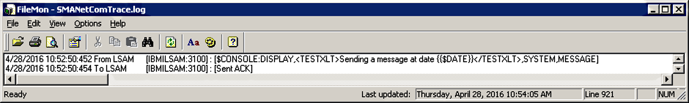
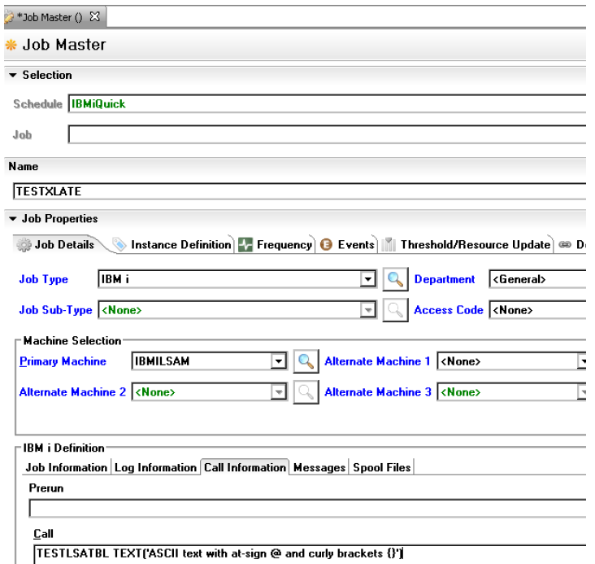

# Translation Table Testing
 
The IBM i LSAM software includes two commands that may help to diagnose problems with translation tables. The LSAM Parameters configuration screens and the SMAFT (SMA File Transfer) Parameters screens allow specification of user-defined translation tables, as well as alternate CCSIDs (character code set IDs). These parameters are explained in the Configuration topic, under the topics of Communications Parameters and the extended Discussion on Translation Tables, and in the SMA File Transfer topic. The LSAM translation table testing commands provide a simplified method of access to technical data that can help to confirm that a translation table or CCSID should work correctly with the LSAM.

:::warning
Great caution must be exercised when changing the translation tables used by the LSAM. These tables must always support the existing OpCon transaction protocol rules; therefore, the reserved characters utilized by the OpCon transaction protocol must be understood. Industry standard XML protocol characters are among those that must be protected.
:::

IBM supports the creation of user-defined translation tables under IBM i. IBM supplies documentation that explains how to perform the following steps that might be useful in the process of developing new translation tables that would more aptly serve a unique environment:

- Work with tables (WRKTBL) to view their contents
- Retrieve the definition of an existing translation table into a source file member (RTVTBLSRC)
- Create or update a translation table source file member to modify how the translation works
- Create a user-defined translation table in a DB2 library (CRTTBL)

Once a user-defined translation table has been created, before it is specified in the IBM i LSAM Parameters it should be thoroughly tested using the LSAM translation table testing utilities. A strategy for using these utilities follows.

## Translation Table Versus CCSID

When using the LSAM translation table testing tools it is important to understand the different uses that the LSAM makes of translation tables, as compared to CCSID codes. Their uses depend on two different groups of LSAM functions. One LSAM function group includes the LSAM server jobs that handle Job Scheduling on behalf of OpCon SAM, along with the JORS (job output retrieval service) function. The other LSAM function group manages SMA File Transfer functions, including the LSAM Server task and the LSAM Agent jobs.

Initially, by default, the LSAM uses translation tables as specified in the LSAM control parameters when translating the OpCon transaction protocol from the IBM i native EBCDIC character set (as used by the LSAM jobs) to and from the Microsoft Windows native ASCII character set (as used by the OpCon SMANetCom routines and SAM-SS). All of the information related to starting jobs, reporting job status, sending job result messages to SAM and also the processing of OpCon Event commands, are all controlled by the two translation tables specified in the LSAM Parameters control function (LSAM main menu, option 7). The OpCon initial request to start an SMA File Transfer (SMAFT) jobs also falls into this category of work that is managed by the LSAM's Job Scheduling server, although the details about the file transfer are managed in a different data communications link once the SMA File Transfer job has been started.

In a similar fashion, the LSAM SMAFT Server task uses translation tables to exchange file transfer control information with other LSAMs, after OpCon SAM gets a file transfer job started at one of the participating LSAMs. But the translation of the SMAFT control transactions is managed according to an (optionally) different set of translation tables specified in the LSAM's SMAFT Parameters control function: LSAM sub-menu 8, option 7).

In most cases, the translation between EBCDIC and ASCII for SMAFT control transactions would be the same as when LSAMs are communicating about job scheduling with SAM in the OpCon central server. But the IBM i LSAM makes allowance for the possibility that certain LSAMs might require a slight variation in translation tables, since the control of a file transfer is managed directly between the IBM i LSAM and another LSAM.

Separately from the control transactions, the actual file data that is being transferred by the SMA File Transfer protocol is handled in the IBM i LSAM by CCSID codes specified in the SMAFT Parameters (LSAM sub-menu 8, option 7). These are used only for translating the transferred file content. CCSID character translation is used only when the file transfer is not binary, that is, when the transfer was defined as a text transfer (in which case the character sets on either side of the transfer could be ASCII and/or EBCDIC).

The character translation function for SMAFT file content can optionally be managed on a per-job basis, depending on the LSAMs that are connected for the transfer and on the capabilities of each LSAM's native database. For example, the IBM i LSAM and the IBM z/OS LSAM are capable of detecting the native CCSID of the source data and then sending that information to each other so that the original file content may be accurately preserved. Also, the IBM i LSAM will always use the existing CCSID of a target database or stream file with its own machine, if that file exists prior to the start of writing new data that arrives via an SMA File Transfer.

But in cases where the SMA File Transfer job does not deliver instructions to the IBM i LSAM SMAFT programs, and no existing file definition information can be found to determine the correct CCSID for the data, the LSAM will use the default CCSID specified in the LSAM's SMAFT control parameters.

The LSAM translation testing tools support both translation tables and CCSID character sets. In cooperation with the OpCon SAM Message log and a special form of OpCon job command for an IBM i job, it is possible to isolate and test character translation in either direction, using any available translation table pair, or any available pair of CCSID codes.

## LSATBLTEST Utility Command

The command LSATBLTEST should be used from within the IBM i LSAM menu system or from a command entry screen where the LSAM environment library list has been set, typically by using the SMASETLIBL command.

When the command is executed, it always checks for the required utility data queue, LSATBLT00, in the SMADTA (or equivalent) library. If the data queue does not exist, it will be created. It is important that this command be used first, before the special OpCon job command TESTLSATBL, in order to complete this function of creating the data queue because it is used for communications between the LSAM server programs and this utility command.

The command next causes a test display to appear on the screen. The test display includes some instructions, and it supports function keys that may be used to execute different forms of translation table testing. 

:::caution
SMA recommends that a separate, test LSAM environment be utilized for the purpose of fully testing a new translation table before that table is specified in the live LSAM environment.
:::

While performing translation tests, remember that all translation in either direction (sending or receiving) is controlled by this test program and not by the usual LSAM translation routines. (The LSAM server jobs are coded to recognize when the TESTLSATBL command has been requested by OpCon.) Therefore, be sure to choose appropriate
translation settings before using the <**Enter**> key or any function key.

### LSATBLTEST Utility Display

When the LSATBLTEST command is entered, the following utility display appears.

#### LSATBLTEST Utility Command Display (F11-EBCDIC Mode)
```
 LSATBLR1                 Test LSAM Translation Tables                 MM/DD/YY 
 USERNAME               Translation Mode: EBCDIC -> ASCII              HH:MM:SS 
                                                                                
 Type any options and EBCDIC text, press Enter for local or F14=Send to OpCon.  
 To test ASCII with OpCon job, run command TESTLSATBL and up to 70 characters   
  of TEXT, then press F17.  CMD:  TESTLSATBL TEXT('any ASCII character')        
 Use F20 to retranslate same data with new options.  F2=clear data only.        
          NOTE: Send uses these translation options, not LSAM routines.         
 Use Table or CCSID . : T  T=table, C=CCSID       SMAFT ASCII CCSID : 00819     
 EBCDIC-to-ASCII table: QASCII                    SMAFT EBCDIC CCSID: 00037     
   Library  . . . . . :   QSYS                    Job default CCSID*: 00037     
 ASCII-to-EBCDIC table: QEBCDIC                   Alt ASCII CCSID . : 00000     
   Library  . . . . . :   QSYS                    Alt EBCDIC CCSID  : 00000     
   * NOTE: Job default CCSID used for EBCDIC char. Use F10=Hex for other CCSID. 
 F2=CLR  1...5...10....5...20....5...30....5...40....5...50....5...60....5...70 
 EBCDIC:                                                                        
                                                                                
                                                                                
                                                                                
  ASCII                                                                         
                                                                                
                                                                                
 F5=Refresh  F10=Hex  F11=Mode  F14=Send msg  F17=Receive msg  F20=Retranslate  
```
Function key F10 enables the Hex1/Hex2 fields for input, instead of the EBCDIC character input field.

#### LSATBLTEST Utility Command Display (F11-ASCII Mode)
```
 LSATBLR1                 Test LSAM Translation Tables                 MM/DD/YY 
 USERNAME               Translation Mode: ASCII -> EBCDIC              HH:MM:SS 
                                                                                
 Type any options and ASCII hex, then press Enter for local translation.        
 To test ASCII with OpCon job, run command TESTLSATBL and up to 70 characters   
  of TEXT, then press F17.  CMD:  TESTLSATBL TEXT('any ASCII character')        
 Use F20 to retranslate same data with new options.  F2=clear data only.        
                                                                                
 Use Table or CCSID . : T  T=table, C=CCSID       SMAFT ASCII CCSID : 00819     
 EBCDIC-to-ASCII table: QASCII                    SMAFT EBCDIC CCSID: 00037     
   Library  . . . . . :   QSYS                    Job default CCSID : 00037     
 ASCII-to-EBCDIC table: QEBCDIC                   Alt ASCII CCSID . : 00000     
   Library  . . . . . :   QSYS                    Alt EBCDIC CCSID  : 00000     
                                                                                
 F2=CLR  1...5...10....5...20....5...30....5...40....5...50....5...60....5...70 
 EBCDIC                                                                         
   Hex1:                                                                        
   Hex2:                                                                        
                                                                                
  ASCII:                                                                        
   Hex2:                                                                        
                                                                                
 F5=Refresh           F11=Mode                F17=Receive msg  F20=Retranslate  
```

There is no support for F10=Hex or F14=Send msg in the ASCII mode, since this mode is for local testing only, and it is always driven by entering the hexadecimal equivalent of ASCII characters into the ASCII and ASCII-Hex2 fields.

#### Menu Pathways

Main Menu > Selection or command line > type LSATBLTEST and press <**Enter**>

#### Fields

| Field                | Default              | Description          |
| -----                | -----                | -----                |
| Use Table or CCSID   | T                    | **T** = use translation tables, as specified on left of screen.  |
|                      |                      | **C** = use CCSID codes, as specified on right of screen. |
|                      |                      | Set this field and choose the appropriate tables or codes before performing any operations, to determine how translation is done in either direction (sending or receiving messages).       |
| EBCDIC to ASCII table  | The LSAM Parameters value, or QASCII | Initially, the utility displays the LSAM Parameters control file value for this translation table. If no value is present in the control file, the IBM i system default translation table used to translate EBCDIC characters to the extended ASCII character set is displayed. This  initial value is the one currently used by the IBM i LSAM communications server programs. |
|                      |                      | This value can be changed to a user-selected translation table for testing when the Use code is set to T = Table. This table is used when a text string is typed into the EBCDIC input field for use with the <**Enter**> key or with <**F14**>.     |
| Library              | The LSAM Parameters value, or QSYS | The UDB DB2 (DB2/400) library where the translation table is stored.              |
| ASCII to EBCDIC table     | The LSAM Parameters  value, or QEBCDIC | Initially, the utility displays the LSAM Parameters control file value for this translation table. If no value is present in the control file, the IBM i system default translation table used to translate the extended ASCII character set to EBCDIC characters is displayed. This value is the one currently used by the IBM i LSAM communications server programs. |
|                      |                      | This value can be changed to a user-selected translation table for testing when the Use code is set  to T = Table. This table is used when a text string is typed into the ASCII Hex input field, or is received from an OpCon test job with <**F17**>.     |
| Library              | The LSAM Parameters value, or QSYS  | The UDB DB2 (DB2/400) library where the translation table is stored.              |
| SMAFT ASCII CCSID    | LSAM Parameters      | The default character code set assigned in the LSAM SMA File Transfer (SMAFT) Parameters is displayed. This code is assumed to represent the character set for the ASCII data being tested, if the Alt ASCII CCSID is left at zeros.            |
| SMAFT EBCDIC CCSID   | LSAM Parameters      | The default character code set assigned in the LSAM SMAFT Parameters is displayed. This code is displayed for reference. If the user-specified ALT EBCDIC CCSID field is left at zeros, the program assumes the Job default CCSID represents EBCDIC data.         |
| Job default CCSID    | IBM i job current value   | The default character code set of the IBM i job is assumed to be assigned to EBCDIC data when the user-defined Receive or To-CCSID are left at zeros.            |
|                      |                      | **Note**: The job default CCSID is always the default that is used to represent an EBCDIC text string that is manually typed into this display's input field, such as before testing a local translation or when creating a text message to send to the OpCon SAM log using <**F14**>.   |
| Alt ASCII CCSID      | zeros = not used     | Set the translation type to C=CCSID, then type a 5-digit CCSID code (using leading zeros as necessary) that will represent the ASCII message data received and processed when pressing <**F17**> or <**F20**> (if F20 used after F17 yo reprocess an incoming ASCII message). This tells the local program how to handle the received message text BEFORE the program translates it.                  |
| Alt EBCDIC CCSID     | zeros = not used     | Set the translation type to C=CCSID, then type a 5-digit CCSID code (using leading zeros as necessary) that will represent the result of a translation. For incoming messages received with the F17 function key, this CCSID will represent the EBCDIC text that will be displayed as the result of translation. For outgoing messages sent using the F14 function key, this value tells the program what EBCDIC character set to assume when translating the message. A translated message sent to the OpCon SAM Log is sent transparently, that is, the LSAM allows the test translation to pass through to OpCon SMANetCom without any changes, so the result can be tested by viewing it with the OpCon SAM Log viewer.          |
| EBCDIC character entry/display line | n/a                  | For the <**Enter**> key and function key <**F14**> this is an input field where 5250 workstation characters may be typed to create a test character string. For function key <**F17**> this is used as an output field to show the EBCDIC character translation of the message received from the special command TESTLSATBL used by an OpCon job.                 |
| EBCDIC hex character lines| X'00'              | Under the input/output character line, a string of hexadecimal character equivalents is displayed after a character translation has been performed. The hexadecimal characters are displayed in over/under format, that is, for each character on the EBCDIC entry/display line, there are two characters displayed below it that form the pair of hexadecimal character equivalents for the displayed character. The hexadecimal characters range from 0-9 and A-F. Each over/under pair of characters represents one 8-bit byte of digital data. These are the same pairs of hexadecimal characters that  are displayed by the IBM i WRKTBL view table function, and they are the same as the data that is used to create a source file member from which a translation table can be created.         |
|                      |                      | Use <**F10**> = Hex to change the program to accept hex characters typed for EBCDIC instead of the keyboard characters line. In this mode, the keyboard characters line will show what the local workstation (usually an emulator program) interprets as a display character for each hex value that is typed. Non-display characters are   prevented from reaching the display, in order to avoid causing a failure of the test command.    |
| ASCII hex character lines | X'00'              | Printable or displayable/keyboard characters from the ASCII character set cannot be displayed, as is, on a 5250 workstation screen. Instead, only the hexadecimal equivalent of the ASCII characters is displayed.       |
|                      |                      | Refer to EBCDIC hex character lines, above, for more information about the hexadecimal character display.         |
|                     |                      | When <**F11**> puts the test program into     ASCII-\>EBCDIC local test mode, these ASCII hex lines can be used to enter the equivalent of ASCII characters that should be translated to the EBCDIC lines above when the <**Enter**>     key is pressed.  |

#### Functions

- **Enter**: After a value has been typed in the EBCDIC character entry field, pressing the <**Enter**> key causes the utility program to perform a local translation of the data using the translation table named in the EBCDIC-to-ASCII fields. In ASCII->EBCDIC mode, pressing <**Enter**> causes the ASCII hex values to be translated to the EBCDIC display and hex lines. The <**Enter**> key does not cause any data to be sent or received externally to this program.
- **F3=Exit**: Not displayed in the function key legend, this key quits the list display and returns to the command line where the LSATBLTEST command was entered.
- **F5=Refresh**: Clears the screen and the utility program work fields and resets the display to its original status. Note that the default values displayed for the translation tables are taken directly from the LSAM Parameters control files, if values exist there. Otherwise, the default values are the IBM i system table values, as shown in the table of fields, above.
- **F10=Hex**: In EBCDIC->ASCII mode, this key toggles the input capability between the EBCDIC displayed characters line and the hexadecimal characters lines 1 and 2. (In ASCII->EBCDIC mode, only hex input is supported, so the F10 key is not displayed and does not function.)
- **F11=Mode**: Toggles between using the EBCDIC or ASCII lines for typing in test data.
- **F12=Cancel**: Not displayed in the function key legend, this key quits the list display and returns to the command line where the LSATBLTEST command was entered.
- **F14=Send msg**: After a value has been typed in the EBCDIC character or hex entry fields, pressing function key <**F14**> causes the utility program to create a $CONSOLE:DISPLAY event and send it to the OpCon SAM Log through the active LSAM server communications programs. Use the OpCon SAM Log display function to see this message. It will not be changed by the interface, but will be displayed using the results of the local command EBCDIC to ASCII translation.
- **F17=Receive msg**: This function key is used to check for new input into the LSATBLT00 data queue. Data is placed into this data queue by the special TESTLSATBL command when it has been run by an OpCon job. F17=Receive message allows test messages to be sent and analyzed outside of the regular flow of LSAM operations. This feature can help determine what characters should be typed into an OpCon job master record in order for the EBCDIC result to be understood by the LSAM server programs and by IBM i. Used with Use option C=CCSID, it demonstrates SMAFT file data translation.
- **F20=Re-translate**: After any other function has been performed on this utility display, function key <**F20**> makes it possible to type in a new translation table name or a new CCSID code and discover a new result using the same data from the most recent translation test. The translation table or CCSID codes that will be used by the F20=re-translate function depends on the most recent operation performed. If the <**Enter**> key or function key <**F14**> was last executed, the EBCDIC-to-ASCII table is used. If function key <**F17**> was last executed, the ASCII-to-EBCDIC table is used. Refer to the Fields table above for an explanation of how the CCSID codes may be used when the Use option is C.

### TESTLSATBL Utility Command

The command TESTLSATBL has been created only for one special purpose. This command may be used from within an OpCon job master record, in the Call command line of a Batch job type, to send a message directly from OpCon to the LSATBLTEST utility display documented above. This command will not function as expected when used outside of the OpCon-to-LSAM job scheduler work flow because the LSAM server programs have been specially coded to respond in a unique way to this command name. The command by itself merely logs a normal completion message into the job log of any job where the command runs, and the OpCon normal completion status does not reflect whether the test message was actually received by the LSATBLTESTdisplay tool, documented above. 

#### Command Syntax
```
TESTLSATBL TEXT('any ASCII text or special character')
```
The name of the command should be followed by the parameter keyword value TEXT. Although IBM i command parameter rules would allow just the parameter value inside of the parentheses without typing the TEXT keyword, the TEXT keyword is required by the LSAM server jobs in order to recognize the test character string that will receive special handling.

The TEXT parameter must be enclosed by a pair of parentheses ( ) and also by a pair of single quote marks ' ' inside of the parentheses. The LSAM server programs check for the reserved text string of TEXT('to mark the beginning of the test character string, and they test for a single quote followed by a right parenthesis ') to mark the end of the test character string. Therefore, it is not allowed to include a single quote followed immediately by a right parenthesis inside of the test character string. However, each of these characters may be included within the test character string as long as they are not immediately next to each other in this order.

Due to the special communications routing path built into the LSAM server programs, it should be possible to send virtually any ASCII character value that can be typed on an MS Windows Server workstation. The purpose of this command is to enable testing of special characters that may be unique to various international character sets and keyboards
used in different countries.

One of the typical problems encountered in OpCon environments is that there may be language-specific characters allowed as names of programs or other object types under a version IBM i that has been configured for national language support. In some cases it is difficult to determine which characters must be typed in an OpCon job master record in order to cause them to be correctly translated by the LSAM into the characters expected by IBM i. In some cases where the default IBM i system translation table is not working well, it might be necessary to configure the LSAM to utilize a user-defined alternate translation table or to identify a pair of CCSID codes that produce the desired result from translation. In this case, the LSATBLTEST utility should be used to carefully prove the results of the proposed new configuration.

### TESTLSATBL Job Results Under IBM i

The special TESTLSATBL command provided with LSAM software is used to trigger a reserved, direct routing of test data from an OpCon job to the LSATBLTEST utility data queue, LSATBLT00 in SMADTA (or the equivalent library). The LSAM sockets communications server program for job scheduling tests for this command and performs special data routing functions that preserve test data for handling only by the LSAM LSATBLTEST command.

The TESTLSATBL command is NOT managed by the IBM i LSAM job scheduler the same as a regular IBM i job command. When the job command is logged to the LSAM communications debug trace file for the usual translated EBCDIC image of every transaction, it appears with the ASCII data removed from the TEXT parameter and only one blank (space) character is left as the parameter data.

The LSAM sockets communications program generates an immediate and direct normal job completion message that it routes back to OpCon. This means that the test job in the OpCon schedule should always show a normal completion, and that normal completion status does not reflect whether the test message was received and processed by the LSAM's local translation test display tool, documented above.

:::caution
SMA recommends that a separate, test LSAM environment be utilized for the purpose of fully testing a new translation table or a pair of CCSID codes before that configuration is specified in the live LSAM environment, even if the translation testing tool represents acceptable results.
:::

### Strategy for Translation Table Testing

SMA has provided the two LSAM software commands (documented above) that engage special utilities for the purpose of diagnosing problems with translation tables and/or pairs of CCSID codes. These tools can also be used to test a proposed user-defined translation table in a test LSAM environment before that translation table is used in a live production environment. This section offers some details about how the LSAM translation table testing utilities will behave, specific to the task of developing user-defined translation tables.

### Creating User-defined Translation Tables

IBM supports the creation of user-defined translation tables under IBM i. IBM supplies documentation that explains how to perform the following steps that might be useful in the process of developing new translation tables that would more aptly serve a unique environment:

- Work with tables (WRKTBL) to view their contents
- Retrieve the definition of an existing translation table into a source file member (RTVTBLSRC)
- Create or update a translation table source file member to modify how the translation works
- Create a user-defined translation table in a DB2 library (CRTTBL)

As an example of this process, assume that we wish to translate braces (curly brackets) typed on a 5250-type workstation (usually emulated by a PC program) into square brackets before the data is sent to OpCon. Of course, if we make this choice in the LSAM translation tables, we will lose the ability to send braces (curly brackets) directly. But for the purpose of this example, we will assume that this is an acceptable choice.

To create a new table that translates EBCDIC characters into ASCII characters, we start with the IBM i system-supplied translation table called QASCII from library QSYS. Using the WRKTBL command to view this table in a list, option 5=Display may then be entered to view the contents of the table. The following example shows the view of the
table, paged down to the position where the braces (curly brackets) character occurs in the EBCDIC character set (X'D0').

### QSYS/QASCII Table View

#### QSYS/QASCII Display Conversion Table
```
                             Display Conversion Table                            
                                                                                
 Table:   QASCII         Library:   QSYS                                        
                                                                                
  Hex    Hex                 Hex    Hex                 Hex    Hex              
 Input  Output              Input  Output              Input  Output            
  00      00                 0F      0F                 1E      1E              
  01      01                 10      10                 1F      1F              
  02      02                 11      11                 20      80              
  03      03                 12      12                 21      81              
  04      9C                 13      13                 22      82              
  05      09                 14      9D                 23      83              
  06      86                 15      85                 24      84              
  07      7F                 16      08                 25      0A              
  08      97                 17      87                 26      17              
  09      8D                 18      18                 27      1B              
  0A      8E                 19      19                 28      88              
  0B      0B                 1A      92                 29      89              
  0C      0C                 1B      8F                 2A      8A              
  0D      0D                 1C      1C                 2B      8B              
  0E      0E                 1D      1D                 2C      8C              
                                                                        More... 
 F3=Exit   F12=Cancel   F17=Position to                                         
 ```

Notice that the X'D0' translation has been highlighted in red, near the bottom of the middle column. The original IBM-supplied translation table (according to US CCSID 37 standards) translates to ASCII X'7D'. For our example, we wish to have X'D0' translate into ASCII X'5D'. 

We use the IBM i command RTVTBLSRC (retrieve table to source file member) to extract the data from the existing IBM QASCII table. In the following example, we have instructed the command to put the source member into a library we created called SMAUTILITY, and we had also created in advance a source file called QTBLSRC (duplicated from the model IBM provides in the QGPL library). Notice where the target translation character of X'7D' occurs, highlighted in red at display columns 33-34 in source member line 0000.07.

#### QSYS/QASCII Table Source Member
```
Columns . . . :    1  71           Browse                    SMAUTILITY/QTBLSRC    
SEU==>                                                                  QASCII
   FMT **  ...+... 1 ...+... 2 ...+... 3 ...+... 4 ...+... 5 ...+... 6 ...+... 7
          *************** Beginning of data *************************************
  0000.01 000102039C09867F978D8E0B0C0D0E0F101112139D8508871819928F1C1D1E1F
  0000.02 80818283840A171B88898A8B8C050607909116939495960498999A9B14159E1A
  0000.03 20A0A1A2A3A4A5A6A7A85B2E3C282B2126A9AAABACADAEAFB0B15D242A293B5E
  0000.04 2D2FB2B3B4B5B6B7B8B97C2C255F3E3FBABBBCBDBEBFC0C1C2603A2340273D22
  0000.05 C3616263646566676869C4C5C6C7C8C9CA6A6B6C6D6E6F707172CBCCCDCECFD0
  0000.06 D17E737475767778797AD2D3D4D5D6D7D8D9DADBDCDDDEDFE0E1E2E3E4E5E6E7
  0000.07 7B414243444546474849E8E9EAEBECED7D4A4B4C4D4E4F505152EEEFF0F1F2F3   
  0000.08 5C9F535455565758595AF4F5F6F7F8F930313233343536373839FAFBFCFDFEFF
          ****************** End of data ****************************************
```
Before we modify this source member, we copy it to a new source member name, TSTASCII. The new source member TSTASCII is then modified at columns 33-34 of line 7. The following example shows that the prior value of '7D' has been replaced by the new value '5D'.

#### Modified TSTASCII Table Source Member
```
Columns . . . :    1  71           Browse                   SMAUTILITY/QTBLSRC    
SEU==>                                                                TSTASCII
   FMT **  ...+... 1 ...+... 2 ...+... 3 ...+... 4 ...+... 5 ...+... 6 ...+... 7
          *************** Beginning of data *************************************
  0001.00 000102039C09867F978D8E0B0C0D0E0F101112139D8508871819928F1C1D1E1F
  0002.00 80818283840A171B88898A8B8C050607909116939495960498999A9B14159E1A
  0003.00 20A0A1A2A3A4A5A6A7A85B2E3C282B2126A9AAABACADAEAFB0B15D242A293B5E
  0004.00 2D2FB2B3B4B5B6B7B8B97C2C255F3E3FBABBBCBDBEBFC0C1C2603A2340273D22
  0005.00 C3616263646566676869C4C5C6C7C8C9CA6A6B6C6D6E6F707172CBCCCDCECFD0
  0006.00 D17E737475767778797AD2D3D4D5D6D5D8D9DADBDCDDDEDFE0E1E2E3E4E5E6E7
  0007.00 7B414243444546474849E8E9EAEBECED5D4A4B4C4D4E4F505152EEEFF0F1F2F3   
  0008.00 5C9F535455565758595AF4F5F6F7F8F930313233343536373839FAFBFCFDFEFF
          ****************** End of data ****************************************
```
Finally, this modified source member is used in the IBM i command CRTTBL to produce a new translation table object. The following example shows that the table TSTASCII was created in a test version of the SMADTA  library, where it can be tested outside of the live production version of the LSAM.

The new table is viewed by using the IBM i command WRKTBL and entering option 5=Display next to the table name. The following example shows that the PageDown key has been pressed to reveal the portion of the table where we made a change. Now the table shows that an EBCDIC X'D0' will be translated into an ASCII X'5D'.

We will use this example of a translation table modification in the following illustration of how the IBM i LSAM translation table testing utilities can be used to prove translation results both before and after the table modification was implemented.

#### TSTSMADATA/TSTASCII Translation Table View
```
  
                            Display Conversion Table
Table:   TSTASCII       Library:   TSTSMADTA                                                                             

 Hex    Hex                 Hex    Hex                 Hex    Hex
Input  Output              Input  Output              Input  Output
 B4      DC                 C3      43                 D2      4B
 B5      DD                 C4      44                 D3      4C
 B6      DE                 C5      45                 D4      4D
 B7      DF                 C6      46                 D5      4E
 B8      E0                 C7      47                 D6      4F
 B9      E1                 C8      48                 D7      50
 BA      E2                 C9      49                 D8      51
 BB      E3                 CA      E8                 D9      52
 BC      E4                 CB      E9                 DA      EE
 BD      E5                 CC      EA                 DB      EF
 BE      E6                 CD      EB                 DC      F0
 BF      E7                 CE      EC                 DD      F1
 C0      7B                 CF      ED                 DE      F2
 C1      41                 D0      5D                 DF      F3 
 C2      42                 D1      4A                 E0      5C
                                                                      More...
F3=Exit   F12=Cancel   F17=Position to
```
### Proving Translation Table Modifications with LSATBLTEST

Continuing with the example of a translation table explained above, we start by testing the existing configuration of the IBM i LSAM. As the LSATBLTEST example below shows, the default translation table QSYS/QASCII has translated EBCDIC right braces (curly brackets) from X'D0' into ASCII X'7D'. (The red highlights of the hexadecimal
characters in the following example do not appear on the real display, they are for this document only.)

#### LSATBLTEST Displays Default Translation Results
```
LSATBLR1                 Test LSAM Translation Tables                 00/00/00   
USERNAME              Translation Mode: EBCDIC -> ASCII               00:00:00

  Type any options and EBCDIC text, press Enter for local or F14=Send to OpCon.
  To test ASCII with OpCon job, run command TESTLSATBL and up to 70 characters
   of TEXT, then press F17. CMD:  TESTLSATBL TEXT('any ASCII character')   
  Use F20 to retranslate same data with new options. F2=clear data only.
           NOTE: Send uses these translation options, not LSAM routines.
  Use Table or CCSID . : T  T=table, C=CCSID       SMAFT ASCII CCSID : 00819   
  EBCDIC-to-ASCII table: QASCII                    SMAFT EBCDIC CCSID: 00037
    Library  . . . . . :   QSYS                    Job default CCSID*: 00037   
    ASCII-to-EBCDIC table: QEBCDIC                 Alt ASCII CCSID . : 00000
    Library  . . . . . :   QSYS                    Alt EBCDIC CCSID  : 00000     
  * NOTE: Job default CCSID used for EBCDIC char. Use F10=Hex for other CCSID.
  F2=CLR  1...5...10....5...20....5...30....5...40....5...50....5...60....5...70   EBCDIC: Sending a message at date: {{$DATE}}
          E89889848498AA88848A488A874CC5CCECDD           2554957010452217501304135A000B413500

  ASCII:  566666626266776662672667632772445477           35E49E7010D53317501404145A0BB44145DD

  F5=Refresh  F10=Hex  F11=Mode  F14=Send msg  F17=Receive msg  F20=Retranslate
```
This display has been obtained by typing in the EBCDIC test message shown, and then pressing F14=Send msg. The same result would appear on this display if the <**Enter**> key had been pressed. However, using F14=Send msg allows us to go to the OpCon log displays to verify how this data was received.

Default Translation Table Test Message Arrives at OpCon



In the example above, the test message appears in the SMANetCom Trace Log display in its raw form. The message was translated to ASCII by the LSAM test message generator program (LSATBLTEST), but the $DATE token has not yet been analyzed and replaced. We can see from this example that the braces (curly brackets) have been carried in tact, as would be expected. Next, consider the following SAM Log results:

Default Translation Table Test Message Token Translation by OpCon


Before we experiment with changes to the translation table, take note of a special behavior that has been programmed into OpCon handling of Token field replacement. Due to translation table problems between MS Windows Server environments and environments like IBM's i OS and IBM's mainframes, SMA has allowed that braces (curly brackets) {{ }} can be used to designated Token fields in the same way as the OpCon standard square brackets [[ ]] are used. As expected, the {{$DATE}} token in the example above was translated into the current MS Windows Server system date just as [[$DATE]] would be.

To prove the results of the modified TSTASCII translation table, we can go back to the LSATBLTEST utility program display and type in some new values, then press <**Enter**> to test the translation table completely within the utility itself. We start with the default QSYS/QASCII translation table and test how a simple OpCon Token string
is translated.

#### LSAM Translation Table Test of Default QASCII Table
```
LSATBLR1                 Test LSAM Translation Tables                 00/00/00   
USERNAME              Translation Mode: EBCDIC -> ASCII               00:00:00

  Type any options and EBCDIC text, press Enter for local or F14=Send to OpCon.
  To test ASCII with OpCon job, run command TESTLSATBL and up to 70 characters
   of TEXT, then press F17. CMD:  TESTLSATBL TEXT('any ASCII character')   
  Use F20 to retranslate same data with new options. F2=clear data only.
           NOTE: Send uses these translation options, not LSAM routines.
  Use Table or CCSID . : T  T=table, C=CCSID       SMAFT ASCII CCSID : 00819   
  EBCDIC-to-ASCII table: QASCII                    SMAFT EBCDIC CCSID: 00037
    Library  . . . . . :   QSYS                    Job default CCSID*: 00037   
  ASCII-to-EBCDIC table: QEBCDIC                   Alt ASCII CCSID . : 00000
    Library  . . . . . :   QSYS                    Alt EBCDIC CCSID  : 00000     
  * NOTE: Job default CCSID used for EBCDIC char. Use F10=Hex for other CCSID.
  F2=CLR  1...5...10....5...20....5...30....5...40....5...50....5...60....5...70   
  EBCDIC: {{$DATE}}
          CC5CCECDD           
          00B413500

  ASCII:  772445477           
          BB44145DD

  F5=Refresh  F10=Hex  F11=Mode  F14=Send msg  F17=Receive msg  F20=Retranslate
```

Notice in the EBCDIC: text representation the hexadecimal equivalents of the right braces (curly brackets) **}}**. These are the characters that are the subject of this discussion.

To continue the test, we change the name of the EBCDIC-to-ASCII translation table and the library where our test table is located. Then we can press the <**F20**> function key to retest translation of the same test character string without having to type the data a second time. As the results show in the illustration below, the braces (curly brackets) have now been translated into ASCII X'5D'. 

#### LSAM Translation Table Test of Modified TSTQASCII Table
```
LSATBLR1                 Test LSAM Translation Tables                 00/00/00   
USERNAME              Translation Mode: EBCDIC -\> ASCII               00:00:00

  Type any options and EBCDIC text, press Enter for local or F14=Send to OpCon.
  To test ASCII with OpCon job, run command TESTLSATBL and up to 70 characters
   of TEXT, then press F17. CMD:  TESTLSATBL TEXT('any ASCII character')   
  Use F20 to retranslate same data with new options. F2=clear data only.
           NOTE: Send uses these translation options, not LSAM routines.
  Use Table or CCSID . : T  T=table, C=CCSID       SMAFT ASCII CCSID : 00819   
  EBCDIC-to-ASCII table: TSTQASCII                 SMAFT EBCDIC CCSID: 00037
    Library  . . . . . :   TSTSMADTA               Job default CCSID*: 00037   
  ASCII-to-EBCDIC table: QEBCDIC                   Alt ASCII CCSID . : 00000
    Library  . . . . . :   QSYS                    Alt EBCDIC CCSID  : 00000     
  * NOTE: Job default CCSID used for EBCDIC char. Use F10=Hex for other CCSID.
  F2=CLR  1...5...10....5...20....5...30....5...40....5...50....5...60....5...70   
  EBCDIC: {{$DATE}}
          CC5CCECDD           
          00B413500

  ASCII:  772445455           
          BB44145DD

  F5=Refresh  F10=Hex  F11=Mode  F14=Send msg  F17=Receive msg  F20=Retranslate
```

For the purpose of this illustration, we have changed only the translation of the right brace (curly bracket) character. We might expect that we would also want to modify the translation of the left brace (curly bracket) character as well, in order to produce a resulting Token field string that would be valid for OpCon to interpret. In many environments, as explained above, it may not be necessary to change the translation of braces (curly brackets) to square brackets. However, when national language support has been configured under IBM i, and depending on the type of keyboard used with a 5250 workstation emulation program, it might be necessary to develop some similar modification to a translation table in order to make it simple for system users to configure OpCon Event commands from inside the LSAM configuration screens, such as when maintaining LSAM Message Management Parameters.

### Proving Translation Table Modifications with TESTLSATBL

It is equally important to prove that translation table changes work when data is sent from OpCon to the IBM i LSAM servers.

### Local Testing of ASCII->EBCDIC

For a quick test that does not require configuring an OpCon job, use the <**F11**> function key to put the LSATBLTEST program into ASCII->EBCDIC mode. Then type hex characters that represent the ASCII source data for translation and press <**Enter**> to test different tables and CCSID code sets.

### Utilizing OpCon for Testing of ASCII->EBCDIC

The special LSAM command TESTLSATBL used in an OpCon batch job for IBM i is a good way to test ASCII characters that are typed within the Microsoft Windows environment of the SMA OpCon User Interface.

##### LSAM Command TESTLSATBL Used in OpCon Job Master (shown using the older EM user interface)



Although a different translation table is used for translations from ASCII to EBCDIC, national language support under IBM i, for example, may introduce difficulties in typing character strings for OpCon job master records that will be correctly interpreted by IBM i. The special IBM i LSAM command TESTLSATBL can be used with an OpCon job to set up a test of any characters so that they will show up on the LSATBLTEST utility display. The TESTLSATBL command syntax is explained above. The previous example shows how this command might be set up in an OpCon job called TstLsaTbl1. In this example it appears that the tester wants to make sure that both the at-sign @ and the braces (curly brackets) { } are being received as expected once the data has been transmitted to the IBM i LSAM.

An important step in evaluating character translation is to verify that keyboard characters typed at a workstation keyboard and shown on the workstation display are actually the characters that have been transmitted by OpCon. This can be confirmed by examining the OpCon SMANetCom Trace log just after the test job has been executed.

##### OpCon Sends IBM i Job Command in Field Code 05022


A careful examination of the SMANetCom Trace Log requires that the log viewer window be positioned far to the right. The line where a TX1 request job transaction appears will contain a long string of data. For this test, we wish to confirm that the string typed into the job Call command line has been transmitted to the IBM i LSAM in the same form as it was typed. This can be confirmed by looking for field code 05022. Notice in the example above that a field code is contained within the XML tag characters < and >. In this case, the field code itself is displayed in the value I="05022". The data that follows the greater than sign \> is the actual Call command string. The end of this string is marked by the XML end field tag \</F\>. We see in the example above that OpCon has transmitted exactly what was typed in the job master record.

As explained previously, the LSAM job scheduling communications server program recognizes the special command TESTLSATBL, and it responds to that command by routing the enclosed TEXT string directly to a special LSAM data queue used only by the LSAM utility command LSATBLTEST. As soon as we have confirmed that the job request data has been sent by OpCon, we can immediately begin using the LSATBLTEST command from with the target LSAM environment in order to retrieve and examine the test character string.

It is important to remember that the LSAM communications server has sent exactly the ASCII character string that was received from OpCon. The special translation table testing protocol implemented by the LSAM prevents the LSAM server programs from touching the test character string. It is sent in tact so that we can experiment with different translation tables while using the LSAM's LSATBLTEST utility display.

#### IBM i LSAM LSATBLTEST Command Shows Results from TESTLSATBL Job
```
LSATBLR1                 Test LSAM Translation Tables                 00/00/00
USERNAME              Translation Mode: EBCDIC -> ASCII               00:00:00

  Type any options and EBCDIC text, press Enter for local or F14=Send to OpCon.
  To test ASCII with OpCon job, run command TESTLSATBL and up to 70 characters
   of TEXT, then press F17. CMD:  TESTLSATBL TEXT('any ASCII character')   
  Use F20 to retranslate same data with new options. F2=clear data only.
           NOTE: Send uses these translation options, not LSAM routines.
  Use Table or CCSID . : T  T=table, C=CCSID       SMAFT ASCII CCSID : 00819   
  EBCDIC-to-ASCII table: QASCII                    SMAFT EBCDIC CCSID: 00037
    Library  . . . . . :   QSYS                    Job default CCSID*: 00037   
  ASCII-to-EBCDIC table: QEBCDIC                   Alt ASCII CCSID . : 00000
    Library  . . . . . :   QSYS                    Alt EBCDIC CCSID  : 00000     
    * NOTE: Job default CCSID used for EBCDIC char. Use F10=Hex for other CCSID.
  F2=CLR  1...5...10....5...20....5...30....5...40....5...50....5...60....5...70   
  EBCDIC: ASCII text with at-sign @ and curly brackets {}
          CECCC4A8AA4A8A848A6A88947489848A99A4898898AA4CD           
          123990357306938013029750C0154034938029132532000

  ASCII:  45444276772767626727666242666267767267666677277           
          133990458407948014D397E0001E40352C902213B5430BD

  F5=Refresh  F10=Hex  F11=Mode  F14=Send msg  F17=Receive msg  F20=Retranslate
```

The example above shows how the LSATBLTEST utility display will appear after pressing F17=Receive message to retrieve the test characters sent by the OpCon job running the TESTLSATBL command. This illustration shows the source ASCII hexadecimal characters near the bottom of the display. It is important to remember that these are the original ASCII characters received by the LSAM directly from OpCon, untouched by the LSAM. The IBM i 5250 workstation emulation program cannot conveniently show the printable (displayable) ASCII characters themselves, so the hexadecimal equivalent is shown on this display. The original ASCII characters that are represented here can be viewed in either of the two OpCon locations identified above.

Once the IBM i LSAM utility program LSATBLTEST has retrieved a test message sent by OpCon, that message is removed by the utility from its dedicated data queue, LSATBLT00 in SMADTA. This test data will remain in the LSATBLTEST program so that we can experiment with it until it is flushed by pressing F5=Refresh, or until another function key or the <**Enter**> key is pressed.

The example above shows how the default translation tables used by the IBM i LSAM interpreted the incoming message. To experiment with another ASCII-to-EBCDIC translation table, be sure the Use code is set to T, then just type in a different table name and library name, as necessary, and press F20=Re-translate. The utility program will continue to show the source ASCII hexadecimal characters at the bottom, but the new EBCDIC translation will be updated according to the translation table specified.

### Translation Table Technical Considerations

The IBM i LSAM translation tables are not the only source of data translation in the testing processes that have been explained in this document. There are at least two other locations in the flow of the data that must be considered before making final decisions about translation tables.

When EBCDIC data is typed into the LSATBLTEST data input field, the values that are displayed on the workstation screen depend on the type of keyboard being used. They also depend on the code page being used by the 5250 workstation emulator program when a personal computer is being used to emulate the workstation function, as is usually the case. The emulator program translates the keyboard scan codes into a set of EBCDIC characters that it sends to the IBM i workstation controller function. It is possible to configure 5250 workstation emulation programs to perform this translation differently.

Whenever LSAM communications are being diagnosed, it is very important to consider the source of the EBCDIC data. When LSAM server programs or even other software running under IBM i have generated data that must be sent to OpCon, the actual hexadecimal characters used by those programs may differ from characters that are produced by a 5250 workstation emulation program. To confirm whether there are any such differences, a technical analyst must use the IBM i LSAM debugging tools. The debugging log file feature must be turned on before test data is processed by the LSAM server programs. Then the LSAM log file viewers may be used to examine both the character data and its hexadecimal equivalent that has been trapped in the LSAM log files. Instructions for using the LSAM debugging tools are offered in another section of the **IBM i LSAM**
documentation.

A similar consideration may apply when it comes to viewing data on the OpCon configuration workstation where the OpCon job has been defined. It is not usually likely, but it is possible that the data appearing on a workstation display could vary from information actually processed by OpCon. One means of ruling out this variation is explained above in the illustration of the SMANetCom Trace Log display of the OpCon job Call command field code 05022.