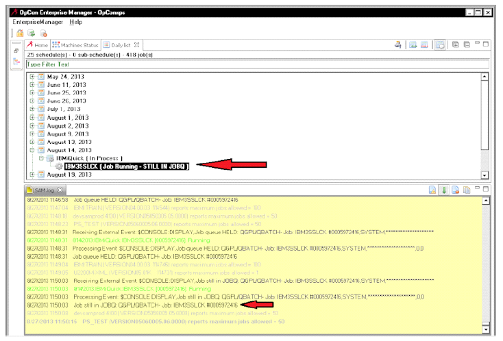

# IBM i LSAM Configuration

The LSAM parameters screen contains settings for LSAM communication with SMANetCom and settings for optional features. After installation of the LSAM, review the configuration file before starting the LSAM server jobs.

## Run the LSAM Configuration Program

1. In the command line, enter **SMAGPL/STRSMA**. For more information on the STRSMA command, refer to the [STRSMA Command](../operations/lsam.md#the-strsma-command).
2. Enter **7** to choose the **LSAM Parameters** function in the SMA Main Menu.
3. <**Tab**> to move between fields on the configuration screen.
4. Modify relevant configuration fields. Refer to the Configuration Settings table [IBM i LSAM Configuration Settings: Heading Information](#Heading_Information).
5. After modifying all relevant fields, press <**Enter**>.

## Critical Settings 

The following settings are **critical** to the operation of the LSAM with OpCon. Before using the IBM i LSAM, verify these settings in the system. In order to update critical settings, start the configuration program and then follow the instructions below.

- LSAM Name: The LSAM and SMANetCom use this value for communication.
  - The LSAM Name setting must be all capital letters and/or numbers and it must match the setting on the Machines screen of the OpCon EM (Enterprise Manager, the User Interface).
  - The SAM Server must be able to ping this name, unless the IBM i LSAM IP address will be used in the EM machine table in place of the LSAM server name.
    :::tip
    If using multiple environments, assign a unique name to each LSAM environment.
    :::
- Internet Address: This value is the IP Address of the IBM i system. Use the <**F4**> function key to view a list of valid IP addresses for this system.
- Max Concurrent Jobs: This value determines the maximum number of jobs the LSAM may process concurrently. This value should not exceed the maximum number of jobs that can be processed concurrently by the IBM i subsystems and job queues where OpCon can run jobs.
- Communication Port: The LSAM and SMANetCom use this value for communication.
  - The Communication Port setting must match the setting on the EM's Machines screen. (The default port value is 3100.)
  - Also set the JORS port (default value 3110) and verify it matches the EM machine record.
  - This LSAM uses a separate port for SMA File Transfer. (Refer to [SMA File Transfer](../file-transfer/overview.md).)
- SMA Subsystem Name: This value should only be changed for multiple IBM i LSAM environments; otherwise, leave it as the default value (SMASBS).
- Keep socket open (Y/N): For optimal LSAM performance, SMA recommends using the value Y (yes). This setting must match the setting on the EM's Machines screen. For more information, refer to [Discussion of Keep Socket Open Parameter](#Discussi).

:::tip
In the past, changing the value to N (no) was sometimes proposed as a solution when a site was experiencing unstable communication between the LSAM and SMANetCom, or if data was being lost. However, if either of these symptoms appear, please contact the Support team at SMA Technologies for assistance. SMA Technologies does not recommend trying to use this interface with the Keep socket open value set to N (no).
:::
- **Screen Title**: LSAM Configuration Parameters (3 Pages)
- **Screen ID**:
  - LSAPARR00-1
  - LSAPARR00-2
  - LSAPARR00-3

### Function Keys

#### F4=IP Address List

When the cursor is in the Internet Address field, press <**F4**> to view a list of the IP addresses used by the system. Select the address that represents the communications path used between OpCon and the LSAM. From the IP Address List window, use the keyboard/mouse to highlight the appropriate IP address and press <**Enter**> to select it.

##### IBM i LSAM Configuration Settings: IP Address Selection
```
 .. IP Adr Selection ...
 :   111.22.33.4       :
 :   127.0.0.1         :
 :                     :
 :                     :
 :                     :
 :                     :
 :                     :
 :                     :
 :                     :
 :              Bottom :
 : F12=Cancel .........:
```
##### F9=View LIBL

From the LSAM Parameters display, press <**F9**> to view the library list in effect for this LSAM environment. This function is useful with multiple LSAM environments. An example of the default library list for the SMADEFAULT environment is shown below.

```
SMALIBD00-2                SMA Environment Management                    00/00/00   
USERNAME                     Environment: SMADEFAULT                     00:00:00

Press Enter or F12=Return to return.

Seq  Library      Type     Description
 10  QTEMP
 20  SMAGPL
 30  SMADTA       SMADTA
 40  SMAPTF       SMAPTF
 50  SMAPGM       SMAPGM
 60  QGPL

                                                                           Bottom
F3=Exit   F5=Refresh   F12=Return
```

## Configuration Settings

### IBM i Name Rules

Certain parameters must conform to the following rules for IBM i names.

- Names must be 10 characters or less.
- Names must begin with an alphabetic character (A through Z, @, $, and #). 1, 3
- All subsequent characters can be alphanumeric (A through Z, 0
    through 9, @, $, #, and _ (underscore)).
    3
-   There can be no embedded blanks.
- The following special characters are not allowed to be used in names:
  - / Forward slash
  - \ Backslash
  - \* Asterisk
  - , Comma
  - : Colon
  - ; Semi-colon
  - \- Dash
  - = Equal sign
  - \+ Plus sign
  - ? Question mark
  - | Vertical bar
  - < Left angle bracket
  - \> Right angle bracket
  - & Ampersand
  - % Percent sign
  - ' Single quotation mark
  - " Double quotation mark
  - . period2


[1] For some command parameters, IBM i permits special values to begin with an asterisk (\*).

[2] The period is not valid as the first character of the name string, but it is valid as a subsequent character.

[3] SMA does not recommend using special characters due to difficulties that can arise with character translation tables. Please use only alphabetic characters and numeric digits in IBM i names.

### IBM i Password Rules

Certain parameters must conform to the following rules for IBM i passwords. Additional rules may be assigned with IBM i system security control values (refer to IBM reference SC41-5302, Security Reference).

- A password may contain any character string
- A password may not exceed 10 characters. IBM i does provide support for longer passwords - up to 128 characters (optionally supported by the LSAM for some features), but there are still parts of the LSAM software that are limited to only 10 characters. (Please contact SMA Support to report any LSAM limitations on passwords that interfere with applications that could otherwise be automated by OpCon.)

##### Update Configuration Variables

1. <**Tab**> to the relevant field.
2. Type a new value for the parameter. Refer to the table below for more information about each parameter.
3. Repeat steps 1-2.
4. Press <**Enter**> to update the LSAM's configuration.

:::tip
The update is stored immediately in the LSAM Parameters control file, however, any change in control values does not take effect in the LSAM server jobs until they are stopped and restarted.
:::

### Information Fields
- Environment:
  -   This display field contains the name of the LSAM environment.
  -   For new installations, the default value is SMADEFAULT and the LSAM Name is IBMILSAM, or the IBM i system/partition name may be used. **Use all capital letters!**
  -   SMA recommends using the LSAM Environment name for the Host Name when there are multiple LSAM environments within the same IBM i partition.(Refer to below.)


- Version 
  -   This display field identifies the LSAM's version, stored in the data area LSAVERSION.
  -   When contacting SMA Customer Support about the LSAM, please report the version. 
  
<a name="Heading_Information"></a>

##### IBM i LSAM Configuration Settings: Heading Information

| Field | Description |
| ----- | ----------- |
| Environment | - This display field contains the name of the LSAM environment. |
|             | - For new installations, the default value is SMADEFAULT and the LSAM Name is IBMILSAM, or the IBM i system/partition name may be used. Use all capital letters! |
|             | - SMA Technologies recommends using the LSAM Environment name for the Host Name when there are multiple LSAM environments within the same IBM i partition. (Refer to below.) |
| Version     | - This display field identifies the LSAM's version, stored in the data area LSAVERSION. |
|             | - When contacting SMA Technologies Customer Support about the LSAM, please report the version. |

### LSAM Control Parameters

##### IBM i LSAM Configuration Settings: Control Parameters
| Field       | Default     | Valid Values    | Required (Y/N)   | Description |
| -----       | -------     | ------------    | --------------   | ----------- |
| LSAM Name   | IBMILSAM    | IBM i Name (Refer to [IBM i Name Rules](#IBM2) | Y           | - This field identifies each LSAM environment to OpCon/xps. |
|             |             |                 |                  | - The default LSAM environment may use the system name. |
| Max Concurrent Jobs | 100   | Verify that the number of jobs does not exceed the maximum number of active jobs allowed by the IBM i subsystem definitions. | Y           | This field contains the maximum number of jobs the LSAM is allowed to process concurrently. |
| SMA Subsystem Name | SMASBS      | IBM i Name [IBM i Name Rules (Refer to Rules)](#IBM2)| Y           | - This field contains the name of the IBM i subsystem where the LSAM agent jobs run. |
|             |             |                 |                  | - The IBM i subsystem should be a dedicated subsystem unshared with other applications, because normal LSAM management functions start and stop the subsystem. |
|             |             |                 |                  | Note: Although the installation of the LSAM creates a default subsystem description (SMASBS), the IBM i administrator is responsible for configuring the subsystem and for tuning system performance. |
| Internet  Address  | <IP address of the server\>        | 255.255.255.255 (IPv4 required address pattern shown. If the IPv6 switch is set to Y = yes, this field MUST be updated to the correct format. Use F4 for assistance.)        | Y         | - This field identifies the IP address of the server where the LSAM programs may be contacted. |
|             |             |                 |                   | - Use the <**F4**> function key to view a list of valid IP addresses for the system. |
|             |             |                 |                   | Caution: Do not use the local host address of 127.0.0.1 |
| Int IP Addr (or *EXT) | *EXT       | *EXT or IP Address | Y           | -  Most IBM i partitions will directly support an Interface to the External (or Public) IP Address that is used by OpCon to connect to the LSAM Job Scheduler and JORS Server. When this is the case, just leave the Internal IP Address field set to *EXT. The External IP  address is available for the Bind IP? Option. |
|             |             |                 |                   | - However, when port-forwarding is being used by Client IBM i (virtual) partitions, as they are supported by a (physical) Host partition, then it is necessary to  specify an IP Address that can be directly accessed “internally” by the virtual, client partition, in order to support the Bind IP? option. |
| Bind IP?    | N           | Y or N      | Y           | - The original behavior of the LSAM communications programs was to request any available IP Interface where they can bind their designated Ports and then use that connection point to accept a socket connection request from the OpCon server. |
|             |             |                 |                   | - It is often preferred, and possibly more secure, to bind the Port to a specific IP address. This ability is required if an Internal IP address (such as a Virtual LAN address) will be used to support the OpCon server’s connection to the designated External IP Address. |
| Use IPv6 protocol? | N           | Y or N      | Y           | The LSAM communications programs (for both job scheduling and JORS) are capable of managing both the IPv4 and IPv6 protocols, concurrently. This support cannot be used until at least one IPv6 communications line has been configured under IBM i. |
| Start JORS server? (Y/N) | Y=yes       | Y or N      | Y           | -  This field determines if the LSAM server startup routines will automatically start the JORS communications server program.  |
|                          |             |             |             | - This option should normally be set to Y=yes. The option is provided only in case any functional problem might make it convenient to disable the lower priority JORS services while still allowing the critical job scheduling servers to continue processing. |
| EBCDIC -> A: translation table (EBCDIC to ASCII) or CCSID number  | QASCII      | IBM i Name Rules. Table must exist before starting LSAM. A CCSID number may be specified instead. *  | Y           | -  This field identifies the translation table used to translate IBM i native EBCDIC characters to the ASCII character set required by OpCon/xps. |
|                          |              |             |           | - To use a CCSID number, set the Library field to the special value of "*CCSID". |
| EBCDIC -> A: translation table library or '*CCSID' | QSYS | IBM i Name Rules. User-defined tables would exist in libraries other than QSYS. | Y | - The name of the DB2 UDB (DB2/400) library where the translation table may be found. |
|                          |              |             |           | -  Use the special value of "*CCSID" instead of a library name if a CCSID number will be specified in the table name field. |
| ASCII -> E: translation table (ASCII to EBCDIC) or CCSID number   | QEBCDIC     | IBM i Name Rules. Table must exist before starting LSAM. A CCSID number may be specified instead. *  | Y           | - This field identifies the translation table used to translate the ASCII character set incoming from OpCon/xps to the IBM i native EBCDIC character set used by the LSAM server programs. |
|  |                 |               |                  | - To use a CCSID number, set the Library field to the special value of "*CCSID". |
| ASCII -> E: translation table library or "*CCSID"   | QSYS        | IBM i Name Rules. User-defined tables would exist in libraries other than QSYS.  | Y           | - The name of the DB2 UDB (DB2/400) library where the translation table may be found. |
|             |             |              |            | - Use the special value of "*CCSID" instead of a library name if a CCSID number will be specified in the table name field. |
| Communication Port JORS Port | 3100        | Valid port numbers range from 0 to 65535  | Y           | - These fields contain the TCP/IP port numbers used for communication between the LSAM and SMANetCom. |
|             |             |              |            | - Communications Port is for Job Scheduling. |
|             |             |              |            | - JORS Port is for OpCon/xps retrieval of job logs. |
|             |             |              |            | **Note**: The JORS Port needs to be set in both the LSAM Parameters and the advanced machine setting in the OpCon Enterprise Manager. The JORS port is different from the SMA File Transfer port for this LSAM. |
|             |             |              |            | - For more information on modifying the JORS port number, refer to Communication Settings in the Concepts documentation. |
|             |             |              |            | - For multiple environments, each LSAM must have a unique port number. |
|             |             |              |            | **Caution**: Avoid port numbers ranging from 0 to 1023 due to common conventions. |

\* If one table field specifies a CCSID number, then both table fields
must specify a CCSID number. Refer to the topic of Character Translation
under the Extended Discussion of Parameters, below.

### Job Default Parameters


##### Job Parameters

| Field        | Default   | Valid Values | Required (Y/N) | Description  |
| -----        | -------   | ------------ | -------------- | -----------  |
| User Name    | QSYSOPR   | IBM i Name Rules (Refer to [IBM i Rules](#IBM2)| N        | - This field contains the name of the user whose authority governs the privileges granted to the LSAM jobs. This is useful whenever a user name is not being provided from OpCon. |
|              |           |              |          | - Certain LSAM utilities may require that the user name specified have special privileges normally granted to the system operator (as for QSYSOPR). |
|              |           |              |          | - The IBM i administrator is responsible for creating and configuring IBM i user profiles that will be used for OpCon job start requests. |
|              |           |              |          | - Also ensure that the SMANET user profile has been granted authority to use this user profile. |
| Jobd Name    | QBATCH    | IBM i Name Rules (Refer to [IBM i Rules](#IBM2) | N        | - A Job Description name referring to the system object that determines how a job  is processed. |
|              |           |              |          | - This job description controls all remaining job attributes unspecified by this screen. |
|              |           |              |          | - The IBM i administrator is responsible for creating and configuring the job description. |
| Jobd Lib     | QGPL      | IBM i Name Rules (Refer to [IBM i Rules](#IBM2) | N        | The library within the DB2 database where the job description resides. |
| Jobq Name    | QBATCH    | IBM i Name Rules (Refer to [IBM i Rules](#IBM2) | N        | - A Job Queue name referring to the system object that stores waiting or on hold  job requests. |
|              |           |              |          | - This determines which subsystem runs jobs when an OpCon/xps job request does not specify a job queue. |
| Jobq Lib     | QGPL      | IBM i Name Rules (Refer to [IBM i Rules](#IBM2) | N        | The library within DB2/400 where the job queue resides. |
| Outq Name    | QPRINT    | IBM i Name Rules (Refer to [IBM i Rules](#IBM2) | N        | An Output Queue name referring to the system object that stores waiting or on hold printer spool files. |
| Outq Lib     | QGPL      | IBM i Name Rules (Refer to [IBM i Rules](#IBM2) | N        | The library within the DB2 database where the output queue resides. |
| Current Library Name | *CURRENT  | IBM i Name Rules (Refer to [IBM i Rules](#IBM2) | N        | - This field specifies the Current library within the library list of an IBM i job. |
|              |           |              |          | - The system always searches the Current library first when looking for a requested program object or a file. |
|              |           |              |          | - The Current library definition is not required, but is useful for quickly changing the library name that is  initially searched. |
|              |           |              |          | - Instead of *CURRENT, any existing library name may be specified. SMA Technologies recommends using *CURRENT when there is no requirement for naming this library. |
| Initial Library List | *JOBD    | *CURRENT *JOBD *NONE *SYSVAL   | N        | - When unspecified by an OpCon job request, the library list of the requested job defaults to this value. |
|              |           |              |          | - For jobs depending on the LSAM environment, use the value *CURRENT.  |
|              |           |              |          | - Specifying this value is an effective way to control a job's library list when using multiple environments. |
| Printer Device | *JOBD    | *JOBD *CURRENT *SYSVAL *USRPRF  | Y        | - Establishes the value that will be used for all jobs that the LSAM submits, for the PRTDEV parameter of the SBMJOB. |
|              |           |              |          | - This job parameter is currently not supported by a job master field in the OpCon/xps Enterprise Manager. |
|              |           |              |          | - The default value of *JOBD is recommended because it is the most flexible – the printer device, including a value of *USRPRF, can be specified in each job description that is used. |
| Job Priority | 5         | 1 - 9        | N        | - This field determines the priority of OpCon/xps jobs in the specified job queue. |
|              |           |              |          | - This value determines the run order of jobs waiting in the job queue. |
|              |           |              |          | - SMA Technologies recommends using the moderate value 5 to keep from interfering with priorities defined in OpCon/xps. |
| Logging Level | 4         | 0 -- 4       | N        | - This field specifies the level of IBM i job logging. |
|              |           |              |          | - Levels range from 0 (no logging) to 4 (detailed logging). |
|              |           |              |          | - SMA Technologies recommends level 1 for effective troubleshooting. |
|              |           |              |          | - Refer to the IBM i Help text regarding the LOG parameter for the commands CHGJOB and SBMJOB. |
| Severity     | 00        | 00 - 99      | N        | - This field sets the filter for IBM i messages sent to the job log. |
|              |           |              |          | - The job log records only messages with a severity equal to or higher than this value. |
| Text         | *SECLVL   | *MSG *SECLVL *NOLIST | N        | This field specifies the maximum character length of each message added to the job log.|
|              |           |                          |          | - *MSG logs a single line. |
|              |           |                          |          | - *SECLVL logs the full message help text plus incident-specific parameter values. This logging type uses more system resources. |
|              |           |                          |          | - *NOLIST does not log any message text. |
| Log CL       | *YES      |  *YES *NO       | N        | - This field determines if the job log includes entries for executed lines of a control  language program. |
|              |           |              |          | - Since this type of logging uses more system resources, SMA Technologies recommends only using this for debugging or for critical procedures requiring full documentation. |
| Inq Msg Reply | *RQD     | *JOBD / *RQD / *DFT / *SYSRPYL | N        | - This field determines how un-handled information or error messages should be handled by the LSAM jobs. |
|              |           |              |          | - To properly engage its exception handlers, OpCon/xps expects the value *RQD. |
|              |           |              |          | - For more information, use the prompted command SBMJOB to see the IBM Help text regarding the INQRPYMSG parameter. |
| File Arrival Job Description | SMALSAJ00 | IBM i Name Rules (Refer to [IBM i Rules](#IBM2) | Y        | File Arrival jobs require that the IBM i LSAM library list be included in the job description. The LSAM server job description is a good default value that can be used, unless the user needs to override some job attributes for the whole File Arrival job. Note that the Enterprise Manager job master record supports selection of a unique Job Queue,  so it is not necessary to define a separate job description just to change the job queue where File Arrival jobs will be submitted. |
| File Arrival Job Description | SMADTA    | IBM i Name Rules (Refer to [IBM i Rules](#IBM2)   | Y        | Name the DB2 library where the File Arrival Job Description is stored. If the default job description of SMALSAJ00 is used, it would be necessary to change this library name from the default of SMADTA within a separate instance of the LSAM software, such as when two copies of the LSAM software (one for testing) are installed within the same IBM i partition. |
| IFS LOG      |           |              |          | Please contact SMA Technologies Support for assistance before making changes to these three special override fields. They apply only to the QSHELL commands executed by (1) File Arrival jobs, or (2) the LSAM CHKIFSFIL command. The default values prevent excessive QPJOBLOG reports from being produced by QSHELL service jobs. |
| IFS LOG -- job priority | 1         | 0 -- 4, *SAME | Y        | This field specifies the level of IBM i job logging. Levels range from 0 (no logging) to 4 (detailed logging). SMA Technologies recommends level 1 for this special-purpose override. Refer to the IBM i Help text regarding the LOG parameter for the commands CHGJOB and SBMJOB. |
| IFS LOG -- logging level | 30        | 00 -- 99, *SAME | Y        | This field sets the filter for IBM i messages sent to the job log. The job log  records only messages with a severity equal to or higher than this value. SMA Technologies recommends a value of 30 for this special-purpose override. |
| IFS LOG -- text | *NOLIST  | \*SAME \*MSG \*SECLVL \*NOLIST| Y        | This field specifies the maximum character length of each message added to the job log. |
|       |           |              |          | - *MSG logs a single line. |
|       |           |              |          | - *SECLVL logs the full message help text plus incident-specific parameter values. This logging type uses more system resources. |
|       |           |              |          | - *NOLIST does not log any message text. SMA Technologies recommends this value for this special-purpose override. |

: IBM i LSAM Configuration Settings: Job Parameters

### LSAM Database Maintenance

For more information, refer to [Log File and Database Management](../logs-database/overview.md)
 and [JORS and Spool File Server](../reference/jors.md).

#### IBM i LSAM Configuration Settings: LSAM Log Management

##### LSAM Database Maintenance
| Field        | Default | Valid Values | Required (Y/N) | Description  |
| -----        | ------- | ------------ | -------------- | -----------  |
| Automatic delete-global | Y       | Y = yes / N = no  | Y            | - This field determines if the LSAM automatically purges LSAM daily log files. |
|                         |         |                   |              | - If enabled, purges occur according to the number of days specified to keep LSAM logs. |
|                         |         |                   |              | - This flag does not control job log and spool file purging, or the Backup and Reorganize process. |
|                         |         |                   |              | - The LSAM server job LSAMNG manages log and file purging. |
| Maintenance hour | 0400    | 0000 – 2359 (24- hour clock values) | Y            | - This is a 24-hour clock time after which the LSAM will attempt to perform periodic file maintenance once every day. |
|                         |         |                   |              | - SMA Technologies recommends specifying the time of least activity on the system. |
|                         |         |                   |              | - There may be brief delays in starting jobs just following this hour, especially on the days specified for the backup and reorganize process. |
| Days to keep daily LSAM logs | 5       | 1 - 99       | Y            | - This field specifies the number of days of data to retain in the daily  operations log files. |
|                         |         |                   |              | - There is a separate control for the category of debug/audit log files (refer to [Operator Replay Scripts](../operator-replay/overview.md) about types of log files).  |
| Days to keep daily BkUp | 30      | 1 - 999      | Y            | - The number of days to retain the type "O" save files in library SMALOG that contain a backup of the LSAM daily logs before they are purged. |
|              |         |              |              | - A value of 999 means do not delete. In this case the user is responsible for archiving and deleting the save files. |
| Days to keep debug logs | 5       | 1 - 99       | Y            | - This field specifies the number of days of data to retain in the Debug/Audit log  files. |
|              |         |              |              | - There is a separate control for the category of daily log files (refer to [Operator Replay Scripts](../operator-replay/overview.md) about types of log files). |
| Days to keep debug BkUp | 30      | 1 - 999      | Y            | - The number of days to retain the type "D" save files in library SMALOG that contain a backup of the LSAM debug/audit logs before they are purged. |
|              |         |              |              | - A value of 999 means do not delete. In this case the user is responsible for archiving and
deleting the save files. |
| Days (to) keep PTF RLBK SAVF | 30      | 1 - 999      | Y            | - The number of days to retain the PTF rollback save files in library SMAPTF. Only rollback save files for very recently installed PTFs would be useful. Older rollback save files are not required. (Users may request old rollback save files from SMA Technologies if they are needed.) |
|              |         |              |              | - Set this value to a short number of days in order to lower disk space utilized by the LSAM. |
|              |         |              |              | - This control value does not support the special value of 999 to mean "do not delete." Instead, to prevent deletion of the rollback save files, set the LSAM automatic delete-global flag to 'N' = no. However, 999 days is a long time to keep unnecessary old PTF rollback save files. |
| Days to keep SPLFs (spool files) | 5       | 1 -- 99      | Y            | - This field determines when the LSAM will automatically remove spool files that it has been asked to track. |
|              |         |              |              | - Spool files to track are specified in the Enterprise Manager as part of the OpCon job master. |
|              |         |              |              | - Spool files produced by OpCon-scheduled jobs that are not specified in the Enterprise Manager job master will not be deleted by the LSAM. Job log reports are handled separately. |
| Days to keep job logs | 5       | 1 -- 99      | Y            | - This field is the default value that determines when the LSAM will automatically remove the job logs of jobs that were scheduled by OpCon. The LSAM will delete the actual IBM i job log report spool file as well as any (optional) LSAM copy of the job log (refer to next field). |
|              |         |              |              | - Retention of job logs may be controlled for each job master that is defined in the OpCon  Enterprise Manager. The Enterprise Manager job master number of days and number of occurrences (per SAM job name) overrides this LSAM default value. |
| LSAM copy of job logs? | N       | Y=yes, N=no | Y            | - The LSAM can use a database file to store copies of the IBM i job log reports for jobs started by OpCon. This supports the OpCon option to View Output, and may be helpful if the system normally removes IBM i job log reports very quickly. |
|              |         |              |              | - However, copying job logs requires much disk space, so SMA Technologies recommends leaving this option set to N = no. |
|              |         |              |              | **Note**: The LSAM normally supports the OpCon View Output function by reading the actual IBM i job log spool file. It is also able to read the job logs of active jobs, and the reading of active job logs is not affected by this control flag. |
| Backup/reorganize files - FREQ | M       | N=Never D=Daily W=Weekly M=Monthly  | Y            | - This field controls when the LSAM will automatically suspend LSAM server operations to execute a separate job that runs the SMARGZ command. When automatic scheduling is used, this process is initiated shortly after the specified Maintenance Hour. |
|              |         |              |              | - The SMARGZ command (described in Commands and Utilities) uses the SMASUP command in (LIB) mode to create a backup of the entire SMADTA database library. It then suspends the LSAM server jobs while it reorganizes the LSAM's control and master files. |
|              |         |              |              | - Refer to the description of the Days/Wk, Mo field for information about how to control the schedule of this process. |
|              |         |              |              | - It is possible to schedule an OpCon job that will execute the SMARGZ command instead of using the LSAM's own rudimentary schedule controls. Using the OpCon schedule method provides better control over the process and an ability to coordinate the brief LSAM down time with other jobs. When using the OpCon schedule instead, set this field to the value of N = never. |
| Days/Wk(1-7), Mo(1-31) | 26      | 1 - 31       | N            | - The LSAM backup and reorganize process uses this Days field to further define the automatic processing schedule. |
|              |         |              |              | - All daily and weekly scheduled processing is based on the IBM i system day of the week (system value QDAYOFWEEK) as follows: *SUN = day 1 of the week / *MON = day 2 / *TUE = day 3 / *WED = day 4 / *THU = day 5 / *FRI = day 6 / *SAT = day 7 |
|              |         |              |              | When this field is blank, the following default schedule is used: D (Daily) = every day / W (Weekly) = day 1 of the week (*SUN) / M (Monthly) = day 1 of the month |
|              |         |              |              | - When the field is not blank, one or more digits may be typed into the field to indicate which days the process should be executed: M(Monthly) = specify one day of the month using a one- or two-digit number, 1 - 31. **Note** that the simple LSAM  schedule rules do not accommodate the different number of days in each month, so specifying a day greater than 28 will result in the backup and reorganize procedure not being executed on months that have less than 29, 30 or 31 days. To specify the end of the month, use an OpCon/xps schedule instead of LSAM scheduling.  D(Daily) or W(Weekly) = specify the day or days of the week when the process should execute. For example: 136 = Sunday, Tuesday, Friday |
| Days keep LSAM backup (Days to keep the LSAM SMADTA library backup and/or log file extract save files)  | 90      | 1 - 999      | Y            | - The number of days to keep LSAM backup save files of type "L" in the library SMALOG. Type "L" save files are produced by the SMASUP command, and they may contain a complete backup of the SMADTA library (option LIB), a copy of all log files (option LOG), or only selected log and/or master files (option SEL). |
|              |         |              |              | - A value of 999 means do not delete. The save files will remain stored until removed by a manual process or by a job scheduled in OpCon. |
|              |         |              |              | - The LSAM command SMARGZ can be used to drive the save file delete process. (Refer to [Commands and Utilities](../commands-utilities/commands.md) for more information about the SMARGZ command.) |

### Job Scheduling Performing Parameters

The following table of job scheduling performance parameters describes some flags that can be used to bypass LSAM errors that would normally reject an OpCon/xps job start request. SMA recommends that these errors should not be bypassed. There are many strategies that could be used instead of bypassing errors. Please contact SMA Support for advice before setting these bypass flags to Y=yes.

:::caution
Setting the LSAM error bypass flags to Y=yes causes the LSAM server programs to incorrectly report the actual job status. It also creates an opportunity for the LSAM to report that a job has failed when it has actually completed normally. In order to prevent incorrect job failure messages the LSAM server program performance must be carefully tuned. Please review the discussion below about the Job message idle timer parameter and also Tuning LSAM performance.
:::

#### IBM i LSAM Configuration Settings: Job Scheduling Performance Parameters

##### Job Scheduling Performance Parameters

| Field        | Default | Valid Values | Required (Y/N) | Description  |
| -----        | ------- | ------------ | -------------- | -----------  |
| Bypass errors (warn only) | N/A     |(Informational Output Only) | N/A          | This group of flags supports user-defined options for the behavior of the LSAM when it attempts to control scheduled jobs. Refer to [Discussion of Bypass Flags](#Discussi2).    |
| SMA0008 = JOBQ HELD | Y       | Y or N       | Y            | - **Y = yes**: Bypass error SMA0008 when the requested job queue is in held status. Allow the OpCon/xps job request and place the job into the held job queue. A warning is issued to OpCon/xps for display on the SAM console. |
|              |         |              |              | - **N = no**: Do not allow a job to be submitted when the requested job queue is in held status. Reject the job start request with error code SMA0008. |
| SMA0007 = JOBQ no SBS   | N       | Y or N, 1-9  | Y            | - **Y = yes**: Bypass error SMA0007 when the requested job queue is not attached to a subsystem. Allow the OpCon/xps job request and place the job into the unattached job queue. A warning is issued to OpCon/xps for display on the SAM console. |
|                         |         |              |              | - **N = no**: Do not allow a job to be submitted when a job queue is not attached to a subsystem. Reject the job start request with error code SMA0007. |
|                         |         |              |              | - **1 – 9**: Retry the check of the job queue status this number of times. If the status never returns normal, then the job scheduler will behave as if this bypass flag were set to 'N' and return an error code SMA0007 to the OpCon/xps SAM. |
| SMA0007 retry delay | 0       | 000-999      |              | If the SMA0007 bypass flag value is set to a number (of retries), the LSAM job scheduler server program will delay this number of seconds before attempting each retry of checking the job queue status. |
| SMA0014 = TE1 run job | N       | Y or N       | Y            | - **Y = yes**: Bypass error SM0014 when OpCon/xps has rejected a request (using a TE1 transaction) to track an ad hoc job. Issue warning message SMA0014 to the IBM i operator message queue and release the job so it can run without being tracked. |
|              |         |              |              | - **N = no**: Do not release a job that is supposed to be tracked by OpCon/xps when OpCon/xps has issued a TE1 transaction rejecting the request to track the ad hoc job. Issue warning message SMA0014 to the IBM i operator message queue. |
| SMA5801 = MSGQ+LIB | blank   | IBM i object names | N            | - Enter the name of a message queue and library location of the message queue, where the LSAM job scheduler server program will send message ID SMA5801 whenever a job is found stuck in MSGW (message waiting) status. |
|              |         |              |              | - Also refer to the extended discussion of this parameter, below in this topic. |
| Job message idle timer | 5       | 1, or greater number of seconds | Y            | - This is the amount of time, in seconds, that the LSAM job completion message monitor server (job TXMMNG, program LSARCMR00) will pause to check for operator control signals before starting a new cycle of checking for job completion messages in the SMAMSGQ message queue. |
|              |         |              |              | - If this value is set too high, then the LSAM can issue a SMA0097 error message reporting that a job has failed when it has actually completed normally. |
|              |         |              |              | - Casual LSAM users should try a value of 5 seconds in order to prevent this server from impacting system performance. But very active LSAM users may need to lower the value to 2 or even 1 in order to prevent false reports of job failures. Refer to [Discussion of Bypass Flags](#Discussi2) for more information. |
| Job message pause frequency | 1000    | 1 - 99999    | Y            | The number of job completion messages that can be processed at once before the program is forced to pause and check its control data queue. This value prevents the system from becoming locked up by a runaway job cycle that generates  many (or endless) messages all at once. |
| Bypass command validate | Y       | Y = yes, do bypass command syntax validation N = no, do not bypass and do validate command syntax  | Y            | Normally set to Y = yes, do bypass. Bypassing is the recommended value for best performance of the LSAM job scheduler server. If not bypassed, command line syntax validation can fail, incorrectly, due to an inability to accommodate unique job initial library lists, and in some environments also due to restrictions in object authority. The preferred method is to let invalid commands fail and use the OpCon/xps "view output" feature to inspect the job log of failed jobs. |
| Use job cmpl msg mgmt? | N       | Y=yes, N=no | Y            | - Job completion messages for all jobs controlled by the IBM i LSAM are sent to the SMAMSGQ message queue in the SMADTA library. |
|              |         |              |              | - It is possible, though not recommended, that a program could cause other types of messages to  be sent to a job's completion message queue. When this happens, the default behavior of the LSAM job completion message server is to ignore messages that are not actual job completion messages. But if those messages are important, then this flag can be set to Y = yes to tell the LSAM job completion message server that it should consult the LSAM Message Management Parameters master file for any rules that might apply to these other types of messages. |
| Job parms separator-HEX    | 6A      | X'01' - X'FE' | Y            | - This pair of characters is the EBCDIC hexadecimal character representation of the actual character that can optionally be used to add more job definition parameters to the Call command line field of an OpCon/xps job master record for IBM i jobs. This character must be the result of translating the ASCII character used in OpCon/xps job master maintenance, translated to EBCDIC according to the translation table specified above in the LSAM Parameters. |
|              |         |              |              | - After typing this character in the Call command line, additional job definition parameters (as supported by the IBM i SBMJOB command) may be added to the job. In addition, it is also allowed to type in a SCANSPLF command and its parameters that will be used to evaluate the job log report after a job finishes normally, in order to produce a final determination of the job completion status that will be reported to the OpCon/xps schedule. |
|              |         |              |              | - When the SCANSPLF command is used along with additional job parameters, the SCANSPLF command and its own parameters must follow any job definition parameters. That is, the SCANSPLF command string must be the last string of non-blank characters in the Call command field, following the Job parms separator character. ||

### Communication Performance Parameters

There are two sets of communications performance parameters. The first set is for the job scheduling server and the second set is for the JORS (job output retrieval) server. The parameter definitions are similar for each set. For more information about the LSAM JORS server job, refer to [JORS and Spool File Server](../reference/jors.md).

#### IBM i LSAM Configuration Settings: Communication Performance Parameters

##### Communication Performance Parameters

| Field        | Default | Valid Values | Required (Y/N) | Description  |
| -----        | ------- | ------------ | -------------- | -----------  |
| Keep Socket Open (Y/N) | Y       | Y or N       | Y            | - This field determines if the communication socket remains open after transactions. |
|              |         |              |              | - Keeping the socket open improves communication speed; however, closing the socket after each transaction may solve a data loss problem in LSAM connections. |
|              |         |              |              | - Refer to [Discussion of Keep Socket Open Parameter](#Discussi) about synchronizing this value with theOpCon/xps machine table. |
| Port Idle Timeout | 300     | Should be at least 60 | Y            | - This field determines the number of seconds to wait for communication from OpCon/xps before timing out. |
|              |         |              |              | - The value should be larger than the sum of the Control DTAQ Wait value and the Input Wait Timeout value. |
| Control DTAQ Wait | 1       | Suggested range is 1 to 10    | Y            | - This field determines the number of seconds to wait for instructions from an i5 operator. |
|              |         |              |              | - Waiting on a data queue lessens the rapid attempts by a program to read from an idle socket conversation. |
|              |         |              |              | - This value is ignored as long as there is activity in the socket conversation. When the socket is active, the check for new control instructions is instant and the program returns to receive the next input from the socket. |
| Control DTAQ Frequency | 20      | Suggested range is 5 to 20 | Y            | - This field determines the number of consecutive communication transactions to process while the sockets communications program is active (i.e., no Input Wait Timeout has occurred) before pausing to check for new commands from the control data queue. |
|              |         |              |              | - This setting allows the emergency interruption of active communications without disturbing LSAM transactions. |
| Input Wait Timeout | 1       | Suggested range is 1 to 30 | Y            | - This field determines the number of seconds the communications program awaits input from the socket before checking the control data queue. |
|              |         |              |              | - This wait time does not affect active sockets (i.e., the program does not wait to receive  incoming data). |
| Closed Socket Linger | 1       | Suggested range is 1 to 120 | Y            | - This field determines the number of seconds the system waits before purging a closed socket. |
|              |         |              |              | - The LSAM is allowed to immediately reuse a closed socket; consequently, this setting does not affect new connection requests from OpCon. |
|              |         |              |              | - The linger time should be short to prevent an error where OpCon is unable to connect to the LSAM due to "socket is already in use." A short linger time should prevent lingering socket conversations from adding up to the maximum number of permissible conversations on a single socket. |
| ACK pending timeout | 60      | Recommended value is 30 – 60 | Y            | - This field determines the number of seconds that the LSAM communications program will wait for OpCon/xps to respond to the last transaction sent. |
|              |         |              |              | - An unacknowledged transaction prevents any further communication between the LSAM and OpCon/xps, so this value should be kept short. |
| Number of sub-processes | 3       | 1 - 999      | Y            | Controls the number of simultaneous Job Output Retrieval requests that the LSAM can handle. If there are already 3 active, a 4th request would be rejected. However, LSAM response to most JORS requests is usually very quick. |
| Transmit block size | 1280    | 1280         | Y            | Do not change this value without consulting with SMA Technologies Support. However, this control value exists in case there is a need to tune performance for clients with exceptional network circumstances. |
| -sub; -main  | N/A     | Only change if instructed by SMA Technologies Support.  | N/A          | The JORS communications server is comprised of the main listener program that routes all incoming requests and sub-programs that are spawned to process each data retrieval request. There are separate  tuning parameters that affect each of these processes. | 
| Accept OpCon server IP#: 2:, 3:, 4: | *ALL   | *ALL or IP Address | Y            | There are four data entry lines that can be used to register IP addresses of OpCon servers that are allowed to connect to this LSAM. Any attempt to connect by another OpCon server will be rejected and it will be reported to the active OpCon server's SMA Log. |
|              |         |              |                     | Either set the first line IP# to the special value of *ALL, or enter one or more allowed IP addresses to restrict the connection. |
|              |         |              |                     | **Note**: Only one OpCon server can connect to the LSAM at once. Secondary connection attempts will be rejected, reported to the active OpCon server SAM Log and to the local IBM i partition's QSYSOPR message queue. The original active OpCon server connection will remain active. |


: IBM i LSAM Configuration Settings: Communication Performance
Parameters

# TLS Security Options

For more information, refer to [Extended Discussion of Parameters](../configuration/configuration.md#extended-discussion-of-parameters) that provides instructions for implementing TLS Secured communication connections with this Agent. Those instructions must be understood to choose correct values for the
fields in this table.

Remember that changes to the TLS Security options will only take effect after the LSAM Server jobs have been stopped and restarted.

## IBM i LSAM Configuration Settings: Job Scheduling and JORS TLS Security Options

### TLS Security Options

| Field       | Default Values | Valid       | Required (Y/N) | Description |
| -----       | -------------- | -----       | -------------- | ----------- |
| Use TLS Security? | N           | Y=yes N=no  | Y           | - This field determines if the LSAM will engage a digital certificate and complete a TLS Security handshake with the OpCon server. |
|             |                |             |                | - When this option is set to Y = Yes, the TLS Security handshake must complete  successfully, or the connection with the OpCon server will be refused.  |
|             |                |             |                | - Use the LSAM Log Viewers, log view 1, to see entries that report about TLS Security, whether it completed successfully, or whether some error is reported.  |
|             |                |             |                | - Please carefully consider the information under [Extended Discussion of Parameters](../configuration/configuration.md#extended-discussion-of-parameters) that explains how to configure and use TLS Security. Understand that there are IBM Digital Certificate Manager options for directly updating some of the follow fields, although SMA Technologies recommends using this LSAM Parameters interface to change those settings, so that the LSAM control file and display will remain synchronized with the Digital Certificate Manager's database.  |
| TLS handshake timeout | 30          | 1 -- 999    | Y           | - The number of seconds that the Agent communications programs should wait for the next response, once a TLS Security handshake has been initiated, before they give up waiting and reject the connection attempt. |
|                       |             |             |             | - This value must be long enough for a normal connection from the OpCon server to  complete successfully. But if the time is too long, that could create an opportunity for hacking the security handshake.  |
| TLS DCM Application Description   | (see default text on screen) | Any text    | N           | This field supports a description of the Digital  Certificate Manager application, for information purposes only. |
|  TLS DCM Application ID | (see default text on screen) | Must match the IBM i DCM App ID | Y           | This Digital Certificate Manager Application ID must match the Application ID that was registered in the local IBM i Certificate Store for this Agent's certificate. The Agent uses this key value to request the digital certificate data that it needs to complete a TLS Security handshake with the OpCon application server. |

### Extended Discussion of Parameters

Additional explanation and examples are provided to help understand how to set and use certain of the LSAM parameters listed above.

### TLS Security Implementation

#### Introduction to TLS Security for the IBM i Agent

This discussion offers supplemental information in addition to what is provided in [Communication Settings](https://help.smatechnologies.com/opcon/core/latest/Files/Concepts/Machines.md#Communic)  in the **Concepts** online help, and other referenced sections of documentation that explain each part of implementing TLS Security in the OpCon network. The ready should look for information about configuring the OpCon Server communications programs,  including SMANetcom, and the MSLSAM (Windows Agent).

This section is focused on guidelines for implementing compliant and compatible TLS Security for the OpCon Agent for IBM i (= the IBM i LSAM), in cooperation with the OpCon Server itself and, if SMA File Transfer with Windows is required, also in cooperation with the MSLSAM. It is typically possible to also use TLS Security with most of the other OpCon Agents, but please consult OpCon documentation for instructions about specific operations required to implement digital certificates and client/server authentication within those other Agents.

#### Implementing Digital Certificates for TLS Security

In general, SMA does not provide specific instructions for generating or installing the digital certificates that are required to support TLS-secured data communication connections. However, the following guidelines are provided as a checklist to help ensure that minimal requirements are not missed.

Follow the OpCon core product documentation for implementing TLS Security.

a.  At least one digital certificate identifying the OpCon server must be generated or obtained and installed into the Microsoft Windows certificate store on the OpCon server.
    i.  Digital certificates can be self-signed or issued by well-known public Certificate Authorities.
b.  Similarly, the OpCon application server's digital certificate, or the CA root certificate for the authority that issued the OpCon Server certificate, must be imported into the IBM i *SYSTEM certificate store, using the IBM i web-based DCM (Digital Certificate Manager) application.

The IBM i DCM (Digital Certificate Manager) must be used to complete the following operations:

a.  First, if it is not already established, follow IBM instructions to active the *SYSTEM certificate store.
    i.  Always select the *SYSTEM certificate store to complete most of the following steps (except for the following step 2.b.).
b.  There is sometimes an exception where a special CA certificate store might be used to generate a CA certificate that identifies the IBM i server itself as a certificate-generating authority.
    i.  If the IBM i server will be a self-signed CA that issues TLS Client/Server certificates for the IBM i LSAM applications, then the internal CA certificate should be imported into the *SYSTEM certificate store as a Trusted CA. 
    ii. Similarly, exporting the IBM i local CA certificate is a good way to then import that CA certificate into the affected Windows systems (such as the OpCon Server and possibly other Windows Agent machines), so that individual TLS Client/Server certificates for the IBM i applications do not, themselves, have to be exported/imported.
c.  TLS Client/Server digital certificates for the IBM i Applications can be issued by a public CA (Certificate Authority), or they can be self-signed certificates issued by the IBM i partition in the client environment.
    i.  TLS Client/Server digital certificate requests can be generated by the IBM i DCM web application, although, it has been observed that not all of the certificate request options one might desire are readily available from the IBM i DCM web application. Even so, any external digital certificate request application can be used, as long as the local IBM i system identity factors and functional characteristics are known and carefully submitted.
    ii. Certificates issued by a public CA must then be imported into the IBM i *SYSTEM certificate store.
           I.  Copy the digital certificate to a directory within the IFS root file system of the IBM i partition where that will execute the DCM web application and host the *SYSTEM certificate store.
d.  If a locally generated TLS Client/Server certificate will be exported from the IBM i \*SYSTEM certificate store:
    i.  Export the certificate to an IFS root '/' file system directory. Frequently it is convenient to specify a .CER suffix on the exported file name.
    ii. Always use ASCII text mode when transferring a .CER file from the IBM i IFS root file system directory to another system, such as a MS Windows partition or machine.

In OpCon, the machine records for the IBM i machine must be updated with a certificate serial number when a self-signed TLS Client/Server certificate is being imported by itself into the OpCon Windows server, that is, when there is no IBM i CA trusted root certificate already imported into the Windows system.

a.  This same principle applies when any TLS Client/Server certificate is imported into the Windows system, when the CA that issued the certificate is not already identified by a Trusted Root certificate (that is already registered in the Windows system).
b.  Put another way, it is not necessary to import individual TLS Client/Server certificates into a system whenever the CA that issued the certificate is identified as a Trusted Root (which means that the CA Root certificate has already been imported into the local system's certificate store).

There are four (4) TLS Applications in the IBM i LSAM software (as of the date of this publication) that must be registered in the IBM i *SYSTEM certificate store, and then assigned a TLS Client/Server certificate.

The IBM i *SYSTEM certificate store must be initialized (as mentioned above) before an Application can be registered, but...

The digital certificates do not have to be generated or registered (yet) to complete the Application registration in the LSAM software configuration steps.

It is critical that the LSAM registration of the Application ID match exactly the Application ID that will be registered in the IBM i *SYSTEM certificate store.

The four Applications that must be assigned the exact Application ID's are commonly described by OpCon documentation with the following approximate labels:

- LSAM Job Scheduling and JORS services (a TLS Server).
- LSAM SMAFT (SMA File Transfer) Agent (a TLS Client, initiated by an OpCon SMA File Transfer job start request).
- LSAM SMAFT Server (a TLS Server, a never-ending LSAM server job that runs alongside of the other LSAM server jobs).
- LSAM Operator Replay:   The script driver (a TLS Client), accessing the IBM i Telnet Server.

After the Applications are registered, use the IBM i DCM web application to assign the appropriate TLS Client/Server digital certificate to each
application.

a.  The same TLS Client/Server certificate could be used for all four Applications.
b.  The client may choose to use two to four separate TLS Client/Server certificates, depending on the entity's security standards or common practices.

#### Steps to Implement TLS Security for the IBM i LSAM

The following instructions apply specifically to the data communication connection between the IBM i LSAM and the OpCon SAM, used for Job Scheduling and (for this LSAM) the JORS Server. For information that is specific to the SMA File Transfer protocol or the Operator Replay Script driver use of the Telnet Server, refer to TLS Security details within those chapters of this Agent documentation.

Some of the following steps may require information that originates from the Digital Certificate guidelines, above.

1. New installs of the LSAM (OpCon Agent) for IBM i must use an install file with a name similar to LI181001 (or newer, where the "181" refers to the IBM i Agent version 18.1).
    a.  Version 04.00.03 or older of the IBM i LSAM are not supported for TLS Security. But they can be upgraded to LSAM version 18.1 using the same, latest version of the 18.1 install file.
2. The OpCon server software must be at a version 17.2.x or newer. 
    a.  For versions of OpCon prior to 18.3.1, it might be necessary to obtain and execute SQL instructions that are used to update the OpCon database (at the location of the SQL Server) to enable new TLS Security settings for IBM i machine records.
        i.  As of this publication, these statements were available in a file named "UpdateLSAMTYPES_AUXForSMAFTTLS.sql". Please contact SMA Support for assistance with obtaining and executing this update to the OpCon server's database.
3. Within General Settings for the IBM i LSAM machine record:
    a.  Enter the Fully Qualified Domain name, for example:
        
4. In Advanced Settings for the IBM i LSAM machine record, complete the following updates.

    a.  Under Communication Settings:

      i.  Set the "Use TLS for Scheduling Communications" flag to True.

      ii. Enter the TLS Certificate Distinguished Name; this is often the same as the Fully Qualified Domain Name (but verify what the certificate says; some views show this as the certificate Common Name (CN).

      iii. The TLS Certificate Serial number is not required when certificates are published by a trusted CA (Certificate Authority). But if a self-signed certificate is being used by this machine, then enter the certificate serial number so that OpCon can find its local copy of the certificate to authenticate the communication connection user.

    

    b.  Under SMA File Transfer Settings, it is usually recommended to start by allowing both TLS-secured and non-TLS connections to be supported, until all the OpCon and LSAM communication links can be verified. After that, only disable non-TLS connections if it is true that all machines used at the site are confirmed as supporting TLS security for SMA File Transfer.

      i.  Unrelated to TLS security, but required, set the File Transfer Role for IBM i machines to "Both".

      ii. Set the File Transfer TLS Port Number to the same value as the non-TLS port.

      I.  The IBM i LSAM uses the same port number for either type of connection and depends on a combination of the LSAM local controls, plus the remote SMA File Transfer partner's controls, to determine whether TLS security handshake can be completed.

      II. **NOTE**: OpCon "File Transfer" jobs, under the Options tab, can override each job's settings to either force only TLS connections, or to allow non-TLS connections.

      iii. Set Support TLS for SMAFT Server Communications = True.

      iv. Set Support TLS for SMAFT Agent Communications = True.

      v.  Set File Transfer non-TLS Port Number to the same value as the TLS port (for IBM i machines).

      vi. Set Support non-TLS for SMAFT Server Communications = True.

      vii. Set Support non-TLS for SMAFT Agent Communications = True.

    c.  Be sure to use the Update and Save buttons to store the machine record changes.

    
5. Update the IBM i LSAM Parameters.

    a.  The LSAM green screen main menu is accessed, for example, by using the command SMAGPL/STRSMA. Select option 7 on the main menu. There are tables summarizing the meaning of these parameters in the [IBM i Agent Configuration Settings](../configuration/configuration.md) section of this User Help.

    b.  After verifying the main LSAM Control Parameters, press Enter or PageDown twice to reach display format 3 and update the "Job Scheduling and JORS TLS Security Options."

    i.  Set "Use TLS Security" = Y.

    ii. The "TLS Handshake" default value of 30 seconds is usually more than long enough to complete a TLS handshakes.

      I.  If an error message in the LSAM Communications trace log (LSAM sub-menu 6, option 5, log view 1) shows a "handshake timeout" message, it's possible to try the connection again after updating this value to a longer time, and then stopping/restarting the LSAM Servers (to actualize the new setting). However, in most cases it seems that a handshake timeout is really an indication that the other side has rejected the LSAM's digital certificate (for any of several reasons).

    iii. The "TLS DCM App description" is suggested in the TLS Security parameters table, above, and on the green screen display, page 3 of LSAM Parameters. But it can be user-defined. It is not critical, but is the description that will show in certain IBM i DCM displays.

    iv. The "TLS DCM Application ID" is critical, because this field value, as entered in this display format, will be used by the LSAM communication program to find the digital certificate it must use, that was stored in the IBM i certificate store.

6. Update the IBM i LSAM Parameters.

    a.  The LSAM green screen sub-menu for SMA File Transfer in the IBM i is accessed using option 8: SMA File Transfer menu, from the LSAM main menu. From the sub-menu, select option 7: SMAFT Configuration Parameters, from this sub-menu.

    b.  Press Enter or PageDown once to reach the "SMA File Transfer SSL/TLS Security Options."

    c.  Set the flag "Use TLS Security?" to 'Y'.

    d.  The other fields in this segment of TLS Security options are managed similar to the instructions above for Job Scheduling and JORS, except that there are two different programs (or DCM Applications) for SMAFT that must each be described and labeled.

7. Before TLS Security can be engaged, remember to complete the IBM DCM maintenance:

    a.  Register the four LSAM Applications, making sure that the Application ID (not the Description) matches exactly what is registered in the LSAM Parameters.

    b.  After digital certificates are obtained and installed, or created from within the IBM DCM application, assign one or more digital certificates to the four LSAM Applications.

8. After setting all the LSAM options and completing other preparations (above), use the LSAM sub-menu 6. If the LSAM server jobs were already started, they must first be stopped using the sub-menu option 2, in order for new LSAM Parameter values to be implemented. Then use sub-menu option 1 to restart the server jobs.

    a.  The same operation holds true for the LSAM's SMAFT server job, managed from sub-menu 8, although in most cases a SMAFT Parameters flag will indicate that the SMAFT Server job will stop and restart along with all the other LSAM server jobs.

### Discussion of Keep Socket Open Parameter

The Keep Socket Open parameter controls the performance of the IBM i LSAM sockets communication program.

:::caution
The setting of this parameter must match the equivalent parameter in the machine table of OpCon/xps Administration. When the advanced General values parameter for a machine has been set to: Close socket during synchronization = False, then the matching IBM i LSAM must be set to: Keep socket open = Y (yes), and vice versa. Failure to match these parameter values can cause a loss of data.
:::

:::tip
In most cases, set Keep Socket Open = Y. Do not change this value unless instructed to do so by SMA technical support. This value supports the highest possible rates of communications. However, if a communications link with an IBM i LSAM must be set to close the socket between each transaction, then some other performance parameters in the OpCon/xps machine table must be set to less aggressive values. These parameters and their settings are illustrated in the following table.
:::

#### IBM i LSAM Configuration Settings: Communication Performance
| Category        | Parameter                        | With Keep socket open  | With Close socket per TX |
| --------        | ---------                        | ---------------------  | ------------------------ |
| Buffer Settings | Max Consecutive Send Messages    | 100                    | 1                        |
| Timer Settings  | Consecutive Send Sleep Time (ms) | 100                    | 200 -- 1000 SMA Technologies recommends testing the
lowest reliable rate.   |

### Character Translation

The function of OpCon controlling jobs in IBM i is managed by the LSAM job scheduling server programs. The TCP/IP sockets communications program (job SKTCMN, program CMNSTKR00) must translate job control  information between the native ASCII character set used by the OpCon server and the  language-specific EBCDIC character set used by the IBM i partition where the LSAM server jobs run.

The LSAM Parameters are set by default to use IBM i translation tables for U.S. English. But the LSAM also supports an option to use CCSID character set numbers instead, since this translation method may work better in non-U.S. English language environments. Please contact SMA Support for assistance if it is believed that the table names might need to be changed. An SMA technical analyst should evaluate the LSAM's job scheduling communications log in order to help determine whether a change to a different translation table, or the use of CCSID character sets will be required.

To specify a numeric CCSID character set in the Table field, type the special value of "*CCSID" into the Library field. If one table uses a CCSID number, then both tables must use a CCSID number. It is not allowed to mix a translation table name with a CCSID character set number. When specifying CCSID character set numbers, specify the character set that pertains to the set name that is on the right side of the -> arrow character. For example, in the United States, a value of 37 (US EBCDIC) would be specified next to ASCII ->E:, and a value of 819 (US ASCII) would be specified next to EBCDIC->A:.

The CCSID pair of 37 <-> 819 typically produces the same result on a US EBCDIC machine as using the default translation table names of QEBCDIC and QASCII. But in other countries it is more difficult to identify useful translation tables, and in those sites better results can be obtained by identifying the CCSID character sets that are used by the IBM i operating system for DB2 EBCDIC data and IFS ASCII stream files.

### Discussion of Bypass Flags

Error bypass flag SMA0014 is discussed in Job Tracking and Queuing.

When choosing the settings for the error bypass flags SMA0007 and SMA0008, it will help to understand the behavior visible from the OpCon/xps Schedule display. It is important to remember that regardless of how these bypass flags are set, these error message IDs represent that there is a technical problem that is preventing one or more jobs from running when OpCon/xps has requested to start the jobs. If the bypass flags are not set to bypass the errors, OpCon/xps will report the jobs as failed and the jobs can be restarted after the error has been corrected.

If a job has been submitted by bypassing one of these errors, OpCon/xps will report the job as shown in the following examples (refer to both *Job Status* discussions, below); it will assume that the jobs are active but incomplete. In this case, the IBM i system operator or administrator becomes responsible for manually correcting the configuration problems under IBM i and then manually releasing the jobs. 

If it is decided that a job being held in a job queue that has an error (either condition SMA0007 or SMA0008) should be deleted and not run when the error has been bypassed, the correct procedure for deleting the job is to use the OpCon/xps Kill command from the job's context (right mouse click) menu in the OpCon/xps EM Schedule display. Using the Kill command will allow OpCon/xps to correctly set the job status in the schedule and it also removes the job from the IBM i job queue.

If an IBM i system operator deletes a job from an IBM i job queue, OpCon/xps will not be able to report the failed status of that job, but will continue to show the job as active until the next OpCon/xps job status poll interval. After OpCon/xps sends a job status poll (transaction TX2) to the LSAM, the LSAM will be able to discover that the job is either not found or is in *OUTQ (output queue) status.

:::tip
It may take some time for the LSAM to report a failed status for a job that was ended by an operator directly from IBM i, outside of the control of the LSAM. This is because the LSAM will only search for the job status when it receives a job status request transaction (TX2) from OpCon/xps. The interval that controls how often OpCon/xps sends a job status request is set using the OpCon/xps **Administration function -> Options table -> Time Settings -> Minutes between checking running jobs**.
:::

In previous versions of he IBM i LSAM software, it was possible for the server jobs to issue the error message ID SMA0097. If this error code appears next to an IBM i job in an OpCon schedule, this indicates that the LSAM software needs to be updated with the latest software patches.

#### Job Status for Attempted Job Starts (TX1)

If the IBM i LSAM Parameters switches (SMA0008 or SMA0007) are set to "Y" = Yes, allowing job queue error conditions to be bypassed, the LSAM will return a special job status to the OpCon/xps Schedule, rather than rejecting the job request. The job will appear to be active, however, it will show the special status message "JOBQ HELD" as illustrated in the example below. When this status appears, the job will not start executing until an operator intervenes and manually releases the held job queue. Once the job queue is released, the job should run normally and OpCon/xps and the LSAM will continue normal operations automatically.

This example illustrates how OpCon/xps notifies when a job has been allowed to bypass error code SMA0008 and enter a job queue in HELD status:

Bypassed Job Start Error SMA0008



When a job has been allowed to bypass error code SMA0007 and enter a job queue that is not attached to an IBM i subsystem, the report from the OpCon/xps Schedule works the same as in the example above, but with the following different text:

1. The Schedule job status will show: Job Running -- JOBQ NO SBS
    - This status means, "the job queue is not attached to a subsystem."
2. The message sent to the SAM Log will read:
    - "JOBQ not linked to SBS: library/jobq preventing job: jobname #1234567890"\ (The SAM job name and job number are shown at the end of the message.)

#### Job Status After OpCon/xps Status Request (TX2)

If a job remains stuck in a job queue and does not achieve active status, the LSAM job status check program will either report that the job queue is still HELD (as shown above), or for any other reasons, the job status will appear as in the following example:

Job Status When Stuck In Job Queue


As the OpCon/xps Schedule display above illustrates, a job that is still in the job queue and not actually started yet shows a status of "Job Running -- STILL IN JOBQ". This status can occur for any of at least the following three reasons:

1. If the job queue was not attached to a subsystem (originally reported with the status of "Job Running -- JOBQ NO SBS")
2. If a job was manually placed in HOLD status while it was still in the job queue.
3. If the maximum number of jobs permitted are already active in the attached subsystem, and the job has to wait until one of the active jobs ends.

If an operator is able to repair any of these causes, the submitted job should start immediately and OpCon/xps and the LSAM will automatically resume normal schedule control operations.

A [job queue] in HELD status is handled differently, as explained above. When the job queue is released, the job should start and the OpCon/xps job monitoring will return to normal status codes.

#### SMA0007 Bypass Logic

The LSAM job scheduler server program (LSASCHR00, job TXMMNG) checks the job queue for a job start request to make sure the job queue is attached to a subsystem. This check prevents OpCon/xps from submitting a job that will never be executed. The default action of the LSAM server (bypass flag value 'N') when it finds a job queue that is not attached to a subsystem is to fail the job start request with error code SMA0007. If the bypass flag value is set to 'Y', the job is submitted but the LSAM continues to report a special error condition to OpCon/xps SAM that shows next to the job in the OpCon/xps schedule.

Sometimes it may be possible that unusual conditions cause the LSAM server to receive a false indication that a job queue is not attached to a subsystem, when it actually is. In this case, it may be helpful to try setting the SMA0007 bypass flag to a number (1 - 9) of retries. The LSAM server will recheck the job queue status after waiting for the number of seconds specified in the Delay for SMA0007 retry, and it will repeat this process for the number of retries. If the job queue status still returns as unattached after the retries, then the LSAM job scheduler server program will fail the job start request with error code SMA0007, just as if the bypass flag had been set to 'N'.

During the process of checking the job queue status, if the LSAM server program receives an error from the IBM i routine that performs the check, the LSAM server will report this error to the system operator message queue (normally QSYSOPR). Two error messages will be sent to the system operator, resembling the following examples:

- "LSASCHR00 retrieve job queue API reports error CPF1234"
- "CPF1234 error message text (refer to second level help text of message for more information)"

The first message is used to clearly identify that this message and the one following it have come from the LSAM job scheduler server program, SMA0007 logic. The first message is used to report the message identifier that will appear next in the operator message queue. The second message, which cannot be anticipated in this document, will contain the information returned by IBM i when the API for retrieving job queue information failed. The second message may prove helpful in diagnosing the unexpected circumstances that caused the API to fail. When these messages appear in the system operator message queue, if it is not clear what action to take, please report them to SMA Support for assistance.

#### SMA5801 Notification of Job MSGW Status and LSAM Feedback

The LSAM job scheduler and status server tasks detect when a job is stuck in a MSGW (message waiting) status. This detection can occur immediate as a job starts, if the job immediately reports an error, or periodically after the job as started, whenever the OpCon server sends a job status request (TX2). The frequency of job status requests is controlled by OpCon performance options (refer to the OpCon **Concepts** online help).

Whenever the LSAM server jobs detect the MSGW status, they always send LSAM Feedback information (field code 5801) to OpCon, at the same time as the job status displayed in the Enterprise Manager is updated with the MSGW status.

:::tip
LSAM Feedback support was added to the IBM i LSAM with PTF # 403178. At the same time, depending on the OpCon version, it was also necessary to execute some SQL statements to update the SMALOOKUP control file in the OpCon database in order to add definitions for the field code 5801. Those SQL statements were documented in the IBM i LSAM PTF Post-Install Instructions. Newer versions of OpCon would already have this field code added.
:::

There are two different ways to configure a response when a job is reported by the LSAM as stuck in the MSGW status. First, OpCon Event commands can be triggered by the Job Events assigned to the OpCon job master record. Second, the local LSAM server jobs can be configured to trigger Message Management rules by generated a message ID SMA5801.

##### OpCon Job Events Triggered by LSAM Feedback

LSAM Feedback is one of three methods that can be used to trigger Job Events for IBM i jobs, when the Job Event tab of the job master record shows the "MSGW Status for Active Job" Feedback option. To configure any OpCon Event command that will execute whenever a job is stuck in the MSGW status, update the LSAM Feedback Value field with the character string %MSGW% (include the percent sign % so that the letters MSGW will match the value string sent by the LSAM regardless of its position in the value text). One or more Event commands can be triggered whenever the LSAM job scheduler server jobs send the LSAM Feedback value text to OpCon.

##### Local LSAM Response to MSGW via Message Management

At the same time that LSAM Feedback is generated, the LSAM job scheduler and job status server jobs can also be configured to generate message ID SMA5801. This option is activated by changing the SMA5801 MSGQ+LIB fields from blanks to a valid message queue name and a message queue library name. To deactivate this option, set these two fields back to blanks.

Remember that any updates to the LSAM Parameters control file will not become effective until after the LSAM server jobs are stopped and restarted.

This SMA5801 option for the LSAM enables local response to the job status of MSGW, separately from any OpCon job master response. Both methods can be used, but care should be taken to avoid generating duplicate Event commands when responses are configured at both levels.

The local response is triggered by the message ID SMA5801 being sent to the designated message queue. The text of the SMA5801 message will include the IBM i job ID that is waiting for a message reply. The local response actions are defined by adding Message Management Parameters. One or more Message Management Parameter master records can be configured to respond to the message ID SMA5801, and different responses can be added for specific job names - possibly in addition to one generic response that would be triggered for any job where the MSGW status is detected. Remember, also, that each Message Management Parameter record can be linked to Capture Data Rules which can be connected to Response Rules. This response matrix makes it possible to
conditionally execute any action within the IBM i partition as well as any OpCon Event command.

The response to message ID SMA5801 does not connect directly to the pending message that caused the job's MSGW status. That original message will still require a response, either manual or automatic. Separate Message Management Parameters must be added if the original message is one that might be repeated in the future. This means that one  strategy for using the SMA5801 message is to support learning among the IBM i operations team, helping to call attention to messages that might benefit from future automation. Remember that the MSGW status could be for an error message or it could be for any normal program-generated message that requires an operator response.

#### Bypass Command Validate

The LSAM job scheduler server program (LSASCHR00, job TXMMNG) previously always attempted to validate the syntax of the command line in IBM i jobs submitted by OpCon/xps. However, the LSAM server program did not support logic that would accommodate unique initial library lists that could be specified for jobs, and it was also unable to easily accommodate specific object authorities in environments that require the LSAM server user profile (SMANET) to be restricted.

The LSAM Parameters bypass flag normally instructs the LSAM job scheduler server to bypass, or skip any validation of the job's command line syntax. This is the recommended setting for most environments. This bypass flag has been provided so that existing IBM i LSAM clients who prefer to use the old validation method can set the bypass flag to N = no in order to continue running the LSAM with its old characteristics. 

The LSAM command line syntax validation did provide a quick response in case a command was incorrectly typed, but it did not provide as much diagnostic assistance as would typically be available from the job log of a failed job. According to the old method, it was sometimes necessary to log on to an IBM i workstation in order to view the job log of the LSAM job scheduler server whenever a command was rejected for incorrect syntax. Depending on the setting of job logging parameters, the OpCon/xps "view output" feature would typically provide more helpful information about anything that is wrong with a command line. The "view output" function supports inspection of an IBM i job log from the same console display where the OpCon/xps schedule status is viewed.

### Discussion of Translation Tables

The IBM i LSAM communications server programs that exchange data with OpCon must translate between the IBM i native EBCDIC character set (which could be an international language variation) and the ASCII character set that is native to the MS Windows Server environment where the OpCon communications programs function.

The IBM i LSAM supports three methods for accomplishing character translation:

1. Specify a matched pair of IBM-provided translation tables.
2. Define and specify a pair of user-defined translation tables.
3. Specify a pair of CCSID character sets (one for EBCDIC and one for ASCII).

The default values presented in the LSAM Configuration Parameters are translation tables in the system library QSYS: QEBCDIC and QASCII. However, the system supplied tables are insensitive to various national character sets and so the LSAM may not be able to easily adapt to the practical applications of differing keyboards and language characters that could be used to configure OpCon job master records and OpCon Event commands. For non-U.S. clients the preferred option is probably to use CCSID character sets. User testing is required to prove that a pair of tables or CCSID character sets will work with OpCon.

IBM supports the creation of user-defined translation tables under IBM i. IBM supplies documentation that explains how to perform the following steps that might be useful in the process of developing new translation tables that would more aptly serve a unique environment:

- Work with tables (WRKTBL) to view their contents.
- Retrieve the definition of an existing translation table into a source file member (RTVTBLSRC).
- Create or update a translation table source file member to modify how the translation works.
- Create a user-defined translation table in a DB2 UDB (DB2/400) library (CRTTBL).

The translation tables or CCSID character sets named here will affect
all forms of communication between the LSAM and OpCon.

:::warning
Great caution must be exercised when selecting the translation tables or CCSIDs used by the LSAM. The translation must always support the existing OpCon transaction protocol rules; therefore, the reserved characters utilized by the OpCon transaction protocol must be understood. Standard XML protocol characters are among those that must be protected. SMA recommends that a test LSAM environment be used to fully prove a new translation table before attempting to use it for live operations. Please contact the SMA Support team if assistance is needed to adapt OpCon translation.
:::

#### OpCon/xps Event Command Characters

A typical problem experienced by IBM i LSAM users when specifying OpCon/xps Even commands is the difficulty of trying to insert square brackets [[ ]] around the token fields that can be supported by OpCon/xps Event processing.
 
For example, when an IBM i LSAM Message Management parameter has been configured to issue an OpCon/xps Event upon discovery of an error message, it might be useful to include some variable value in a notification message. A message sent to OpCon/xps from a Message Management Event might look something like this:

:::tip Example
$CONSOLE:DISPLAY,This message text is being sent on **[[$DATE]]**,SYSTEM,MESSAGE
:::

In the example above, the character sequence [[$DATE]] will be replaced by the system date as soon as OpCon/xps receives this $CONSOLE:DISPLAY event. This token appears in the OpCon/xps SMANetCom Trace Log, but by the time the message appears on the SAM Log, the token has already been replaced by an actual date value.
 
One difficulty that arises for IBM i workstation users is that the IBM 5250 workstation keyboard, emulated by the iSeries Access software on a PC, does not support direct keying of the square brackets characters.
 
However, it is not necessary to create new translation tables to overcome this particular issue, because OpCon/xps already provides a solution for IBM and other similar platforms. The brace (curly bracket) characters {{ }} may be used as a substitute for the square brackets as Event Token field delimiters. In this case, the example above could be typed on a 5250 (emulated) workstation as follows:

:::tip Example
$CONSOLE:DISPLAY,This message text is being sent on **{{$DATE}}**,SYSTEM,MESSAGE
:::

It is possible that in some environments, the default translation tables involved in certain types of data exchange will prevent a correct translation of the braces (curly brackets){ }. In this case, the ability to specify user-defined translation tables could be helpful. For more information about translation tables, refer to [Discussion of Translation Tables](#Discussi4).

:::tip
Dynamic Variables, supported by the IBM i LSAM in places such as a job's call command string, are identified by a single pair of braces (curly brackets) {}. OpCon allows these to be passed to the IBM i LSAM without mistaking them for an OpCon Property token because the OpCon token requires that the braces be doubled in order to be recognized, for example: {{property_token}} or \[\[property_token\]\] versus {dynamic_variable}.
:::

### Extending the IBM i Call Command with Special Parameters

#### Job Parameters Separator Character

A special character can optionally be used to add more job definition parameters to the Call command line field of an OpCon job master record for IBM i jobs. The special character will be typed in the ASCII character set used by the machine where the OpCon Enterprise Manager is executing. Before the LSAM job scheduling server actually processes the special character it will be translated to EBCDIC according to the translation table specified above in the LSAM Parameters.

IBM i jobs can have additional Job Description attributes added, and various job management functions that are optionally provided by the IBM i LSAM can be engaged, as explained in the next sections.

#### Adding Job Description Parameters to an IBM i Job in OpCon

After typing the separator character in the Call command line, additional IBM i job description parameters may be added to the job. Any parameters that are not already supported by specific fields of the OpCon job master record may be specified using the same keywords and syntax as is supported by the IBM i SBMJOB command. For example, in some environments it might be helpful to specify a unique character set as the default for the job, using the CCSID  parameter, as for the French EBCDIC character set: CCSID(297). Assuming the special character is the pipe character ( \| ) - however that may appear in this document - the Call command field might look like this:
```
WRKJOB JOB(*) OUTPUT(*PRINT) OPTION(*ALL)|CCSID(297)
```
#### Using SCANSPLF to Evaluate an IBM i Job Completion Status

In addition to adding job parameters after the separator character, it is also allowed to type in a SCANSPLF command and its parameters that will be used to evaluate the job log report after a job finishes normally. This special use of the SCANSPLF command is specifically dedicated to the evaluation of the job log report produced only by each execution of the job where this command was added to the command line. 

When the SCANSPLF command is included in the job Call command line after the separator character, the IBM i LSAM will withhold a report to OpCon about the job completion status until after it completes the evaluation of the job log. This post-job log evaluation is only performed when the original Call command of the job has completed normally; it will not be performed for jobs that ended abnormally. (The job log of jobs that completed abnormally, if it is available, could be analyzed by a separate OpCon job that executes the SCANSPLF command using a dependency on the original job completion status.) For jobs that did complete normally, the final completion status of the job that is reported to the OpCon schedule will depend on the Scan Rules defined for this job name and the spool file QPJOBLOG, under the Application ID specified with the SCANSPLF command. Many Scan Rule options are available to control whether a job will be reported as completed normally or failed.

When the SCANSPLF command is used along with additional SBMJOB job parameters, the SCANSPLF command and its own parameters must follow any job description parameters. That is, the SCANSPLF command string must be the last string of non-blank characters in the Call information field, following the Job parameters separator character. Using the same example as in the previous section, the Call command line might look like this:
```
WRKJOB JOB(*) OUTPUT(*PRINT) OPTION(*ALL)|CCSID(297) SCANSPLF
APP(ChkJobLog1)
```
Remember that the APP() keyword of the SCANSPLF command is case-sensitive.

Refer to the following Note to learn about ways to diagnose this special
use of the SCANSPLF utility included with a Call command.

:::tip
The details about the SCANSPLF command that was assigned to evaluate a job's completion status may be viewed from the IBM i LSAM log viewer for job status (LSAM menu 6, function 5, viewer 5; LSAM log viewer utilities are not documented in this online help). When a job was assigned to use SCANSPLF the function key F23=SCANSPLF will appear on the LSAM Job Status Details screen. Press F23 to view the LSAM record of the SCANSPLF command.
:::

#### Setting an IBM i Job's LDA Value

A new option has been added to the IBM i LSAM job scheduler server program that supports building a job's local data area (LDA) by adding one or more **LDA()** keywords after the separator character. When used, this special keyword must follow any job description parameters, but it must precede the special use of the SCANSPLF command, as explained above.

Here are some rules for using one of the LDA keyword formats shown below:

1. More than one LDA() keyword may be included in the Call command line.
2. Blanks are not allowed, except within quoted strings.
3. Numeric values can be shorter than their full length, but not longer.
4. The length of 1024 for the value string may be constrained by the available length of the Call command field.
5. Remember that the whole content of the LDA for the job will be replaced by these LDA() keywords. Therefore, it may be necessary to include more than one LDA() keyword to insert all of the required values for the LDA. However, format 2 of this LDA() keyword can be used so that a group of LSAM Dynamic Variables can be used to format   the entire LDA, while only one LDA() keyword value is put into the OpCon job master call command line.

Choose one of the following formats for the LDA keyword:

**LDA(start_nbr_4.0:length_nbr_4.0:'value string 1024.A')**

:::tip Example
LDA(225:14:'14-char string')
:::

The maximum length supported for each parameter of the LDA() keyword is shown as part of the symbolic names, that is:

- Start Number = up to 4 digits locate the starting position within the LDA data area.
- Length = up to 4 digits specify how much of the LDA data area is updated by the string that follows.
- value string' = up to 1024 characters can be included to specify the entire LDA contents in one string. However, considering using OpCon properties or LSAM Dynamic Variables (shown below) to make construction of the LDA contents more flexible.

**LDA(start_nbr_4.0:length_nbr_4.0:{DynVarNam1}{DynVarNam2}...)**

:::tip Example
LDA(225:14:{DYNVARNAM1})
:::

:::tip
The special characters that denote a Dynamic Variable token {} may be different on your system, depending on the native character sets used in your workstation and in your IBM i operating system. The appearance of the character may vary, but the hexadecimal value is what is important. This value is controlled by the LSAM Job Tracking Configuration (menu 1, option 7).
:::

:::danger
Do not change this special character without assistance from a technical support person. It cannot be changed once Dynamic Variables are defined, unless a custom data conversion procedure is used.
:::

Notice that the value string for the LDA would be comprised of the results of one or more Type 'V' (NOT Type 'L') Dynamic Variables in this case. The Type 'L' Dynamic Variable is used only for variation 2., below. You cannot use both a single-quoted string and a Type 'V' Dynamic Variable together - choose one format or the other. However, since more than one LDA() keyword is supported, it's easy to see how quoted strings and Dynamic Variables of Type 'V' could be combined for one Call command.

**LDA(DynVarName)**

:::tip Example
LDA(DYNVARNAM2)
:::

Notice that this format for the LDA() keyword does not enclose DynVarName in the Special token characters (refer to above), because it will not be replaced, but will be used as the key value to fetch the LDA update instructions from all Type "L" dynamic variables that match the variable name. Since each Dynamic Variable can only return up to 128 characters, it would be necessary to define 8 sequence numbers for the Type L Dynamic Variable name in order to account for all 1024 positions of the LDA. Of course, more sequence numbers may be used, so that smaller LDA content pieces can be managed more easily.

When using the LDA() keyword in an OpCon IBM i job Call command line, remember that LSAM Dynamic Variables are able to call a user-defined program to calculate the value for each Dynamic Variable at run time. This might be a good way to fetch specialized LDA content from a third-party software  application and then feed that content (in 128-character pieces) to the LSAM so that the LDA content will be added to the job that OpCon is starting. 

##### Example of Using the LDA() Keyword with Other Call Command Extensions

Here is an example of an OpCon job master record for an IBM i job, showing all three possible job definition extensions used at once:

:::tip Example
```
CALL PROGRAM|CCSID(000297) LDA(215:9:'new value') SCANSPLF
APP(APPID01) DATE({CURDATE}) OPCONJOB(Y) FAILOPT(2)
```
:::
