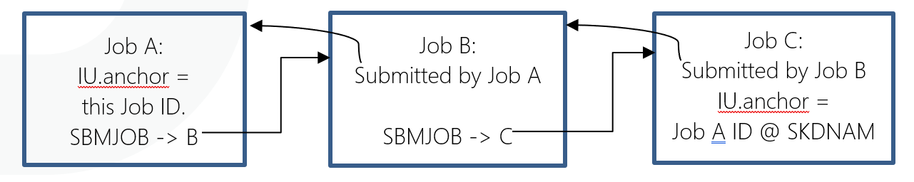

# Multi-Instance Dynamic Variables

Similar to the multi-instance Property support provided by the OpCon central server application, the Agent for IBM i can now support true parallel processing as variable values are isolated to any of the following optional instances.

- **SI.** = OpCon Schedule Instance.  This scope matches the same scope used by the OpCon Job Scheduler, applied to any IBM i jobs started by OpCon.

- **JI.** = OpCon Job Instance.  Each IBM i job started (directly) by OpCon gets its own value for a Dynamic Variable, using the OpCon Job Name as the key to that value.

- **IJ.** = IBM i Job Instance.  Any IBM i job can use Dynamic Variable values isolated to just that job, without any reference to OpCon Schedules or Jobs.

- **IU.** = IBM i “Unit of Work”.  IBM jobs that are associated with each other by the use of the IBM i SBMJOB command can share a unique Dynamic Variable value.

Multi-instance Dynamic Variable capabilities are engaged simply by adding one of the prefixes above to the Dynamic Variable name, for example:  **{IJ.MYVARNAME}**

#### Using Simple Instance Qualification in Most Cases

It is normally very simple to engage variable instance isolation by simply adding a 3-character prefix to a Dynamic Variable token anywhere among the Agent’s automation features.

The Agent supports up to 435 characters for a Dynamic Variable {TOKEN} to allow for circumstances when a Dynamic Variable instance must be fully qualified by, for example, the complex string of parameters that identify an OpCon Job.  However, fully qualified variables are usually only used internally by the Agent software.  Special use cases where the LSAM Administrator might expect to need instance qualifying keys are explained in this documentation.

### Summary of Multi-Instance Dynamic Variable Characteristics

Multi-instance Dynamic Variable capabilities are engaged simply by adding one of the prefixes below to the Dynamic Variable name, for example:  {IJ.MYVARNAME}.  Instance-qualified variable names can usually have their required key fields deduced by the Agent’s software, based on the context of the job where a Dynamic Variable {TOKEN} will be replaced by its value.  But for special purpose use cases, the Agent provides data selection and data prompting aids to help the user compose a correct set of instance qualifying parameters.  The key fields used by each of the following instances are demonstrated by their associated templates.

#### SI. = OpCon Schedule Instance
This scope matches the same scope used by the OpCon Job Scheduler.  Any IBM i jobs that are started by the same OpCon Schedule can share a Dynamic Variable value.  Other Daily instances of the same master Schedule in the OpCon server have a different Name, even though they may be executing all the same steps.  But the OpCon Schedule Instance Name is used to isolate the Agent’s Dynamic Variable value so that two different instances of the same Schedule can be running at the same time without interfering with each other.

Template:
```
SI.<VARNAME>.<SkdDate>."<SkdName>"
```

#### JI. = OpCon Job Instance
Any IBM i job started by the OpCon server can use the unique OpCon Job identifier parameters to isolate a Dynamic Variable value to just that one IBM i job.  (See also the next description of the IBM i Job Instance.)

Template:
```
JI.<VARNAME>.<SkdDate>."<SkdName>"."<SamLongJobName>".<SamJobNbr>
```
 
#### IJ. = IBM i Job Instance
Although this instance of a Dynamic Variable value is also isolated to just one IBM i job, this instance type does not require any connection to a job on an OpCon Schedule.

- Job instances of Dynamic Variables (whether JI or IJ) are especially useful when used with the IBM i Agent’s Multi-Step Job Scripting tool. The individual Steps of a Script may each execute different programs or commands within the IBM i partition, and all those Steps can share Dynamic Variable values without interfering when the same Script is being executed by a different IBM i job.
    - In this example, instance-variables function in the same way as DCL (declared) variables in a CL (Control Language) program.  But the Agent's Scripts do not require compiling as CL programs do.  Thus, the Agent's Scripting tool is more flexible and also safer than compiled programs because they cannot be made to run with adopted authority as can compiled CL programs.
- Job instance Dynamic Variables gain the same advantage when Captured Data Response Rules are being executed, so that the same set of Rules can be executing within different IBM i jobs but isolated from each other.  Response Rules are used by Operator Replay scripts, by the SCANSPLF command and by the Agent’s Message Management system. 
- The Message Management serve job uses the Job ID of the Job that issued the message for qualification of variables, and not the IBM i Job ID of the Agent’s Message Management server program.
- Operator Replay uses the Job ID of the script driver program, by default.  But since the virtual workstation job that is connected to the script driver program is actually a different IBM i job, the virtual workstation job has a different IBM i Job ID than does the script driver program.
    - The Agent provides a tool and procedures that can be used to share instance-variable values between the script driver and the virtual workstation job.
    - In most cases, the instance-variable values will be managed by the script driver program, and those values will be sent to a virtual workstation job as part of the "String to send" data - that is, data generated by the emulated keyboard input to the workstation.

Template:
```
IJ.<VARNAME>."<iJobName>".<iUserName>.<iJobNbr>.<iJobDate>.<iJobTime>
```

#### IU. = IBM i “Unit of Work”
IBM documentation sometimes refers to multiple different types of “units of work,” but this feature of the OpCon Agent has its own, unique definition.  For the Agent, a unit of work is defined by the connection among jobs that submit each other (usually using the IBM i SBMJOB command).  This instance does not require any connection to an OpCon Schedule or Job.  But it overcomes the problem of isolating a Dynamic Variable value that must be shared by a whole tree of submitted jobs, when that same tree of submitted jobs might also be executed starting with a different “anchor job.”  

##### The Unit of Work instance is keyed by the IBM i Job ID of an “Anchor Job"
The first job in the tree, perhaps understood as the trunk of the tree, uses its IBM i Job ID to identify the “anchor” for the unit of work it will submit.  (This IBM i Job ID gets stored by the Agent as if it were a Schedule Name for the Dynamic Variables.) Thus, the OpCon Scheduler can initiate multiple threads of processing within the IBM i partition for the same theoretical unit of work, but where each different job that OpCon submits using a different Dynamic Variable Unit of Work ID.

Template:
```
IU.<VARNAME>."<SkdName=JobName10+JobUser10+JobNbr6+JobDate8+JobTime6>"
```

The following diagram may make this Unit of Work concept easier to understand and utilize.  The IBM i operating system stores the “Submitted For” (= submitted by) Job ID for jobs B and C in this diagram.  Job A, having no submitter, is usually the Anchor job for this unit of work, so its IBM i Job ID is the key value that qualifies any IU.VARIABLES referenced by any of the jobs that are part of this unit of work.



