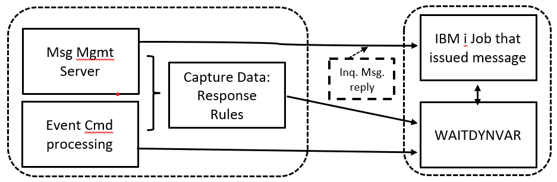
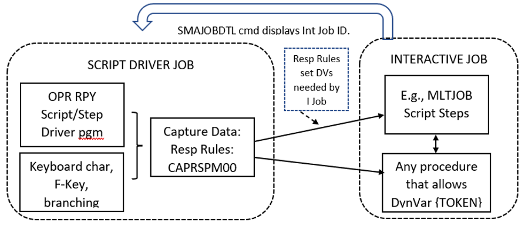

# Multi-Instance Dynamic Variables
## Overview of Multi-Instance Dynamic Variables
Similar to the multi-instance Property support provided by the OpCon central server application, the Agent for IBM i can now support true parallel processing as variable values are isolated to any of the following optional instances.

- **SI.** = OpCon Schedule Instance.  This scope matches the same scope used by the OpCon Job Scheduler, applied to any IBM i jobs started by OpCon.

- **JI.** = OpCon Job Instance.  Each IBM i job started (directly) by OpCon gets its own value for a Dynamic Variable, using the OpCon Job Name as the key to that value.

- **IJ.** = IBM i Job Instance.  Any IBM i job can use Dynamic Variable values isolated to just that job, without any reference to OpCon Schedules or Jobs.

- **IU.** = IBM i “Unit of Work”.  IBM jobs that are associated with each other by the use of the IBM i SBMJOB command can share a unique Dynamic Variable value.

Multi-instance Dynamic Variable capabilities are engaged simply by adding one of the prefixes above to the Dynamic Variable name, for example:  **{IJ.MYVARNAME}**

#### Using Simple Instance Qualification in Most Cases

It is normally very simple to engage variable instance isolation by simply adding a 3-character prefix to a Dynamic Variable token anywhere among the Agent’s automation features.

The Agent supports up to 435 characters for a Dynamic Variable {TOKEN} to allow for circumstances when a Dynamic Variable instance must be fully qualified by, for example, the complex string of parameters that identify an OpCon Job.  However, fully qualified variables are usually only used internally by the Agent software.  Special use cases where the LSAM Administrator might expect to need instance qualifying keys are explained in this documentation.

## Summary of Multi-Instance Dynamic Variable Characteristics

Multi-instance Dynamic Variable capabilities are engaged simply by adding one of the prefixes below to the Dynamic Variable name, for example:  {IJ.MYVARNAME}.  Instance-qualified variable names can usually have their required key fields deduced by the Agent’s software, based on the context of the job where a Dynamic Variable {TOKEN} will be replaced by its value.  But for special purpose use cases, the Agent provides data selection and data prompting aids to help the user compose a correct set of instance qualifying parameters.  The key fields used by each of the following instances are demonstrated by their associated templates.

### SI. = OpCon Schedule Instance
This scope matches the same scope used by the OpCon Job Scheduler.  Any IBM i jobs that are started by the same OpCon Schedule can share a Dynamic Variable value.  Other Daily instances of the same master Schedule in the OpCon server have a different Name, even though they may be executing all the same steps.  But the OpCon Schedule Instance Name is used to isolate the Agent’s Dynamic Variable value so that two different instances of the same Schedule can be running at the same time without interfering with each other.

##### Template:
```
SI.<VARNAME>.<SkdDate>."<SkdName>"
```

### JI. = OpCon Job Instance
Any IBM i job started by the OpCon server can use the unique OpCon Job identifier parameters to isolate a Dynamic Variable value to just that one IBM i job.  (See also the next description of the IBM i Job Instance.)

##### Template:
```
JI.<VARNAME>.<SkdDate>."<SkdName>"."<SamLongJobName>".<SamJobNbr>
```
 
### IJ. = IBM i Job Instance
Although this instance of a Dynamic Variable value is also isolated to just one IBM i job, this instance type does not require any connection to a job on an OpCon Schedule.

- Job instances of Dynamic Variables (whether JI or IJ) are especially useful when used with the IBM i Agent’s Multi-Step Job Scripting tool. The individual Steps of a Script may each execute different programs or commands within the IBM i partition, and all those Steps can share Dynamic Variable values without interfering when the same Script is being executed by a different IBM i job.
    - In this example, instance-variables function in the same way as DCL (declared) variables in a CL (Control Language) program.  But the Agent's Scripts do not require compiling as CL programs do.  Thus, the Agent's Scripting tool is more flexible and also safer than compiled programs because they cannot be made to run with adopted authority as can compiled CL programs.
- Job instance Dynamic Variables gain the same advantage when Captured Data Response Rules are being executed, so that the same set of Rules can be executing within different IBM i jobs but isolated from each other.  Response Rules are used by Operator Replay scripts, by the SCANSPLF command and by the Agent’s Message Management system. 
- The Message Management serve job uses the Job ID of the Job that issued the message for qualification of variables, and not the IBM i Job ID of the Agent’s Message Management server program.
- Operator Replay uses the Job ID of the script driver program, by default.  But since the virtual workstation job that is connected to the script driver program is actually a different IBM i job, the virtual workstation job has a different IBM i Job ID than does the script driver program.
    - The Agent provides a tool and procedures that can be used to share instance-variable values between the script driver and the virtual workstation job.
    - In most cases, the instance-variable values will be managed by the script driver program, and those values will be sent to a virtual workstation job as part of the "String to send" data - that is, data generated by the emulated keyboard input to the workstation.

##### Template:
```
IJ.<VARNAME>."<iJobName>".<iUserName>.<iJobNbr>.<iJobDate>.<iJobTime>
```

### IU. = IBM i “Unit of Work”
IBM documentation sometimes refers to multiple different types of “units of work,” but this feature of the OpCon Agent has its own, unique definition.  For the Agent, a unit of work is defined by the connection among jobs that submit each other (usually using the IBM i SBMJOB command).  This instance does not require any connection to an OpCon Schedule or Job.  But it overcomes the problem of isolating a Dynamic Variable value that must be shared by a whole tree of submitted jobs, when that same tree of submitted jobs might also be executed starting with a different “anchor job.”  

#### The Unit of Work instance is keyed by the IBM i Job ID of an “Anchor Job"
The first job in the tree, perhaps understood as the trunk of the tree, uses its IBM i Job ID to identify the “anchor” for the unit of work it will submit.  (This IBM i Job ID gets stored by the Agent as if it were a Schedule Name for the Dynamic Variables.) Thus, the OpCon Scheduler can initiate multiple threads of processing within the IBM i partition for the same theoretical unit of work, but where each different job that OpCon submits using a different Dynamic Variable Unit of Work ID.

##### Template:
```
IU.<VARNAME>."<SkdName=JobName10+JobUser10+JobNbr6+JobDate8+JobTime6>"
```

The following diagram may make this Unit of Work concept easier to understand and utilize.  The IBM i operating system stores the “Submitted For” (= submitted by) Job ID for jobs B and C in this diagram.  Job A, having no submitter, is usually the Anchor job for this unit of work, so its IBM i Job ID is the key value that qualifies any IU.VARIABLES referenced by any of the jobs that are part of this unit of work.


In the diagram above, notice that the Job C box refers to a “SKDNAME” (Schedule Name) field.  There is never an actual OpCon Schedule Name associated with the IU.instance, so that field is re-used to designate the full IBM i Job ID of the anchor job.  The IBM i Job ID fields for Job A comprise the full key value for the variable, and those fields are organized as shown above in the template for this instance.

#### Boundaries (Anchors) for IU. Units of Work

When a new multi-instance variable is first encountered by the Agent in any job, that is, when there is no instance yet stored in the Dynamic Variables master file for THIS variable related to THIS job, then the Agent will decide what IBM i Job ID to use for the IU.instance based on the following rules about what kinds of jobs can be the anchor job.  The Agent will search backwards through a chain of submitted jobs, as necessary, until one of the pre-defined boundary jobs is discovered.

1.	An interactive job is a boundary for an IU.anchor because it has no “submitted by” attribute.
    - EXAMPLE:  Menu-driven SBMJOB action.
2.	The IBM i LSAM Job Scheduler job (TXMMNG) should NOT be an anchor, because it submits many different unrelated jobs.
    - However, any job that TXMMNG submits CAN be set as the anchor for an IU.instance.
3.	User-defined anchors can be designated by the SETDYNVAR command using the “IUKEY” parameter values…
    - \*DEFAULT:
        - As defined above
        - The current job (can be an interactive job or the current batch job in a series, ignoring any predecessor batch job in same series).
    - \*THISJOB: Use the job that runs the SETDYNVAR as the anchor for the IU.instance.
    - \*PREVJOB: Use the “Submitted by” (SBMFOR) job to anchor IU.instances for this job and any additional job it may submit.
    - To force a given batch job to become an anchor for an IU.instance, from any other job, use IU.variable.<QUALIFIERS\> in the Variable Name field of the SETDYNVAR command (or the Store to-> Variable in a Capture Data Rule).
        - The <QUALIFIERS\> can be partially completed, such as specifying only the JobName10 (see Template reference, above), but be sure to leave spaces for the preceding JobNbr6 value. 
        - When specifying only the JobNbr6, if this number exists more than once in the IBM i  tables, the most recent occurrence of the job will be chosen.  It is not necessary to leave quoted spaces for the qualifier values that follow the JobNbr6.

### Alternate Job Notify Service Required for IU. Instance

The Agent’s Alternate Job Notify service must be configured and activated before the IU.instance can be used.  A new pair of Agent server jobs (named JOBNFY*) will appear in the LSAM server job subsystem once this service is activated.  This requirement is based on the possibility that very short IBM i jobs will not always have their status registered in time for use by the Agent’s multi-instance variables logic when the Agent is only depending on the arrival of job completion messages.

The Alternate Job Notify service can be configured to process any one or more of its three supported modes of service:
```
 JOBNFYD301           Alternate Job Notify Configuration               2/09/22  
 USERNAME          Environment: SMAGPL9     Version: 21.1             10:05:00  
                                                                                
 Use Alt Job Notify Server.: N           Y=yes, N=no, T=Tracked only            
                                                                                
 Notify Actions                                                                 
   OpCon job completion  . : Y           Y=yes, N=no                            
   Passive job tracking  . : N           Y=yes, N=no                            
   IU.Dynamic variable jobs: N           Y=yes, N=no                            
                                                                                
 Default notify data queue.: QSYSDTAQ                                           
   Default DTAQ library....:                                                    
 Delay job end notify proc :   3         seconds                                

```
1.	The procedures for activating Alternate Job Notify are written in detail in the IBM i LSAM Administration Guide (= HTML User Help:  Agents – IBM i).
    - (PDF Chapter 5) -> IBM i Components and Operation -> Operating the LSAM -> Alternate Job Notify Service.
2.	From LSAM sub-menu 6, select option 8 to enter the Alternate Job Notify sub-sub-menu.
    - Select option 7 from this sub-menu to configure the LSAM Alternate Job Notify global control options.
    - Under the (new) “Notify Actions” section, type “Y” (= Yes) next to the line labeled “IU.Dynamic variable jobs”.
        - This option may be used with or without the other Notify Action options, but it is required to store this “Y” setting for the IU.Dynamic variables to work.
        - This setting must be completed before the next step of registering one or more data queues.
3.	It is necessary to separately register each job queue where batch jobs might be submitted that need to use IU.DynVars.  The LSAM simplifies this process, eliminate multiple low-level IBM i commands, such as managing access to the IBM i Exit Point register.
    - Using the LSAM tools for this process eliminates any need to directly authorize any IBM i user profile (except for the LSAM service profile) to have direct authority to the Exit Point Register.
        - Instead, the LSAM Object Authority function under LSAM sub-menu 9 should be used to grant authority for an LSAM administrator to use the program that runs the Work with Alternate Job Notify function (option 1 in the Alternate Job Notify sub-sub-menu .
    - Part of the registration process requires that the subsystem connected to a job queue must be stopped and restarted.
    - The LSAM list of registered job queues supports an action code that launches a test of the exit point registration.  Use option 5=Display to see the results of the test.  The test must be passed before the LSAM Alternate Job Notify can be used.

## Managing Large Fields for Fully Qualified Dynamic Variable Tokens

The Agent supports up to 435 characters for a Dynamic Variable {TOKEN} to allow for circumstances when a Dynamic Variable instance must be fully qualified by, for example, the complex string of parameters that identify an OpCon Job.  However, fully qualified variables are usually only used internally by the Agent software, so it is normally very simple to engage variable instance isolation by simply adding a 3-character prefix to a Dynamic Variable token anywhere among the Agent’s automation features.

Because of the theoretical potential for the large size of a fully qualified Dynamic Variable instance, many changes were made to this Agent’s database tables, and the interactive maintenance of Agent master files had to be reformatted to support the on-demand extension of many different master file fields.  Most of the interactive programs that can optionally support a long Dynamic Variable {TOKEN} name show the function key F13 as the way to display “More…”  data for each field.  At the same time, those extensible fields show a highlighted plus sign (+) whenever F13 can be used to bring up a larger data entry display for the field.

The number of key fields that could be used for a fully qualified Dynamic Variable instance may seem daunting.  But the intent of the Agent software is to only require the three-character prefix to designate a variable instance in most use cases.  When special use cases arise, there are various forms of prompting displays that provide: 
- Data entry prompts to help the user correctly arrange instance qualifying key values
- Labelled break-out displays of the qualifying keys that the Agent used during automation processing

## Diagnostic Tools and Procedures for Multi-Instance Dynamic Variables

Several Agent green screen displays have been provided to either help format multi-instance qualified Dynamic Variable {TOKENS}, or to report the results after a token has been replaced by its stored or computed value at run time.

### Tools for Composing Variable Instance qualifying parameters (keys)

These steps can be used to compose and insert correctly formatted multi-instance Dynamic Variable {TOKENS} into any Agent master file fields that are supported by Dynamic Variable token translation.
- Function key F8=DYNVAR is the new standard function key supported by all Agent file maintenance functions for requesting a list of registered Dynamic Variable names.  
    - After using this and the following optional steps, a Dynamic Variable {TOKEN} will be inserted where the cursor was located when F8 was pressed.
    - Fields such as the Response Rule **Store to ->** variable name field will be loaded with only the name of a Dynamic Variable, while other supported fields will get a formatted {TOKEN} inserted at the cursor position.
- In the window showing variable names, use PageDown and the arrow keys to highlight the desired variable name.
    - When no instance formatting is needed, press Enter to return the selected variable name.
    - When instance formatting is desired, press **F4=Instance Templates** to branch to a next display where the instance type can be selected.
- From the Multi-Instance Dynamic Variable Templates list display, select the desired formatting template(s) by typing option 1 next to the desired format.
    - There is an option to add qualifier keys for a specific IBM i Job that can be appended to the instance format, but these are only needed for special purposes.  Type a second option 1 next to the **(optional +)** for the currently selected format if these extra keys are needed.
    - Press Enter to return the plain template line(s), as shown, to the Agent’s master record field.
    - Press F4=Prompt parameter to request a data entry screen that will help with inserting correctly formatted instance parameters.
- Accept or type the instance format prefix code desired and press Enter to continue.
- Use the Prompt Dynamic Variable Formatting display to fill in the appropriate instance parameters.
    - This display presents a data entry format that varies depending on the Instance Type.
    - This display will help with editing in case incorrect parameter fields are chosen, depending on the Instance Type.
- Press Enter to continue to the next display.
- The Display Formatted Dynamic Variable screen shows the fully qualified Dynamic Variable instance using the values typed in the previous screen.
    - The template for the selected Instance Type appears in white below, followed by a colored character string that shows the user-defined instance qualifying parameter values.
    - The “Qualified variable name” field can be used to type corrections or changes.  It is possible to insert or replace values with other Dynamic Variable tokens or with $-System reserve variable names, but it might be easier to accept the displayed variable format and then use prompting function keys such as F8 and F23 to select and insert these modifications.
- Press Enter to accept and insert the formatted instance variable string into the Agent’s master file record field.
- Function keys F12 and F3 can be used at various steps during this procedure to interrupt the formatting aids.  Results from using these keys will vary depending on the step where they are used, but the results are easy to interpret.

### Viewing Computed Dynamic Variable Instance Qualifiers and Values

The function “Maintain dynamic variables” can be found and used from many different LSAM Menu displays.  The initial display of this function is a list of the basic master records for every Dynamic Variable that has been defined using this maintenance, or by the SETDYNVAR command that is used by Agent automation tools to establish a new variable at run time.

There will always be a Dynamic Variable master record for every instance variable that is created during run time, but only one master record is created regardless of how many different instances might be used.

The instance records for a Dynamic Variable are deleted from the database after a user-defined number of days has expired.  The purge criteria is supported by a new field added to the LSAM Parameters maintenance (LSAM Main Menu, or sub-menu 6, option 7) on page 2 of this maintenance function:

**Days to keep Dynamic Variable History**
```
LSAM Database Maintenance.............................................
 Automatic delete-global: Y  Y/N       Maintenance hour.......: 1540  
 Days to keep daily logs: 10           Days to keep debug logs:  3    
 Days to keep daily BkUp:   7          Days to keep debug BkUp:   7   
 Days to keep SPLFs.....:  5           Days keep PTF RLBK SAVF: 120   
 Days to keep job logs..:  5           LSAM copy of job logs?.: N  Y/N
                                       Days to keep DynVar Hst:  5    
```
To view the results of Job-level or Schedule-level instances created during run time, use these function keys to navigate among the three list displays of Dynamic Variables.  (Work with Dynamic Variables is accessible from most of the LSAM sub-menus.)
- F7=Sched Inst  
- F8=Job Inst
- F12=return to Master records list

The Sched(ule) Inst(ances) list will also show the IU. (Unit of Work) instances.  The function keys supported will vary depending on which list display is on the screen, supporting navigation among the three different list displays. 

#### How to prove the format of a used instance variable

When selecting option 5=Display from either the Schedule or Job Instances list, the Record Type and Multi-instance type fields are both filled, and a colored prompt appears to the right of these lines suggesting the use of (F15=I-keys) to display another format that documents the instance qualifying key values.  In addition to listing each qualifying field, the bottom of the display shows both the template for the current instance type, and also the fully qualified instance variable string that was used when the instance was registered.

### Diagnostic Error Logging for Dynamic Variables

The Agent’s sub-menu 6, option 5, log viewer 4, launches a new program that displays the “Submitted Job Log.”  The previous purpose of this log has been greatly extended so that this log file (LSALOGF30) now serves the purpose of a multi-function log for the Agent.  There are Agent log files that are dedicated to each of the Agent’s automation tools, but some features of the Agent such as Dynamic Variable token replacement span across multiple Agent features, so a single log file must be used to collect the activity and error log entries.  
The enhanced log viewer program supports multiple ways to subset the data in this general purpose log file, making it easy to isolate log entries for a specific IBM i job, or to isolate log entries by the record type so that, for example, only Dynamic Variable log entries appear in the list display.

- Use function key F11 to vary the data that appears in the list display.
- Use function key F10 to wrap the lines of every log entry so that all the text of each entry appears in the list display.
- Use function key F15=Sel/Omit to limit the entries appearing in the display.

:::caution IMPORTANT
At the third line from the top is the prompt, “F2=Subset/Clear JobID”.  This function key will be very important as soon as a large number of entries are accumulated in the log file.  The log file is purged daily, based on the general LSAM parameter “Days to keep daily logs” in the LSAM Parameters (main menu, option 7, page 2).  Use F2 to set or clear a control that limits the list to display only messages from one IBM i job.
:::

The subset by job feature is not always helpful when a complex use case for instance variables is involved.  (See examples later in this chapter document about complex use cases.)  In these cases, try positioning the list to the date and time of the job.  Use the following Select/Omit function key F15 to show, for example, only entries marked for Dynamic Variable operations.

#### Using F15 = Select / Omit from the Submitted Job Log display

Press F15 to set or change a subset rule.  Type either “S” or “O” into the Select/Omit data entry field, then enter 1 next to one or more TYP codes to Select or Omit from the list.  Press Enter to implement the list subset.  To clear a subset rule, use F15 and then press F2.  This will return to a full list display.

```
LSALOGR6                 Select Subset by Entry Type                  5/31/22
USERNAME                                                             16:01:14
Enter S or O for the filter type, then type 1 next to one or more Types.
Press Enter to engage the filters, or press F2 to clear filter rules.      

Select/Omit filter method: S   S=Select, O=Omit

Opt TYP  Entry Type Description
 _  DV:  Dynamic Variable token processing information
 _  SP:  Space/blank Entry Type
 _  VE:  Dynamic Variable token replacement error


                                                                      Bottom
F2=Clear subset   F3=Exit   F5=Refresh   F12=Cancel               
```

The entries in the subset list will represent actual data found in the LSALOGF30 log file.  The display program includes a built-in list of all supported TYP codes, so that the description of each Type code can be displayed in the list subsetting prompt display.

Notice that the colon (:) is part of the TYP code used by the sub-setting rules.
For complex log entry analysis, multiple entry TYP codes can be selected at once.  Another strategy that might be useful is to try Omitting certain entry types to “clean up” the list display from entry types that are not important to the current research tasks.

## Use Cases for Multi-Instance Dynamic Variables

### Message Management Server Override to IBM i Job ID of Message Sender

The Agent’s Message Management server job presents a certain challenge to the way instances of Dynamic Variables can be used.  According to the general rules when the Agent decides what should be the unique keys for a variable instance, the Message Management server job itself would be considered as the default job requesting a new instance.  But the Message Management server job is a single job that handles information from many different jobs, therefore it cannot be allowed to be used to provide the default IBM i Job ID for variable instances.

To overcome this limitation, the Agent’s multi-instance variables management modules always know when a message instance is being processed for the Message Management server, and for each message being processed it substitutes the IBM i Job ID from the job that initiated the message.

#### Assumptions for Message Management server setting variable instance values

1.	The Message Manager server job never needs to use Dynic Variables for its own operation.  It is dedicated to serving the jobs that issued the messages.
2.	Capture Data Rules themselves never use Dynamic Variables.  Only their connected Response Rules use Dynamic Variables.
3.	The Message Manager server job always has access to the IBM i Job ID that issues each message.
    - Instance variables can be managed in the primary Event command.
    - Capture Data connected Response rules must also always direct their variable instances to the job that issued the message.
4.	The Message Management server program has a built-in override that adds variable instance qualifying (key) fields as necessary to redirect all instances away from the server job itself and always towards the job that issued the message.
    - The Response Rules modules and sub-procedures test for their Capture Rule being for Message Management and then they insert the message job qualifying parameters.
    - The IJ.DYNVAR needs the message job inserted into the primary instance qualifying keys, but the other instance types may use the optional trailing IBM i Job ID qualifiers.  (See the hints about diagnostic tools for multi-instance variables to understand the optional trailing IBM i Job ID qualifiers.)

### Supporting WAITDYNVAR Utility with Multi-Instance Dynamic Variables

An illustration is provided below to show vectors where the Message Management server job would insert the message sending Job ID parameters into the main qualifiers of the one or two variable(s) that the WAITDYNVAR is monitoring.  (Search the Agent documentation for more information about using the WAITDYNVAR command.)

This example shows the WAITDYNVAR command being used within a job that generates a message which will be intercepted by the Agent’s Message Management server.  The WAITDYNVAR command can monitor for one or two different Dynamic Variable values.  In this example, the variables should be IJ. instance variables.  The Message Management server job inserts values into those variables using the IBM i Job ID parameters from the job that sent the message as the qualifiers of the variables that the WAITDYNVAR is monitoring.  In a typical example, one of the Agent’s scripting tools can test the value returned to the WAITDYNVAR command to vary the branching logic of the script, such as deciding to stop script execution based on the content of the message.



Whenever it is necessary to introduce multi-instance Dynamic Variables, such as when supporting the parallel processing of this one Operator Replay script, but in two separate jobs at the same time, the logic required by the WAITDYNVAR command can be achieved by using IJ.instances of one or more variables.  The qualifiers (keys) for the IJ.instance will be the IBM i Job ID parameters from the interactive job.  When it sends a message that is watched by the Agent’s Message Management server, the server will override the IJ.instance qualifiers to use the IBM i Job ID parameters of the interactive job.

### Multi-Instance DynVar Support for SCANSPLF Evaluation of IBM i Job Completion

For detailed instructions about extensions to the command line of an OpCon job for IBM i, please refer to [Extending the IBM i Call Command with Special Parameters](../configuration/extended-call-cmd#using-scansplf-to-evaluate-an-ibm-i-job-completion-status).

The Agent’s job completion message server recognizes when a SCANSPLF (Scan Spool File) command has been appended to the “Call” command line in an OpCon IBM i batch job.  A pipe **( | )** character is placed at the end of the primary call command, and there are multiple, optional job management extensions that can be added to the command line after the pipe.  The last optional addition can be a SCANSPLF command that is configured by the client administrator to evaluate the contents of the IBM i job log report produced by the job.  In this mode, the SCANSPLF command can be used to override the job completion status that the Agent reports to the OpCon server, forcing the final job status to be either “Finished OK” or “Failed”, depending on messages that are found in the job log report.

The Agent can translate Dynamic Variable {TOKENS} that may be inserted into the syntax of the SCANSPLF command, enabling the command to adapt to unique characteristics of the job log report spool file.  The original limited ability of global Dynamic Variables did not well support many characteristics that can be unique among different jobs, especially in high-volume environments where attributes such as the Job Name can be repeated frequently within a short time span.  The multi-instance Dynamic Variables overcome the problems of de facto parallel processing, however, the rules for isolating multi-instance Dynamic Variable values depend on identifying unique IBM i Job IDs.

The general rules for multi-instance Dynamic Variable instance keys state that the IBM i job that requests processing for a variable instance will be assumed to provide the IBM i job key values.  But when the Agent’s Spool File Server job is handling the SCANSPLF commands requested by many different automated jobs, the IBM i Job ID of the Spool File Server job ID should not be used.  

Rather, in this case the Agent uses the IBM i Job ID that produced the job log report’s spool file as the job key values assigned to multi-instance Dynamic Variables.  This special override processing is the same as is used by the Agent’s Message Management server.

Note that one effective way to assign values to the multi-instance Dynamic Variables that are embedded in the SCANSPLF command is to identify the instance-qualified Dynamic Variable name (e.g., {IJ.VARNAME} or {IU.VARNAME}) in the table of the Variables tab that is part of the OpCon job master record definition.  The Variables tab can feed values from OpCon Properties (including multi-instance Properties) to the named Dynamic Variable.

#### Diagnostic Tools for Identifying Problems with SCANSPLF Dynamic Variable Processing

The special processing used to process multi-instance Dynamic Variables embedded in a SCANSPLF command that was appended to an OpCon IBM i job Call command line engages multiple different Agent services.  Since these services are universal, and are pieced together like building blocks, it is often necessary to examine multiple log viewers to discover the cause for errors in the Dynamic Variable processing.  

SMA recommends surveying each of these different sources, until a pattern of useful information is recognized at a specific client site.  These sources are not specified in the order they should be used.  After some experience, the client may discover which source provides the most helpful information for their circumstance.  If some of the log viewers show no data, use LSAM sub-menu 6, option 4, to verify and optionally start logging for the Agent functions.  Note the function key F2 at the bottom of initial page that shows the primary Agent server logging option.  F2 gathers control of Agent peripheral function logging into a single, secondary display format.

- LSAM sub-menu 6 (LSAM management menu), option 5 (View LSAM logs):
    - Viewer 1 (Job Sched communications trace log) can be used to verify exactly how the OpCon job start request was formatted, including verifying the format of an appended SCANSPLF command and its parameters.
    - Viewer 4 (LSAM submit job log – which has now become a “general LSAM functions log”) can be used to isolate log activity by date and time, and it supports using F2 to subset the entries to a single IBM i Job ID.  This log viewer also supports F15=Sel/Omit to filter log entries by the log type codes, such as DV: (Dynamic Variables information) and DE: (Dynamic Variables errors).
    - Viewer 8 (spool file server log) shows the before/after image of a SCANSPLF command that contained Dynamic Variable tokens, to prove what values were inserted in place of any {TOKENS}.

- From many LSAM sub-menus, use “Maintain dynamic variables” to see a list of registered variable names.
    - Use F7=Sched Inst to view Dynamic Variable instances qualified by prefixes SI. and IU.
    - Use F8=Job Inst to view Dynamic Variable instances qualified by prefixes JI. and IJ.
    - Function key F2 can be used to isolate variable instance history records to just one IBM i job.
    - Use option 5 to view the characteristics and last value stored in any Variable master record or any Instance History record.
        - From the Instance History record details display, use F15 to view a formatted display of the Dynamic Variable instance key values (supported also by templates at the bottom that show both the generic, symbolic template and a formatted display of how the instance key values should appear.
    - Use option 6=DSPDYNVAR to branch to a labelled view of the actual variable value that was (or would be) returned to an Agent automation tool after the stored VALUE field has been formatted by any of that variable’s value formatting options (such as character string trimming, numeric value punctuation, or date/time reformatting).

- From LSAM sub-menu 3 (Events and Utilities), option 9 (Display data capture debug log) shows the processing results from a SCANSPLF command
    - The Scan Rules define data that is captured from a spool file.
    - For this specialized application of job log scanning, there will also be one or more Response Rules attached to the (any) Scan Rules.
    - Use F2 to Set/Clear a subset of the list by an IBM i Job ID.  This is an important tool for studying what will likely be an extensive collection of log entries that could all be intermixed with each other.
        - Unfortunately, all the processing of SCANSPLF commands that were appended to the Call command line of OpCon-submitted IBM i jobs, are processed by the same, continuous Agent server job named “LSAJOR”.  So the F2 subset by job has only a limited ability to isolate log entries.  But the good news is that the entries will be in Date/Time order, so watch the Entry_Codes for the code “SCANSPLFST” to spot the start of each new SCANSPLF command.
    - When viewing entries for only one job, the entries will be listed in date/time order, and the “Entry_Code” at the right side of the list display is helpful for identifying the log entries that can most quickly reveal the cause for errors.
        - One technique for learning how to use a subset list by job is to type option 5  next to every list entry, and then press Enter to start viewing the details of each entry.  Continue pressing Enter to move sequentially through all the selected log entries.
        - Study the Entry_Code for each log detail view to learn which codes are most helpful during an error diagnostic process.

### Operator Replay Sharing Variable Values with an Interactive Job

This discussion is supported by an illustration below.

One of the challenges for Operator Replay jobs is how to share values between the Operator Replay Script Driver job and the Interactive Job it started.  Instance-qualified variable {TOKENS} could be used in the Script Steps in command lines that will actually be executed within the interactive job.  Another function of the Operator Replay Script Driver job is to execute Captured Data Response Rules where the Response Rules might need to set values for instance variable {TOKENS} that are specified by other Agent-supported automation solutions being executed within the interactive job.

The following illustration identifies a new Agent utility command SMAJOBDTL which can be used to fetch the IBM i Job ID from the interactive job.  This tool is useful because there is no known way for a virtual workstation job to communicate its IBM i Job ID to the Telnet service that activated the virtual workstation.

##### Operator Replay Script Setting Instance Variables for an Interactive Job



The diagram above shows two different IBM i jobs.  One is the Script Driver Job (typically started by an OpCon Schedule and Job) and the other is the Interactive Job which is a virtual workstation job that the Script Driver has initiated.  

:::tip
It is important to understand the two different ways that Dynamic Variable {TOKENS} might be used with Operator Replay.

1. The most common use of Dynamic Variables is contained within the Operator Replay Script Steps and any associated Captured Data Response Rules.
    - The Script Step records may use Dynamic Variable {TOKENS} as part of the "string to send" data that is virtually typed on the workstation keyboard.  They can also use Dynamic Variable tokens to make the Script Branching rules variable, for example.
    - The Response Rules can store data captured from the workstation display, and they set Dynamic Variables based on the content of captured data.  Then, these Dynamic Variable settings are often fed back to the Script Step, to be used as mentioned just above.
    - By default, the keys for Multi-Instance Dynamic Variables that are managed by the Script driver program and any linked Response Rules will use the IBM i Job ID of the Script driver job itself, and NOT the Job ID of the interactive workstation job.

2.  The virtual workstation usually receives the data it needs as the Script driver program transmits the keyboard "string to send."  However, if an interactive session ever tries to execute the Agent's Multi-Step Job Scripts, then the Multi-Step Script driver program might need to access multi-instance Dynamic Variables that are isolated to the virtual workstation Job ID and not to the Script driver Job ID.
    - **This would be a rare instance, but this is the use case that is being explained in this section of documentation.**
:::

Since there is no way that an IBM i service can report back to the Script Driver Job the IBM i Job ID of the virtual workstation’s interactive job, the Script Driver is relying on a Script Step that executes just after logging in to the workstation and starting the interactive job, to execute the Agent’s SMAJOBDTL command.  This command presents a workstation display that reports the full set of IBM i Job Details:
```
 JOBDTLR1                   SMA Display Job Detail                      2/09/22 
 USERNAME                                                              12:25:24 
                                                                                
 Job name  . . . . . . : QPADEV0001                                                  
 Job user  . . . . . . : USERNAME                                                 
 Job number  . . . . . : 752064                                                 
 Job entry CCYYMMDD  . : 20220209                                               
 Job entry HHMMSS  . . : 122519                                                 
```                                                                                
                                                                                
Whenever this display format is then detected by the Script Driver program, it automatically stores the Job ID Parameters into some internal work fields and also into the Agent’s Operator Replay job log record.  The values that are stored into the job log record can then be retrieved at any time by Response Rules that are connected to the Script Driver Job via screen Capture Data rules.

To access the stored IBM i Job ID values from the interactive job, the Response Rules can use a set of the Agent’s $-System variables within the Response Rules command line:
```
$VWS JOB ID  
$VWS JOB NAME
$VWS JOB NBR 
$VWS JOB USER
$VWS JOB DATE
$VWS JOB TIME
```
These $-System keywords can be retrieved using function key F23 from the Response Rules maintenance display.  Insert these reserved character strings into the qualifying parameters of an IJ.instance-qualified variable name, as in the following example.  In this example, let’s assume that the interactive job wants to use the variable IJ.DISKUTIL, but that variable has to be preset with ‘Some value’ that was obtained or derived during an earlier Response Rule.  The VALUE( ) parameter could contain a different Dynamic Variable {TOKEN} that is holding the value until it can be sent, here, to the variable instance needed by the interactive job.

```
 OPRR51R2               Create Capture Response Rule                   2/09/22  
 USERNAME         Capt Type: C  C=Screen, S=SPLF, M=Message           12:35:02  
                                                                                
                                                                                
 Application Key / ID  : 000000003     Char display of disk utilize             
 Capture Sequence/Desc : 010           ROW: 5, COL: 45, LEN: 34                 
 Response sequence . . : 020                                                    
 Continue (AND/OR/CMD) :                                                        
 Store CAPT to-> DynVar:                                                     +  
  ...to-> Oper Rply Var:               CompNum/CharEdit: N  Num:Y,N / Edit:CQDEF
Response command  . . : SETDYNVAR VARNAM({IJ.DISKUTIL."$VWS JOB NAME".$VWS JOB _
USER.$VWS JOB NBR.$VWS JOB DATE.$VWS JOB TIME}) VALUE('Some value')             
____________________________________________________________________________                                                                                
 
... (some display data is omitted from this example) ...
                                                                             +  
 Use F13 to update long fields showing + when they are protected.               
 F2=CSVtoXML   F4=IBMiCmd   F8=DynVar   F9=ExtEvents   F23=$Var   F24=More keys 
```                                                                                
## LSAM Global Controls over Multi-Instance Dynamic Variables

### Option to Delete Temporary Dynamic Variable instances

The IBM i LSAM Job Scheduler server program may sometimes write temporary IJ.instances of Dynamic Variables to the variables master table, while processing the OpCon Job Master VARIABLES table contents.
                                                                       
These temporary records are sometimes required to pre-process variable values, but they are useless after a job start process is completed. However, for diagnostic purposes, the temporary records can be retained for later study.
                                                                       
But the default action of the Job Scheduler is to delete the temporary records after each job is submitted, in order to eliminate confusing histories of variable processing that is not part of a user's automatic processing by the LSAM.

To control this automatic deletion process, use the LSAM Parameters maintenance function (LSAM main menu, option 7) and change the value on page 2 for the following option:

```                                                                      
     DLT temp IJ.TXMMNG vars: _  Y/N 
```
                                                                      
The default value assumed for this option is 'Y' = yes, do the delete.
Type 'N' (= No) and press Enter to update this control field.         
                                                                      
Remember that the LSAM Job Scheduler server job TXMMNG must be stopped and restarted for changes to this option to take effect.