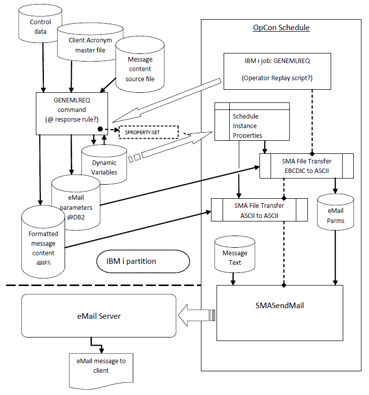

# Client eMail Management

This LSAM feature makes it possible to generate email requests that will be processed by the OpCon server, using content that is managed by the LSAM automation tools. This feature supports cleaner and more elaborate email content than is possible with the simpler OpCon email event command or an OpCon notification definition. This method requires quite a bit of configuration in advance, but once it is set up, it is not hard to reuse for various email events.

:::caution
Beginning with OpCon 15.0 and higher, SMA has changed its support for OpCon auxiliary utilities that are used by this LSAM feature. Any user of this feature who is upgrading from a prior release of OpCon is requested to contact SMA Support for special instructions about retaining or installing new copies of the OpCon utility programs that can be used until a future release of OpCon updates the support for the LSAM feature.
:::

The master file, CLTEMLF00, contains up to 10 characters used as an acronym to represent clients or other entities who should receive email notifications as the LSAM completes certain processes. This master file may store multiple records per client acronym in order to gather one or more lists of email addresses. Multiple records are managed by a sequence number, and they can be grouped together by a Use Code, for example, when a single record cannot hold all of the email addresses
that should be used for one mail event.

The LSAM command GENEMLREQ (Generate eMail Request) is used to combine information from the Client eMail control record and the Client (Acronym) eMail master file, together with run-time parameters, completely defining the content and processing of an eMail request. This command can be used alone, or in the command line of various LSAM features, most usefully in the command line of a Captured Data Response Request where LSAM Dynamic Variables can be inserted into any of the
GENEMLREQ command parameters.

The GENEMLREQ command is designed to work with a proscribed OpCon Schedule that must contain at least four tasks, as described below. It is also necessary to use Schedule Instance properties with these jobs, as documented below.

1. The first task may be a batch job that executes the GENEMLREQ command, but more typically it might be an Operator Replay script execution that triggers a Captured Data Response Rule where the GENEMLREQ command is defined.
2. A file transfer job moves the email request parameters file to the OpCon server.
3. Another file transfer job moves the separate email message content file from the IBM i disk space to the OpCon (or other Windows) server disk space.
4. The fourth task (or a later task in a dependent schedule) must be a call to the MS Windows utility from SMA called SMASendMail.

The output from the GENEMLREQ command is designed specifically for use with the SMASendMail utility. Currently, the SMASendMail utility is a manually installed utility that can be downloaded from SMA's Support Portal, under the content library called Automation Toolkit. However, this process is expected to change soon, so please contact SMA Support to request this utility.

It is important to understand the components and the flow of the Client eMail generation service. This application requires a carefully coordinated combination of LSAM master files, OpCon schedule jobs with Schedule Instance properties and an SMA utility program (SMASendMail). The flow chart following is offered to illustrate all the components of this application.

Client eMail Flow Chart



## How to Prepare for eMail Tasks

Certain resources must be installed and technical data must be gathered in order to use the Client eMail generation request command, GENEMLREQ. This outline assumes an understanding of how the OpCon server was installed and how to use OpCon features, as well as assuming an understanding of how to use e-mail servers. Refer to the flow chart on the previous page for orientation to where each of the following elements is used.

1. Identify the e-mail server that will be used, obtaining the URL, and learn what e-mail services are supported. Identify the TCP/IP port number(s) available and learn which types of e-mail security (TLS, SSL or none) are supported at each port number.

    a.  Be sure to identify the user name and password that is required
        in order to request Send Mail service from the e-mail server.

2. Obtain and install the SMA utility called SMASendMail. This utility is comprised of a program and some example files. Please contact SMA Support for special instructions to obtain and install this utility. Then, take note of the OpCon server directory where this utility is installed, so that the installation path can be registered in the LSAM eMail Management control data.
3. If not already done, update the IBM i LSAM (agent) version 04.00.03 software in the IBM i partition using the LSAM's PTF tools. Verify that PTFs 403067 - 403069 have been installed.
4. Manually create a directory structure (using command 'mkdir') within the IBM i IFS (Integrated File System) disk space, where the message text temporary files will be constructed. The recommended IFS path would be one of these two alternatives, depending on the site standards for IFS organization: '/SMA/ClientMail/' or '/home/SMA/ClientMail/'.

## How to Configure an eMail Task

It may seem challenging at first to correctly configure all the data elements required to successfully generate an e-mail request. Please contact SMA Support if  assistance is desired the first time working through this process. Once a working model has been established, then it will be easy to repeat this model for many different applications.

1. Create an OpCon Schedule that will include the following jobs. These jobs can be made serially dependent, although the two file transfer jobs could be run in any order or in parallel. View the flow chart, above, for orientation to the construction and use of this Schedule. The user is responsible for determining details about how and when the GENEMLREQ command will be executed, and how the Schedule will be built and executed.

    a.  **Add Schedule Instance Properties**: View the examples provided in the Screens and Windows section of this document, in particular under the Client eMail Management Configuration screen, for descriptions and recommendations about the names of the four Schedule Instance Properties that will be required to complete this Schedule. Use OpCon Schedule maintenance to add these four Properties to a single "instance" line within the Schedule definition. That is, all four properties are registered in a single instance, separated by a semi-colon. The initial value of each property can be a symbolic value, one that will obviously show that a Property has not yet been updated by the GENEMLREQ command in case of failure.

    b.  **Job 1**: Create an IBM i job that will execute the GENEMLREQ command. This job will require reference to the IBM i LSAM library list. The job could be a simple batch job that specifies the GENEMLREQ command in the Call command line of the OpCon job master. However, in many cases it might be more convenient to cause the GENEMLREQ command to execute as a Captured Data Response Rule command, triggered by steps of an Operator Replay script where the Client data can be collected into LSAM Dynamic Variables that will become the GENEMLREQ parameter keyword values.
    :::note note1 
    It is necessary to set the OPCONJOB parameter of the GENEMLREQ command to a value of '1' in order to cause the GENEMLREQ command to complete the four executions of the $PROPERTY:SET event command, required to transfer the names of the temporary files from the LSAM Client eMail control and master files to the Schedule Instance Properties configured above.
    :::
    :::note note2
    The IBM i LSAM configuration parameters for SMA File Transfer (LSAM sub-menu 8, option 7) are used to identify the CCSID (character set) of the EBCDIC data used to compose the message text source, and of the ASCII stream file that will be composed as the GENEMLREQ routines assemble and translate the final message text format. This method assures that international character sets will be honored.
    :::

    c.  **Job 2**: A file transfer job is required to transfer the mail task temporary file from the DB2 library location to the MS Windows machine where the SMASendMail.exe program will be executed. The SMA File Transfer function is appropriate for this task. The source file is a DB2 EBCDIC Text file, and the target (destination) file is an ASCII Text file. Use two of the Schedule Instance Properties to identify the path + file name of the source and target files when defining this transfer job.

    d.  **Job 3**: A file transfer job is required to transfer the message text stream file from the IBM i IFS disk space to the MS Windows machine where the SMASendMail.exe program will be executed. The source file is an ASCII Text stream file, and the target (destination) file is also an ASCII Text file. Use the other two Schedule Instance Properties to identify the path + file name of the source and target files when defining this file transfer job.

    e.  **Job 4**: A MS Windows job is required to execute the SMASendMail.exe program. Refer to the installation directory paths noted above under the Preparation steps for the path values required to configure this job. Refer to the example files provided with the SMASendMail utility (included in the ZIP file along with the .exe program) for examples of how the program parameters may be configured. This SMASendMail program was designed so that all the required parameters may be included in the temporary parameters text file that will be constructed by the GENEMLREQ command, in which case it may only be necessary to include the parameter keyword (refer to the program examples for the correct syntax of this parameter keyword) and the temporary file name. Use one of the Schedule Instance Properties  for the path + file name value that will be assigned to the parameter keyword.

    f.  **Jobs 5 and 6**: After a prototype test Schedule has been established, the production versions of this schedule should include two MS Windows jobs that will only be executed if Job 4 completes successfully. These jobs must delete the temporary files in the MS Windows disk space. Use the Schedule Instance Properties to specify each of the path + file names that must be deleted when the job is done.

2. Before using the other IBM i LSAM Client eMail menu functions, start by executing option 7 on the Client eMail Management sub-menu. This will establish the default parameter values that will determine how the GENEMLREQ command must be specified, and it may also influence how the Client eMail Data (also called the Client Acronym master file) is maintained. The Client eMail configuration parameters are the ones that are considered likely to be consistent whenever the GENEMLREQ command is used, although it is always possible to override these values using the keywords of the GENEMLREQ command for exceptional circumstances. Careful setting of these central configuration values makes it easier to specify the GENEMLREQ command parameters.
3. Create one or more Client eMail Data master records. Refer to the Screens and Windows section of this document for detailed information about this function.
4. *(Optional)* Create one or more Message Text Source Members, using the LSAM sub-menu option for this function. Remember that this special type of source member supports translation of LSAM Dynamic Variable values. This means that the name of a Dynamic Variable can be inserted anywhere into the message text by typing the token enclosure characters around the Dynamic Variable name. (The Dynamic Variable Token Start/End characters are specified in the LSAM Job Tracking menu, option 7. The default value used to create tokens is a pair of curly brackets, such as in this example where the registered Dynamic Variable name is DYNVAR1: {DYNVAR1}
:::note
Any LSAM Dynamic Variables that will be used within a message source text member must be manually registered in the LSAM Dynamic Variables table efore they can be used by the GENEMLREQ command during actually e-mail message formatting. Numeric variable formatting rules of any type are permitted for Dynamic Variables used in the  context of an e-mail message.
:::
5. The final step in preparing for execution of the GENEMLREQ command is to determine the proper settings for each of the command's many parameter keywords. These are fully documented in the next section of this document. It is helpful to pay close attention to the following possible sources for many of these parameters, where the table of parameter values below identifies which sources are appropriate for each keyword, and what keyword value tells the command to use each source:
    - Client eMail configuration values (sub-menu option 7)
    - Client eMail Data master record values (sub-menu option 1)
    - GENEMLREQ command parameters that specify their own values
    - *EXTERNAL = a special parameter keyword value that refers to the OpCon command line where the SMASendMail.exe program is executed. When this special value is used, it will be required to include that parameter on the program command line. Refer to the examples of the SMASendMail command line provided in the files that were delivered with the program in order to determine how each command line parameter must be specified for the MS Windows job.
6. Following execution of the GENEMLREQ command (Job 1 in the suggested OpCon Schedule outlined above), diagnostic information about any failures will be found using the LSAM sub-menu options 4 and 5. Note that additional information about problems with LSAM Dynamic Variable replacement can also be found the LSAM submitted job log file, LSALOGF30, viewed using LSAM sub-menu 6, option 5, log viewer 4.

## Client eMail Utility Commands

### GENEMLREQ Command (Generate eMail Request)

The command GENEMLREQ (Generate eMail Request) combines input from the Client eMail feature control file, from the Client Acronym master file and from the command parameters themselves to identify all the elements required to produce a nicely formatted e-mail message that may include any data that was captured and formatted by other IBM i LSAM functions. There are many parameters for this command, but most of them can be set to rely on (1) \*DEFAULT values from the control file or (2) \*ACRONYM values from the Client Acronym master file. In addition, it is anticipated that the remaining parameter values would mostly be represented by LSAM Dynamic Variable tokens. However, the command processor itself does not translate Dynamic Variable token values inserted into the command parameters, except for the MESSAGE() parameter when it may be used (even though some of the other command parameters require that a name of a Dynamic Variable - NOT in token format - must be specified). Therefore, it may be most convenient to execute this command from a Captured Data Response Rule, where the Response Command line does support translation of Dynamic Variable tokens wherever they may appear in the command line.

#### Command Syntax

In the following example of the GENEMLREQ command, the command default value is shown for every parameter (when a default is available). The default value may be assumed when it is not explicitly specified. Many of the command parameters support long strings, up to 128 characters, which prevents the IBM i command prompter from showing the command value prompts.
```
GENEMLREQ SUBJECT('Subject text string')
ACRONYM(\*CMD) SEQ(0) USECODE(\*NONE) MSGMBR(\*ACRONYM)
MSGTXTFILE(\*DEFAULT) MESSAGE(\*ACRONYM) MSGDYNVAR(EMLMSGVAR)
EMLMSGPROI(\*DEFAULT) EMLMSGPROP(\*DEFAULT)
PARMFILE(\*DEFAULT) RMDYNVAR(EMLPRMVAR)
EMLPRMPROI(\*DEFAULT) EMLPRMPROP(\*DEFAULT) FILEPATH(\*DEFAULT)
EMLUSER(\*EXTERNAL) EMLPWDPATH(\*EXTERNAL) EMLSVRURL(\*DEFAULT)
EMLSVRPORT(587) EMLSECURE(\*DFT) FROMADDR(\*DEFAULT) TOADDR(\*DEFAULT)
CCADDR(\*NONE) BCCADDR(\*NONE) OPCONJOB('1')
```

The command syntax illustrated above is not a working example of this command, since some of the default values are in conflict with each other (for example, \*CMD versus \*ACRONYM). The possible sources of each parameter value are defined in the following table of command parameters.

#### Table of GENEMLREQ Command Parameters

**SUBJECT**: User-specified e-mail subject line.

The subject line text for an e-mail must be specified when the command is executed. (Hint: A Dynamic Variable value could be used in this parameter if the command is being executed by a Captured Data Response Rule.)

**ACRONYM**: \*CMD **- or -** Client Acronym value (up to 10 characters).

When a client Acronym value is specified in this parameter, other command parameters may obtain their value from the Client Acronym master file.

\*CMD = This special value means that a Client Acronym master record will not be used, in which case the TOADDR e-mail address field must be specified instead of relying on the master file for the address. Also, the MESSAGE parameter must include some text for the message content. 

**SEQ**: Client Acronym master record sequence number.

This parameter is ignored if the ACRONYM parameter is set to \*CMD.

If the USECODE parameter is \*NONE or blank, specify the only Client Acronym record that will be used to obtain the TOADDR e-mail address and, optionally, the message text source member name. Zeros is a value sequence number.

If the USECODE parameter is not \*NONE and not blank, specify the first sequence number of the records in a Use group where the e-mail address retrieval should start. Zeroes means to start with the first record of a Use group, regardless of the actual sequence number assigned to that record.

**USECODE**: A registered Use Code from the Client Acronym master file **- or -** Blanks.

The Use Code is an optional means of grouping together Client Acronym master records to collect e-mail addresses. At this time there is no master table of Use Codes; they are only registered by typing them on one or more Client Acronym master records. Also refer to the SEQ parameter.

**MSGMBR**: \*ACRONYM **- or -** \*CMD **- or -** Source member name Specifies where the message content text will be retrieved.

\*ACRONYM = Get the message text source member name from the Client Acronym master record.

\*CMD = Use the text from the MESSAGE parameter of this command as the message content.
 
 Member name = the name of a source member in the LSAM source-physicalMSGTXTSRC.

:::note
This command supports translation of Dynamic Variable tokens that are included in the source member. Refer to the section on Message Text Source Member maintenance, below.
:::

**MSGTXTFILE**: \*DEFAULT **- or -** 10-character root name of temporary file.

The name of the temporary file that will contain the formatted message content text.

\*DEFAULT = a name will be automatically constructed starting with the capital letter "M" followed by DDHHMMSSm, where:

- DD = 2-digit day of month
- HH = 2-digit hour of the day
- MM = 2-digit minutes of the hour
- SS = 2-digit seconds after the min.
- m = 1-digit tenth of a second

Any name, up to 10 characters, may be specified, but allowing the command to generate a name prevents overlaying another file in case two jobs are executing at or near the same time. If a file name is used more than once by two different jobs, the content of the file will be overlaid by the latter job.

:::note
The actual name of the temporary file created in the IBM i IFS disk space, and after transferring the file to a MS Windows computer, will include a suffix of '.txt'. Only the 10-character root name of the file is specified in this field, as if the file were being created in the DB2 database. (The file is composed using an ASCII stream file in the IFS in order to provide the best support for line and paragraph formatting of the message content.)
:::

The file will be located in the IFS path specified in the IBM i Client 
eMail configuration. (This location has no override in the command
parameters.)

**MESSAGE**: \*ACRONYM **- or -** Message content text.

This parameter is ignored unless one of the following parameters is
specified:

- ACRONYM(\*CMD)
- MSGMBR(\*CMD)

When no message text source member is used, a character string up to 128
characters, enclosed in single quotes, should be specified in this
parameter to be used as the message content.

:::note
This is the only parameter of this command that supports translation of a Dynamic Variable token, no matter where the command is executed. It is possible to compose message content up to 1024 character by listing multiple Dynamic Variable tokens in this field, even though the parameter value only supports 128 characters as the command is submitted.
:::

**MSGDYNVAR**: User-specified Dynamic Variable name **- or -** the default of 'EMLMSGVAR'.

A value must be provided for this parameter. This is the name of the LSAM Dynamic Variable where the 10-character root name of the message text temporary file will be stored for later reference. If the default file name is used this could allow content to be overlaid in case two e-mail jobs are running at the same time.

**EMLMSGPROI**: \*DEFAULT **- or -** OpCon Property receiving IBM i message text file name.

This is the name of an OpCon Schedule Instance Property that is used to receive the full path and file name where the message content text will be retrieved during a file transfer operation. The location referenced will be in the /root file system of the IBM i IFS disk space.

\*DEFAULT = Use the name designated in the IBM i Client eMail configuration.

**EMLMSGPROP**: \*DEFAULT **- or -** OpCon Property receiving MS Windows message text file name.

This is the name of an OpCon Schedule Instance Property that is used to receive the full path and file name where the message content text will be placed after a file transfer operation. The location referenced will be an MS Windows directory and file name.

\*DEFAULT = Use the name designated in the IBM i Client eMail configuration.

**PARMFILE**: \*DEFAULT **- or -** 10-character root name of temporary file.

The name of the temporary file that will contain the task definition values for the SMASendMail utility.

\*DEFAULT = a name will be automatically constructed starting with the capital letter "P" followed by DDHHMMSSm, where:

- DD = 2-digit day of month
- HH = 2-digit hour of the day
- MM = 2-digit minutes of the hour
- SS = 2-digit seconds after the min.
- m = 1-digit tenth of a second

Any name, up to 10 characters, may be specified, but allowing the command to generate a name prevents overlaying another file in case two jobs are executing at or near the same time. If a file name is used more than once by two different jobs, the content of the file will be overlaid by the latter job.

The file will be located in the DB2 library specified in the IBM i Client eMail configuration. (This location has no override in the command parameters.)

**PRMDYNVAR**: User-specified Dynamic Variable name **- or -** the default of EMLPRMVAR.

A value must be provided for this parameter. This is the name of the LSAM Dynamic Variable where the 10-character name of the SMASendMail parameters will be stored for later reference. If the default file name is used this could allow content to be overlaid in case two e-mail jobs are running at the same time.

**EMLPRMPROI**: \*DEFAULT **- or -** OpCon Property receiving IBM i mail task parameters file name.

This is the name of an OpCon Schedule Instance Property that is used to receive the library and file name where the mail task parameters will be retrieved during a file transfer operation. The location referenced will be in the IBM i DB2 database.

\*DEFAULT = Use the name designated in the IBM i Client eMail configuration.

**EMLPRMPROP**: \*DEFAULT **- or -** OpCon Property receiving MS Windows mail task parameters file name.

This is the name of an OpCon Schedule Instance Property that is used to receive the full path and file name where the mail task parameters will be placed after a file transfer operation. The location referenced will be an MS Windows directory and file name.

\*DEFAULT = Use the name designated in the IBM i Client eMail configuration.

**FILEPATH**: \*DEFAULT **- or -** Temporary file location path for MS Windows.

This is the \\path\\ (including the trailing slash) where the two temporary files will be located in an MS Windows system after the file transfer operations.

\*DEFAULT = Use the value designated in the IBM i Client eMail configuration.

**EMLUSER**: \*EXTERNAL **- or -** eMail server user name.

The name of the user profile that has permission to log into the eMail server.

\*EXTERNAL = Do not include this value in the mail task parameters file, it will be specified on the command line where the SMASendMail.exe program is executed.

**EMLPWDPATH**: \*EXTERNAL **- or -** MS Windows \\path\\file where the encrypted mail server user's password was stored.

The full MS Windows directory path and actual file name where the mail server user's password was stored. The password must be stored using the utility SMAEncryptPassword.exe (located in the directory \\OpConxps\\Email Monitor\\, as documented in [Encrypting Passwords](https://help.smatechnologies.com/opcon/core/latest/Files/UI/Enterprise-Manager/Encrypting-Passwords.md#top) in the **Enterprise Manager** online help).

\*EXTERNAL = Do not include this value in the mail task parameters file, it will be specified on the command line where the SMASendMail.exe program is executed.

**EMLSRVURL**: \*DEFAULT **- or -** URL where the e-mail server is contacted.

The URL string, such as "smtp.gmail.com", where the e-mail server is contacted by the program SMASendMail.

\*DEFAULT = use the value specified in the IBM i Client eMail configuration.

**EMLSVRPORT**: 0 (= default) **- or -** up to 5 digits designating the service requested at the e-mail server URL.

Specify the TCP/IP port number of the mail server requested from the mail server. This port number typically varies according to the type of security requested (refer to security parameter, next).

0 (default) = use the value specified in the IBM i Client eMail configuration.

**EMLSECURE**:

- \*DFT
- \*NONE
- \*TLS
- \*SSL

Specify the type of security used to protect the e-mail message content during transmission.

\*DFT = use the value specified in the IBM i Client eMail configuration.

\*NONE = do not include the security setting in the mail task parameters file.

**FROMADDR**: \*DEFAULT **- or -** e-mail address for the FROM: field.

Specify the e-mail address of the e-mail sender, as appears in the message FROM: field.

\*DEFAULT = use the value specified in the IBM i Client eMail configuration.

**TOADDR**: \*DEFAULT **- or -** e-mail address or addresses where the message will be sent.

Specify the e-mail address where the message should be sent.

A specific value is required when the ACRONYM parameter is set to \*CMD.

\*DEFAULT = use the e-mail addresses from one or more Client Acronym master records.

**CCADDR**: \*NONE **- or -** e-mail address or addresses to receive a copy of the message.

If a carbon copy of the message is desired, specify one or more e-mail addresses that should receive a copy.

When the command is used from a Captured Data Response Rule command line, this value might typically be specified as a Dynamic Variable, so that the cc. address can be conveniently changed from a single location (the Variable value), affecting multiple instances of the command execution.

\*NONE = do not include a cc. address in the mail task parameters.

**BCCADDR**: \*NONE **- or -** e-mail address or addresses to receive a blind copy of the message.

If a blind carbon copy of the message is desired, specify one or more e-mail addresses that should receive a copy.

When the command is used from a Captured Data Response Rule command line, this value might typically be specified as a Dynamic Variable, so that the cc. address can be conveniently changed from a single location (the Variable value), affecting multiple instances of the command execution.

\*NONE = do not include a cc. address in the mail task parameters.

**OPCONJOB**:

- '1' = yes, the default.
- '0' = no.

This flag controls the extended actions of the GENEMLREQ command.

'1' = the command is executed as part of a job started by OpCon, and the command process should include generation of the $PROPERTY:SET event commands that will push the four Schedule Instance Property values up to OpCon. (The job must have been started by OpCon in order to obtain the values required for the event commands.)

'0' = the command will not execute the $PROPERTY:SET event commands. The command will still generate the two temporary files and all log entries, but any use of the temporary files must be controlled by an external or manual process.

### GETCLTEML Command (Get Client eMail Address)

The command GETCLTEML (Get Client eMail Address) is a special purpose command just for the purpose of retrieving the e-mail address field from one Client Acronym master record and storing it into an LSAM Dynamic Variable. This function would be useful for the purpose of assembling an OpCon event command such as $NOTIFY:EMAIL from a Captured Data Response Rule, where the Dynamic Variable token can be included as the event command parameter where any of the e-mail address values is specified
(to, cc. or bcc.).

:::note
The GENEMLREQ command is often preferred over the $NOTIFY:EMAIL event command because event commands do not allow commas (as may be desired in the message text) and because the mail messages generated by the event command will also include some internal technical data at the start of the message.
:::

#### Command Syntax

In the following example of the GETCLTEML command some sample values are illustrated. The command parameters do not support default values except for the MSGSEQ parameter which would default to zeros. 
```
GETCLTEML ACRONYM(ACRVALUE) VARNAM(DYNVARNAME) MSGSEQ(010)
USECODE(USECODEVAL)
```
Zeros can be a valid value for a Client Acronym master record sequence number, but if the USECODE is not blanks, then zeros means to use of the first Client Acronym master record that matches the USECODE value, regardless of the sequence number assigned to that master record. It is recommended to provide a specific value for the MSGSEQ if the USECODE applies only to records that have non-zero sequence numbers. 

Note that this command, unlike the GENEMLREQ command, will only access one Client Acronym master record. This is because the e-mail address field of a single record is 128 characters long and this is the same as the maximum value length that can be assigned to an LSAM Dynamic Variable.

#### Table of GETCLTEML Command Parameters

**ACRONYM**: 1 to 10 characters

The key value that identifies an eMail Client.

**VARNAME**: LSAM Dynamic Variable name

The name (but not in token format) of the LSAM Dynamic Variable where the e-mail address field will be copied from the identified Client Acronym master record.

**MSGSEQ**: 0 to 999

A sequence number that uniquely identifies each record belonging to a single Acronym value. Zeros is a valid value for a sequence number.

When the USECODE is not blank, then zeros in this sequence number field has the special meaning of "find the lowest sequence number of a record that matches the Use Code."

**USECODE**: 1 to 10 characters

This field may be left blank, in which case the command will use only the Acronym and the Sequence Number to identify the master record that will be used to fetch the e-mail address.

## Client eMail Screens and Windows

A sub-menu of functions that support the Client eMail Management is accessed using option 11 from either the sub-menu 3 (Events and Utilities Menu) or 4 (Operator Replay Menu).

### Client eMail Management Menu


```
SYSTEMNAME                CLIENT EMAIL MANAGEMENT MENU                  00/00/00   
USERNAME                                                                00:00:00

 Select one of the following:

     1. Work with Client eMail Data (WRKCLTEML)        
     2. Work with Message Text Source Members
     3. Generate eMail Request (GENEMLREQ)        
     4. Display eMail Activity Logs
     5. Display Error Log (DSPPFM EMLLOGF10)        
     6. Maintain Dynamic Variables
     7. Client eMail Configuration

Selection or command
 ===> __________________________________________________________________________
_______________________________________________________________________________
F3=Exit   F4=Prompt   F9=Retrieve   F12=Cancel
F13=Information Assistant   F16=System main menu
```
##### Menu Pathways

- Main Menu > Events and Utilities Menu (#3) > option 11
- Main Menu > Operator Replay Menu (#4) > option 11

##### Field

**Selection or command**: (may be restricted for some users)

##### Options

- The options displayed on this menu are explained in the following sections of this document. Type an option number in the Selection or command line and press <**Enter**> to begin using any of the options.
- **Option 3**(GENEMLREQ) is for testing, and documentation of this command appears above.
- **Option 6** is documented in the existing **IBM i LSAM** online help, especially in the topic about Job Tracking.

##### Functions

- **F3=Exit**: Returns to the master menu
- **F4=Prompt**: Prompts for keywords for any command entered in the  Select or command line.
- **F9=Retrieve**: Retrieves the previous command that was entered on the Select or the command line. If it is pressed multiple times, you
    go further and further back to previous commands.
- **F12=Cancel**: Returns to the previous menu.
- **F13=Information Assistant**: Takes you to the IBM i general help screen.
- **F16=System main menu**: This is always shown on any system-generated menu screen. It takes you to the general command entry menu for the operating system. Return to the previous menu by pressing <**F3**> or  <**F12**>. This function is not commonly used and can be restricted for certain user profiles.

### Work with Client eMail Data

- **Screen Title**: Work with Client eMail
- **Screen ID**: CLTEMLR1

##### Menu Pathways

- "Main Menu > Events and Utilities Menu (#3) > Client eMail Menu (# 11) > option 1
- "Main Menu > Operator Replay Menu (#4) > Client eMail Menu (# 11) > option 1

##### Fields

- **Search content**: Type 1 - 10 characters in this field and press <**Enter**> to search the entire contents of every record for a match. Data not on the list display is also searched.
  - If a record with a matching string is found, the list will be positioned to that record and the cursor will be positioned to the Opt field next to that record. Type 5 and press <**Enter**> to view the details of a record and see the matching data.
  - Press F16=Search Next to continue a search on to the next matching record.
  - Opt Type one of the option numbers listed near the top of the display into an Opt field and press <**Enter**> to perform that function on the selected record.
- **Acronym**: The 1-10 character key representing an eMail Client
- **Seq**: The sequence number used to identify separate e-mail address records within a single Acronym.
- **F11 = Change View**: Use this function key to replace the data shown to the right of the Sequence number field.

**View 1**

- **eMail Address (partial)**: A partial, or full 128-character string of one or more email addresses, where a semi-colon is used to separate the addresses.
  - Press F10= Fold/Drop to expand or contract the full field content.
  - Option 5=Display can also be used to show the full e-mail address list per record.

**View 2**

- **Use Code**: A code used to create sub-groups of records within a single Acronym, such as when there are different e-mail addresses used for different types of communication.
- **Use Description**: An optional field that describes the Use Code. There is no separate table of Use Codes, so the Description field is repeated on each master record, but it only needs to be specified once, and only exists for the convenience of system users, as documentation. (The Use Codes are not a normalized in the database at this time.)

**View 3**

- **MsgSrcMbr**: The name of the source physical file member in file MSGTXTSRC that contains the message content. For records that may be grouped by a Use Code, only the first record in the group (the lowest sequence number) needs to contain this member name. (The Use Codes are not a normalized in the database at this time.)
- **Client Name**: An optional description of the Acronym. Since there can be multiple records per Acronym, the client name is repeated on each record, but this name field is only for internal documentation purposes. (The Client Acronym is not normalized in the database at this time.)

##### Options

- **2=Change**: Type this option and press <**Enter**> to branch to a single-record display where the master record content can be updated. The key fields of Acronym and Sequence Number cannot be changed, so use option 3=Copy then option 4=Delete to accomplish a change in the key fields.
- **3=Copy**: Type this option and press <**Enter**> to branch to a single-record display where the master record content can be copied to a new Acronym and/or a new Sequence number.
- **4=Delete**: Type this option and press <**Enter**> to add this record to a list of master records to be deleted. After all options that were typed before the Enter key was pressed are processed, then the screen will show a Delete confirmation list display (refer to below).
- **5=Display**: Type this option and press <**Enter**> to branch to a single-record display where all the fields that define a single master record are displayed in their entirety.

##### Functions

- **F3=Exit**: Do not update the data, return to the LSAM menu.
- **F5=Refresh**: Clear any remaining options that were typed and rebuild the list display from a new read through the database.
- **F10=Fold/Drop**: When the e-mail address is displayed on the list, this function key can be used to show the entire 128-character list of e-mail addresses for each record. Press F10 again to restore the display to one line per record. F10 changes the list display to 3 lines per record for other F11 views, but there is no extended data on the other views.
- **F11=Chg View**: This function key changes which fields appear in the list display. Refer to the Fields table above for a list of fields appearing in each view.
- **F12=Cancel**: Do not update the data, return to the LSAM menu.
- **F16=Search Next**: When data was typed into the Search content field and pressing Enter resulted in a match, press <**F16**> to continue the search on to the next matching record. F16 can also be pressed to start a new search when a new value has been typed into the Search Content field.
- **F17=Top, F18=Bottom**: These function keys are used to reposition the list display to the beginning or the end of the master file.
- **F24=More keys**: This function key changes the function key legend that is displayed at the bottom of the screen. However, all function keys remain active, regardless of which keys show in the function key legend.

### Display/Change/Copy Client eMail Data

- **Screen Title**: Display Client Record
- **Screen ID**: CLTEMLR5

##### Menu Pathways

- Main Menu > Events and Utilities Menu (#3) > Client eMail Menu (# 11) > option 1 > 2,3,5
- Main Menu > Operator Replay Menu (#4) > Client eMail Menu (# 11) > option 1 > 2,3,5

##### Fields

- **Acronym**: The 1-10 character key representing an eMail Client
- **Record sequence**: The sequence number used to identify separate e-mail address records within a single Acronym.
- **Record use code**: A code used to create sub-groups of records within a single Acronym, such as when there are different e-mail addresses used for different types of communication.
- **Record use description**: An optional field that describes the Use Code. There is no separate table of Use Codes, so the Description field is repeated on each master record, but it only needs to be specified once, and only exists for the convenience of system users, as documentation. (The Use Codes are not a normalized in the database at this time.)
- **Client Name**: An optional description of the Acronym. Since there can be multiple records per Acronym, the client name is repeated on each record, but this name field is only for internal documentation purposes. (The Client Acronym is not normalized in the database at this time.)
- **Default msg txt SrcMbr**: The name of the source physical file member in file MSGTXTSRC that contains the message content. For records that may be grouped by a Use Code, only the first record in the group (the lowest sequence number) needs to contain this member name. (The Use Codes are not a normalized in the database at this
 time.)
- **eMail Address**: A 128-character string of one or more email addresses, where a semi-colon is used to separate the addresses.
  - The Use Code can group together multiple records in order to extend the list of e-mail addresses that would be used at one time for a message.

##### Options

- **2=Change**: The key fields of Acronym and Sequence Number cannot be changed, so use option 3=Copy then option 4=Delete to accomplish a change in the key fields.
- **3=Copy**: This format of the display allows changes to the Acronym and Sequence number, and new values must be typed for one or both of the fields, but the new values cannot already exist in the master file.
- **5=Display**: This format of the display does not support any changes to the data.

##### Functions

- **F3=Exit**: Do not update the data, return to the LSAM menu.
- **F5=Refresh**: Restore the display to its original condition, removing any changes that were typed but not yet committed with the Enter key.
- **F10=WRKMBRPDM**: This function key is displayed only in Change or Copy mode, and not in Display mode. When F10 is pressed, the program exits to the IBM i list display of members in the source physical file called MSGTXTSRC, permitting addition of new text members and/or changes to existing text members. This function may also be used just to identify the name of an existing source member that would then be typed into the Default msg txt SrcMbr field. For details about F10=WRKMBRPDM, refer to the display for menu option 2.
- **F12=Cancel**: Do not update the data, return to the list display.

### Work with Message Text Source Members

##### IBM i WRKMBRPDM List Display
```
                      Work with Members Using PDM             SYSSERNO
File  . . . . . .   EMLTXTSRC      
  Library . . . .     SMADTA               Position to  . . . . . __________

Type options, press Enter.
 2=Edit         3=Copy  4=Delete 5=Display       6=Print     7=Rename
 8=Display description  9=Save  13=Change text  14=Compile  15=Create module...

 Opt  Member      Type        Text
__   MSGTEST1    TXT         Test email sent to Client 1______________________
__   TSTMSGTXT1  TXT         Test message content with Dyn Var________________


                                                                          Bottom
Parameters or command
===> __________________________________________________________________________
F3=Exit          F4=Prompt             F5=Refresh            F6=Create
F9=Retrieve      F10=Command entry     F23=More options      F24=More keys
                             (C) COPYRIGHT IBM CORP. 1981, 2005.
```

##### Menu Pathways

- Main Menu > Events and Utilities Menu (#3) > Client eMail Menu  (# 11) > option 2
- Main Menu > Operator Replay Menu (#4) > Client eMail Menu (# 11) > option 2

##### Function Notes

The function of the WRKMBRPDM display is found in IBM i documentation and not repeated here. Refer to the following example of a member edit display for additional notes about how to format message text source members.

### Edit Message Text Source Members

When F6=Create is pressed from the WRKMBRPDM display, a prompt appears requesting the member name and description of the new source member. After that data is typed, the following display appears for both Create and option 2=Change in order to update the lines of a message source member.

##### IBM i WRKMBRPDM Member Edit Display
```
Columns . . . :    1  71            Edit                      SMADTA/EMLTXTSRC    
 SEU==> __________________________________________________           TSTMSGTXT1
 FMT **  ...+... 1 ...+... 2 ...+... 3 ...+... 4 ...+... 5 ...+... 6 ...+... 7
          *************** Beginning of data *************************************
  0001.00 Verify that the Dyn Var name DVAR is translated here: {DVAR}
  0002.00
  0003.00
  0004.00 Two blank lines above result in one blank line in the final formatted
  0005.00 e-mail message. A single blank line results in a new paragraph but no
  0006.00 space will appear between the paragraphs.
  0007.00
  0008.00
  0009.00 Sincerely,
  0010.00
  0011.00 SMA Support
          ****************** End of data ****************************************

F3=Exit   F4=Prompt   F5=Refresh   F9=Retrieve   F10=Cursor   F11=Toggle
F16=Repeat find       F17=Repeat change          F24=More keys
                          (C) COPYRIGHT IBM CORP. 1981, 2005.
```

##### Function Notes

The GENEMLREQ command processor program reformats the content of message text source members in a way that makes it easy for mail browsers to display message text in a format that is appealing and easy to read. Therefore, no special care is required when composing message text using the WRKMBRPDM (SEU) editor from IBM.

The only rule that applies while typing is to never type partial words on a line. If a word will not fit on one line, start that word on the next source member line. The final formatting will take care of the spacing between words, although, only one space will be inserted between the last word of one line and the first word of the next line.

Keep in mind the following two features of the message text formatting logic in order to achieve the desired final format of the message:

1. GENEMLREQ will replace LSAM Dynamic Variable tokens.
2. Leave a source member line blank to insert a Carriage Return + Line  Feed.\ One "New Line" function will be inserted into the message text for each blank source line, marking the end of a paragraph. Leave two (or more) lines blank in order to force a blank line between paragraphs in the final message format. When it is desired to have no blank space, but to only start a new line, such as in the signature lines at the end of a memo, leave only one source line blank.

Following is an example of how the message illustrated above would appear in a typical e-mail message browser, given that the Dynamic Variable was replaced by an numeric value of 1234567 that had Dynamic Variable numeric formatting rules applied.

Email Message Example
```
Verify that the Dyn Var name DVAR is translated here: $12,345.00

Two blank lines above result in one blank line in the final formatted
e-mail message. A single blank line results in a new paragraph but no
space will appear between the paragraphs.

Sincerely,
SMA Support
```

### Display Mail Activity Logs

This function also provides convenient access to the Display of Error Log information, using a formatted display instead of the simple IBM i command DSPPFM that is used for menu option 5. However, this method of access to the error log information limits the error log records to only those that pertain to the selected GENEMLREQ job, therefore, some error log entries that might be available for failed GENEMLREQ jobs would not appear except when using menu option 5.

- **Screen Title**: Display Client eMail Activity Log
- **Screen ID**: EMLLOGR1

##### Menu Pathways

- "Main Menu > Events and Utilities Menu (#3) > Client eMail Menu (# 11) > option 4
- "Main Menu > Operator Replay Menu (#4) > Client eMail Menu (# 11) > option 4

##### Fields

- **Search content**: Type 1 - 10 characters in this field and press <**Enter**> to search the entire contents of every record for a match. Data not on the list display is also searched. If a record with a matching string is found, the list will be positioned to that record and the cursor will be positioned to the Opt field next to that record. Type 5 and press <**Enter**> to view the details of a record and see the matching data.
  - Press F16=Search Next to continue a search on to the next matching record.
- **Opt**: Type one of the option numbers listed near the top of the display into an Opt field and press <**Enter**> to perform that function on the selected record.
- **DD-HH.MM.SS**: A truncated form of the record logging date and time, showing the day of the month and the hours, minutes and seconds of the entry. A primary record key (shown on the details display) assures that records will appear in DESCENDING date+time sequence, where the most recent record appears at the top of the display.
- **TP**: The record entry type. Values are:
  - E = an error log, where the TP value and the Status code on the far right will show in red to highlight a failed job.
  - U = the updated GENEMLREQ job parameters, after the mail task definition sources have all been reconciled. More than one U record will appear when multiple Client Acronym records were used to obtain an extended To-Address list.
  - Q = the original job request parameters, logging the actual values that were supplied via the GENEMLREQ command parameters, before defaults and cross-reference codes are replaced from other sources.
- **Acronym**: The 1-10 character key representing an eMail Client
- **Seq**: The sequence number used to identify separate e-mail address records within a single Acronym.
- **Use Code**: A code used to create sub-groups of records within a single Acronym, such as when there are different e-mail addresses used for different types of communication.
- **Ref Key \#**: The actual internal primary key number of the first record in a mail task log group, used to show the association of a group of log records to a single job. This value is important when more than one job, perhaps with the same name, might be executing at the same time, because the log records could be interspersed.
- **Job Name**: The IBM i job name of the job where the GENEMLREQ was executed. The full IBM i job identifier (number/user/name) is shown in the option 5=Display details format.
- **Status**: A value displays when any error code or other exceptional (perhaps non-fatal) status code is reported as the completion code by the GENEMLREQ command processor program. If the TP (type of log record) is value "E", then the TP code and the status code are displayed in red. Use option 5=Display to see more information about the reason for a failed job. (Also refer to the discussion elsewhere in this section about tools that can be used to diagnose the cause of job failures.)

##### Options

- **1=Error log**: Type this option and press <**Enter**> to branch directly to a subset list of the Error Log entries (if any) that pertain only to the selected job.
- **2=WRKJOB**: Type this option and press <**Enter**> to branch to an IBM i Work with Job menu, in order to examine information such as the job log for the job where the GENEMLREQ command was executed.
- **5=Detail**: Type this option and press <**Enter**> to branch to a series of formatted pages that display all the job definition details, and any failure reason text, for this execution of the GENEMLREQ job. The values displayed vary, depending on the record type (refer to the list of record types in the Fields table, above).
- **6=View Parms**: Type this option and press <**Enter**> to branch to an IBM i display (DSPPFM) of the content of the DB2 database temporary file where the mail task parameters were written for use with the SMASendMail program.
- **7=View message**: Type this option and press <**Enter**> to branch to an IBM i display (DSPF) of the ASCII stream file where the formatted message text was assembled, prior to transmitting the stream file to the MS Windows system where it would be used by the SMASendMail command.

##### Functions

- **F3=Exit**: Return to the LSAM menu.
- **F5=Refresh**: Clear any remaining options that were typed and rebuild the list display from a new read through the database.
- **F12=Cancel**: Return to the LSAM menu.
- **F16=Search Next**: When data was typed into the Search content field and pressing Enter resulted in a match, press <**F16**> to  continue the search on to the next matching record. F16 can also be pressed to start a new search when a new value has been typed into the Search Content field.
- **F17=Top, F18=Bottom**: These function keys are used to reposition the list display to the beginning or the end of the master file.

### Display eMail Activity Detail

- **Screen Title**: Display eMail Activity Detail
- **Screen ID**: EMLLOGR5A

##### Menu Pathways

- "Main Menu > Events and Utilities Menu (#3) > Client eMail Menu (# 11) > option 4 > 5
- "Main Menu > Operator Replay Menu (#4) > Client eMail Menu (# 11) > option 4 > 5

##### Fields

[Common header fields]

(Also apply to formats B, C and D)

- **Log time stamp**: A date and time stamp when this log record was written
- **Rec ID**: The type of log entry - refer to the Fields table for the Activity Log list display, above.
- **OpCon Job**: '1' = Yes, '0' = No (refer to the GENEMLREQ parameters explanation).
- **Prim key**: A numeric primary key assigned to this Activity Log record.
- **Xref Prim key**: The primary key assigned to the first Activity Log record for this e-mail. All entries for the same e-mail task will cross-reference the first primary key in order to show the association of log entries, even when multiple jobs may write interspersed entries. This cross-reference also separates multiple  executions of the GENEMLREQ command from the same IBM i job.
- **IBM i Job ID**: Number/User/JobName where the GENEMLREQ command was executed.
- **Job Status**: A message code or a mnemonic character string representing the type of failure. Consult SMA Support for assistance with interpreting mnemonic codes, but the failure text on the right usually explains the code.
- **Error Text**: An explanation provided by the program of why the GENEMLREQ command failed.
- **eMail Subject Line**: The value provided by the SUBJECT keyword of the GENEMLREQ command.
- Fields that are unique to this format
- **Acronym**: The 1-10 character key representing an eMail Client
- **Seq**: The sequence number used to identify separate e-mail address records within a single Acronym.
- **Use Code**: A code used to create sub-groups of records within a single Acronym, such as when there are different e-mail addresses used for different types of communication.
- **Msg Txt Src**: The name of the source physical file member in file MSGTXTSRC that contains the message content. For records that may be grouped by a Use Code, only the first record in the group (the lowest sequence number) needs to contain this member name. (The Use Codes are not a normalized in the database at this time.)
- **Msg Txt File**: The 10-character root name of the .txt file where the formatted message text was stored in the IBM i IFS disk space. Use function key F23 to view the contents of this file.
- **Msg Txt DVar**: The name of the LSAM Dynamic Variable where the 10-character root name of the message text temporary file is stored for reference.
- **Command Message value**: The value specified in the MESSAGE keyword of the GENEMLREQ command. (Refer to the command definition, above, for more information.)
- **Msg Text DB2 OpCon Prop**: The full name of the OpCon Schedule Instance property where the path and name of the message text temporary file is stored by a $PROPERTY:SET event command that the GENEMLREQ program executes. This SI.Property is required by the file transfer jobs in order to know the path and name of the source file to be transferred.
- **Msg Text OpCon Proprty**: The full name of the OpCon Schedule Instance property where the path and name of the message text temporary file is stored by a $PROPERTY:SET event command that the GENEMLREQ program executes. This SI.Property is required by the file transfer jobs in order to know the path and name of the target file in the MS Windows system that will receive the message text to be transferred.

##### Functions

(These also apply to formats B, C and D)

- **F3=Exit**: Do not update the data, return to the LSAM menu.
- **F12=Cancel**: Do not update the data, return to the list display.
- **F20=ErrLog**: This function key will cause the display to branch to a different LSAM list display that will select only the error log records pertaining to the job identified on the current Details display.
- **F21=WRKJOB**: This function key triggers a branch to an IBM i Work with Job menu, in order to examine information such as the job log for the job where the GENEMLREQ command was executed.
- **F22=Parms**: This function key triggers a branch to an IBM i display (DSPPFM) of the content of the DB2 database temporary file where the mail task parameters were written for use with the SMASendMail program.
- **F23=MsgTxt**: This function key triggers a branch to an IBM i display (DSPF) of the ASCII stream file where the formatted message text was assembled, prior to transmitting the stream file to the MS Windows system where it would be used by the SMASendMail command.
- **PageUp/Down**: The Page Up and Page Down keys are prompted, depending on which of the four screen formats is on display. Use these function keys to move among the four parts of a log entry.

- **Screen Title**: Display eMail Activity Detail
- **Screen ID**: EMLLOGR5B

##### Fields

Fields that are unique to this format

- **Parm Temp File**: The 10-character name of the DB2 file where the SMASendMail task parameters were stored in the IBM DB2 database. Use function key F22 to view the contents of this file.
- **Parm Temp File DVar**: The name of the LSAM Dynamic Variable where  the 10-character name of the mail task parameters temporary file is stored for reference.
- **Parameters File Path**: The \\path\\ value in the MS Windows system (usually the OpCon server machine) where both the mail task parameters file and the message text temporary file are stored after the file transfer operation.
  - The \\Binn\\ sub-directory under the OpCon installation directory is the typical place for this type of temporary file storage.
- **Parm DB2 OpCon Proprty**: The full name of the OpCon Schedule Instance property where the path and name of the mail task parameters temporary file is stored by a $PROPERTY:SET event command that the GENEMLREQ program executes. This SI.Property is required by the file transfer jobs in order to know the path and name of the source file to be transferred.
- **Parm File OpCon Proprt**: The full name of the OpCon Schedule Instance property where the path and name of the mail task parameters temporary file is stored by a $PROPERTY:SET event command that the GENEMLREQ program executes. This SI.Property is required by the file transfer jobs in order to know the path and name of the target file in the MS Windows system that will receive the message text to be transferred.

- **Screen Title**: Display eMail Activity Detail
- **Screen ID**: EMLLOGR5C

##### Fields

Fields that are unique to this format

- **From Address**: The e-mail address from which the message is sent
- **To Address**: The e-mail address to which the message is sent
- **CC Address**: An option carbon copy address to which a copy of the message is sent
- **BCC**: An optional blind carbon copy address to which a copy of the message is sent, but other recipients do not see this address

- **Screen Title**: Display eMail Activity Detail
- **Screen ID**: EMLLOGR5D

##### Fields

Fields that are unique to this format

- **eMail Svr Port**: The TCP/IP port number of the service at the e-mail server that will receive the request to send the message
- **eMail Svr /Secure**: The security option selected for protecting the privacy of the message
- **eMail Server URL**: The WWW URL identifying the e-mail server
- **eMail Server User ID**: The name of the user that was authorized to request message send services from the e-mail server. This may be in the form of an e-mail address, or any other form as required by the named e-mail server.
- **Password Path/File**: The full path and file name that was used by the SMAEncryptPassword program to store an encrypted version of the password require for the e-mail server user.

### Display Error Log (by Job, from Activity Log)

This function provides convenient access to the Display of Error Log information, using a formatted display instead of the simple IBM i command DSPPFM that is used for menu option 5. However, this method of access to the error log information limits the error log records to only those that pertain to the selected GENEMLREQ job, therefore, some error log entries that might be available for failed GENEMLREQ jobs would not appear except when using menu option 5.

- **Screen Title**: Display Client eMail Error Log
- **Screen ID**: EMLLOGR2

##### Menu Pathways

- Main Menu > Events and Utilities Menu (#3) > Client eMail Menu (# 11) > option 4 > option 1
- Main Menu > Events and Utilities Menu (#3) > Client eMail Menu (# 11) > option 4 > option 5 > F20=ErrLog
- Main Menu > Operator Replay Menu (#4) > Client eMail Menu (# 11) > option 4 > option 1
- Main Menu > Operator Replay Menu (#4) > Client eMail Menu (# 11) > option 4 > option 5 > F20=ErrLog

##### Fields

- **Prim key**: A numeric primary key assigned to this Error Log record.
- **Xref Prim key**: The primary key assigned to the first Activity Log record for this e-mail. All entries for the same e-mail task will cross-reference the first primary key (of the Activity Log, not of the Error Log) in order to show the association of log entries, even when multiple jobs may write interspersed entries. This
    cross-reference also separates multiple executions of the GENEMLREQ command from the same IBM i job.
- **DD-HH.MM.SS**: A truncated form of the record logging date and time, showing the day of the month and the hours, minutes and seconds of the entry. A primary record key (shown on the details display) assures that records will appear in ASCENDING date+time sequence, where the most recent record appears at the bottom of the list.
- **TP**: The record entry type. Values are:
  - ER = an error description.
  - CE = an error occurred when executing a CL command, also refer to the next entry type.
  - CT = a log of the command that was executing when the CE entry was made.
  - FE = an error during a file operation, refer to the content for the name of the file.
  - VB = a line of message text showing a Dynamic Variable token before replacement.
  - VA = the same line of message text showing the result after a Dynamic Variable token was replaced.
  - VE = the error that occurred while trying to replace a Dynamic Variable token (also refer to the LSAM generic error log, file LSALOGF30, viewed from sub-menu 6, option 5, log view 4, for the name of the Dynamic Variable being processed when an error occurred).
- **Log Entry**: Text describing the log event. Use option 5=Display to see the complete 1024 characters of the log entry.

### Display Error Log Details

Option 5=Display from the list of Error Log entries shows the complete entry text of up to 1024 characters, along with all other record identifying fields.

- **Screen Title**: Display eMail Error Log Detail
- **Screen ID**: EMLLOGR6

##### Menu Pathways

- Main Menu > Events and Utilities Menu (#3) > Client eMail Menu (# 11) > option 4 > option 1 > 5
- Main Menu > Events and Utilities Menu (#3) > Client eMail Menu (# 11) > option 4 > option 5 > F20=ErrLog > 5
- Main Menu > Operator Replay Menu (#4) > Client eMail Menu (# 11) > option 4 > option 1 > 5
- Main Menu > Operator Replay Menu (#4) > Client eMail Menu (# 11) > option 4 > option 5 > F20=ErrLog > 5

##### Fields

- **Actv key**: A numeric primary key assigned to the GENEMLREQ Activity Log entry from which this error log entry was displayed. Error log entries are actually associated with all the Activity Log entries that belong to the same Xref Prim key group (refer to next field).
- **Xref Prim key**: The primary key assigned to the first Activity Log record for this e-mail. This is the cross-reference value from the Activity Log entry that was on display when access to the Error Log was requested.
- **IBM Job ID**: The number/user/jobname of the IBM i job where the GENEMLREQ command was executed.
- **Acronym**: The 1-10 character key representing an eMail Client.
- **Seq**: The sequence number used to identify separate e-mail address records within a single Acronym.
- **Use Code**: A code used to create sub-groups of records within a single Acronym, such as when there are different e-mail addresses used for different types of communication.
- **ELog key**: A numeric primary key assigned to this Error Log record.
- **Xref Prim key**: The primary key assigned to the first Activity Log record for this e-mail. All entries for the same e-mail task will cross-reference the first primary key (of the Activity Log, not of the Error Log) in order to show the association of log entries, even when multiple jobs may write interspersed entries. This
    cross-reference also separates multiple executions of the GENEMLREQ command from the same IBM i job.
- **Log time**: The date and time when this Error Log entry was generated.
- **Record Type**: The record type values are:
  - ER = an error description.
  - CE = an error occurred when executing a CL command, also refer to the next entry type.
  - CT = a log of the command that was executing when the CE entry was made.
  - FE = an error during a file operation, refer to the content for the name of the file.
  - VB = a line of message text showing a Dynamic Variable token before replacement.
  - VA = the same line of message text showing the result after a Dynamic Variable token was replaced.
  - VE = the error that occurred while trying to replace a Dynamic Variable token (also refer to the LSAM generic error log, file LSALOGF30, viewed from sub-menu 6, option 5, log view 4, for the name of the Dynamic Variable being processed when an error occurred).
- **Log Entry**: Text describing the log event.

### Display Error Log (DSPPFM EMLLOGF10)

This function supports unrestricted access to the full content of the GENEMLREQ error log. This menu option uses an IBM i command DSPPFM instead of the formatted presentation of log entries limited to one mail task (as supported by menu option 4). Despite the lack of formatting, the log entries are easy to read, and this method of access may sometimes be necessary in order to diagnose the reason that the GENEMLREQ command failed to execute (and therefore might not have created an Activity Log entry).

The sample display below shows the file content positioned to column 94, where the Record Type code appears, followed by the beginning of the plain text log entry.

The illustration below includes an example of a real error message, but the color was changed from green to red in this document in order to call attention to the entries. The actual DSPPFM display format always uses the same color for all records in the file.

##### Display Client eMail Activity Log
```
                         Display Physical File Member
File . . . . . . :   EMLLOGF10           Library  . . . . :   SMADTA
Member . . . . . :   EMLLOGF10           Record . . . . . :   1
Control  . . . . .   W94                 Column . . . . . :   94
Find . . . . . . .

.+....0....+....1....+....2....+....3....+....4....+....5....+....6....+....7
VB&Verify that the Dyn Var name DVAR is translated here: {DVAR}
VAVerify that the Dyn Var name DVAR is translated here: 128 characters of te
ERßSMA0179: Client eMail missing OpCon property name for Message Text file
ERµGENEMLREQR failure, see previous error log entries. Last error: SMA0179,
VB&Verify that the Dyn Var name DVAR is translated here: {DVAR}
VAVerify that the Dyn Var name DVAR is translated here: 128 characters of te
VB&Verify that the Dyn Var name DVAR is translated here: {DVAR}
VAVerify that the Dyn Var name DVAR is translated here: 128 characters of te
VB&Verify that the Dyn Var name DVAR is translated here: {DVAR}
VAVerify that the Dyn Var name DVAR is translated here: 128 characters of te
VB&Verify that the Dyn Var name DVAR is translated here: {DVAR}
VAVerify that the Dyn Var name DVAR is translated here: 128 characters of te
VB&Verify that the Dyn Var name DVAR is translated here: {DVAR}
VAVerify that the Dyn Var name DVAR is translated here: 128 characters of te
VB&Verify that the Dyn Var name DVAR is translated here: {DVAR}
                                                                       More...
F3=Exit   F12=Cancel   F19=Left   F20=Right   F24=More keys
```

##### Menu Pathways

- Main Menu > Events and Utilities Menu (#3) > Client eMail Menu (# 11) > option 4
- Main Menu > Operator Replay Menu (#4) > Client eMail Menu (# 11) > option 4

##### Fields

- Refer to the description of the formatted Error Log display, above, for an interpretation of the raw log file entries. The log entry text begins at display column 98.
- The format and use of the DSPPFM command output is documented by IBM. Use the function keys F19/F20 or the control field at the top of the display to change the position of the display window.
