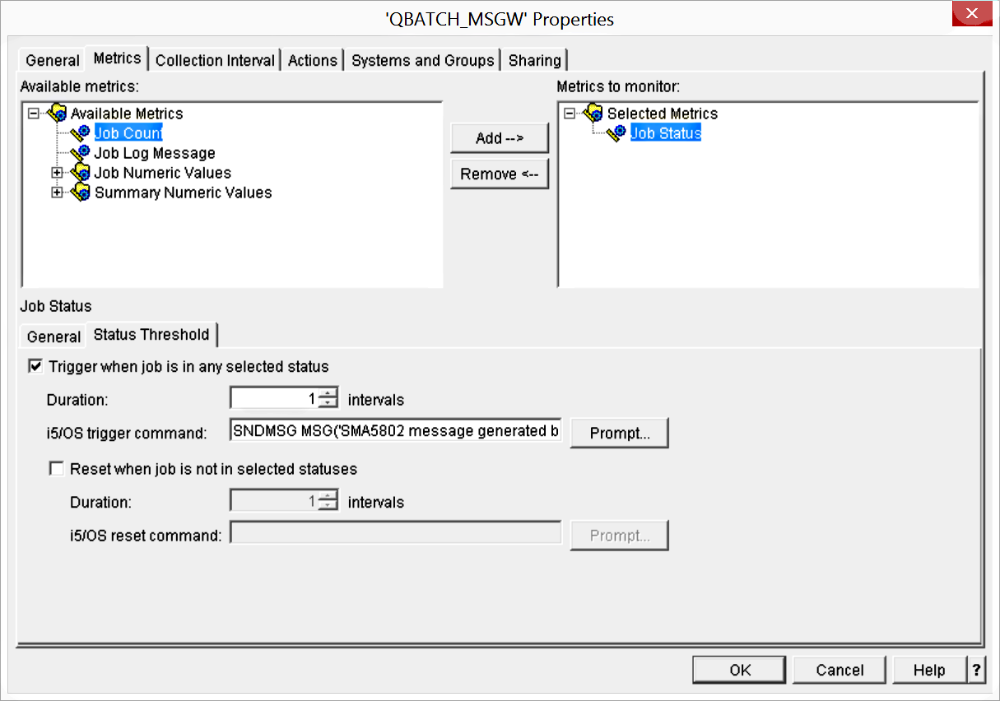
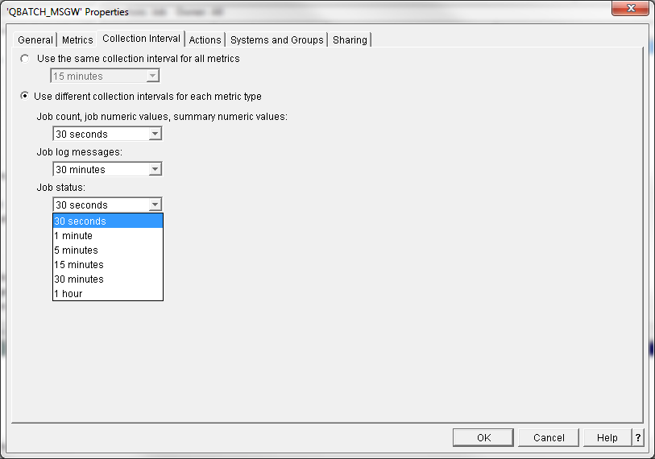

# Operation Tips and Techniques

This document section provides advice about ways to use OpCon and the IBM i Agent toolkit to automate IBM i operations. Details about how to use the IBM i toolkit components referenced in this section may be found in other topics of this document.

## Monitoring for IBM i Jobs in MSGW Status

This document section offers suggestions about ways that clients of SMA Technologies can engage the efficient System i Navigator Monitors for the purpose of detecting any jobs in the IBM i operating system that are stuck in MSGW (or other) status. It describes how to configure a Monitor to generate a message that can be intercepted by the IBM i LSAM Message Management facility, from which many forms of notification and response can be generated, including OpCon Event commands.

Information included in this section about IBM tools and software is provided as convenience, and use of this information is at the risk of the user. SMA Technologies endeavors to offer useful information, but it makes no warranty of any kind, explicit or implied, regarding resources from other providers. However, SMA is interested in further collaboration with its clients towards the end of improving the capabilities of OpCon and its IBM i Agent (LSAM).

### General Implementation Outline

The strategy suggested by this document is to configure and start an IBM i Monitor, using the System i Navigator. If a Monitor is defined to watch for a job status of "MSGW", any job detected with this status can trigger generation of a readily identifiable message that can be sent to QSYSOPR or any other message queue. Subsequently, an IBM i LSAM Message Management Parameter record can be configured to recognize this unique message, and attached Capture Rules and Response Rules can capture and communicate specific information about the job.

The general purposes anticipated by this suggested strategy include:

1. The client operations staff and/or administrators can be aggressively notified when any jobs are stuck in the MSGW status.
2. As each MSGW event is detected, the client may wish to implement new Message Management rules that can answer and/or respond to the specific messages that are discovered during follow-up research that is initiated by each Monitor event.
3. As a result, there should be fewer jobs that are actually stuck, since the IBM i LSAM and OpCon can answer inquiry messages and possibly also initiate self-healing procedures to recover from the anticipated error condition.

The activities required to implement this strategy include:

1. Define one or more new System i Navigator Monitors.
2. Add a specifically formatted message generation event to the Thresholds defined within the Monitor.
3. Add an IBM i LSAM Message Management Parameter that corresponds to each new message defined in the Monitor(s).
4. Define Capture Rules linked to the Message Management Parameters that can capture identifying information from the triggered Monitor message.
5. Define Response Rules linked to each Capture Rule that will:
    1. Store the message identifying information into LSAM Dynamic Variables.
    2. Generate any form of Notification Event, typically via OpCon using the OpCon External Event commands supported by the LSAM's CPYTOMSGIN command.

### Configuring System i Navigator Monitors

Here is the set of general instructions provided by IBM for adding a new monitor. The instructions are adapted to this specific case, of watching for jobs that get stuck in the MSGW status.

Creating a new monitor is a process that begins at the New Monitor window. In System i Navigator:

- Expand Management Central.
- Expand Monitors.
- Right-click the type of monitor you want to create (for example, Job).
- Click New Monitor.


After you have given your new monitor a name, the next step is to specify what you want to monitor. Since you are creating a job monitor, you will select which jobs you want to monitor. Be careful to monitor the smallest number of jobs that will give you the information you need. Monitoring a large number of jobs may have a performance impact on your system.

You can specify jobs by their job name, job user, job type and subsystem. When specifying job name, job user and subsystem, you can use an asterisk (\*) as a wildcard to represent one or more characters.

When multiple job selection criteria are specified, all jobs matching any of the criteria are monitored.

#### Selecting the Metrics

For each type of monitor, Management Central offers several measurements, known as metrics, to help you pinpoint different aspects of system activity. A metric is a measurement of a particular characteristic of a system resource or the performance of a program or a system.


In the example above, the top half of the display shows that "Job Status" was selected from the list on the left, then clicking the Add\--\> button moved it to the "Metrics to monitor" box on the right.

Notice that the "General" tab is selected, under the "Job Status" title in the middle of the display. In this lower half of the display, "Waiting for message" is the type of Job Status that was selected from the list on the left and then clicking on the lower Add\--\> button moved it into the "Selected statuses" box.

#### Specifying the Threshold Values

Setting a threshold for a metric that is being collected by a monitor allows you to be notified and, optionally, to specify actions to be taken when a certain value (called the *trigger value*) is reached. You can also specify actions to be taken when a second value (called the *reset value*) is reached.

Threshold values are not specified for this example. Instead, use the Threshold run command, as follows.

#### Specifying Threshold Run Commands

A *threshold* is a setting for a metric that is being collected by a monitor. *Threshold commands* run automatically on your endpoint system when threshold events occur. Threshold commands are different from any threshold actions you may have set. Threshold actions happen on your PC or central system, while threshold commands run on your endpoint systems.



In the specific example above, now the "Status Threshold" tab has been clicked, and then the box "Trigger when job is in any selected status" was checked.

:::tip Example
The example command text that is suggested by this document looks like this:

```shell
SNDMSG 
MSG('SMA5802 message generated by iSeries Navigator Monitor for job in MSGW status: &JOBNUMBER/&JOBUSER/&JOBNAME') 
TOUSR(*SYSOPR)
```
:::

You can specify any message text you wish, but keep in mind the following guidelines:

- The Navigator Monitor will not be using a Message ID for this message that is sent to the QSYSOPR message queue, therefore, a special identifier string of "SMA5802" appears in the first position in order to make it possible for the LSAM Message Management system to accurately identify this message using the Primary message text comparison rules.
- There is a table of supported variable fields, such as &JOBNAME, listed below in this document section. For this example, probably only the job identifier variables will be useful, although the Subsystem name could be added. Assembling these variables at the very end of the Primary message text will make it easy to define the LSAM Message Data Capture Rule that can pick out the job ID information (which will be 28 characters long, at the most) so that it can later be stored by a linked Response Rule into an LSAM Dynamic Variable.

#### Specifying the Collection Interval

When you are setting thresholds for the metrics you have selected to monitor, you should consider how often you want the data to be collected. The lowest value of 30 seconds would provide the most aggressive possible response to any job stuck in MSGW status.



#### Specifying Event Logging and Actions

When you have specified the threshold values for your monitor, you can click the Action tab to select event logging and the PC actions to be taken when a threshold is triggered or reset.

This aspect of Monitors is not required for this example. You can research this topic using IBM documentation and decide if it will be useful for you.

#### Applying Thresholds and Actions for a Monitor

When you have specified your threshold values and chosen to log events, you can select whether to always apply these thresholds and actions, or to apply them only on the days and times you choose.

Click the "OK" button to complete the registration of a new monitor. When you are ready for the monitor to start working, use a right mouse click on the monitor line and then a left mouse click on the "Start" option. (Refer to an example of the Monitor management window in the following section.)


### IBM i LSAM Configuration

All of the instructions for adding LSAM Message Management Parameters, Capture Rules and Response Rules are provided in the **IBM i LSAM** online help.

Here is an example of how the QSYSOPR message queue might look after a job is stuck and the Navigator Monitor has triggered the event message:


Position the cursor over the message that shows "SMA5802" in the text, then press the Help key (F1, or ALT+F1) and then pressing F9 to see that:

- The message with "SMA5802" in the text does not have a Message ID.
- The job that generated this message is an IBM i server job named QZRCSRVS, and not the original job that is stuck in MSGW status.

Here is an example of the Message Management Parameter that will be able to detect the Monitor message defined above:


In the example above, the IBM i server job name of QZRCSRVS could be used in the Job Name field, however, the Compare Text should be a unique string.

| Replacement variable | Notes | Data Substituted |
| -------------------- | :---: | ----------------- |
|&DATE                 |       | The Date the monitor triggered or reset as mmddyyyy|
|&EVENTFUL             |       | Collection interval: How often the monitor collected data (in seconds)|
|&MON                  |       | The monitor name|
|&TIME                 |       | The time the monitor triggered or reset as hhmmss|
|&ENDPOINT             |       | The endpoint system name|
|&EVENTTYPE            |   4   | Event type: The type of trigger or reset that is happening defined as follows:<ul><li>Triggered Event = 1</li><li>Auto Reset Event = 2</li><li>Manual Reset Event = 3</li></ul>|
|&JOBNAME              |       | The job name of the job causing the trigger/reset|
|&JOBNUMBER            |       | The job number of the job causing the trigger/reset|
|&JOBSTATUS            |   7   | The job status causing a trigger/reset|
|&JOBTYPE              |       | The job type of the job causing the trigger/reset|
|&JOBUSER              |       | The job user of the job causing the trigger/reset|
|&METRICTYPE           |       | The category of the metric. For a Job monitor the categories are defined as follows:<ul><li>Status Metric = 10010</li><li>Message Metric = 10020</li><li>Numeric Metric = 10030</li></ul>|
|&METRIC               |       | Metric that has triggered/reset defined as follows:<ul><li>Job CPU Utilization = 1010</li><li>Summary Comm I/O = 2040</li><li>Job Logical I/O = 1020</li><li>Summary Transaction Rate= 2050</li><li>Job Disk I/O= 1030</li><li>Summary Transaction Time = 2060</li><li>Job Comm I/O = 1040</li><li>Summary Thread Count = 2070</li><li>Job Transaction Rate= 1050</li><li>Summary Page Faults= 2080</li><li>Job Transaction Time= 1060</li><li>Job Status = 3010</li><li>Job Thread Count = 1070</li><li>Job Log Messages = 3020</li><li>Job Page Faults = 1080</li><li>Summary Job Count = 4010</li><li>Summary CPU Utilization = 2010</li><li>Summary Logical I/O = 2020</li><li>Summary Disk I/O= 2030</li></ul>|
|&NUMCURRENT           |   5   | Current trigger or numeric reset value|
|&NUMRESET             |       | Threshold value to cause auto-reset of numeric metric|
|&NUMTRIGGER           |  5 6  | Threshold value to cause trigger of a numeric metric|
|&OWNER                |       | Monitor owner|
|&RDUR                 |       | Reset duration in intervals|
|&RESETTYPE            |   3   | Reset type and defined as follows:<ul><li>Manual reset = 1</li><li>Automatic reset = 2</li></ul>|
|&SBS                  |       | Subsystem of the job causing the trigger/reset|
|&SERVER               |       | Server type of the job causing the trigger/reset|
|&TDUR                 |   5   | Trigger duration in intervals as set in the threshold|
|&THRESHOLD            |       | Threshold number causing the trigger|
|&MSGID                |   2   | Message ID causing the trigger/reset|
|&MSGSEV               |   2   | Message severity causing the trigger/reset|
|&MSGTYPE              |   2   | Message type causing the trigger/reset|

#### Notes for List of Replacement Variables

1. Refer to on-line help for additional information. To see Online help for a job monitor:
    - Left-click the (?) question mark icon on the monitors threshold tab window.
    - Drag the question mark to the 'OS/400 command' text prompt.
2. If a monitor is triggered and the user performs a manual reset ("Reset with Commands" or "Reset Only"), there is no substitution value for the parameter &NUMRESET, &RDUR. It will only have a value if the reset is automated.
3. &MSGID, &MSGSEV, or &MSGTYPE you need to be monitoring the 'Job Log Message' metric - otherwise there is no substitution value for these. Additionally, these are only valid in the trigger and reset commands of Job Log Messages thresholds.
4. &RESETTYPE only has a valid substitution value on an OS/400 reset command. Constant values are used to determine whether the reset type is manual or automated.
5. &EVENTTYPE is valid for all substitution and has constant values that are used to determine the type of monitor event that occurred (automated trigger, automated reset, or manual reset). In an OS/400 trigger command, the value is always the trigger constant; in a reset command, it can either be the automated reset or manual reset constant.
6. &TDUR, &NUMTRIGGER, and &NUMCURRENT only have valid substitution when a trigger occurs, in the OS/400 trigger command.
7. &NUMTRIGGER, &NUMCURRENT, and &NUMRESET only have valid substitution when a "numeric" metric is being monitored, in the trigger and reset commands of numeric metric thresholds.
8. &JOBSTATUS only has valid substitution when the Job Status metric is monitored, in the trigger and reset commands of Job Status thresholds.
9. Job Count metric not valid with: &JOBNAME, &JOBUSER, &JOBNUMBER, &JOBTYPE, &SBS, &SERVER, &MSGID, &MSGSEV, &MSGTYPE, AND &JOBSTATUS.
10. Job Log Message metric not valid with: &RDUR, &NUMRESET, &TDUR, &NUMTRIGGER, &NUMCURRENT, and &JOBSTATUS
11. Job Status metric not valid with: &NUMRESET, &NUMTRIGGER, &NUMCURRENT, &MSGID, &MSGSEV, AND &MSGTYPE
12. The 'Job Numeric Values' metrics of CPU Percent Utilization, Logical I/O Rate, Disk I/O Rate, Communications I/O Rate, Transaction Rate, Transaction Time, Thread Count, and Page Fault Rate are not valid with: &MSGID, &MSGSEV, &MSGTYPE AND &JOBSTATUS
13. The 'Summary Numeric Values' metrics of CPU Percent Utilization, Logical I/O Rate, Disk I/O Rate, Communications I/O Rate, Transaction Rate, Transaction Time, Thread Count, and Page Fault Rate are not valid with: &JOBNAME, &JOBUSER, &JOBNUMBER, &JOBTYPE, &SBS, &SERVER &MSGID, &MSGSEV, &MSGTYPE AND &JOBSTATUS.