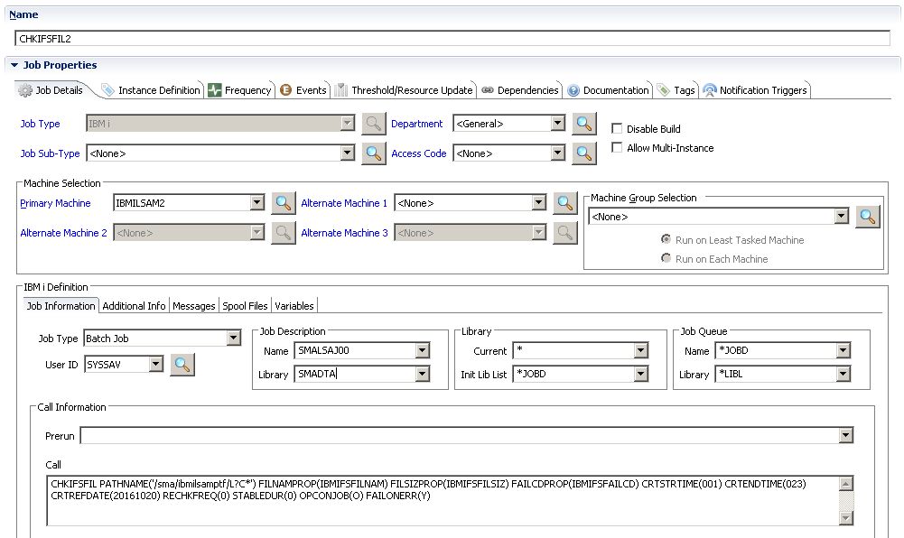

# File Arrival Jobs using CHKFILE and CHKIFSFIL

Previously, the IBM i LSAM utility commands CHKFILE and CHKIFSFIL could only be used for a simple, one-time, instant check for the existence of a file. One or two additional parameters were supported to provide feedback about user authority or locked objects. These commands could not easily be used to watch for a file arrival. The current version of IBM i Agent software supports a long list of optional command parameters for these commands, enabling a File Arrival job type along with additional file qualifiers.

Since OpCon introduced the Windows (MSLSAM) job sub-type of a File Arrival job, a new standard was established for integrating file watching directly into OpCon schedules. This replaced many of the functions of the older, separate File Watcher service of the OpCon Windows Resource Monitor -- although there were certain services provided by the File Watcher that are still being replaced as the Windows job sub-type model evolves.

Now the OpCon (version 17.1 and newer) IBM i job master record supports a separate job sub-type called "File Arrival" which makes it easier to configure file watching for IBM i, instead of using the IBM i "Batch Job" sub-type and typing in all the CHK* command parameters. The new OpCon User Interface (EM, SM) panel that appears for File Arrival jobs makes it easy to configure this type of job with many different options. TheUser Interfacepanel is actually supported by the IBM i Agent using its native CHKFILE and CHKIFSFIL commands. In addition, the Variables Tab of the IBM i job master record supports any of the command parameter keywords, so that the entire range of Agent command capabilities are available to OpCon User Interface users.

Both of the commands also support an off-line execution mode for use either as a pre-test of file watching concepts, or as a production command that might be useful in some of the IBM i LSAM automation tools, such as Multi-Step Job scripts or as part of a collection of Captured Data Response Rules (which support Operator Replay, Message Management and the SCANSPLF utility). The command parameter OPCONJOB(N) is used to disable OpCon communication functions, such as reporting a job completion status, when the commands are used in their stand-alone mode.

SMA clients who were previously using either of these commands in IBM i Batch Jobs can continue to execute those jobs without having to change any OpCon job parameter. Similarly, SMA clients who have not yet updated the OpCon server to version 17.1 or newer can still gain all the advantages of these enhanced commands by using them as the Call command for an OpCon IBM i job sub-type of Batch Job. All of the new command parameters include initial default values that cause the command driver programs to behave as they did before theUser Interfacepanel support enhancements were added. However, any existing job definitions might be worth reviewing, to see if new command capabilities would improve the effectiveness of the old job strategies.

## Tips and Techniques for the CHKFILE and CHKIFSFIL Commands

### New Optional Command Keywords

A long list of optional command keywords, documented below, support many features that enable this Agent to perform a File Arrival job type and also support an ongoing File Watcher strategy.

### Support for the OpCon File Arrival Job Sub-type

Starting with OpCon version 17.1, the IBM i job master record offers a new job sub-type called "File Arrival." (The sub-type of jobs for the IBM i Agent is supported by a "Job type" field within the lower User Interface panel that contains job master data specific to this Agent.) The File Arrival job sub-type supports a data entry panel that makes it easier to define File Arrival job parameters. This technique replaces the former strategy of using the IBM i "Batch Job" sub-type and entering raw command line text with many optional command keywords. But, behind the scenes, the Agent is still using the same CHKFILE and CHKIFSFIL commands as are documented here. The following information helps to decide on appropriate settings for the File Arrival job definition.

:::note
Starting with this Agent's version 21.1.097 (version 21.1 at LSAM PTF level 097), the Agent is able to support five additional data entry fields that are added to the OpCon Solution Manager Job Master and Job Daily views of File Arrival job definitions.  Whenever this Agent version (or newer) is active, it will start notifying the OpCon server that it now supports "fileWatcher.v3" as one of its capabilities that are listed in the OpCon Machine record attributes.  As the OpCon server is updated to a level that includes the new data entry fields, it will show the new File Arrival job defintion fields for any IBM i Agent that has reported it is capable of processing data from the new fields.  
:::

### Extended List of Command Completion Codes

The Agent File Arrival commands support an extended range of completion codes. These completion codes can be sent to a local Agent's Dynamic Variable, so that they can be tested when the CHKFILE or CHKIFSFIL commands are used from within the Agent's local automation tools, such as the Multi-Step Job Scripting tool.

When an OpCon Schedule submits a File Arrival job, the completion code can be sent to an OpCon Property. But just as useful, the completion code is also sent to three other destinations:

1. It is included in the Exit Description, that is, the displayed job status text.
2. It is sent within a text string as LSAM Feedback (hint: match %CKF0% or a specific code such as %CKF0006%).
3. Detailed Job messages provide the completion code and its description.

The Exit Description and the LSAM Feedback can be used to define Events triggered by the OpCon job.

A complete description of completion codes is found later in this section under [Command Feedback Methods](#command-feedback-methods).

### Options to Control the Final Job Status

A combination of the Agent's File Arrival command parameters with a drop-down list of Failure Conditions in the OpCon User Interface job definition panel allows the user to decide whether the Agent will report a final job status of Finished OK or Failed, depending on a variety of different circumstances. These options allow the File Arrival job to adapt to the requirements of a software application or of the user's surrounding OpCon Schedule dependencies.

The higher level decision about Finished OK versus Failed can be further refined by using the OpCon job's Events tab to respond to any of the completion codes expected from the IBM i Agent. 

### New $@ Agent Variable Names Support Command Keywords

As the OpCon general standards for File Arrival jobs evolve, the full capabilities that are unique to the IBM i Agent File Arrival commands can be engaged by setting any command keyword value from the Variables Tab of an OpCon job. This makes it possible to engage any of this Agent's capabilities that are not already supported by the OpCon User Interface job definition panel.

:::tip
The two variable prefix characters "$@" are used consistently in this documentation to refer to the user-defined prefix characters that are defined in the LSAM Events and Utilities menu (sub-menu 3) using option 7: LSAM Utility Configuration. IBM i partitions using US EBCDIC (CCSID 37) should normally continue using the default values of "$@". Partitions using other national language character sets may need to change the prefix characters because of the way they are translated between the local version of IBM i EBCDIC and the ASCII character set used by the OpCon server. See the Commands and Utilities chapter topic [LSAM Utility Configuration](/events-utilities/menu#update-the-lsam-utility-options-control-parameters) for more information about changing the prefix characters.
:::

The IBM i Agent supports a system-reserved naming convention for variables that can be added to the OpCon job Variables tab, where any command keyword can be prefixed with the characters '$@' to designate that the Variable Name is referring to a command keyword. For example, this Agent's command keyword "JOBENDTIME" can have a value set by adding a variable named $@JOBENDTIME to the OpCon job's Variables tab. The value provided for this type of variable name must exactly match the format and type of value that is supported by either command's JOBENDTIME() keyword.

The $@ command keyword convention is supported by this Agent for any IBM i job. However, it should only be used for circumstances documented in this IBM i Agent user help, otherwise unpredictable results could occur. As a general rule, this type of command keyword will be inserted only within the IBM i job's CMD() line, which is a parameter of the IBM i SBMJOB command. Thus, the $@Variable names cannot be used (at this time) to extend the parameters of the SBMJOB command itself.

The $@ command keyword variables can be used with IBM i Batch Jobs that are executing the CHK* commands. These Variable tab entries may support greater flexibility in the format of value data entry, as compared to using the raw CHKFILE or CHKIFSFIL command keywords in an IBM i Batch Job. For example, values for time relative to midnight can be expressed in clock time format such as 14:30, or in decimal format such as 14.5 (where both values mean 14 hours and 30 minutes after midnight/start of day).

## Change to the CHKIFSFIL search work library: no longer uses QTEMP

As of PTF # 181047, the sub-programs that search the IFS stream file directories no longer use the QTEMP library to report their search results and errors. Instead, they use a temporary work library named 'CKF' plus the IBM i Job Number where the CKFIFSFIL command executes.

The temporary work library will be retained in case the CHKIFSFIL command reports a failure, unless a command parameter says to ignore failures. When the command completes normally or ignores errors, then the work library will be deleted at the end of the command processing. 

To perform debugging operations when the command completes normally, set the new command parameter KEEPWRKLIB(Y) to the value of 'Y' = yes.

## Change to the management of the CHK-command job library list

When the commands CHKFILE and CHKIFSFIL are used in an IBM i Batch Job, not when started by the OpCon File Arrival job type, these commands can be requested for execution from outside of the LSAM environment. To successfully launch these commands that do require the LSAM library list, qualify the commands with their library location (SMAPGM/CHK...) and then observe the following rules.

There are two existing command parameters at the end of both the CHKIFSFIL and CHKFILE command that can be used to temporarily establish a correct LSAM library list for the command execution job:

- **ENV** = the LSAM environment name (defaults to the current LSAM).

- **GPL** = the name of the SMAGPL library in this LSAM environment.

When these two parameters are set to existing values, and not left set to their default values of '\*DEFAULT', the CHK\* commands can be executed from anywhere within the IBM i partition without requiring that the job's initial (or current) library list be set to the LSAM environment library list.

When the ENV and GPL values are set to represent an existing LSAM environment, the CHK\* command driver programs will add the LSAM environment libraries temporarily to the job's library list, so that the command can interact as required with tables in the LSAM database.

Prior to LSAM PTF # 181047, the File Arrival jobs or the stand-alone CHKIFSFIL and CHKFILE commands required that the LSAM library list be established before the commands would execute. Now the configuration of an OpCon job is much easier to manage, and these two commands can be easily executed from anywhere within the IBM i partition.

## Using JOBENDTIME and RECHKFREQ Parameters to Control Job Behavior

The old, original CHKFILE and CHKIFSFIL commands performed simple, one-time checks for a file. They were designed to be used in the Pre-Run command line of an OpCon job master.

With the implementation of the File Arrival job sub-type for IBM i jobs, it is now possible to control the behavior of the File Arrival job so that it executes either a one-time check or it performs a continues file arrival watching function. When defining the continuous file watching function, it is important to carefully control the two IBM i parameters that enable this capability.

- **RECHKFREQ (Re-check frequency)**: This parameter creates two effects. When it is not zero, it implies that the check for a matching file will be repeated, and this frequency value specifies (in seconds) how long the file check program will pause before repeating the check for file existence. When this value is left at zero (by default, or intentionally specifying zero), this tells the file check commands that the job should perform only a one-time check.
- **JOBENDTIME (Job End Time)**: The Job End Time works together with the Re-check Frequency. The primary use case for the Job End Time parameter is when it is expected that a file might have been created earlier in the day (or on a previous day), but it will not be moved into the watched directory (or DB2 library) until after some previous depended-on job has completed. Currently, the OpCon Windows  File Arrival job depends only on the file Create End Time to govern when the File Arrival job should stop. But if the target file is believed to have a Create Time in the past, and the job only wants to find a file that was created on or before that time, then there is no good way to keep the File Arrival job running until the expected file finally arrives. Using the Job End Time parameter separates the control of the absolute time when the File Arrival job should give up waiting and end, and it allows the File Create End Time to perform only its intended function of qualify whether a matching file name was created during the desired window of time. When the Job End Time is zero (the default for this parameter), then the Create End Time WILL govern the absolute job end time. But when a Job End Time is specified, then the file check commands will use this value as the end time boundary for the Re-check Frequency. 

:::caution 
If both the Job End Time and the Create End Time are zeros/blanks, but the Re-check Frequency is not zero, then the File Arrival job will run endlessly until a matching file is found. This can only happen if the user intentionally creates this parameter configuration -- the default parameter values for the job will not create this endless loop. Interestingly, allowing for an endless loop makes it possible to create a real all-day file watcher. For this type of job, users can choose to have an OpCon control schedule force the job to end and then start a new one, based on their own schedule, or the endless file watcher could just keep running day after day until and unless there is a system stop or system failure. In that case, it would be necessary to have a secondary OpCon service monitor restarting itself all the time to assure that the endless file watcher job is always active. 
:::

## Using the Agent Commands in File Arrival Jobs

The recommended method for configuring File Arrival jobs in OpCon Schedules is to select the IBM i job sub-type of "File Arrival" and then fill in the unique job definition panel. The Variables tab of the IBM i job can also be used to set additional command parameters using the $@ Agent variable naming convention to represent any given command parameter keyword. The File Arrival job sub-type will cause the Agent to format and submit the CHKFILE or CHKIFSFIL command, with any optional $@VARIABLE parameters, as the File Arrival job.

Before the OpCon File Arrival job definition panel was supported for IBM i jobs, the job sub-type of Batch Job was used and the CHKFILE or CHKIFSFIL command with parameters was typed (or pasted) into the Call command box. That format of File Arrival Job may still be used -- it fully supports all the same features as the new File Arrival job definition panel. All new command parameter keywords that have been added to the two commands support default values that are transparent to older formats of the command lines, so existing Batch job definitions using the native command lines will still execute correctly.

Otherwise, the command line formats of the CHKFILE and CHKIFSFIL commands are documented here for two purposes. First, these commands can be used in local mode (not submitted by OpCon), such as from a Step of a Multi-Step Job Script, or from a Captured Data Response Rule, as long as the command parameter OPCONJOB is set to a value of (N), (T), or (A), where both of those values refer to Test mode (offline from OpCon). Second, a clear understanding of the native command parameters may be required to complete more complex File Arrival job definitions, especially when using the $@ variable names for setting command parameter keyword values from an OpCon job's Variables tab.

### Formatting the File Arrival Command Line

A good way to prepare a correctly formatted File Arrival command line is to use an IBM i green screen command entry line and prompt either command using function key F4. After completing the required command parameters, press F3 to cancel the command, then, use F9 to retrieve the cancelled command so that the complete command line can be copied and pasted.

When logged on to a green screen workstation, it is very helpful to use the full screen command entry mode. This is the best way to capture longer command lines so they can be pasted into an OpCon job's Call command box.

To enter the full screen mode for IBM i commands, type the following command and then press Enter:
```
CALL QCMD
```
To successfully access the File Arrival commands it is necessary to refer to at least the Agent library SMAPGM, where the commands are stored. To execute either command, the full Agent library list is required. However, when simply prompting the command to format the parameter keywords, it is only necessary to use the SMAPGM library. The following options will support prompting the commands: 

- Type SMAPGM/CHKFILE or SMAPGM/CHKIFSFIL and press F4. 
- Enter the Agent (LSAM) menu system and use the menu command line to type only the command name, then press F4. It works better to first CALL QCMD before attempting to prompt, format, cancel and retrieve the command line.
- From any IBM i command line, the Agent commands SMAGPL/SMASETLIBL or SMAGPL/SMAADDLIBL can be used to replace or amplify the job's library list with the complete set of Agent libraries. Then it is only necessary to type the command name before pressing F4=Prompt.

The values specified for the many different command parameters will depend on which of the functions listed below are required. It is possible for one job to perform many different file checking functions, although multiple functions requested at once will interact with each other (in ways described below).

### Configuring an OpCon IBM i Batch Job for File Arrival

Although the original Batch Job method for defining File Arrival jobs is no longer the recommended method, it still works, and this is the only method for defining IBM i File Arrival jobs with versions of OpCon prior to 17.1. File Arrival jobs that are already formatted this way will continue to work, and can be enhanced with most of the newer features.

Here is an example of a semi-complex file watching command entered into an IBM i batch job master record in OpCon:

Example OpCon IBM i batch job



The various parameter values illustrated in the image, above, are all explained in tables below in this document. The command line could be much simpler, since the only value that must be specified is the PATHNAME parameter (for this CHKIFSFIL command), or the FILE parameter for the CHKFILE command.

All new File Arrival jobs in OpCon (version 17.1 and newer) should be configured using the newer "File Arrival" job sub-type for IBM i jobs.

## Purpose of CHKFILE versus CHKIFSFIL

The CHKFILE command is designed for use only with the DB2 database that comes embedded with the IBM i operating system. It is designed to work with Libraries that contain different types of objects. Only the object type of \*FILE is supported by this command. The file attribute would typically be either PF-DTA or PF-SRC, although LF (logical views) and some other \*FILE objects can also be checked.

The CHKIFSFIL command can be used with any file system supported by the IBM i operating system. Perhaps the most common use of this command would be to watch for files arriving in the root(/) file system, which, like the basic Windows disk system, can contain nested directories and it is not case sensitive.

:::warning
Although the root(/) file system is not case sensitive, the CHKIFSFIL command may use some UNIX-style APIs which are case sensitive. Therefore, the PATHNAME parameter must be managed as case sensitive.
:::

The CHKIFSFIL command can be used with other of the Integrated File Systems (IFS), including, for example, the /QOpenSys file system that resembles UNIX disk systems and is case sensitive. The old /QDLS document storage file system can also be checked with CHKIFSFIL, although this poorly performing file system is no longer recommended for
use.

CHKIFSFIL can also be used with the DB2 database file system, since it also exists within the operating system's generalized IFS file system, but the format for addressing DB2 tables from the IFS file system perspective must be configured like this:

'/QSYS.LIB/MYLIBRARY.LIB/MYFILE.FILE'

**-or-**

'/QSYS.LIB/MYLIBRARY.LIB/MYFILE.FILE/MYDATA.MBR'

In most cases, it is probably better to use the CHKFILE command for DB2 tables, especially since the CHKIFSFIL command will re-route any DB2 file definitions to the CHKFILE command.

### Replacing Windows File Shares with Direct Access to IBM i

Before there was an enhanced File Arrival job method for the IBM i Agent, many OpCon users would try to use the OpCon Windows Resource Monitor in File Watcher mode. This required a complex configuration of IBM i disk file shares within the Windows system where the Resource Monitor was executing, as well as difficult management of user authorities.

Now, the enhanced IBM i File Arrival job sub-type replaces the dependency on IBM i file shares with direct access to any IBM i file system. This is a welcome move towards eliminating the extra work required for system and network administrators to configure IBM i file shares. Another benefit of eliminating the use of file shares is a reduced work load within the IBM i system, which improves system performance overall.

## Using CHKFILE for DB2 Tables

The File Name field of an IBM i File Arrival job sub-type in the OpCon User Interface is checked by the Agent to determine whether the file exists in the DB2 database, or whether it is located outside of DB2 in another IFS file system, such as the root '/' file system. It is the leading forward slash character '/' that designates an IFS file outside of DB2. Without the leading slash, the Agent attempts to hand the File Name string in the DB2 format of LIBRARY/FILENAME or LIBRARY/FILENAME(MEMBER). When a DB2 format will be processed, the Agent uses theUser Interfacejob definition panel fields to compose the Agent's CHKFILE command for execution in an IBM i batch job.

The CHKFILE command can also be used in stand-alone mode, either inside of OpCon using the IBM I job sub-type of Batch Job, or outside of direct control by OpCon, from some of the Agent's local automation tools such as a Multi-Step Job Script, or as a command in a Captured Data Response Rule. To use this command off line from OpCon, it is necessary to specify the command parameter OPCONJOB() with a value of N=no, or T or A, where either value indicates "test mode" for the command. In fact, "No" or the test mode turns off any attempt to send job information and completion codes to OpCon. The optional parameters for sending values to OpCon Properties are also not supported in the local test mode; but in this case, there are Dynamic Variable names that can be specified for similar purposes.

The CHKFILE command complete command syntax is shown here with the default values for all parameters (where applicable):
```
CHKFILE
    FILE(libname/filename)
    LOCK(*NO)
    MEMBER(*FIRST)
    FILNAMPROP(*NONE)
    NUMRECPROP(*NONE)
    FAILCDPROP(*NONE)
    FILNAMDV(*NONE)
    NUMRECDV(*NONE)
    FAILCODEDV(*NONE)
    FAILIFZERO(*NO)
    CRTSTRTIME(0)
    CRTENDTIME(0)
    CRTREFDATE(*DEFAULT)
    JOBENDTIME(0)
    JOBREFDATE(*DEFAULT)
    RECHKFREQ(0)
    STABLEDUR(0)
    AUTUSER(*JOB)
    AUT(*NONE)
    OPCONJOB(O)
    FAILONERR(Y)
    ENV(*DEFAULT)
    GPL(*DEFAULT)
```

The command parameter summary shown next defines each parameter and lists possible values. However, the effect of using these parameters together can vary the outcome of the command, as discussed below.

### CHKFILE Command Parameter Summary

#### Parameter Keyword/Values/Description
- FILE  
  - IBM i object names. File name can be generic. 
    
    DB2: library name / file(table) name. The file name can be generic, e.g., FIL*. For DB2 tables, only a trailing asterisk (*) is supported for generic names. A partial name is defined by one or more leading characters (conforming to the rules for IBM i object names).

- LOCK
  - *NO
  - *YES

    *YES causes command to report failure if a lock exists on the file object that might prevent a subsequent operation from being performed.

- MEMBER
  - *FIRST 
  - IBM i object name
    
    Optionally, specify a specific data member name for PF-SRC files, or for multi-member PF-DTA files. (SQL tables do not support multiple data members.)        

- FILNAMPROP
  - *NONE 
  - OpCon Property name 
  - {dvtoken} 

    File Name Property: Optionally, specify an OpCon Property name (without brackets) that will store the name of the actual file that was found and used for the command. This feedback is important when a GENERIC* name is submitted. An LSAM Dynamic Variable token (with curly braces) can be used to provide the actual name of the OpCon Property at run time.

- NUMRECPROP
  - *NONE 
  -  OpCon Property name 
  -  {dvtoken} 

     Number of Records  Property: Optionally, specify an OpCon Property name (without brackets) that will store the digits representing the number of records for the actual file that was found and used for the command. An LSAM Dynamic Variable token (with curly braces) can be used to provide the actual name of the OpCon Property at run time.               

- FAILCDPROP
  - *NONE 
  - OpCon Property name 
  - {dvtoken} 

    Failure Code (command completion code) Property: Optionally, specify an OpCon Property name (without brackets) that will store the command completion code. An LSAM Dynamic Variable token (with curly braces) can be used to provide the actual name of the OpCon Property at run time.
- FILNAMDV
  - *NONE 
  - LSAM Dynamic Variable name  

    File Name Dynamic Variable: Optionally, specify an LSAM Dynamic Variable name (without curly braces) that will store the name of the actual file that was found and used for the command.

- NUMRECDV          
  - *NONE
  - LSAM Dynamic Variable name 

    Number of Records Dynamic Variable: Optionally, specify an LSAM Dynamic Variable name (without curly braces) that will store digits for the number of active records in the actual file that was found and used for the command.

- FAILCODEDV        
  - *NONE
  - LSAM Dynamic Variable name 

    Failure Code (command completion code) Dynamic Variable: Optionally, specify an LSAM Dynamic Variable name (without curly braces) that will store the command completion code. This value can be useful, for example, when developing LSAM Multi-Step Job scripts, to condition actions that might be performed depending on the completion code value. 

- FAILIFZERO        
  - *NO
  - *YES

    Fail If Zero (report job status as failed):
       - *NO = allow the command to complete normally when a file is found with zero records. 
       - *YES = request the command report a failure when the file is found with zero records.
    
    (Refer also the notes about parameter interactions.)

- CRTSTRTIME 
  - 0 (zero)
  - +/- 99999.99 hours, where .99 refers to hundredths of an hour: 0.25 = 15 minutes.

    The File Create Time must occur after this Start Time value (converted to a time stamp relative to midnight of the Reference Date).
       - Zero means to ignore this parameter.
       - A negative value indicates the number of hours before midnight.
       - A positive value indicates the number f hours after midnight.
       - Batch Jobs can use the OpCon job's Variables Tab to load $@CRTSTRTIME with a format of hhhhh:mm (+/- hours and minutes).

- CRTENDTIME
  - 0 (zero)
  - +/- 99999.99 hours, where .99 refers to hundredths of an hour: 0.25 = 15 minutes.

    The File Create Time must occur before this End Time value (converted to a time stamp relative to midnight of the Reference Date).
      - Zero means to ignore this parameter.
      - A negative value indicates the number of hours before midnight.
      - A positive value indicates the number of hours after midnight.
      - Batch Jobs can use the OpCon job's Variables Tab to load $@CRTENDTIME with a format of hhhhh:mm (+/- hours and minutes.

- CRTREFDATE
  - *DEFAULT
  - *SCHED
  - *JOB
  - CCYYMMDD
  - {dvtoken}

    File Create Time Reference Date for midnight: Designates what date is used for midnight. Midnight is considered to be at the start of the specified date.
      - For OpCon jobs, *DEFAULT refers to the Schedule Date of the job.
      - Outside of OpCon (job type is T or A), *DEFAULT refers to the current IBM i system date.
      - *SCHED = use the Schedule Date (only valid for OpCon jobs).
      - *JOB = use the IBM i Job Date.
      - CCYYMMDD = an actual date may be specified, e.g., 20160601 = June 1, 2016.
      - An LSAM Dynamic Variable (with curly braces) can be translated at run time to provide an actual date in the CCYYMMDD format.
    For OpCon User Interface File Arrival jobs, use the job master Variables tab to put the desired Value into the variable $@CRTREFDATE.

- JOBENDTIME
  - 0 (zero)
  - +/- 99999.99 hours, where .99 refers to hundredths of an hour: 0.25 = 15 minutes.

    The Job End Time, when specified, replaces using the File Create End Time as the default last time that a file check can occur. (The +/- value is converted to a time stamp relative to midnight of the Job Reference Date). 
      - Zero means to ignore this parameter. 
      - A negative value indicates the number of hours before midnight.
      - A positive value indicates the number of hours after midnight.
  OpCon User Interface File Arrival or Batch Jobs can use the OpCon job's Variables Tab to load $@JOBENDTIME with a format of hhhhh:mm (+/- hours and minutes or using a decimal format such as +14.5 = 14 hours and 30 minutes after Midnight).

- JOBREFDATE
  - *DEFAULT
  - *SCHED
  - *JOB
  - CCYYMMDD
  - {dvtoken}

    Job End Time Reference Date for midnight: Designates what date is used for midnight. Midnight is considered to be at the start of the specified date.
      - For OpCon jobs, *DEFAULT refers to the Schedule Date of the job.
      - Outside of OpCon (job type is T or A), *DEFAULT refers to the current IBM i system date.
      - *SCHED = use the Schedule Date (only valid for OpCon jobs).
      - *JOB = use the IBM i Job Date.
      - CCYYMMDD = an actual date may be specified, e.g., 20160601 = June 1, 2016.
  
    An LSAM Dynamic Variable (with curly braces) can be translated at run time to provide an actual date in the CCYYMMDD format. For OpCon User Interface File Arrival jobs, use the job master Variables tab to put the desired Value into the variable $@JOBREFDATE.

- RECHKFREQ
  - 0 (zero)
  - 999 seconds

    Frequency to re-check for file existence:
      -  Zero means to check once for a matching file name (optionally qualifying it by the Start/End Create time).
      - Greater than zero indicates the number of seconds to wait between repeated checks for file existence. Check looping will not start until at or after the Start time, and it will end once the End time has been reached. 

    The Job End time is either specified by its own parameter, or it will default to the File Create End Time. If both are zero, then a job with a non-zero RECHKFREQ will continue running for 24 hours from the IBM i system job start time.

- STABLEDUR
  - 0 (zero)
  - 999 seconds
  
    File size stable for this duration in seconds: Specify the number of seconds that the file size (number of records) must remain the same. The command will repeat the check of the number of records after waiting for this number of seconds, until a second check produces the same number of records as the previous check. If the number of records remains zero, then the FAILIFZERO parameter controls the final command status.

- AUTUSER
  - *JOB
  - User Profile name
  - {dvtoken}

    Specify the User whose authority to the file will be verified (using the AUT authority values).
       - If this parameter is blank or the default value of *JOB, then the user profile assigned to the job that is executing the command will be used, IF AUT values are specified.
       - If AUT values are not specified, then this parameter is ignored. But if AUT values are specified, then this User name will be referenced.
       - An LSAM Dynamic Variable token can be used to provide the User Name.
 
    For OpCon User Interface File Arrival jobs, the User name specified in the job master record is applied to this parameter. The File Arrival job itself always runs under the authority of the SMANET Agent user profile. For Batch Jobs, specifiy the job user name that has authority to use the LSAM CHK* command utility, and then put the name of the user whose authority must be checked into the AUTUSER command parameter.  

- AUT
  - *NONE
  - *CHANGE
  - *ALL
  - *USE
  - *EXCLUDE
  - *AUTL 
  - *OBJALTER
  - *OBJEXIST
  - *OBJMGT
  - *OBJOPR
  - *OBJREF
  - *ADD
  - *DLT
  - *READ
  - *UPD
  - *EXECUTE

    List one or more authority values that will be used to verify if the AUTUSER has this/these authorities to use the file. For more information about these authority values and their use/meaning, please consult IBM i documentation for the GRTOBJAUT command.
 
    If AUT shows a value of *NONE, then the AUTUSER will be ignored and no authority check will be performed.

    If any of the specified authority rights are not assigned to the AUTUSER, the command will fail with error code CKF0007. 

    :::tip 
    For OpCon File Arrival jobs, the list of authorities can be specified for DB2 tables using the Value column of the job's Variables table, specifying a variable name of $@AUT. Otherwise, the authority for DB2 tables will be set to approximate the READ, WRITE and EXEC stream file authority options supported by the OpCon User Interface job.
    :::

- OPCONJOB
  - O
  - Y
  - N
  - T
  - A

    - O or Y (Yes) = OpCon started the job and the OpCon server can receive Property value settings.
    - T or N (No) = Test or local IBM i job: No attempt is made to send values to an OpCon server. Use this mode when the CHKFILE command is executed from an LSAM Multi-Step Job script or from LSAM Response Rules.
    - A = a French indication for test mode, same as 'T'.

- ENV

  - \*DEFAULT 
  - Actual LSAM environment name

    Used when the CHKFILE command is executed by itself (not by the OpCon File Arrival job), to set the LSAM library list according to the LSAM Environment name.

- FAILONERR

  - Y
  - 1
  - N
  - 0
  - T
  
    Report Job Status as failed when file check fails:
      - Y = Yes or 1: The command will report a failed job status if a file is not found, or the file Create Time does not fall within the Start/End times.
      - N = No or zero (0): The command will always report a normal job completion status even when no matching file is found. When using N, the final command status should be stored in an LSAM Dynamic Variable and/or an OpCon Property so that it can be tested.
      - T = file not found by End Time, but ignore and end normally. 
      - If the file check command is reporting an internal program failure, then this override flag is ignored and the command will always report the failure.

    The OpCon User Interface File Arrival job supports different Fail Condition options, including this one. This FAILONERR option can be combined (in some cases) with the FAILIFZERO option in an OpCon User Interface File Arrival job by adding the $@FAILIFZERO variable name to the job's Variables tab and specifying that parameter's Value. (Refer also the discussion about using LSAM Feedback.)

- GPL 
  - *DEFAULT Actual LSAM environment name
  - *DEFAULT Actual SMAGPL library name

     Used when the CHKFILE command is executed by itself (not by the OpCon File Arrival job), to identify the SMAGPL library where the LSAM Environment library list can be found.


## CHKFILE command parameter values

### Using CHKIFSFIL for IFS Stream Files

The File Name field of an IBM i File Arrival job sub-type in the OpCon User Interface is checked by the Agent to determine whether the file exists in the DB2 database, or whether it is located outside of DB2 in another IFS file system, such as the root '/' file system. It is the leading forward slash character '/' that designates an IFS file outside of DB2. When a non-DB2 IFS format will be processed, the Agent uses theUser Interfacejob definition panel fields to compose the Agent's CHKIFSFIL command for execution in an IBM i batch job.

The CHKIFSFIL command can also be used in stand-alone mode, outside of direct control by OpCon, from some of the Agent's local automation tools such as a Multi-Step Job Script, or as a command in a Captured Data Response Rule. To use this command off line from OpCon, it is necessary to specify a value of (N), (T), or (A) for the command
parameter OPCONJOB(), where (N) = not an OpCon job and either value (T) or (A) indicates "test mode" for the command. In fact, the test mode turns off any attempt to send job information and completion codes to OpCon. The optional parameters for sending values to OpCon Properties are also not supported in the local test mode; but in this case, there are Dynamic Variable names that can be specified for similar purposes.

The CHKIFSFIL command complete command syntax is shown here with the default values for all parameters (where applicable):
```
CHKIFSFIL
  PATHNAME('/dir/subdir/file.ext')
  READ(*NO)
  WRITE(*NO)
  EXEC(*NO)
  AUTUSER(*JOB)
  FILNAMPROP(*NONE)
  FILSIZPROP(*NONE)
  FAILCDPROP(*NONE)
  FILNAMDV(*NONE)
  FILSIZDV(*NONE)
  FAILCODEDV(*NONE)
  FAILIFZERO(*NO)
  CRTSTRTIME(0)
  CRTENDTIME(0)
  CRTREFDATE(*DEFAULT)
  JOBENDTIME(0)
  JOBREFDATE(*DEFAULT)
  RECHKFREQ(0)
  STABLEDUR(0)
  OPCONJOB(O)
  FAILONERR(Y)
  ENV(*DEFAULT)
  GPL(*DEFAULT)
  KEEPWRKLIB(N)
```
The command parameter summary shown next defines each parameter and lists possible values. However, the effect of using these parameters together can vary the outcome of the command, as discussed below.

### CHKIFSFIL Command Parameter Summary

#### CHKIFSFIL Command Parameter Values
| Parameter Keyword   | Values               | Description          |
| -----------------   | ------               | -----------          |
| PATHNAME            | Fully qualified IFS path including the file name. File name can be generic. | The file name and/or extension can use generic search characters, including a question mark (?) for single character masking and an asterisk (\*) for a variable number of characters. An example of a generic file name mask might be: L?C\*.\* 
|                     |                      | This mask indicates any one character between the L and C, then any number of characters before the period, and any number of characters in the file extension.|
|                     |                      | To experiment with generic file name masks, use the STRQSH command and then the DIRLIST command. The CHKIFSFIL utility relies on the DIRLIST command executed by QSHELL for all file checks.|
| READ(\*NO)/WRITE(\*NO)/EXEC(*NO) | \*NO / \*YES | Check for file authority/permissions: |
|                     |                      | Specify \*YES for any of these parameters to cause the command to check for this type of authority to the file, as assigned to the AUTUSER. |
|                     |                      | If the user is a member of a Group profile that has the requested authorities, then the command reports success. |
|                     |                      | If the \*PUBLIC has the requested authorities,the command will report success. |
| AUTUSER             | \*JOB / User Profile name / {dvtoken} | Specify the User whose authority to the file will be verified (using the AUT authority values). |
|                     |                      | If this parameter is blank or the default value of \*JOB, then the user profile assigned to the job that is executing the command will be used. |
|                     |                      | If all the authority values of READ, WRITE and EXEC are set to (\*NO), then this AUTUSER will be ignored and no authority checking will be executed. |
|                     |                      | An LSAM Dynamic Variable token can be used to provide the User Name. |
|                     |                      | For OpCon User Interface File Arrival jobs, the User name specified in the job master record is applied to this parameter. The File Arrival job itself always runs under the authority of the SMANET Agent user profile. |
|                     |                      | For Batch Jobs, specifiy the job user name that has authority to use the LSAM CHK\* command utility, and then put the name of the user whose authority must be checked into the AUTUSER command parameter. |
| FILNAMPROP          | \*NONE / OpCon Property name / {dvtoken} | File Name Property: Optionally, specify an OpCon Property name (without brackets) that will store the name of the actual file that was found and used for the command. This feedback is important when a GENERIC\* name is submitted. An LSAM Dynamic Variable token (with curly braces) can be used to provide the actual name of the OpCon Property at run time. |
| FILSIZPROP          | \*NONE / OpCon Property name / {dvtoken} | File Name Property: Optionally, specify an OpCon Property name (without brackets) that will store the name of the actual file that was found and used for the command. This feedback is important when a GENERIC\* name is submitted. An LSAM Dynamic Variable token (with curly braces) can be used to provide the actual name of the OpCon Property at run time. |
| FAILCDPROP          | \*NONE / OpCon Property name / {dvtoken} | Failure Code (command completion code) Property: Optionally, specify an OpCon Property name (without brackets) that will store the command completion code. An LSAM Dynamic Variable token (with curly braces) can be used to provide the actual name of the OpCon Property at run time. |
| FILNAMDV            | \*NONE / LSAM Dynamic Variable name | File Name Dynamic Variable: Optionally, specify an LSAM Dynamic Variable name (without curly braces) that will store the name of the actual file that was found and used for the command. |
| FILSIZCDV           | \*NONE / LSAM Dynamic Variable name | File Size Dynamic Variable: Optionally, specify an LSAM Dynamic Variable name (without curly braces) that will store the digits representing the number of bytes for the size of the actual file that was found and used for the command. |
| FAILCODEDV          | \*NONE / LSAM Dynamic Variable name | Failure Code (command completion code) Dynamic Variable: Optionally, specify an LSAM Dynamic Variable name (without curly braces) that will store the command completion code. This value can be useful, for example, when developing LSAM Multi-Step Job scripts, to condition actions that might be performed depending on the completion code value. |
| FAILIFZERO          | \*NO / \*YES | Fail If Zero (report job status as failed): |
|                     |            | ***NO** = allow the command to complete normally when a file is found with zero bytes of data. |
|                     |            | ***YES** = request the command report a failure when the file is found with zero bytes of data. |
|                     |            | (Refer also the notes about parameter interactions) |
| CRTSTRTIME          | 0 (zero) / l +/- 99999.99 hours, where .99  refers to hundredths of an hour: 0.25 = 15 minutes. | The File Create Time must occur after this Start Time value (converted to a time stamp relative to midnight of the Reference Date). |
|                     |            | Zero means to ignore this parameter. |
|                     |            | A negative value indicates the number of hours before midnight. |
|                     |            | A positive value indicates the number of hours after midnight. |
|                     |            | Batch Jobs can use the OpCon job's Variables Tab to load $@CRTSTRTIME with a format of hhhhh:mm (+/- hours and minutes. |
| CRTENDTIME          | 0 (zero) / l +/- 99999.99 hours, where .99 refers to hundredths of an hour: 0.25 = 15 minutes. | The File Create Time must occur before this End Time value (converted to a time stamp relative to midnight of the Reference Date). |
|                     |            | Zero means to ignore this parameter. |
|                     |            | A negative value indicates the number of hours before midnight. |
|                     |            | A positive value indicates the number of hours after midnight. |
|                     |            | Batch Jobs can use the OpCon job's Variables Tab to load $@CRTENDTIME with a format of hhhhh:mm (+/- hours and minutes. |
| CRTREFDATE          | \*DEFAULT / \*SCHED / \*JOB / CCYYMMDD / {dvtoken} | File Create Time Reference Date for midnight: Designates what date is used for midnight. Midnight is considered to be at the start of the specified date.  |
|                     |            | For OpCon jobs, *DEFAULT refers to the Schedule Date of the job. |
|                     |            | Outside of OpCon (job type is T or A), *DEFAULT refers to the current IBM i system date. |
|                     |            | **\*SCHED** = use the Schedule Date (only valid for OpCon jobs). |
|                     |            | **\*JOB** = use the IBM i Job Date. |
|                     |            | **CCYYMMDD** = an actual date may be specified, e.g., 20160601 = June 1, 2016.|
|                     |            | An LSAM Dynamic Variable (with curly braces) can be translated at run time to provide an actual date in the CCYYMMDD format.|
|                     |            | For OpCon User Interface File Arrival jobs, use the job master Variables tab to put the desired Value into the variable $@CRTREFDATE.
| JOBENDTIME          | 0 (zero) / +/- 99999.99 hours, where .99 refers to hundredths of an hour: 0.25 = 15 minutes. | The Job End Time, when specified, replaces using the File Create End Time as the default last time that a file check can occur. (The +/- value is converted to a time stamp relative to midnight of the Job Reference Date). |
|                     |            | Zero means to ignore this parameter. |
|                     |            | A negative value indicates the number of hours before midnight. |
|                     |            | A positive value indicates the number of hours after midnight. |
|                     |            | OpCon User Interface File Arrival or Batch Jobs can use the OpCon job's Variables Tab to load $@JOBENDTIME with a format of hhhhh:mm (+/- hours and minutes or using a decimal format such as +14.5 = 14 hours and 30 minutes after Midnight). |
| JOBREFDATE          | \*DEFAULT / \*SCHED / \*JOB / CCYYMMDD / {dvtoken} | Job End Time Reference Date for midnight: Designates what date is used for midnight. Midnight is considered to be at the start of the specified date. |
|                     |            | For OpCon jobs, *DEFAULT refers to the Schedule Date of the job. |
|                     |            | Outside of OpCon (job type is T or A), *DEFAULT refers to the current IBM i system date. |
|                     |            | **\*SCHED** = use the Schedule Date (only valid for OpCon jobs). |
|                     |            | **\*JOB** = use the IBM i Job Date. |
|                     |            | **CCYYMMDD** = an actual date may be specified, e.g., 20160601 = June 1, 2016.|
|                     |            | An LSAM Dynamic Variable (with curly braces) can be translated at run time to provide an actual date in the CCYYMMDD format.|
|                     |            | For OpCon User Interface File Arrival jobs, use the job master Variables tab to put the desired Value into the variable $@JOBREFDATE.|
| RECHKFREQ           | 0 (zero) / 999 seconds | Frequency to re-check for file existence:  |
|                     |            | Zero means to check once for a matching file name (optionally qualifying it by the Start/End Create time). |
|                     |            | Greater than zero indicates the number of seconds to wait between repeated checks for file existence. Check looping will not start until at or after the Start time, and it will end once the End time has been reached.|
|                     |            | The Job End time is either specified by its own parameter, or it will default to the File Create End Time. If both are zero, then a job with a non-zero RECHKFREQ will continue running for 24 hours from the IBM i system job start time. |
| STABLEDUR           | 0 (zero) / 999 seconds | File size stable for this duration in seconds: Specify the number of seconds that the file size (number of records) must remain the same. The command will repeat the check of the number of records after waiting for this number of seconds, until a second check produces the same number of records as the previous check. |
|                     |            | If the number of records remains zero, then the FAILIFZERO parameter controls the final command status. |
| OPCONJOB            | O / Y / N / T / A | **O or Y (Yes)** = OpCon started the job and the OpCon server can receive Property value settings. |
 |                     |            | **T or N (No)** = Test or local IBM i job: No attempt is made to send values to an OpCon server. Use this mode when the CHKFILE command is executed from an LSAM Multi-Step Job script or from LSAM Response Rules. |
|                     |            | **A** = a French indication for test mode, same as 'T'. |
| FAILONERR           |  Y / N / T |   Report Job Status as failed when file check fails: |
|                     |            | **Y** = Yes, the command will report a failed job status if a file is not found, or the file Create Time does not fall within the Start/End times. |
|                     |            | **N** = No, the command will always report a normal job completion status even when no matching file is found. When using N, the final command status should be stored in an LSAM Dynamic Variable and/or an OpCon Property so that it can be tested. |
|                     |            | **T** = File not found by end time, but ignore and end normally.  |
|                     |            | If the file check command is reporting an internal program failure, then this override flag is ignored and the command will always report the failure. |
|                     |            | (Refer also the discussion about using LSAM Feedback.) |
| ENV                 | \*DEFAULT Actual LSAM environment name  | Used when the CHKFILE command is executed by itself (not by the OpCon File Arrival job), to set the LSAM library list according to the LSAM Environment name. |
| GPL                 | \*DEFAULT Actual SMAGPL library name | Used when the CHKFILE command is executed by itself (not by the OpCon File Arrival job), to identify the SMAGPL library where the LSAM Environment library list can be found. |
| KEEPWRKLIB (Keep work library) | N or 0 = No / Y or 1 = Yes  | This command uses a permanent DB2 work library instead of QTEMP to store the IFS directory search results. The temporary work library is deleted at the end of the command execution, unless the command fails (and failures are not ignored) or unless this parameter tells the command to Keep the Work Library.  The temporary work file will be deleted even when Script jobs fail, if this parameter is set to N = do NOT keep the file. |

## Interaction of Command Parameters

The CHKFILE and CHKIFSFIL commands share several of the same parameters, so the performance of both commands are very similar. Differences between the two commands are noted where applicable.

There are many possible combinations of parameters that may be used or ignored, so some combinations might produce unique results that are not anticipated by this document.

### Order of Command Parameter Response

Both commands process their parameters in the following order.

1. The commands initialize any specified OpCon Properties or LSAM Dynamic Variables to initial values that represent no result:

    - File Name is set to *NONE.

    - File size or number of records is set to 0 (zero).

    - Failure Code (command completion code) is set to CKF0000 (the message ID which implies that no completion code has been received).

    :::tip
    Code CKF0010 is the normal completion code for a valid file found.
    :::

2. Check if a file name exists in the specified library or directory path that matches the specified exact or generic file name.

3. Verify the selected file was created within the Start and End times (if either is not zero).

    - For generic file name searches, if one matching file name does not have a qualifying File Create time, then the list of matching names will be searched in alphabetic order until another file with a matching names does have a qualifying File Create time.

4. When the re-check frequency is not zero, the command will repeat its checks for file existence and create start/end times until a match is found, or until the Job End time is passed.

    - When the re-check frequency is left at zero, then the File Arrival job performs a one-time File Check (which was the original mode of these IBM i CHK* commands, so it is still supported by leaving the re-check frequency set to its default value of zero).

    - The Job End Time is either specified in its own parameter, or if that value is zero, then the File Create End Time is used also for the Job End Time. If both time values are zero, then the Job End Time will be assumed to be 24 hours from the IBM i system job start time.
    :::caution
    When using the re-check frequency, leaving the End time set to zero will cause the file check loop to repeat until 24 hours after the IBM i system job start time (or until a qualified file is found).
    :::

5. As soon as a qualified file is identified, the file name value is stored in any requested OpCon Property or LSAM Dynamic Variable.

    - The initial size or number of records is also set in the Property or Dynamic Variable. The size/number of records will be updated if the stable duration is being checked and a new file size or record count is found.

6. After a qualified file is found, the optional checks for file locks or file authority/permissions are performed on that file.

7. The final command status is stored in any requested OpCon Property or LSAM Dynamic Variable.

8. Just before the command ends, it generates data value communication for OpCon jobs:

    - The $ARRIVED FILE NAME system property is set (using the OpCon Field Code 64), as the very first step of closing out the job. Sending this value before any other data transmissions, such as the OpCon Properties named here, usually allows enough time for OpCon to store and process the $ARRIVED FILE NAME into its parts (as supported by OpCon version 17.1 and newer), so that these OpCon system properties could be utilized in the Events processed at the end of the same OpCon job, if desired.

    - The IBM i LSAM utility command LFEEDBACK is executed as necessary, sending a text message that includes the final command status code to OpCon, and possibly also a zero data message that includes code CKF0005. All LSAM Feedback from these commands is type 5802 = user-defined LSAM Feedback from the LFEEDBACK command. Response to LSAM Feedback is defined under the Events tab of an OpCon job.

    :::tip Hint
    Use an LSAM Feedback match value for specific codes like this: %CKF0006% for example.
    :::

    - One or more Detailed Job Messages are posted to the OpCon Job Information (accessed under the "Configuration" tab after Job Information is selected from the OpCon Job context (right mouse click) menu, or by simply using a left mouse double click on the job icon).

### Rules for Command Parameter Interaction

In addition to the order of parameter processing, above, the following rules govern how the file check commands perform, based on whether the File Create Start and/or End Times are specified (not zero), and/or a Job End Time is specified.

When a job ends abnormally or fails, an appropriate message ID is reported as the command completion status to suggest the cause of the failure. Whether an OpCon Job shows as failed for not finding a qualified file will depend on the FAILONERR override parameter, and/or on the FAILIFZERO parameter.

Depending on the FAILONERR parameter setting, the OpCon job can be marked as completed normally even when there is an error, but the job completion status (termination code) will show the actual message ID reported by the command. The description of unique job failure codes may appear among the OpCon Detailed Job Messages (at: Job Information -> Configuration -> Detailed Job Messages). The job's response to the actual completion code can be managed by the Events tab of the OpCon job, using either the Exit Description or the LSAM Feedback.

Similarly, when the commands are executed outside of OpCon control, the command execution program will either appear to fail (by using the RPG program technique that forces a program failure condition) or it will appear to end normally (if FAILONERR = No), even if the command final status code indicates no file was found or a found file did not qualify.

The FAILONERR parameter supports one unique value that changes its effect on the job. A value of "T" means that when no file is found by the End Job Time, the job should still end normally (that is, the user does not care if no file is found on any given day). However, any other error would cause the job to end abnormally, since the FAILONERR parameter value is not overriding all errors in this case. When using the value FAILONERR(T) it becomes important to test the job completion code, in order to determine if a normally ending job actually found a file or whether completion code CKF0009 was sent (where CKF0009 is the special error code that indicates no file was found as the End Job Time expired).

The FAILIFZERO parameter typically has the opposite effect of the FAILONERR parameter. That is, when a qualified file is found, the user can decide if the File Arrival job should report a failure when the file contains zero records or zero bytes.

Following are some additional details about how the File Arrival processing may behave.

1. When the job starts, the watcher program looks for a file that matches the file name, or a generic file name. If a file is found that has a Create time stamp that falls within the Start/End times, then the job ends normally (unless FAILIFZERO forces it to end
abnormally).

2. When a generic name pattern was provided, the watcher program searches through the list of matching names. For each matching name, it checks if the file Create time stamp falls within the Start/End times. The first matching name that was created within the Start/End times causes the job to end normally (and that file name is provided in the optional OpCon Property and/or LSAM Dynamic Variable, as well as being reported to the $ARRIVED FILE NAME for OpCon jobs).

3. When no matching file name was created within the Start/End times, a File Arrival job with a non-zero RECHKFREQ value will enter a monitor routine that will continue to check for a new file that is created within the Start/End time.

    - The "Re-check frequency" can be left set to zero. A zero value will mean that a matching file name must be found on the first check, and any matching file name must have a Create time stamp that falls within the Start/End times (assuming they are not zeros). If no file is found with a matching name, or no matching name has a valid Create time stamp, then the job will end as failed (unless the FAILONERR parameter forces a normal job end), and it will not continue to check for the file until the End time is reached. This zero re-check frequency option allows for a simple, one-time file check that still uses the Start/End times, but only for a one-time check with an immediate result.

4. If the job started before the specified Start time, it will not start watching for a new file until the current time is equal to, or greater than the Start time. Instead, the job will be placed into a time-delay status that expires as the Start time is reached within the processing IBM i operating system.

5. When the watcher job discovers that the current time is equal to, or greater than the Job End time, it stops watching for any files, and if no file was found, the job ends as failed. In this case, the failure code will be the special code of CKF0009, rather than the other codes of CKF0002 (file not found) or CKF0006 (no file matches  Create Start/End times).

6. There is a special case when the file Start and End times are both in the past. If the re-check frequency is left set to zero, then only one check will be performed for the file. But if the re-check frequency is greater than zero, the File Arrival job will continue to wait for a file to arrive at the specified directory or library location until the Job End Time is reached (see above for rules  about how a Job End Time is ALWAYS defined, even if it defaults to 24 hours after the IBM i system job start time).

    The use case for this type of job would be that a file was actually created in a different location, but it was not moved to the watched location until some depending-on prior job has completed its task. Then the expectation is that the file will eventually be moved into the watched location and immediately found by the waiting File Arrival job.

    This use case justifies the distinction between the File Create End Time and the (optionally) separate, specific Job End Time. Creating a File Arrival job with this capability could be especially useful during recovery processing after a Disaster Recovery restartsprocessing after a much-delayed system time. For this type of special case, also consider how the CRTREFDATE and JOBREFDATE parameters will be set to control which date will be used as the Midnight reference date.

### Start and End Time Calculation versus Midnight

The File Create Start and End times define a window of time within which the designate file must have been created, or have arrived in the target directory.

The Start and End times may be left at zero, in which case they are ignored. In this case, the file must exist at the moment when the CHK\* command is executed, otherwise either command will return a CKF0002 code = file not found.

When the Start or End times are used, the value that must be provided for these parameters is a decimal number that refers to the hours either before or after midnight.

"Midnight" refers to the very start of the day designated by the midnight date. Therefore, if today's date is derived as Midnight, then a value of (15) or (+15) will refer to 3:00 PM today. A value of (-15) will refer to 9:00 AM yesterday. Similarly, a value of 14.5 will refer to 2:30 today (that is, 14 hours and 30 minutes after Midnight).

:::tip Hint
For OpCon jobs, whether for theUser InterfaceFile Arrival job or a simple IBM i Batch Job, the Variables tab can optionally support a format of +/- hhhhh:mm, where +14:30 would mean 14 hours and 30 minutes after Midnight. It is also possible to specify decimal values (as above) in the Variables tab Values column, but this is not necessary since the times can be specified with decimal values in the Batch Job command line, or by using the easily managed user interface of the newerUser InterfaceFile Arrival job. For OpCon jobs when theUser InterfaceFile Arrival job is being used, the only way to specify the CRTREFDATE is to use the Variables tab and specify one of the valid date values in the Value column for the variable named $@CRTREFDATE.
:::

The CRTREFDATE parameter can be used to control which date is used as the Midnight date. Please refer to the command parameters Values tables above for the various ways that midnight can be designated, or what it means when this parameter is not specified and will use its *DEFAULT value. Specific values that are supported include \*SCHED (= the Schedule Date for an OpCon job) and *JOB (= the IBM i Job Date), in addition to either an actual date specified in the format 'CCYYMMDD' (including the single quotes). It is also possible to put an LSAM Dynamic Variable token into this command parameter (surrounded by single quotes).

:::tip Hint
For OpCon jobs when theUser InterfaceFile Arrival job is being used, the only way to specify the CRTREFDATE is to use the Variables tab and specify one of the valid date values in the Value column for the variable named $@CRTREFDATE.]
:::

The concept of using decimal numbers to designate hours is required to keep these IBM i commands compatible with the previously established OpCon Windows "File Arrival" Job Action type, because this is how OpCon sends the time values to an Agent (LSAM) for processing: as positive or negative values where up to 5 whole numbers can be used to
specify the number of hours, and the minutes are optionally specified by up to 2 decimal places (representing 10ths or 100ths of an hour).

Accordingly, a value of 1.25 refers to one hour and fifteen minutes. Mathematically, the decimal portion of the number is multiplied against a total of 60 minutes and then rounded (not truncated) to the nearest minute.

Other rules about how the Start and End times control the file checking commands are describe in the previous two sections of this document.

The JOBENDTIME and JOBREFDATE are processed in exactly the same manner as the File Create Start/End Times. But forUser InterfaceFile Arrival jobs, these two parameters can only be specified by providing Values under the Variables tab for the two parameter names $@JOBENDTIME and $@JOBREFDATE.

:::tip Important
Within the IBM i system, if a file was created during Standard Time, but then the File Arrival job executes during Daylight Saving Time, the green screen display of the Creation Date/Time will differ by one hour from the Create time supplied by the API services utilized by the File Arrival job. (The same holds true for the opposite case, that the file was created during Daylight Saving Time but the File Arrival job executes during Standard Time.) In other words, the API services compensate for the time differences, but the user view from the green screen commands can confuse the user about what would be the correct time to specify for a File Create Start/End Time value.
:::

### Using the FAILIFZERO Parameter and CKF0005 LSAM Feedback

Both the CHKIFSFIL and CHKIFSFIL commands support a parameter FAILIFZERO, which works the same for stream files in the IFS file systems, as does for the CHKFILE command. CHKIFSFIL reports zero bytes of data content in stream files (outside of the DB2 database), while CHKFILE reports zero records in DB2 tables (files).

The FAILIFZERO parameter is set just before the command job ends, if the byte or record count is zero. A value of (\*YES) for this keyword tells  the program to force a failed status, which results in an OpCon job being set to failed and showing a final status code of CKF0005. A value of (\*NO) allows the command job to end normally (as long as no other circumstances are forcing a failure), even if the byte or record count is zeros.

Both commands will always report the message ID 'CKF0005' whenever zero bytes or zero records are detected (as the command ends). This reference code will be sent to both the OpCon Detailed Job Messages and also as LSAM Feedback.

Since the CKF0005 code is sent as LSAM Feedback in all cases when zero bytes or records are found, both commands can adapt to any automation objective with regard to zero data. Even if it is desired that this type of File Arrival job for IBM i should end normally, OpCon can still be configured with an automatic response to zero data by adding an Event for the LSAM Feedback.

LSAM Feedback response is defined under the Events tab of an OpCon job. Click the +Add button and then select the "LSAM Feedback" radio button. In the Trigger Details panel, click the arrow to drop down the list of available LSAM Feedback types. Click on "User defined text from LFEEDBACK command". In the String to Match box, type: %CKF0005% then click Next. Complete the Event command selection and configuration, then click Finish to store the new Event rule with the job master record.

LSAM Feedback for the CKF0005 code can be configured even if the FAILIFZERO command parameter is set to (\*YES). However, the strategy for which Events to trigger upon job failure must be compared to the Event that might be selected for the LSAM Feedback. In a simple case, it is probably not necessary to configure LSAM Feedback for CKF0005 when the job is using FAILIFZERO(\*YES), because the failed job status of CKF0005 can also be tested as an Event, among other possible causes of failure (including code CKF0002 = file not found, or not found within Start/End times).

## Managing IBM i Job Control for File Arrival Jobs

The IBM i LSAM Parameters (main menu, option 7) supports user specification of an IBM i Job Description that will always be used to define the IBM i job that executes the File Arrival programs.  One purpose for this dedicated job description is to support unique job logging definitions that are different from the LSAM Parameter's default job description.

```
Job Default Parameters.........................................................
                                               
 File Arrival Job desc..: SMALSAJ00   Lib: SMADTA       IFS LOG:  4 00 *SECLVL 
```
The OpCon job master details such as the Job Queue and other IBM i job definition fields that are supported by the OpCon job master record will override the File Arrival Job Description supplied by the LSAM.
                                                                       
Users should note that the "User" value in the OpCon job master that appears inside the box of File Arrival Definition will NOT become the IBM i Job User.  Instead, this user name is used only for the purpose of verifying any selected file permissions.

Previously, the Agent would always force a File Arrival job to run under the Agent's powerful server user profile, SMANET.  But this technique did not support any option for the LSAM Administrator to override the Job User.  That created problems such as not being able to check for files in the IBM i QDLS document folder (unless SMANET was registered using WRKDIRE into System Distribution Directory).
                                                                       
The current rules for File Arrival jobs cause the User from the File Arrival Job Description to become the IBM i Job ID User.  If there is no File Arrival Job Description, then the File Arrival job's User ID will be SMANET, as in the past.  But registereing a File Arrival Job Description will then make it possible to override the IBM i Job ID by setting the USER( )value in the job description.

:::caution
When changing the File Arrival Job Description to specify a different USER, this Job User must have sufficient authority to use LSAM objects such as the following, otherwise the job submission, or the job execution, could fail due to insufficient authority to these
(and possibly other) objects:

|LIBRARY   | OBJECT     | TYPE  | COMMENTS  |
|----------| ---------- | ----  | --------  |                            
| SMADTA   | SMALSAQ00  | JOBQ  | The Job Queue name might be different |
| SMADTA   | SMALSAJ00  | JOBD  | The user can specify a different JOBD |
| SMADTA   | SMAMSGQ    | MSGQ  | LSAM directs job completion msgs here |
| SMAPGM   | CHKFILE    | CMD   |                                       |  
| SMAPGM   | **CHKFILR00**  | PGM   | Assign adopted authority to this pgm \* |
| SMAPGM   | CHKIFSFIL  | CMD   |                                       |
| SMAPGM   | **CHKIFSR00**  | PGM   | Assign adopted authority to this pgm \* |

**NOTE**:  
Change the program objects to run with USER authority, and specify SMANET as the user.  This allows an alternate user to access any LSAM object that the File Arrival commands may need to use.
:::
:::tip
If it is necessary to grant special object authorities to a new File Arrival Job User, SMA recommends using the LSAM Object Authority maintenance function at LSAM sub-menu 9, option 8.
:::
:::info
The Agent's File Arrival Job Description will be used for DB2 file (or table) checking.  Preiouvsly, this job description was only being used for file checking operations in IFS file systems outside of DB2.  But that was not the intention for the File Arrival Job Description, so now the behavior of File Arrival jobs has been modified.  This might only be important for LSAM Administrators who could notice the effect of this small change in the File Arrival job behavior when checking for DB2 files (tables).
:::

## Command Feedback Methods

The CHKFILE and CHKIFSFIL commands share most of the IBM i message IDs and job feedback functions.

### Job Completion Codes

The command completion status is reflected by one of the following IBM i message IDs. Certain message IDs have a common special purpose:

- CKF0000 = The commands initialize any OpCon Property or LSAM Dynamic Variable with this value, which indicates no result has yet been reported.
- **CKF0010 = The command reports normal completion: a matching file name was found with a qualifying create time and there are no lock or authority conflicts.**
- CKF0099 = Unexpected, this type of error will always cause the command to be reported as failed, regardless of the FAILONERR override setting. When a command reports this completion code, it may be necessary to contact SMA Support for assistance to prevent this type of command failure in the future.

#### CHKFILE/CHKIFSFIL command completion codes
Message ID 
-  CKF0000:       CHKFILE/CHKIFSFIL has initialized the command completion code = no result
-  CKF0001:       CHKFILE/CHKIFSFIL file name not found
-  CKF0002:       CHKFILE/CHKIFSFIL library or path not found
-  CKF0003:       CHKFILE detected file lock
-  CKF0004:       CHKFILE data file member not found
-  CKF0005:       CHKFILE/CHKIFSFIL found zero records or zero bytes
-  CKF0006:       CHKFILE/CHKIFSFIL file create time outside of parameters
-  CKF0007:       CHKFILE/CHKLFSLST user not authorized to library, path or file
-  CKF0008:       CHKFILE list object API reports object is damaged
-  CKF0009:       CHKFILE/CHKIFSFIL file not found by Create End Time (re: FAILONERR=T)
-  **CKF0010**:   **CHKFILE/CHKIFSFIL ended normally**
-  CKF0099:       CHKFILE/CHKIFSFIL failed due to database or program

The command completion codes are reported in four ways:

- They will be stored in an OpCon Property and/or an LSAM Dynamic Variable, if these are specified in the command parameters.

- The OpCon Job Completion code shows the command completion code and the name of the command that reported it, such as: CKF0010:CHKFILE or CKF0006:CHKIFSFIL.

- The commands send Detailed Job Messages to OpCon, where they can be viewed under the "Configuration" tab that appears after using the right mouse click context menu to choose Job Information. (Job Information can also be accessed by using a left mouse double click on the job icon.)

- LSAM Feedback: See the following discussion for ways to configure OpCon Job Events in response to varying LSAM Feedback content.

In newer versions of OpCon (such as 16.x and newer), the job completion code can be tested and an Event command generated in response, using the OpCon job master Event types of Exit Description or Job Completion Complex Expression.

#### Exceptions to Error Messages when Checking for a Directory

The CHKIFSFIL command can be used to check for an IFS /DIRECTORY.  

However, prior to year 2010, when the IBM i Agent had provided only a very simple form of the CHKIFSFIL command, this command would return an error code of CPD0006 if a directory was not found.  Checking for this error code was, at that time, only useful when a compiled Control Language program had executed the CHKIFSFIL command.  But the error code did appear in the IBM i job log report, and it contained text that identified the error condition.
                                                                       
Since 2010, when the CHKIFSFIL command was enhanced, the CHKIFSFIL command reports different error codes for each different kind of failure.  As a result, the CPD0006 universal error code was replaced by the series of error codes listed in this section of documentation.

For clients who have migrated since 2016 to use the more elaborate IBM i File Arrival job type (from the OpCon job master job types for IBM i), this change was accompanied by new strategies for detecting failure error codes.  Using more specific error codes offered an improvement in OpCon automation strategies.

A client who is executing the CHKIFSFIL command from outside of OpCon control, such as by embedding it into an IBM i Control Language program, will have to change their MONMSG command to detect a different error message now, instead of the (very old, pre-2010) original message ID of CPD0006.

:::caution                                                             
If the CHKIFSFIL command, or the IBM i LSAM File Arrival job, is unable to find an IFS object type (outside of DB2), it will not be able to determine the difference between a directory and some other kind of stream file that is contained within a directory.
:::

### IBM i Job Log Messages

Whether using a local IBM i automation tool, or an OpCon job, the IBM i job log from the job where these commands are executed, will typically contain the job completion codes listed above. In addition, more information about job failures will be provided by IBM i messages and by the following LSAM File Arrival message IDs that deliver informational text:

#### CHKFILE/CHKIFSFIL informational messages
Message ID
- **CKF0996**: CHKFILE/CHKIFSFIL both use this message ID to add commonly reported diagnostic information to the job log.
- **CKF0997**: CHKIFSFIL uses this message ID to document the type of forced program error used to make the job end abnormally (as when a file is not found). It reports which RPG Halt Indicator was used: H1 = command parameters require the job to fail; H2 = the program was aborted due to an unexpected error condition. Halt indicator H2 may require assistance from SMA Support.
- **CKF0998**: CHKFILE uses this message ID to document the type of forced program error used to make the job end abnormally (as when a file is not found). It reports which RPG Halt Indicator was used: H1 = command parameters require the job to fail; H2 = the program was aborted due to an unexpected error condition. Halt indicator H2 may require assistance from SMA Support.

Remember to use the "View Output" function for OpCon jobs as a convenient way to quickly access the IBM i job log report for discovering these additional information messages.

### LSAM Feedback

The CHKFILE and CHKIFSFIL commands always send LSAM Feedback to OpCon, when the job was started by OpCon. (LSAM Feedback cannot be processed outside of the OpCon server, so it is not generated when the OPCONJOB flag is set to 'N' = No.)

The LSAM Feedback generated by these commands will always be type 5802 = "User-defined feedback from the LFEEDBACK command." (This is one of the LSAM Feedback types that appears on the drop-down list for IBM i jobs.) This makes it possible to define one or more Events to be triggered, based on the varying content of the LSAM feedback message. A different event could be trigger for each possible match to a completion code if the LSAM Feedback search rule is set to look for %CKF0006% (or any of the other message IDs listed above).

For more information, see also the discussion above under Interaction of Command Parameters: Using the FAILIFZERO command parameter and CKF0005 LSAM Feedback.

### LSAM Log File

The LSAM file check commands log exceptional events into the IBM i LSAM general purpose log file named LSALOGF30. This log file can be viewed using the LSAM sub-menu 6, option 5, log viewer 4. This menu option (currently) uses the IBM i command DSPPFM to display the log entries. Entries of type DV: or CF: are logged by the check file commands.

- **DV**: entries report when any LSAM Dynamic Variable tokens were found and then replaced.
- **CF**: entries report unexpected program failures, such as when an IBM i API (application program interface) routine has returned an unexpected result. These CF: entries help to explain why a check file command has reported a failure completion code of CKF0099.

## IBM i LSAM Dynamic Variable Support

### Dynamic Variables Receiving Feedback from the Commands

As identified in the command parameters tables, above, some values detected or determined by the check file commands can be stored into Dynamic Variables. When these parameter values are specified, the dynamic variable names must not be enclosed within the curly braces { } that are used to designate a dynamic variable token. Just name the dynamic variable that should receive the value.

Dynamic variable names specified in these store-to parameters do not have to be defined in advance, since the LSAM command SETDYNVAR that the commands use can create new dynamic variable table records at run time. 

When storing a file size or a file record count, it is possible to let the dynamic variable be created at run time. However, if the numeric value stored for these counts should be processed later as a numeric dynamic variable, then the dynamic variable table records must be created in advance in order to specify the numeric field size and any value edits that should be performed later when a dynamic variable token will be replaced by the stored numeric value.

### Using Dynamic Variable Tokens to Supply Command Parameter Values

Dynamic Variable {tokens} can be used to supply the value for some of the command parameter keywords. These tokens are equally effective whether they are used in the Call command line of an IBM i Batch Job in OpCon, or in a stand-alone version of either command that may be used separately from OpCon, such as in an LSAM Multi-Step Job script or in the LSAM Response Rule command lines.

## OpCon Property Support

### OpCon Properties Receiving Feedback from the Commands

Similar to the Property setting fields of a Windows File Arrival job sub-type (being added to the most recent OpCon versions which may not yet be released, depending on the date when this document is being read), the IBM i file watcher commands can send critical information about files back to the OpCon server for use in other jobs, either
confined to the same OpCon schedule (using schedule instance properties) or possibly in other OpCon schedules (as when Global Properties are specified).

Since the LSAM utility commands send property values to OpCon using OpCon External Event commands, then it is not possible to send job instance or schedule instance property values up to the OpCon server using simple syntax such as JI.PROPERTY. Instead, the property must be a fully-qualified property name, using this format:
```
SI.<PropertyName>.<ScheduleDate>.<ScheduleName>
```

In the example above, the < > brackets and their contents must all be replaced by actual values. However, since values may not be known until run time, some of these values can be replaced by OpCon keywords, such as using CURRENT or LATEST for the Schedule Date.

It may also be possible to place an IBM i LSAM dynamic variable {token} into any one of the parameter positions. To make this work, use the Variables tab of the OpCon IBM i job master record to push the current Schedule Name or Schedule Date into the desired LSAM dynamic variable. This will be managed just before the job starts, so the values will become instantly available to the actual job as it executes.

### Using OpCon Property Tokens to Supply Command Parameter Values

TheUser InterfaceFile Arrival job master definition panel supports specifying an OpCon Property token in specially designated boxes for some of the command operations. Property names can easily be selected by using CTRL+T while the cursor is in one of the Property Name boxes. Remember to also set the check box when these Property names will be specified.

But when the LSAM commands are used in an OpCon Job Master record for a simple IBM i Batch Job, these tokens can only be used in the Call command line. If the Property Names are defined in advance in the OpCon Global Properties table, then using CTRL+T makes it easy to insert properly formatted tokens into the command parameter keyword locations.

Here are examples of an OpCon Property token being used to supply the actual file name that will be checked:
```
CHKIFSFIL  PATHNAME('/dir/subdir/[[CurrentFileName]]') OPCONJOB(O)
```
```
CHKFILE    FILE(QGPL/[[SI.SchedFileName]]) OPCONJOB(O)
```

In the examples above, the property names shown are not predefined OpCon system properties, but only supposed user-defined property names that would have to be defined in the OpCon Properties master file, and then loaded with a valid value by some prior job.