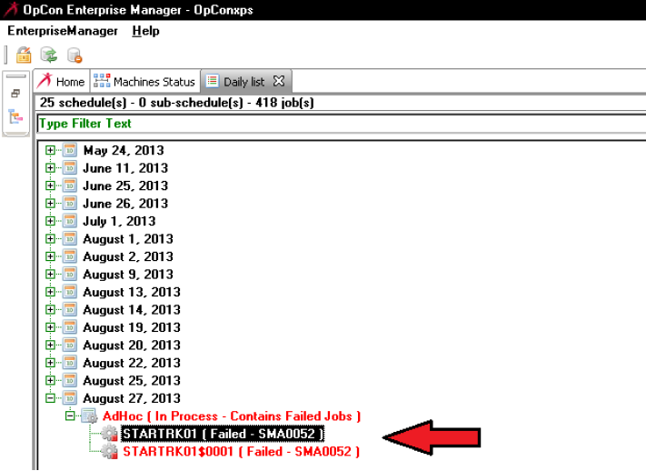
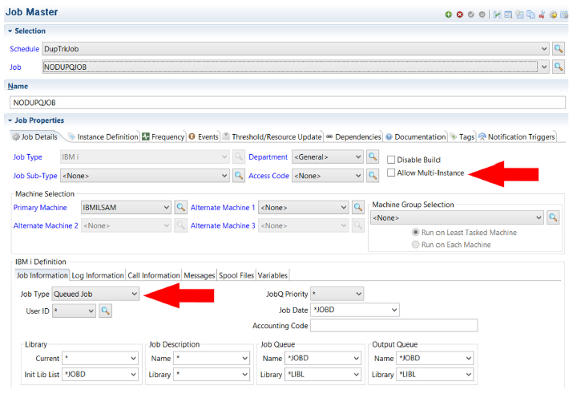

# How LSAM Job Tracking Works

This section of documentation provides important background information and it identifies the processes and tools that may be used in a variety of ways to help adapt OpCon scheduling and event response to various types of jobs that may run under IBM i. It is important to understand  this discussion because the LSAM job tracking feature alters the way IBM i job management behaves. These changes could impact other software that is running under IBM i.

Important fundamental definitions of Job Tracking types are provided in the introduction to this topic. This information is necessary for understanding the application of Job Tracking functions. In addition, the LSAM's Alternate Job Notify service is an LSAM service required for the True Passive type of job tracking. Details about how the Alternate Job Notify service works are provided in IBM i Components and Operation -> Operating the LSAM -> Alternate Job Notify Service.

## Using Dynamic Variables with Job Tracking

Some examples of where dynamic variables may be used are offered in the procedural outlines above. There is more information about dynamic variables in [How Numeric Compression Is Managed for *DB2](../dynamic-variables/function-codes#how-numeric-compression-is-managed-for-db2).

The type-L Dynamic Variable is especially useful with Tracked and Queued Jobs. It L is used exclusively to update the local data area (LDA) contents associated with any IBM i job. This variable type can be used with any batch job submitted by OpCon to IBM i, and also with tracked, queued or captured jobs. Dynamic variables of type L replace data in the LDA based on the starting position and length fields specified in the dynamic variable master record. These two numeric fields apply only to type-L variables and they cannot be used for type-V variables. For dynamic variables of type L, the Variable Name must be either the Captured Job ID of a captured job, or the IBM i Job Name of an OpCon batch job, a tracked job or a queued job.

## IBM i Registered Exit Programs

Job Tracking is supported by using two different IBM i interface techniques:

1. An exit program registered against the SBMJOB command. This technique interrupts the SBMJOB process and the LSAM later performs the actual SBMJOB process, preserving a link to the original submitter. This technique is used for most of the job tracking types. This technique is discussed here.
2. A system-defined exit process linked to one or more subsystems which generates a notification transaction in a user-identified data queue. This technique does not interrupt a job start process, but it also does not provide information about a job until after the job is generated in an IBM i job queue, and the job may already have run and completed by the time OpCon is notified. This technique is required only for the True Passive tracking type. Details about the function and management of the data queue notification technique are provided in Components and Operation under the topic of the Alternate Job Notify server.

The LSAM exerts its control over the IBM i SBMJOB command by registering an exit program with IBM i. Registered exit programs and the available exit points may be viewed using the IBM i command WRKREGINF. There is a set of LSAM programs used by a single registered exit program that support the various LSAM job tracking functions of: Tracking, Queuing and Capture. The LSAM's exit program is registered using the STRJOBTRK command, or the corresponding LSAM menu function on the Job Tracking sub-menu.

:::warning
If any other software has registered an exit program for the SBMJOB command at exit point QIBM_QCA_CHG_COMMAND, this registration must be removed before using the LSAM command STRJOBTRK. Use IBM i command WRKREGINF to check for conflicting exit point entries. Contact SMA Support for answers to questions.
:::

There are some IBM rules restricting the way registered exit programs work. Details about these rules may be found in IBM documentation. One of the most important rules is that there can be only one program registered for use with the SBMJOB command (that is, at the critical exit point required by the LSAM). This means that any  of the IBM i LSAM job tracking features can only be used when the IBM i LSAM's exit program is the one that is registered for the SBMJOB command. Certain job scheduling tools and programs from other software vendors are known to also use this same exit point in the IBM i registry. The tools from these other software vendors must first be used to remove their exit point registration before the LSAM's STRJOBTRK command may be used. Due to the potential complexity of exit program registration, the IBM i LSAM does not offer a tool that can be used to remove and reapply registered exit programs from other software vendors.

If it is necessary to restore the exit program registration for other software in the system, for example, after completing the LSAM's Capture Job function, then the LSAM command ENDJOBTRK or the corresponding LSAM sub-menu function on the Job Tracking menu must first be used to remove the LSAM's exit program registration. Once the
ENDJOBTRK function has completed, third-party software tools may be used to reinstate the exit programs from their software.

If there is a requirement to continue using registered exit programs from other software vendors while the LSAM is operational, it will not be possible to rely on Tracked or Queued jobs. However, the LSAM's Capture Job function may provide a useful alternative to actively intercepting jobs that would normally be initiated by IBM i system users (rather than the OpCon schedule). Once a job has been captured, it becomes possible to create routines or procedures that will allow that job to be requested by users and tracked or controlled by OpCon without having to use either the SBMJOB command or some third-party software.

## Job Tracking and Queuing Versus Capture Job

The LSAM offers a set of tools that are designed to intercept jobs started by the IBM i SBMJOB (submit job) command. After the LSAM configuration for Job Tracking is completed, this service is enabled by the LSAM command STRJOBTRK (start job tracking). The STRJOBTRK command registers an exit program in the IBM i exit program registry, and IBM i gives control to this program whenever the SBMJOB command is used. 

Once the LSAM exit program receives control, it checks the LSAM master files to see if the conditions present when a job is submitted qualify the job to be Tracked, Queued or Captured. In all cases, the process of the SBMJOB command is temporarily interrupted and if the LSAM exit programs discover that a job qualifies for one of the job tracking services, they store the complete definition of the job into the LSAM Job Tracking master files. Then, one of the three following actions is launched:

- Tracking = a request that OpCon should simply monitor the job for its completion status. This makes it possible for other OpCon jobs and events to be dependent upon the tracked job, even though the tracked job is not allowed to depend on any conditions within OpCon. The submitted job is held by the LSAM only long enough to contact OpCon so that the job identifier can be registered in the OpCon Ad Hoc (or other named) schedule, and then the job is almost immediately allowed to execute. OpCon does not impose any changes on the job definition, however, the Tracking feature does allow the OpCon job master record rules for spool file management and job-level message management to be engaged.

- Queuing = a request that OpCon should both control when the job is allowed to execute and also monitor the job for its completion status. A queued job is predefined in the OpCon Ad Hoc (or other named) schedule and it may be dependent upon other jobs, thresholds or properties in order to qualify it for execution. In addition, queuing allows the OpCon job master record rules for spool file management and job-level message management to be engaged. Similarly to tracked jobs, the LSAM holds the job in its job definition master file until it receives a signal from OpCon to release the job, but unlike tracked jobs, this signal could be intentionally delayed by OpCon. Also, the attributes of a queued job may be overridden by the OpCon job master attributes. The LSAM permits a queued job to be manually released by an IBM i operator, in which case the job will not benefit from the OpCon job parameter changes. In this case, the LSAM sends a signal to OpCon that the job controls have been overridden by the operator and the job completion status is still tracked by OpCon.

- Capturing = a request that the LSAM completely intercept a submitted job, not allowing it to execute and not notifying OpCon. Instead, the same LSAM tools used for tracking and queuing are used to store all of the captured job parameters and data in the LSAM master files. When a job is captured, the capturing user is able to specify a unique identifier for the captured job. A captured job is not executed until the RUNCAPJOB command is specified in an OpCon job, where the captured job ID is listed as a parameter of the RUNCAPJOB command.

A captured job is managed differently in the LSAM than tracked or queued jobs in that there are tools that enable a system operator or administrator to change any attributes of the captured job definition, including updating the captured LDA contents. A captured job definition may be executed many times, whereas a tracked or queued job may only be executed once.

Another difference between tracked/queued jobs and captured jobs is their identifier. A tracked or queued job is assigned a unique Tracking Number by the LSAM, and the LSAM uses this number internally to identify the stored job definition. Captured jobs use a unique Captured Job ID value of up to 12 characters that is specified by the capturing user. (When a job is captured in a batch process, the default ID of the captured job is its IBM i Job Name.) The Captured Job ID is specified in the RUNCAPJOB command when the time comes to request execution of a captured job.

The Capture Job technique is a useful way to quickly assemble a complex set of job parameters without having to type them all manually into an OpCon job master record. Capturing is especially appropriate for jobs that rely on local data area content prepared by third-party software, when the intention is that the job should be executed periodically under control of an OpCon schedule.

OpCon does not have a way to directly store and deliver the LDA content of an IBM i job (although the LDA content is passed along by tracked and queued jobs); this is done by the LSAM on behalf of OpCon. Even so, once a captured job definition exists, there are then many ways that OpCon can indirectly control the content of the LDA by means of the LSAM's dynamic variables and its SETDYNVAR command. This is discussed in more detail under the section about dynamic variables.

It is also possible to use the LSAM dynamic variables to modify the attributes of tracked and queued jobs.

## Specifying a User ID for Queued or Captured Jobs

The LSAM's job scheduling server program allows for and supports special values in the Job User field as a job start request is received from OpCon. The general rule for jobs submitted by OpCon is that the user specified in the OpCon job master record (appearing in the User field of an IBM i job master record in the OpCon EM) is that the IBM i job will be submitted to run under the ID and authority of that specified user profile.

However, in the case of queued or captured jobs, it may be preferred that the original IBM i user profile included in the SBMJOB command be preserved. In this case, either all possible queued or captured user IDs must be registered as valid OpCon user IDs for IBM i jobs, or else it will be necessary to register in OpCon a false user ID just for this purpose.

OpCon would permit the registration of a user ID named "\*" (a single asterisk) or named "\*CURRENT." Either of these values appearing in an IBM i job start request will allow the IBM i LSAM job scheduler to honor the original user ID that was captured from the SBMJOB command. To set up these fake user IDs, open the OpCon User Interface and route to: Administration -> Security -> Batch User Privileges. But it is important to remember that once one of these fake user IDs is registered, it's not possible
to delete it. It could only be disabled to the extent that privileges for the user ID are revoked.

If the fake user IDs are registered in OpCon, then they can be used with a Queued or Captured job, making it simpler to honor various user IDs from IBM i that might be authorized to submit one of the AdHoc (or other named schedule) jobs that will be tracked or queued, as well as any given job definition that has been captured by the LSAM for later execution.

## Execution of Tracked and Queued Jobs

This topic discusses the base functions of Tracking and Queuing, without consideration of the variations implemented by the True Passive and Automatic tracking types. But both of those types rely on much of the same logic presented in this section. Passive and Automatic tracking are explained in more detail below.

The LSAM's registered exit program for the SBMJOB command intercepts jobs for tracking or queuing when a job is predefined in the LSAM Job Tracking Parameters master file. When a job qualifies for tracking the LSAM forwards a request to SAM and supporting services (SAM-SS) to track the defined job. The LSAM uses OpCon event commands $JOB:TRACK and $JOB:QUEUED to request that SAM-SS add the jobs to the indicated schedule and then monitor them. Job names that will be monitored must have been pre-configured within the special OpCon schedule called AdHoc, or within a user-defined, Named Schedule using the special rules for tracked or queued jobs (as defined in the instructions above, unless the Automatic type is used).

It is possible that the job tracking or queuing request will be rejected if SAM_SS does not recognize the job name, the schedule name, the schedule date and/or the optional frequency registered in the LSAM Job Tracking Parameters master record. But if the request is accepted, SAM-SS returns a job initiation message (TX1) to the LSAM enabling the job's completion status to be sent to SAM-SS when the job completes. From this point forward, the job can be viewed in Schedule Operations in the User Interface of OpCon. If the request is rejected by SAM-SS, the LSAM records an error code of SMA0014 which can be viewed in the LSAM's Job Tracking Log display.

When the LSAM determines that a job has qualified for job tracking or queuing, it prevents the IBM i SBMJOB command from completing (except for tracking in the True Passive mode) and instead stores all the job parameters in the LSAM job tracking master file until SAM-SS sends a job start transaction (TX1). There is more discussion about what happens to the SBMJOB command under the SBMJOB topic, below. This topic also explains the tools that can be used to monitor and manage jobs using LSAM programs and displays, should it become necessary to manually manage job tracking exceptions.

Jobs of type Tracked are released by an OpCon job start transaction (TX1) transaction without regard for any OpCon job dependencies. The purpose of Tracking is to allow a job to run immediately, while also engaging OpCon job status monitoring. But the reason the IBM i LSAM temporarily holds jobs of type Tracked is to allow the OpCon message management and spool file management tools (unique to IBM i jobs) to be configured for the job before it runs. Although the Tracked job itself is not allowed to depend on other OpCon jobs, it is possible for other jobs to depend on a Tracked job in an OpCon Schedule.

For jobs of type Queued, all the OpCon job dependency rules apply. The LSAM will continue to hold Queued jobs in its own job tracking master file until SAM-SS determines that the job may be released. All of the other job support features in OpCon, such as message management and spool file management, are supported for jobs of type Queued.

:::tip
There is an LSAM job performance parameter that supports an option to have the LSAM release a tracked or queued job in case OpCon returns a Tracked Job Error response (TE1 transaction). This can occur if OpCon has not been configured with sufficient information to recognize the external job. For error code SMA0014, choose to leave the job in the LSAM job tracking master file, or choose to have the LSAM automatically release the job without OpCon tracking. Instead of using the error override to have jobs automatically released, use the WRKTRKJOB command (or LSAM Menu 1, function 2) to manually release them from the LSAM job tracking master file.

**UPDATE**: When Automatic tracking was added in OpCon, SAM became able to add tracked jobs to a schedule even when no job master was configured in advance. This results in fewer TE1 rejections of a $JOB:TRACK event command.
:::

When a tracked or queued job is finally submitted for execution by the LSAM, any associated LDA content is prepared by the LSAM so that it becomes part of the submitted job, just as if the job were being submitted by the originating software or user. The LSAM also preserves the job ID information of the original submitting job and user and applies this information to the SBMFOR parameter of the submitted job. The SBMFOR parameter allows the job to remain associated with the original submitting user and job, as if the job had been submitted directly by that user and job. These are the techniques that allow the LSAM and OpCon to apply the customized job response controls over spool files and messages, while still retaining most of the original attributes and behaviors of jobs that are being tracked or queued.

### Matching LSAM Job Tracking Filters with OpCon Schedule Parameters

There is a critical relationship between two groups of the Parameters assigned to Tracked or Queued jobs within the IBM i LSAM master file  maintenance function (LSAM menu 1, option 1). The two groups are (1) certain IBM i job definition parameters and (2) OpCon schedule parameters. The IBM i LSAM is able to match different  combinations of these two parameter groups so that the same job name could be handled differently at different times.

The Job Name itself is the anchor parameter. Each time IBM i starts a new instance of a job it will use the same job name but it assigns a unique job number to that instance. Each instance of a job may use a different User ID, a different Job Description and/or a different Job Queue, depending on circumstances such as running a test version of a job versus a live production version of that job.

The LSAM's Job Tracking exit program selects the actual instance of a job that will be tracked by using the User ID and the four fields that identify the Job Description and the Job Queue and the libraries where these objects are located in the IBM i DB2 database. For each of these five fields, a specific name may be entered or the field can be set to the special value of *ALL that means any value will be accepted. Jobs whose IBM i definition fields do not match any registered combination of values will be ignored by the LSAM and allowed to start normally. Jobs that do match one of the combinations of values registered in the LSAM's Job Tracking Parameters master file will be selected for processing as a tracked or queued job in whichever OpCon Schedule was registered along with the IBM i job definition parameters.

The second group of Job Tracking Parameters includes these OpCon definition fields: Schedule Name, Schedule Date and Frequency, along with the job name. Whenever the LSAM submits a request for OpCon to Track or Queue a job, OpCon can only accept the request if the Job Name is found on the Schedule that matches all of the schedule definition parameters. Among these, Schedule Name and Job Name must be exact. The Schedule Date field is also critical, but there are certain values for this field that make it adaptable to time-sensitive circumstances. The Frequency field may be left blank so that it is ignored, except that there is a default value that OpCon uses for Frequency in case the combination of Job Name, Schedule Name and Schedule Date result in matching more than one active schedule.

In summary, for a job to be successfully tracked or queued, it must match both the IBM i job definition field values and the OpCon Schedule field values. If a job is selected by the LSAM according to the IBM i job definition values, it will be submitted to OpCon for tracking and queuing. But if the OpCon Schedule values do not result in a match to an active OpCon schedule, then OpCon sends a rejection transaction (TE1) to the LSAM and the LSAM logs an error code of SMA0014 in its Job Tracking Log.

If a job was rejected with error code SMA0014, there are two options for overcoming the rejection by OpCon, but while both options allow the IBM i job to execute, OpCon will not know about the job and will not receive notification about how the job ends. One option is to set the LSAM global error override parameter (LSAM main menu, function 7) to allow an automatic override to error SMA0014, so that the LSAM job scheduling server job releases the job even without OpCon tracking. The other option is for an operator to use the LSAM command WRKTRKJOB (Work with Tracked Jobs), which is the same as LSAM Menu 1, function 2. Job track logs, to find and manually release the job. The LSAM Job Tracking Log will reflect these types of override so that it is obvious that OpCon did not track the job.

When matching the IBM i job definition fields to OpCon Schedule definition fields, it is important to understand that the LSAM will use only the first combination of IBM i job definition fields that match the actual job instance. This means that if OpCon rejects the job tracking or queuing request because the OpCon Schedule definition fields find no match, the LSAM will not return to the Job Tracking Parameters table and try to find another match. Therefore, it is important to understand the following table of LSAM Job Tracking job definition field values. This table shows the combinations of IBM i job definition field values that are possible, in the order that they will be evaluated by the LSAM. The first combination that matches the actual job instance will determine the OpCon Schedule field values to be used.

The last entry in this table shows that the catch-all combination of *ALL for all four IBM i job definition fields is the last one in the list. If there will be only one instance of a Job Name that would ever be tracked or queued, then using \*ALL for all the field values is an easy way to set up Job Tracking. But if it is critical to distinguish among different instances of an IBM i job, then do not create a catch-all Job Tracking Parameters record that uses \*ALL for all four IBM i job definition fields.

:::tip
In older versions of the IBM i LSAM, the \*ALL catch-all record for Job Tracking, if found, was the first form of job tracking qualifier to be selected, if it existed. Now, however, all other combinations of specifically qualified job tracking parameters will be considered first before allowing the catch-all record to be used. Thus, in the past it was not possible to have a catch-all record if it was critical to qualify IBM i jobs by their IBM i definition fields -- the catch-all record had to be deleted if it existed. Now, however, it may be useful to have a catch-all record in case certain specific qualifiers are not matched.
:::

In the following table, the word "name" is used to denote a specific value for an IBM i object name. Notice how the order of evaluation begins with all specific names having the highest priority. The rule that places the \*ALL special value lower in the list than specific names is an alternate collating sequence table that was created for this type of file in the LSAM database. The alternate collating sequence table LSACOLTBL1 specifies that the asterisk (\*) will sort higher than letters of the alphabet.

The column names in the following table have these meanings:

- JOBNAME = the Job Name assigned to the job.

- JOBUSER = the User Profile of the IBM i job.

- JOBDES = the IBM i Job Description (an IBM i object that defines job environments).

- JOBDLI = the IBM i DB2 database library where the Job Description is stored.

- JOBQUE = the IBM i Job Queue, where the job start request is first stored before execution begins.

- JOBQLI = the IBM i DB2 database library where the Job Queue is stored.

#### Order of Evaluation for Name Versus *ALL Field Values
|  JOBNAME |   JOBUSER |  JOBDES | JOBDLI |  JOBQUE | JOBQLI |
|  ------- | --------- | ------- | ------ | --------| ------ |
|  name  |      name  |    name  |   name  |   name |  name |
|  name  |      name  |    name  |   name  |   name |  *ALL |
|  name  |      name  |    name  |   name  |  *ALL |  name |
|  name  |      name  |    name  |   name  |  *ALL |  *ALL |
|  name  |      name  |    name  |  *ALL  |   name |  name |
|  name  |      name  |    name  |  *ALL  |   name |  *ALL |
|  name  |      name  |    name  |  *ALL  |  *ALL |  name |
|  name  |      name  |    name  |  *ALL  |  *ALL |  *ALL |
|  name  |      name  |   *ALL  |   name  |   name |  name |
|  name  |      name  |   *ALL  |   name  |   name |  *ALL |
|  name  |      name  |   *ALL  |   name  |  *ALL |  name |
|  name  |      name  |   *ALL  |   name  |  *ALL |  *ALL |
|  name  |      name  |   *ALL  |  *ALL  |   name |  name |
|  name  |      name  |   *ALL  |  *ALL  |   name |  *ALL |
|  name  |      name  |   *ALL  |  *ALL  |  *ALL |  name |
|  name  |      name  |   *ALL  |  *ALL  |  *ALL |  *ALL |
|  name  |      *ALL |    name  |   name  |   name |  name |
|  name  |      *ALL |    name  |   name  |   name |  *ALL |
|  name  |      *ALL |    name  |   name  |  *ALL |  name |
|  name  |      *ALL |    name  |   name  |  *ALL |  *ALL |
|  name  |      *ALL |    name  |  *ALL  |   name |  name |
|  name  |      *ALL |    name  |  *ALL  |   name |  *ALL |
|  name  |      *ALL |    name  |  *ALL  |  *ALL |  name |
|  name  |      *ALL |    name  |  *ALL  |  *ALL |  *ALL |
|  name  |      *ALL |   *ALL  |   name  |   name |  name |
|  name  |      *ALL |   *ALL  |   name  |   name |  *ALL |
|  name  |      *ALL |   *ALL  |   name  |  *ALL |  name |
|  name  |      *ALL |   *ALL  |   name  |  *ALL |  *ALL |
|  name  |      *ALL |   *ALL  |  *ALL  |   name |  name |
|  name  |      *ALL |   *ALL  |  *ALL  |   name |  *ALL |
|  name  |      *ALL |   *ALL  |  *ALL  |  *ALL |  name |
|  name  |      *ALL |   *ALL  |  *ALL  |  *ALL |  *ALL |
|  *ALL |      name  |    name  |   name  |   name |  name | |
|  *ALL |      name  |    name  |   name  |   name |  *ALL |
|  *ALL |      name  |    name  |   name  |  *ALL |  name |
|  *ALL |      name  |    name  |   name  |  *ALL |  *ALL |
|  *ALL |      name  |    name  |  *ALL  |   name |  name |
|  *ALL |      name  |    name  |  *ALL  |   name |  *ALL |
|  *ALL |      name  |    name  |  *ALL  |  *ALL |  name |
|  *ALL |      name  |    name  |  *ALL  |  *ALL |  *ALL |
|  *ALL |      name  |   *ALL  |   name  |   name |  name |
|  *ALL |      name  |   *ALL  |   name  |   name |  *ALL |
|  *ALL |      name  |   *ALL  |   name  |  *ALL |  name |
|  *ALL |      name  |   *ALL  |   name  |  *ALL |  *ALL |
|  *ALL |      name  |   *ALL  |  *ALL  |   name |  name |
|  *ALL |      name  |   *ALL  |  *ALL  |   name |  *ALL |
|  *ALL |      name  |   *ALL  |  *ALL  |  *ALL |  name |
|  *ALL |      name  |   *ALL  |  *ALL  |  *ALL |  *ALL |
|  *ALL |      *ALL |    name  |   name  |   name |  name |
|  *ALL |      *ALL |    name  |   name  |   name |  *ALL |
|  *ALL |      *ALL |    name  |   name  |  *ALL |  name |
|  *ALL |      *ALL |    name  |   name  |  *ALL |  *ALL |
|  *ALL |      *ALL |    name  |  *ALL  |   name |  name |
|  *ALL |      *ALL |    name  |  *ALL  |   name |  *ALL |
|  *ALL |      *ALL |    name  |  *ALL  |  *ALL |  name |
|  *ALL |      *ALL |    name  |  *ALL  |  *ALL |  *ALL |
|  *ALL |      *ALL |   *ALL  |   name  |   name |  name |
|  *ALL |      *ALL |   *ALL  |   name  |   name |  *ALL |
|  *ALL |      *ALL |   *ALL  |   name  |  *ALL |  name |
|  *ALL |      *ALL |   *ALL  |   name  |  *ALL |  *ALL |
|  *ALL |      *ALL |   *ALL  |  *ALL  |   name |  name |
|  *ALL |      *ALL |   *ALL  |  *ALL  |   name |  *ALL |
|  *ALL |      *ALL |   *ALL  |  *ALL  |  *ALL |  name |
|  *ALL |      *ALL |   *ALL  |  *ALL  |  *ALL |  *ALL |

## Execution of True Passive Job Tracking

True Passive is a form of Job Tracking that does not interrupt the IBM i SBMJOB command in any way. This allows the original submitted job message from IBM i to be returned directly to the user or batch job that executed the SBMJOB command. Since the IBM i job is already being at least queued, if not started or even completed, by the time the LSAM sends the $JOB:TRACK event command to OpCon, this means that the Queued form of job tracking cannot support passive job tracking. However, a passively tracked job can still be automatically added to an OpCon schedule if other requirements for automatic job tracking are met.

The IBM i LSAM requires that the Alternate Job Notify service be active to support the True Passive type of job tracking. The Alternate Job Notify service method allows the IBM i SBMJOB command process to complete normally instead of intercepting the job start request and regenerating it later. This technique allows the IBM i job submitted message to be returned directly to the submitting job, and that is the critical reason why the True Passive tracking type must be used with some software applications.

To use the True Passive tracking type, the "Alternate Job Notify" server must be configured either for full operation, or for the limited option "T" = Tracked jobs only. In the T mode, the Job Notify server jobs will generate OpCon job start and completion signals only for jobs that are marked for Passive job tracking.

The Job Notify service is actually comprised of two different IBM i LSAM server jobs. The LSAM server job named JOBNFY4 handles a message type that IBM i generates whenever a job enters a job queue attached to a subsystem which has been configured for job notify services. The other JOBNFY server job handles the Job End messages. Both of the server jobs receive transaction records from user-specified data queues that are configured using the tools and procedures described in Components and Operation under the "Alternate Job Notify Service" section. The transaction records are generated by the IBM i system after the LSAM configuration programs have registered the user-named data queue(s) with one or more IBM i subsystems. Following the registration process, the  designated IBM i subsystems must be stopped and restarted before the new IBM i-controlled subsystem process exit routines will become active. The same is true if it is necessary to deactivate the registration of a subsystem - it must be stopped and restarted after the LSAM Alternate Job Notify configuration steps to remove a subsystem are performed. 

When an IBM i job is placed into a job queue attached to an activated IBM i subsystem, the JOBNFY4 job reads the user-named data queue(s) to receive the job queue entry transactions. These transactions provide the job start data that the LSAM needs to create new LSAM Job Tracking master log file entries. The job tracking master log file is typically created, initially, by the LSAM exit program for the SBMJOB command. But when the LSAM job tracking parameters master file indicates that passive tracking should be used, the actual IBM i full job ID is not known and recorded until after that job has entered the job queue of an IBM i subsystem that is registered for generating job queue entry transactions. Just after the job enters a job queue, the system notification message is able to provide this critical detail about the job being tracked, and that enables the Job Notify LSAM server job to send the $JOB:TRACK event to OpCon. OpCon responds to the event command by sending back its TX1 job start transaction. Then the IBM i job ID from the LSAM Job Tracking master log can be combined with the OpCon job ID information to compose a complete LSAM job master record. This combination of information from both systems enables the full operation of OpCon automation.

As a passively tracked IBM i job ends, the Job End message processing of the JOBNFY server is critical for Passive Job Tracking. This is because the LSAM job start services were not used to initiate the IBM i job, and therefore IBM i will not usually send the job completion message to the message queue that the LSAM is monitoring. Instead, the Job Notify service generates an IBM i Job End message and sends it to the LSAM message queue. This enables the LSAM to send the final job completion status to OpCon.

In summary, passively tracked jobs cannot take advantage of any of the OpCon job master options that control when a job may start, and they also cannot benefit from the OpCon job master message management or spool file processing. But the LSAM Message Management feature can still be used for any messages from a passively tracked job, and spool file management can be handled by the LSAM's SCANOUTQ command. Also, job completion processing by OpCon is fully supported. This means that subsequent jobs can be made dependent upon passively tracked jobs (as long as those jobs were not also using automatic job tracking), and OpCon features such as LSAM feedback and job status triggers can still be used.

## Execution of Automatic Job Tracking

Automatic job tracking is defined as adding jobs to an OpCon daily schedule without requiring that a job master record be configured in the OpCon server database. Even though having no OpCon job master greatly limits the ways OpCon can manage this type of job, it is still possible for the job completion status to be displayed by the User Interface or by Web access to OpCon.

Within the IBM i LSAM, automatic job tracking can also greatly reduce the amount of work required for the LSAM to recognize which jobs should be sent to OpCon for tracking. There is a control field value in the LSAM Job Tracking configuration (LSAM sub-menu 1, option 7) used to turn this capability on or off for the whole LSAM environment. There are also values on the Job Tracking Parameters records that can be used to either request or prevent automatic job tracking of any jobs that are submitted by a registered primary job.

The goal of automatic job tracking is to make it possible for OpCon to monitor one or more sub-jobs submitted by a primary job, without requiring that either OpCon or the IBM i LSAM databases be configured to track each sub-job that may occur. Only the primary job has to be recognized, at least by the IBM i LSAM, in order to get it registered on an OpCon schedule. (The primary job can itself be automatically tracked by OpCon, but the LSAM must have been told to intercept that job and send a $JOB:TRACK event to OpCon in order to get that job registered under some OpCon schedule.)

Automatic job tracking determines which OpCon schedule will show the job using various methods. All sub-jobs that were submitted by a primary job (or by its sub-jobs) will be assigned to the same OpCon schedule as the primary job. Primary jobs could be any job that OpCon started, and when OpCon starts the job, then the OpCon schedule name is recorded in the LSAM as part of that job's profile. But when the LSAM uses Job Tracking to notify OpCon about a primary job, the it is the LSAM Job Tracking Parameters record that determines which OpCon schedule shows both that job and any sub-jobs it submits. The primary job's schedule can be named in the LSAM Job Tracking Parameters record, or if that field is not updated specifically by the user, then the default OpCon schedule will be the automatically created (as necessary) "AdHoc" schedule.

:::tip
This LSAM feature requires a corresponding enhancement to the OpCon SAM central server program that was generally released with OpCon 15.1 and newer versions. An on-demand enhancement is available as a program replacement for OpCon version 5.20 SP1 and for OpCon 15. Although the IBM i LSAM software may show this option, the LSAM can still be used with older versions of OpCon, but in that case the Automatic Job Tracking feature will not be supported. Attempting to track a job that is not pre-configured in older versions of OpCon will result in the job tracking request being rejected with the IBM i LSAM error code SMA0014. Refer to the IBM i LSAM Configuration topic, "Extended Discussion of Parameter" section, for instructions about an override that is available for error code SMA0014.
:::

### Positive Versus Negative Automatic Job Tracking

Two different methods are available for controlling which jobs in the IBM i system will be automatically tracked by OpCon. These methods define the decision performed by the LSAM Job Tracking programs (either the registered exit program for the SBMJOB command, or the Alternate Job Notify job queue transaction processing program).

More detail about the interaction of the LSAM Job Tracking Configuration control, and the values on individual Job Tracking Parameters is provided next, but here is a summary of the basic rule:

- **Positive** control says that only jobs submitted by LSAM-registered jobs will be submitted for automatic tracking. An LSAM Job Tracking Parameter record must be registered for the primary job in order to automatically track any of its sub-jobs that it may submit. This method may be considered the most restrictive rule for Automatic Job Tracking: There must be a positive request to perform automatic sub-job tracking.
- **Negative** control says that sub-jobs from any primary job that OpCon started, or that OpCon is tracking, are eligible for automatic tracking, unless the primary job is specifically prevented by the LSAM. This method may be considered the most open or permissive rule for Automatic Job Tracking.

### Positive Automatic Job Tracking

The Positive method of Automatic Job Tracking is established for the whole LSAM environment (considered to control the whole of a single IBM i partition or machine) by the value of "1" = Positive for the field "Allow automatic tracking" in the LSAM Job Tracking Configuration (option 7 on LSAM sub-menu 1).

The positive method requires that the primary job be registered in the LSAM Job Tracking Parameters master file. However, pre-configuration work is still saved because the sub-jobs started by each primary job do not have to be registered.

Regardless of the job tracking Type code in the LSAM Job Tracking Parameter record, the field "Aut-track sub-jobs" for the registered primary job must be set to a value of "A" = Allow in order for the sub-jobs to be automatically tracked.

If any of the sub-jobs are registered in the LSAM Job Tracking Parameters master file, it is possible to suppress automatic tracking on a job-by-job basis by setting the "Aut-track sub-jobs" field to a value of "P" = Prevent. In this case, the sub-job itself will not be tracked, and also any sub-sub-jobs that it may submit will not be automatically tracked. This method of using prevention when the LSAM is configured for the Positive mode could be used to suppress automatic tracking of a "branch" in the overall "tree" of the primary job's complete work flow chart.

Also, when a sub-job is registered in the LSAM Job Tracking Parameters master file, the Type code assigned to the Parameters record must be considered according to the rules summarized below. Use a Type code of "A" = Automatic Tracking, in order to register a sub-job that should simply be prevented from automatic tracking.

### Negative Automatic Job Tracking

The Negative method of Automatic Job Tracking is established for the whole LSAM environment (considered to control the whole of a single IBM i partition or machine) by the value of "2" = Negative for the field "Allow automatic tracking" in the LSAM Job Tracking Configuration (option 7 on LSAM sub-menu 1).

The negative method requires only that the primary job must have been started by OpCon, or that OpCon is already tracking the submitting job that started a given sub-job. In those cases, no other configuration of the LSAM or of OpCon is required. So the term "negative" means that registration in the LSAM Job Tracking Parameters master files is only needed for the purpose of preventing sub-jobs of the registered primary job from being automatically tracked.

Set the Job Tracking Parameters master file field "Aut-track sub-jobs" to a value of "P" = Prevent, to prevent automatic tracking of sub-jobs from the registered job name.

This prevention control also works to stop automatic tracking of an individual sub-job, if the sub-job name is registered in the LSAM Job Tracking Parameters master file. In that case, any sub-sub-jobs that are started by the registered sub-job name will also be prevented from automatic tracking.

Any job names that are registered in the LSAM Job Tracking Parameters master file will be handled according to the Type code of the Parameters record. More information about the Type codes is offered below. Regardless of the Type code, a value of "P" in the "Aut-track sub-jobs" field will prevent sub-jobs submitted by this registered job from being automatically tracked.

To register a primary job name (or a sub-job name) that should not be governed by its Type code, specify a Type value of "A" = Control Auto-track only. This type code does not cause the LSAM to initiate any job tracking activity, so it is appropriate for registering Parameter records that exist only for the purpose of suppressing automatic job tracking of sub-jobs when OpCon started the primary job.

### LSAM Job Tracking Parameters Type Code

The Type code for a job that is registered in the LSAM Job Tracking Parameters master file will govern how job tracking is initiated by the LSAM, as follows. Note that Type Q is incompatible with un-configured automatic tracking strategies.

- **Type T** = Job Tracking: May be used when OpCon has a pre-configured job master record. But the OpCon response to the $JOB:TRACK external event command will depend on whether the job was pre-configured in the OpCon job master file. Having an OpCon job master record enables more OpCon automation support, but OpCon will perform automatic tracking for the $JOB:TRACK event if there is no OpCon job master.

- **Type Q** = Job Queuing: May only be used if the job was pre-configured in the OpCon job master file. This type code causes the LSAM to generate a $JOB:QUEUE event command, and that command will be rejected by OpCon if a job master record does not exist. Therefore, type Q must be used with care when the job is part of an automatic job tracking strategy.

- **Type P** = True Passive Job Tracking: May be used with automatic job tracking in order to prevent the LSAM from interrupting the SBMJOB command process. In this case, the LSAM will use its Alternate Job Notify method to retrieve the IBM i job information and job status. Passive job tracking is otherwise handle the same as the Tracked Job Type (T), including that the LSAM will support OpCon automatic tracking if there was no pre-configured OpCon job master record.

- **Type A** = Automatic Tracking: Is used to register a primary job or sub-job for the purpose of providing the "Aut-track sub-jobs" code to the LSAM Job Tracking routines. The "automatic track sub jobs" flag can be used to select (value "A") or prevent (value "P") automatic tracking of individual jobs or sub-groups of jobs. A job that is not otherwise selected for automatic tracking will be sent to OpCon for automatic tracking if the Type code is "A" and the Aut-track sub-jobs code is also "A". An A-A Job Tracking Parameters record works the same in the LSAM as a Type T record, in that the LSAM will intercept an independently submitted job, no matter who started this job. The LSAM will send a $JOB:TRACK event to OpCon, and OpCon will add it to the named schedule. The OpCon response to that external event command will depend on whether the job was pre-configured in an OpCon job master record, or not. When there is no matching job master record for the job in the named OpCon schedule, that is when "automatic" tracking occurs, because OpCon will add a daily (only) job record to the OpCon database.

### Rapid Implementation of OpCon Tracking

Automatic job tracking is especially useful when there are, for example, dozens or hundreds of sub-jobs, and the task of configuring for each job would be too big to manage. However, SMA recommends that for small volumes of sub-jobs, it is better to pre-configure job master records in OpCon (and set up corresponding job tracking records in the LSAM) because there are many useful OpCon features that cannot be used with simple automatic tracking, since these jobs are registered only in the OpCon daily schedule and job files and not in the OpCon master schedule and job files.

### Automated Analysis of Complex Job Trees

Another useful application of this limited feature is to use OpCon to automatically analyze and document all the sub-jobs that are submitted in the IBM i system by a primary job that was started directly (or tracked) by OpCon. When the OpCon daily job status display shows all the sub-jobs that were automatically detected, this information could be used to guide permanent configuration of job master records in OpCon, so that all of the OpCon automation features could be applied to the sub-jobs in the future. If required, the IBM i LSAM Job Tracking log inquiry function, and/or the IBM i LSAM job status master record log file viewer (LSAM sub-menu 6, option 5, log viewer 5) could be used to discover the submitting job for each sub-job, since there could be a complex tree of many jobs submitting other jobs, below the primary job in the work flow.

## Execution of Captured Jobs

In order to use the Capture Job tool, the LSAM Job Tracking feature must be started. Any form of job interception requires that the LSAM's exit programs be registered with IBM i for the SBMJOB command. But job capturing differs from tracking and queuing in that the capture action will only be performed for a job or workstation that is temporarily registered to use the capture function, using the STRCAPJOB function (also found in the LSAM menus).

Use the LSAM's STRCAPJOB command or the corresponding menu function in the LSAM's Job Tracking sub-menu to add or remove job or workstation names from a temporary list of jobs that will be enabled to perform the capture function. A job or workstation that has been registered to capture jobs will have every SBMJOB command intercepted and every job that is intercepted will be stored by the LSAM as a captured job profile. If the intention is to capture only one job, then the capturing job or workstation must be immediately unregistered using the ENDCAPJOB function (also found in the LSAM menus).

When a job is captured, it is not allowed to run. Captured jobs can also not become tracked or queued jobs. All that happens to a captured job is that its full  definition is stored in the LSAM master files, including any local data area (LDA) content. During the capture process, an identifier is assigned to the captured job. If an interactive user is capturing a job, that user is allowed to update the proposed captured job ID using up to 12 characters. (Using 12 characters allows more than one variation of a single job name to be captured with different attributes.) If a job is captured by a registered batch job, the default ID for the captured job will be its job name (up to 10 characters). After the capture action is completed, it is possible to make changes to any attribute of the job or to the LDA content using LSAM manual maintenance tools. This form of change to capture jobs would be performed before the job is scheduled to be executed one or more times from an OpCon schedule using the RUNCAPJOB command.

Different from tracking and queuing, the LSAM capture routines do not communicate at all with OpCon during the capture process. This means it is possible to capture jobs even while the LSAM is off line from OpCon.

Captured jobs can only be executed from an OpCon schedule. In the OpCon User Interface, an IBM i job master record is created setting the job sub-type to batch job. The Call command line must specify the command RUNCAPJOB, and the command parameter CAPJOBID(job_id) is used to specify the captured job ID.

The attributes of a captured job can be defined and modified in various ways. It is possible to modify the actual SBMJOB command parameter values, the job's command line or even the LDA content associated with the job. The priority of attributes definitions is:

1. The original job attributes are captured by the LSAM.
2. An authorized LSAM operator or administrator can use the WRKCAPJOB command to permanently modify any job attribute.
3. The somewhat limited set of OpCon IBM i job master record parameters can be used to override the stored values of the captured job.
4. LSAM Dynamic Variables can be predefined so that a job's attributes can be automatically modified just before the LSAM actually submits the job, usually depending on circumstances that are present at the moment the job will execute.
    - The LSAM's SETDYNVAR command can be used in a predecessor job in the OpCon schedule, or as a pre-run command on the RUNCAPJOB job. In this case, it becomes possible to apply OpCon variables to the SETDYNVAR command line, so that OpCon properties can be communicated to the LSAM for use in redefining a job's parameters.
    - Other types of Dynamic Variables defined in the LSAM master file can be used to retrieve and apply IBM i environmental values to almost any aspect of the captured job.

As a captured job is submitted for execution, any associated LDA content is prepared by the LSAM so that it becomes part of the submitted job, just as if the job were being submitted by the originating software or user. The LSAM also preserves the job ID information of the original submitting job and user and applies this information to the SBMFOR parameter of the submitted job. The SBMFOR parameter allows the job to remain associated with the original submitting user and job, as if the job had been submitted directly by that user and job.

## SBMJOB Messages from Tracked Jobs

When starting job tracking from the LSAM menu, the LSAM software registers exit programs with IBM i. These exit programs are called every time the IBM i SBMJOB command is used. They use the LSAM job tracking parameters file to check if each job qualifies for job tracking or job queuing.

When a job qualifies for job tracking or queuing, a message is sent by the LSAM to OpCon, but the job is not allowed to run. Instead, all the job information is extracted and stored in the LSAM job tracking master file TRKJOBF00. The LSAM holds the job until either OpCon sends it a signal to release the job, or an operator uses the WRKTRKJOB display (or LSAM Menu 1, function 2) to manually release or cancel the job. It is possible to release or cancel tracked jobs before OpCon has automatically released them (in which case the job will not benefit from OpCon services) or when OpCon has rejected the request to track a job (as when the LSAM has been configured to track a job, but the OpCon AdHoc (or other named) schedule does not have the same job name configured).

Whenever a job has been recognized by the LSAM as qualifying for job tracking or queuing, after entering the SBMJOB command there will be messages like the ones in the following example, shown after the example of a typed "sbmjob" command. These messages appear instead of the IBM i standard job submitted message (CPF1221).

**Example**:
```
sbmjob cmd(dsplibl *print) job(QUETEST01)

SMAPGM/SMASBMJOB CMD(DSPLIBL OUTPUT(*PRINT)) JOB(QUETEST01)

OpCon tracking job name(QUETEST01), number(000147): see WRKTRKJOB
```

The job number listed in the example message above (SMA0806) is the LSAM Job Tracking number, not the IBM i job number. An IBM i job number will not be assigned to the job until it is actually released from LSAM tracking. The message suggests using the command WRKTRKJOB to view and manage LSAM tracked jobs, since the IBM i WRKJOB command will not show the job until it is released from the LSAM job tracking master file. The qualified command name SMAGPL/WRKTRKJOB can be used from outside of the LSAM menu system, since this command relies on its PRDLIB attribute to automatically access the LSAM environment.

Note that the WRKTRKJOB command does not apply to captured jobs. Captured jobs are managed by other LSAM commands identified in another section of this topic.

However, when a job is submitted by another job or a workstation that has been temporarily registered to perform the Capture Job function, every submitted job will be intercepted and not allowed to run. Instead, a special LSAM prompt window appears requesting verification or update of the suggested captured job ID, and after that step a completion message appears on the IBM i command line to explain that the job was captured and not allowed to run. This behavior is obviously different from tracked or queued jobs.

**Captured Job ID Window**:
```

                              TRKJOBW0
                                                             
   The named job has been captured by the SMA LSAM and will not be
     submitted. Type any changes to the captured job ID used to label  
     this job information and press Enter to complete the capture.

        Captured job ID: TESTCAPJOB  

ENTER=Continue   F3/F12=Abort   F14=Skip capture: run or track
```

After the Captured Job ID window is accepted by pressing the <**Enter**> key, the command entry line may appear as in the following example, with a message (ID: SMA0214) indicating the capture action was completed. The completion message confirms that the Captured Job ID was accepted and can now be found in the LSAM Captured Jobs list. Depending on the type of command entry line used, the job capture completion message may appear at the bottom of the display screen. Jobs that are captured during a batch job may show the completion message in the job log report.

**Example**:
```
sbmjob cmd(dsplibl *print) job(TESTCAPJOB)

SMAPGM/SMASBMJOB CMD(DSPLIBL OUTPUT(*PRINT)) JOB(TESTCAPJOB)

Job TESTCAPJOB definition captured by SMA IBM i LSAM with ID:
TESTCAPJOB
```

If <**F3**> or <**F12**> is pressed from the capture job window, no action will follow: the job will not be submitted or captured. The command entry line will show the following cancellation message (ID: SMA0213):
```
Capture aborted, job not captured and not executed.
```

If **F14=Skip capture** is pressed, the job will not be captured but instead allowed to be submitted normally. In this case, the usual IBM i submitted job message will be displayed, as in the following example:
```
Job 021543/USERNAME/TESTCAPJOB submitted to job queue QBATCH in library QGPL.
```

## SBMJOB Parameter Constraints

The LSAM job tracking and capture job programs and files support all of the job definition parameters available in the IBM i SBMJOB command, except for the parameters listed in the following table.

:::tip
There is an undocumented method for including any of these constrained job parameters in the Call command line of an OpCon batch job for IBM i. Contact SMA Support for assistance if any of these parameters is required in a job definition.
:::

:::tip
The job date applied under IBM i for Tracked, Queued or Captured job has special rules. Tracked jobs will always use the DATE parameter of the original IBM i SBMJOB command. Queued or Captured jobs will be controlled by the OpCon User Interface Job Date field, but the special value of *SYSVAL will tell the LSAM to use the original DATE field.
:::

### SBMJOB Command Parameter Constraints

| Parameter | Description               | Constraint definition     |
| --------- | ---------------           | -----------------------   |
| RQSDTA    | Request data                 | Not supported. Always use the CMD parameter instead.                  |
| SCDDATE   | Schedule date                | Not supported -- job scheduling is controlled by OpCon.                 |
| SCDTIME   | Schedule time                | Not supported -- job scheduling is controlled by OpCon.                 |
| SYSLIBL   | System library list override | Not supported. Relies on the system value for the system library list.      |
| CPYENVVAR | Copy environment variables   | Not currently  supported.            |
|           |                           | (Please contact the SMA Technical Product Manager for the IBM i LSAM if there are jobs that require passing of environment variables.) |
| JOBMSGQMX | Maximum size of the job message queue   | Not supported -- relies on the setting of the system value. |
| JOBMSGQFL | Job message queue full action | Not supported -- relies on the setting of the system value.      |
| INLASPGRP | Initial auxiliary storage group | Only the value \*CURRENT is not supported. If specified, it will be replaced by the value \*JOBD, meaning that the value of this parameter will be obtained from the job description used for the job.                  |
| LOGOUTPUT | Job log output            | For OpCon scheduled jobs, this parameter is always forced to \*JOBEND in order to conform with the LSAM server support for the OpCon JORS (job output retrieval) feature -- where a job log may be retrieved and viewed from the OpCon Schedule display.                  |

## Local Data Area (LDA) Support

Every IBM i job is supported by a system-defined local data area (LDA) of 1024 bytes that resides in the job's temporary library (QTEMP). This LDA is deleted from the system when a job ends, as the QTEMP library is deleted. A job's LDA is not accessible from another job, except when the IBM i SBMJOB command passes the content of the submitting job's LDA to the submitted job.

As described above, most of the LSAM job tracking, queuing and capture functions are supported by an exit program that is called whenever the SBMJOB command from the operating system's QSYS library is used, as long as the LSAM's general job tracking function is active. When the exit program executes it is part of the job that is submitting another job. Therefore, the exit program has access to the submitting job's LDA. The LSAM exit programs store the LDA content in an LSAM database file, keyed by the LSAM's job tracking number or by the captured job's unique Capture ID. The stored LDA content becomes available for maintenance until the intercepted job is executed. The LSAM job scheduling server program, or the LSAM utilities that allow a queued job to be released manually, both retrieve the LDA content from the database file and set the LDA of the submitting job just before the LSAM's own SBMJOB (or SBMJOB2) command is executed.

There are two ways to maintain the captured LDA content. LSAM Dynamic Variables may be used for all forms of intercepted jobs: tracked, queued or captured. For more information about Dynamic Variables, refer to [Dynamic Variables](../dynamic-variables/overview). The LSAM menu system also provides access to a function for manually maintaining stored LDA content, but this function is available only for captured jobs.

## Job Scheduling Messages for Tracked Jobs

The OpCon Schedule display may show message codes next to a job that provide more information about the job status that OpCon is reporting. For example, jobs that complete normally under IBM i show message code SMA0036. (The LSAM Messages are documented in both the **IBM i LSAM** documentation and the **Concepts** documentation.) The following messages may be reported by IBM i machines to identify exceptions that are unique to tracked jobs.

### SMA0045

This message is highly unlikely to occur. It would normally only be displayed in developer testing environments under unusual circumstances.
Message . . . . : IBM i LSAM cannot find the Job Tracking record for a Tracked or Queued job.

When OpCon sends a TX1 (start job) transaction identified as job type Tracked or Queued, the LSAM must have a job definition record stored in the Job Tracking job definition master file (TRKJOBF00). This message is sent when a record cannot be found for the Job Tracking Number that was returned in field code 0004 (private data) of the TX1 transaction. This error should not occur under normal circumstances. It could be caused by corrupted data communications or a programming error.

### SMA0052

This message could appear if the LSAM started tracking a job, but the job was manually released from LSAM Job Tracking while OpCon was not communicating with the LSAM. After OpCon communications is restored, the Tracked or Queued job information would be sent to OpCon for processing and then OpCon would attempt to release the job. This error response helps prevent duplicate jobs from running.

Message . . . . : Tracked Job status does not permit release of job.
Jobs in the LSAM Job Tracking file, TRKJOBF00, can only be released if they do
not have a status suggesting they have already been processed by the LSAM or
by OpCon. For the LSAM WRKTRKJOB command display, the only job status
codes that permit manually releasing a job are E = error from OpCon, and
T = LSAM Tracking (but OpCon has not responded). If OpCon shows
this message ID for a failed job, it is because the job was already
released, usually manually while OpCon was down.

When failed job status code SMA0052 appears, it is a signal that manual job control actions will be required from the operator to properly resolve the job's status under OpCon and to assure that any required jobs have completed normally under IBM i. An illustration of this job status follows.

Example of SMA0052 Error Message for AdHoc Job

{.flat}

The reason the LSAM reports back to OpCon that there is an error, rather than reporting that the job has completed normally, is because the LSAM does not continue to track a job once it has been manually released. Therefore, the operator must manually inspect the job results to assure normal completion. Similarly, the operator will have to manually adjust the OpCon job status (for example, forcing the job status to normal completion) after inspecting the job's results. In summary, once an operator chooses a manual process for releasing jobs, the automated processes will no longer attempt to control a job but will only attempt to prevent job duplication. Thus, if circumstances trigger this message SMA0052, it is a signal that further manual control will be required to fully recover from the situation that forced a manual job release in the first place.

## Preventing Duplicate Queued Jobs

When the IBM i system may start more than one job of the same name that would qualify for Job Queuing on an OpCon schedule, it is possible to use the "Allow Multi-Instance" box on the OpCon Job Master record to either prevent or allow duplicate jobs to run at the same time. If multiple jobs are expected, then it is probably desirable to track them all on the OpCon schedule. However, if, for example, a human operator accidentally starts a second instance of a job, then it may be preferred to prevent duplicate jobs from running.

:::tip
Depending on the version of the OpCon that is being used, it may be necessary to request a patch to the SAM module for older versions of OpCon, in order to implement the logic that applies the "Allow Multi-Instance" box to the control of Queued Jobs.
:::

When duplicate jobs are allowed to run at the same time, the OpCon schedule will show the jobs with the first job having only the original job name, while any duplicate jobs will be assigned a name that includes the original job name text plus a $ sign and a sequence number. For example:

- QJOBNAME
- QJOBNAME$0001
- QJOBNAME$0002

Remember, though, that if the same job is started after all the previous duplicate jobs have ended, then the new job will simply replace the original job name in the same schedule. The numbered secondary jobs would only be reactivated (replaced in the daily schedule, showing active) if more duplicate job requests would follow the isolated new instance of the same job name.

### Rules for Preventing Duplicate Queued Jobs

The following constraints and configuration requirements define how OpCon and supporting LSAMs can control duplicate Queued Jobs.

1. The $JOB:TRACK event is not supported. The concept of Tracking implies that a job on the host system is already running (or, it will always be allowed to run by the IBM i LSAM with no constraints). The only purpose of the $JOB:TRACK event is to enable OpCon to become aware of, and optionally respond to the completion of a job that was started outside of the control of OpCon. Tracked jobs cannot be conditioned by any OpCon dependencies or other constraints, therefore the flag to Allow  Multi-Instance will also have no effect on Tracked jobs.
2. The $JOB:QUEUE event is supported by the job master record flag to Allow Multi-Instance. If this flag is checked, then duplicate, concurrent jobs will be allowed. If the flag is not checked (which is the default setting for a new job), then the $JOB:QUEUE event will be rejected if:
    a.  The job has the same name as a currently active job.
    b.  The job is designated for the same schedule as a currently active job.
    c.  The original job is still active. (*Refer to the discussion below for more details about the term "active."*) Once the original job finishes, with either status of successful or failed, the job is allowed to be replaced by a new $JOB:QUEUE event.
    d.  The new job start request designates the same run day as the currently active job. This constraint implies that if the same schedule has already been built for the next day, it will be possible to run the Queued Job for the next day's schedule. But if a $JOB:QUEUE event specifies the date of the currently active job, then the request will be considered a duplicate and be rejected. It becomes critical to control the Date parameter of the $JOB:QUEUE event if a schedule from yesterday is still active after OpCon processing moves into the new day.
3. Queued Jobs that fail the requirements for duplicate Queued Job prevention will be rejected and show in the IBM i LSAM an error code of SMA0014. (Technical support personnel may need to know that the rejection of the job is communicated from OpCon using the existing TE1 transaction type that includes a short description of "Duplicate Job". This transaction type and short description are translated by the LSAM to report the SMA0014 error in the LSAM Job Tracking logs.)
4. The flag to "Allow Multi-Instance" is implemented only on the OpCon job master record, and not in the Daily job table. The flag is designed to control the schedule and job build process, therefore, it has no meaning for jobs that are already built.
5. Remember that the IBM i LSAM makes it possible for jobs that have the same name to either allow duplicates or prevent duplicates, as long as those jobs have some other unique attribute that is supported by the IBM i LSAM Job Tracking Parameters records. That is, if the job was started by a different User, or by using a different Job Description or Job Description Library, or if the job was designated to run in a different Job Queue or Job Queue Library, then each distinct job could be associated with a different OpCon Schedule. This implies that a job of the same name could be built in two different OpCon schedules, where one job master record allows duplicate Queued Jobs, whereas the other OpCon schedule's job master record would prevent duplicate jobs. This makes it possible to have different controls for test and production environments.

### Definition of an "Active" Job

This information is intended for Technical Support personnel. It refers to information that is only visible to IBM i system operators who have authority to use the IBM i LSAM log viewer that shows the OpCon communications trace log records. It is not usually required to understand this topic in order to configure OpCon and the LSAM to manage Queued Jobs. But if a behavior of a Queued Job does not appear as expected, then it might be necessary to understand this background information.

Tracked and Queued jobs are supported in a unique way by a block of data that is provided by the LSAM once a job has been defined in the host system where it will run (or is already running). This block of data is labeled "PDATA", referring to "Process identification DATA." For IBM i jobs, the PDATA includes the IBM i Job ID information, along with the LSAM's additional Job Tracking Sequence Number. The PDATA is provided to OpCon after the LSAM intercepts a job and sends one of the $JOB event commands to OpCon.

The presence or absence of PDATA figures into the formula for multi-instance control of Queued jobs. For the purpose of this document, a reference to an "active" job is a reference to a job that has PDATA assigned to it already, and/or a reference to a job that has actually started running. When the job has not actually started running on the host system, it will not yet show as a truly active job in the OpCon schedule at first.

The time when a job is considered active also depends on how the job master record was configured. There are various schemes for defining job master records in OpCon that can be used as Tracked or Queued jobs. Job master records can be marked "do not build" in which case they will not appear on a schedule until a $JOB:QUEUE (or $JOB:TRACK and some others) event command is received. But if a job master record is allowed to be built on the schedule by OpCon using methods that cause the job
qualification process to effectively wait for a $JOB:QUEUE event from the host, then the job would at first not have any PDATA associated with it.

The control over duplicate Queued jobs considers both the PDATA and the actual running status of a job as follows:

- **Not Active**: If a job is built on a daily schedule, and the job is not yet running, and the job does not have PDATA, then it is like having a finished job on the schedule, in that a $JOB:QUEUE event will be accepted and have the effect of rebuilding the Daily job from the job master.
- **Active**: If a job is on the daily schedule with PDATA, whether it is running yet or not, and the job has not reached a finished status, then the Allow Multi-Instance flag will control whether a $JOB:QUEUE event is either rejected or causes a new instance of the job to be added to the schedule.
- **Active**: If a job on the daily schedule was started by OpCon before receiving PDATA, then it is considered active from the time that OpCon generated the job start transaction. In this case, if a $JOB:QUEUE event arrives, it will either be rejected if multi-instance is not allowed, or it will cause a second instance of the job to be added to the schedule (with PDATA) if multi-instance is allowed. In this case, the IBM i host will have received the job start request for the original job and that will result in PDATA being sent back to OpCon as the job is submitted to run. This action becomes separate from the activity in the host that generated the $JOB:QUEUE event.

If questions arise related to the management of Queued Jobs, pleasecontact SMA Support for assistance.

### Configuration to Prevent Duplicate Queued Jobs

The IBM i LSAM cooperates with OpCon to track jobs started outside of OpCon control, using either the Tracked Job or Queued Job method. Prevention of duplicate jobs applies only to the Queued Job method. The Queued Job method always requires some pre-configuration in both the IBM i LSAM master files and in the OpCon job master record of some schedule.

#### IBM i LSAM Job Tracking Parameters

According to the rules and constraints above, a IBM i Job Tracking Parameters master record must be configured for a Tracked Type of "Q" = queued. The Tracked Type of "T" = tracked cannot be controlled and duplicate Tracked jobs will always be allowed.

If users wish to implement duplicate job restrictions on an existing OpCon job that was originally configured with the IBM i sub-type of "Tracked Job," it's possible to change the job master to "Queued Job." However, this would also require changing the corresponding IBM i LSAM Job Tracking Parameters record to a value of "Q" instead of "T". At the same time, the OpCon job master record must be carefully examined when any job is changed from Tracked to Queued, since the Queued Job sub-type does allow OpCon to override the IBM i job parameters, whereas the previous Tracked Job type did not.

#### OpCon Job Master Record Configuration

As explained in the previous paragraph, if any IBM i Job Tracking Parameters record is changed from Track Type T to Track Type Q, then the corresponding OpCon job master record must also be changed. In order to imitate the processing of a Tracked job, some of the newly opened job master record fields may need changing from a character value to just use the default field value of asterisk (*). This tells the IBM i LSAM Queued Job management routines to accept the original job definition that was supplied when the job was requested by a user or other job, outside the control of OpCon.

The following illustration of an OpCon job master record for an IBM i Queue Job uses red arrows to mark the most important fields that participate in the control of duplicate Queued Jobs.

OpCon Job Master Record for IBM i Queued Job

{.flat}

If the Job Type for an existing job is changed to "Queued Job" from "Tracked Job," then it will be important to carefully review the job description fields that appear at the bottom of the illustration above. After the job type change, some of those fields may show values that would be used by the IBM i LSAM queued job routines to override the original values supplied by the user or program that submitted the job. It may be necessary to manually change some default character values to use instead an asterisk (*). The asterisk tells the IBM i LSAM to use the original job description values that were specified within IBM i when the job started.

### Results of Duplicate Queued Job Prevention

The IBM i LSAM agent software documents when a Queued Job request (that is, the $JOB:QUEUE event command) has been rejected. The status of tracked and queued jobs may be viewed using the WRKTRKJOB command or by selecting option 2: Job track logs, from the LSAM sub-menu 2: Job Track Menu.

Type option 5 next to any line showing error code SMA0014 and press <**Enter**> to display the log entry details. The Details display shows the **TE1** OpCon transaction code at the top, right. Just below, on the left next to the error code SMA0014 it shows the reason text for the rejection that was provided by OpCon. The reason text "Duplicate Job" will appear for this type of duplicate Queued Job rejection.
