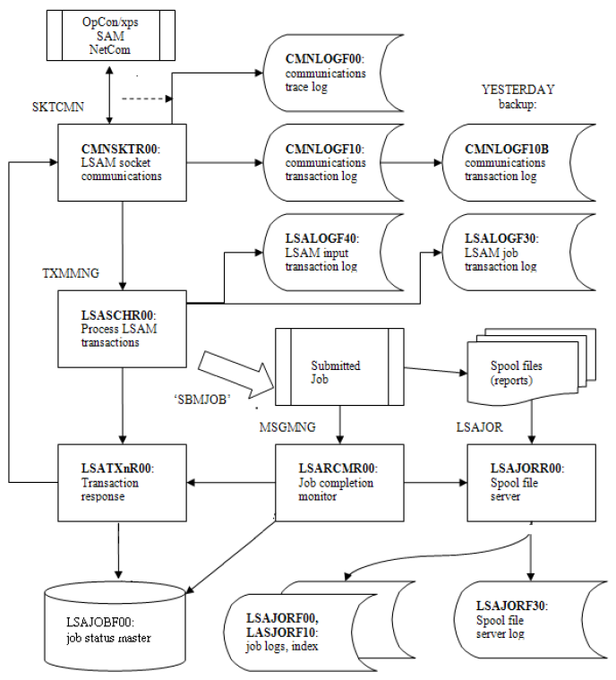

# Strategic Location of Log Files

Technical support staff may find it helpful to understand the transaction flow that produces many of the log files. Names of some of the LSAM server jobs are shown in all capital letters above some of the program object boxes.

