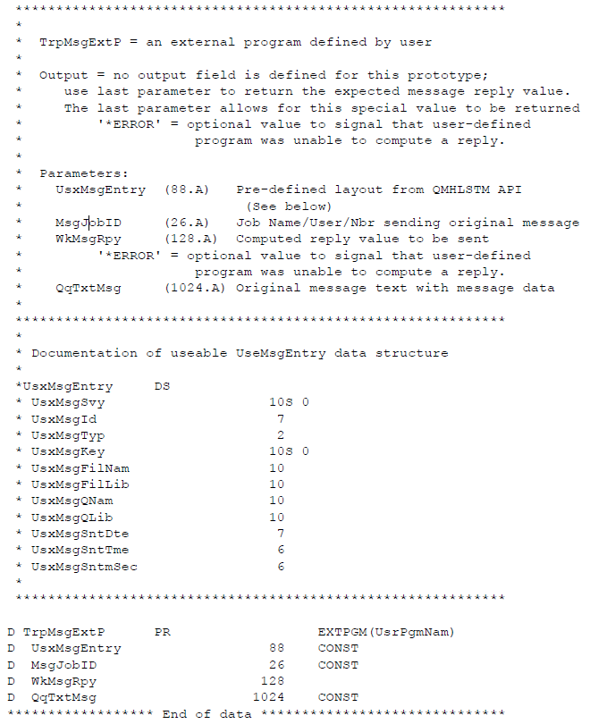

# How the LSAM Message Management Works

The IBM i LSAM Message Management server performs the task of surveying message queues, looking for messages that conform to registered message response rules. Message response rules are created either by adding Message Parameters using the IBM i LSAM Menu function, or by adding message response parameters to an IBM i job in the OpCon User Interface job master record. Each message response rule can specify either or both types of response: answer a message that requires a reply, and/or generate an OpCon Event.

During the process of scanning message queues, the LSAM server job TRPMSG maintains a control file (TRPMSGF10) where it stores the message key of the last message read from each message queue. As the server program repeats its cycle of checking each message queue, it uses the stored last message key to make sure that it does not process the same message twice. As long as this server job is active, the cycle of checking message queues works well and the stored message keys are normally reliable.

:::tip
The message keys that are stored by the LSAM Message Management server could become unreliable if messages are manually deleted from a monitored message queue before the server programs have processed that message and at least one more message that is newer than the message being manually deleted. Avoid manually deleting new messages from a monitored message queue.
:::

If the LSAM Message Management server job is stopped for any length of time, it is not always possible to predict the state of any message queue when the server job is later restarted. A message queue may be cleared, and then new messages may be added to the message queue. In this case, the last message key that was stored by the server is no longer valid. A similar circumstance could arise if the last message key that was stored by the server is for a message that has been manually removed from the message queue. When the server is unable to locate the last stored message key, it will normally reposition itself to the end of the message queue and start processing with the next new messages
that arrive.

The behavior of the LSAM Message Management server is normally predictable once it has established a starting point in each message queue that it will monitor. But the LSAM operator or administrator is able to modify the behavior of the server during the startup process in order to control whether existing messages in any or every message queue will be processed or skipped as the server first starts monitoring. 

## Message Management Start Controls and Rules

The start mode of the LSAM Message Management server is controlled by either an LSAM control file setting or by a start mode parameter that is supplied by an operator as the start request is submitted to the LSAM.

The LSAM control file value is set by using the Message Management Parameters, Maintain performance parameters (F22). This value is used by the server start program when Message Management has been configured to start automatically along with the other LSAM servers, or when an operator specifies a value of "C" (use control file) with the Start Message Management command (that is also used from the LSAM menu function for starting Message Management). Refer to [Message Management Screens and Windows](../message-management/screens.md#message-management-screens-and-windows) for more information about using the parameters maintenance function.

Message Management is started manually either by selecting menu option 3. Start Message Management, from the LSAM Menu 2. Message Management, or by executing or submitting the LSAM command STRMSGMNG. Actually, the menu option uses the same STRMSGMNG command. When this command is used in an IBM i interactive job, a pop-up window appears offering the option to start either in warm mode (option 0) or cold mode (option 1). Whether used interactively or submitted to a batch job, the STRMSGMNG command supports an optional parameter: COLDSTART. The COLDSTART parameter supports the following values:

- **C** = use the control file value (set by Message Management performance parameters).
- **0** = perform a warm start.
- **1** = perform a cold start.

If the COLDSTART parameter is not specified, its default value is "C". The pop-up window that appears when the command is executed in an interactive job is the way the LSAM software requests a value for the COLDSTART parameter.

### Message Management Startup Rules

The LSAM Message Management server start routine responds to the COLDSTART parameter and to conditions in the LSAM database and the monitored message queues according to the following logic. 

1. When a cold start was requested, the LSAM message management control file (TRPMSGF10) is cleared and the COLDSTART parameter is passed along to the message queue scanning program.

    - The message queue scanning program always starts at the beginning of each message queue when a cold start was requested.

2. If a warm start was requested but there is no LSAM control file record for a message queue, such as the first time that a message queue is processed, then that message queue will be scanned starting after the last message that was present in the queue at the time the first scan was initiated.

    - A technical support person can force the server to start processing at the end of a message queue by removing the control record for that message queue and then requesting a warm start.

3. If a warm start was requested but the LSAM control file record for a message queue contains a message key that is not found in the message queue, the server assumes that the message queue contents can no longer be predicted. In this case, it automatically resets the last message key processed to the last message found in the  message queue, and then it will process only new messages that arrive in the message queue.

    - A technical support person can use the undocumented LSAM tools to force the LSAM Message Management control file record to contain a valid key for any message that is currently found in the message queue. Refer to the next section about Undocumented Tools for hints to technical support personnel.

## Message Management Parameters -- Qualification Fields

Many different Parameters records could be created to respond to a single message intercepted by the LSAM Message Management server. This section explains the different groups of fields in the Parameters master record that are used to qualify whether each record's response will be executed.

### Message and Job Profile Fields

Before other forms of message qualification are applied, the LSAM first validates each message it finds by using the following message profile fields. After the message passes the profile tests, then messages can be further filtered using Compare Text, Message Management -- Date and Time fields and Threshold values.

### Message Queue and Library

These two fields govern which message queues will be examined by the LSAM Message Management server job. If the name of a message queue and its library location do not exist in at least one Message Management Parameters record, then any messages delivered to that message queue will never be processed by the LSAM.

This rule also applies to job-level message management that is defined within an IBM i job master record in the OpCon server's database. To accommodate the job-level message management rules stored in the OpCon database, there is a special LSAM Message Management record type of 'Q' (specified in the Answer Type field) that can be registered in the LSAM database. Type-Q records allow the LSAM to server job-level message management without requiring that specific message management rules be
entered in the LSAM's own database.

The messages defined within only the LSAM database do not require a Type-Q record because the existence of an LSAM Message Management Parameters record implies that the LSAM will look for messages in the Message Queue and Library named in that record.

### Message ID (or Range) and File

The LSAM will check every message delivered to any registered message queue. However, only those messages with IDs that were specified in IBM i system or job-level message management will actually be processed by the LSAM server job.

When choosing message IDs to be processed, the LSAM verifies that the Message ID originated from a specific Message File, or that the Parameters record specifies \*ALL for the Message File name. It is not recommended by IBM, but it is possible that the same message ID could be defined in more than one different message file (where message descriptions that include actual message text content and format and also the definition of instance-specific data fields are stored).

The LSAM will handle a message that matches one of three Message ID formats, in the following order, starting with the most specific ID format first:

- A specific message ID, such as CPF1234.
- A range of message IDs, such as CPF1200, where the two zeros at the end imply (just as in IBM i Control Language programming) that a message will match if it has an ID in the range of CPF1201 through CPF1299.
- A generic response message ID with the special value of \*ALL. SMA does not recommend using this value for Message ID, but there may be cases where a special message queue was created for a very limited purpose, and in this case the client wants all messages in that queue to be processed using the same LSAM Message Management Parameters record or records.

All LSAM Message Management Parameters that match a message ID will be processed. This means that if all three of the message ID categories listed above happen to match a single message, then all rules in every category will be processed, starting with the most specific category Parameters record(s) first. When the LSAM processes more than one Parameters record for Inquiry messages, only the first qualifying response will actually be returned to IBM i as the answer to the Inquiry. Any subsequent Inquiry responses will be ignored. However, the Response CMD field commands will still be executed, as will any associated Message Data Capture Rules and their Captured Data Response Rules (refer to more on these rules below).

### Job Name and Job User Name

Message Management Parameters records may be filtered for processing by the name of the job and the name of the job user that originated the message. The LSAM will handle a message that matches one of three name formats (for the Job Name and/or the User Name) in the following order, starting with the most specific format first:

- A specific Job Name and/or a specific User Name.
- A generic Job Name and/or User Name. For example, if the Parameter record specifies a job name of JOB\*, then jobs named JOB001 and JOBABCD will both match. The same example applies to a job's user name.
- A generic name with the special value of \*ALL. In this case any Job Name or any User Name will match the special value of \*ALL. This is another way of indicating that the Job Name and/or the User Name are not important.

All LSAM Message Management Parameters that match a message ID will be processed. This means that if all three of the Job and/or User Name categories listed above happen to match a single message, then all rules in every category will be processed, starting with the most specific category Parameters record(s) first. As always, though, only one answer value will be provided to an Inquiry message, regardless of the existence of more possible answers.

### Compare Text
 
Messages that are qualified after processing the profile filters above are next checked for an optional qualification by message text content. If a value is provided for the Compare Text field, then a message will not be processed by the LSAM unless the Compare Text character string is found (or not found) somewhere in the message text.

The Compare Text will be compared to only the primary message text, to only the secondary (Help) message text, or to both message text strings. When both are specified, the LSAM prepares a message text content buffer by trimming trailing blanks off of the primary text, adding a single space character, and then appending the secondary text to the same text buffer. The format of the message text buffer may matter, depending on the content of he Compare Text field and also on the Position and Length fields.

The Start Position field indicates where in the message text buffer the Compare Text must be found. The rules for the Start Position vary depending on the setting of the Comparison Type field. When the Comparison Type field is EQ or =, the start position may be left at zeros. If the start position is zeros, the LSAM will search the entire message text buffer starting at the first buffer character position (which is designated position 1, not position 0). However, when any other value is specified for the Comparison Type, then the Start Position must be specified.

The length of data that will be used in the Compare Text search may be specified in the Length field. When this field is left set to zeros, the length of the Compare Text is assumed to end with the last non-blank character. Therefore, if trailing blanks in the Compare Text field must be considered, the Length field must be set to a non-zero value. (The length of data field cannot be used to reference all blanks in the Compare Text field, since blanks in that field means not to perform text
comparisons. If it is necessary to compare to blanks, use a Dynamic Variable in the Compare Text field.)

One or more LSAM Dynamic Variables may be specified in the Compare Text field. In this case, each Dynamic Variable is first replaced with a character string produced by the LSAM Dynamic Variable read routine. Then, the resulting text string is subjected to the same rules about length as if the string were typed directly in the Compare Text field. Using more than one Dynamic Variable makes it possible to specify up to the full length of 999 characters as the Compare Text value. (Each Dynamic Variable can produce a value up to 128 characters in length.)

### Message Management Parameters -- Date and Time Constraints

Following qualification by the message profile fields above, an individual message may be further qualified for processing, or bypassing, according to the date and time the message was issued. 

Another way to express this rule is that many Message Management Parameters records may be created for the same Message ID (and matching other profile fields), but they can be configured in a way that controls the response to the message according to various date and time values. For example, a different message response might be required during off-hours at the data processing center, or a different response might be required if the message occurs during the last day of the month.

More details about the date and time fields are presented below, under Message Management Screens and Windows. When specifying dates and times, consider the following possible categories of qualification, and remember that these may be used in combination.

- **Start and End dates**: One or both may be used.
- **Start and End times**: One or both may be used.
- **Linking times to dates**: The date values and time values are used separately, unless the Link flag is set to 1=Link. Used separately, the dates and times can include or exclude time ranges. When the time fields are linked to the date fields, then these combined fields can only mark the start time stamp and or the end time stamp within which the message must have been generated, in order to   select a message for processing. The Start values or the End values can be used by themselves to mark just the effective start time stamp or the effective end time stamp. (Also refer to the table of field values under Screens and Windows for more information about  using dates and times.)
- **Effective DOW (day of week)**: Specifies which days of the week by the number of the day, where the first day of the week may be set in the Message Management Performance Parameters function (LSAM sub-menu 2, option 7).
- **Effective DOM (day of month)**: Specifies starting and ending days of each month, where both values may be the same to indicate a single day of the month, and the special value of 32 is used to indicate End Of Month regardless of the number of days in any given month. It is also possible to specify just the start day or just the end day, to mark only the beginning or the end of an effective period within any given month.

### Message Management Parameters -- Thresholds

There is an optional threshold that may be assigned to a Message  Management Parameters record. The purpose of a threshold is to control when a Message Management Parameters record will be executed. This qualification happens only after the Parameters record has first matched the job and message profile fields, such as Job Name or Job User, and also after the Parameters record has passed any Compare Text or any date and time constraint.

A threshold is used to count the number of times a message has been received within a duration period. If the threshold limit is met within this time period, the Message Management Parameters record will be processed. This controls not only the Parameters record actions but also any attached Message Data Capture and, subsequently, any associated Captured Data Response Rules. The current threshold counter is reset each time the limit is met, so a certain number of additional
occurrences must be counted before the threshold limit allows a second execution of the same Parameters record.

A threshold is comprised of five different fields that are stored in two different places. The data elements that define a message management threshold include:

- **Threshold limit** = the number of the incidence of a given, matching message ID, at which time the matching Parameters record will be processed. Processing occurs when the Threshold count (below) equals this number.
- **Threshold count** = the name of a numeric LSAM Dynamic Variable that is used to hold the current count of the number of times a Parameters record was matched by a message ID. This count is compared to the threshold limit. When the count equals the limit, the Parameters record is processed and the Threshold count is reset to zeros. The count of message activity is increased each time a message passes all of the filtering tests, above.
- **Duration** = the days, hours and minutes of inactivity before a threshold counter will be reset. This field is optional, that is, a threshold does not have to be subjected to any duration; this means that the Threshold count would always be valid, no matter how long ago the first incidence of a message was counted.
- **Threshold date control** = a flag that determines if the date of last update, compared to the Duration, will be taken from the Parameters record itself or from the Dynamic Variable where the count is being stored.
- **Threshold date(s)** = both dates that can be used for calculating the Duration expiration are shown. The Dynamic Variable last updated date is represented by a letter code of V, and the Parameters record date of last message interception is represented by the letter code of M. One of these dates is compared to the current date when a message has been intercepted to determine if the previous threshold count has expired and must be started over at 1.

Dynamic Variables are used to hold the Threshold count (that is compared to the Threshold limit) because this enables a greater flexibility in the way threshold counts can be increased, or reset. Sometimes a simple count of a single message ID is not sufficient to control the desired response action. Instead, it might be important to manage the activity counter using a more sophisticated set of rules that can be implemented as Captured Data Response Rules.

Similarly, the option of choosing the last activity date from either the Parameters record itself or from the Dynamic Variable record makes it possible to either include or exclude activity outside of Message Management that might change the Dynamic Variable value. 

The command SETMSGTHR (set message threshold) can be used, for example, as a Captured Data Response Rule command, to force a threshold count to a different number or to reset it to zeros. Similarly, the command ADDMSGTHR (increase message threshold count) can be used to increase the threshold count stored in a Dynamic Variable that is associated with the Message Management Parameters record identified in the command's parameters.

### Message Management Parameters -- Link to Capture Application

The last fields of the Message Management Parameter master record maintenance are used to connect an optional Message Data Capture Application to the Parameter record. Message Data Capture Applications are defined separately, and they can be re-used for multiple different Parameter records. (This is different from how Capture Data works for the Operator Replay green screen capture, or the SCANSPLF utility where the Scan Rules are the capture rules.)

Use the following maintenance fields on the maintenance display to connect a Capture Application to the Parameters master record, and to define when the Capture Application will execute.

### Capture Application ID

It is possible to type a known Message Capture Application ID into this field; however, the text must match exactly (at this time - this method will change to a more flexible method with LSAM version 21.1), so it is critical that the text be a perfect match to the Application ID text string. This is made easy by using the F10 function key to branch to the Work with Message Data Capture Definitions list display.

From the Capture Definitions list display, type option 1 next to the Definition that should be linked to the Parameters record, then press Enter to complete the link and return to the Parameters maintenance display. 

The Work with Capture function can be used to build a new Capture Definition immediately, so that it can then be selected for a link to the Parameters record; however, when using this technique, be careful to commit the Parameters record maintenance with the Enter key after selecting the link.

Usually, it is safer to first complete the Parameters maintenance, then define the Message Data Capture Definition from the LSAM menu option, and finally re-enter the Parameters Maintenance with option 2=Change. After that, pressing Enter twice navigates back to the Parameters maintenance page where function key F10 can be used to access the Capture Definition list, so that option 1=Select can be used to complete the link and assure that the Application ID of the Capture Definition is correctly named in the Parameters record.

### Before/After Evt, Reply

Type either a 'B' or an 'A' into this field to control when the Message Data Capture Application will execute. Before this field existed, the default was to always execute a Capture Application after the Parameters record Reply and/or Event Command were executed. Therefore, when this field is blank, the default is the same as entering an 'A' in this field.

It is sometimes very important that the Capture Data Application be performed Before the Parameters Reply and/or Event command. Using this method makes it possible to compute a Dynamic Variable value that can be used as the Reply value and/or as a part of the Event Command.

When the Before/After option did not exist, it was often necessary to create two Parameters records, where the first Parameter record did nothing but link to the Capture Application, so that the Response Rules could be executed. Then, a second Parameters record would be able to utilize the Dynamic Variable tokens. But with the Before/After field, the strategy is much easier to recognize and configure.

Sometimes it is not important that the Capture Application execute After the Parameters record has already done its job, such as when the Capture Application is linking to Response Rules that are simply notifying OpCon about the message action that was already taken.

If an older set of Message Management Parameters is being updated with a specific setting of 'B' for the Before/After option, be sure to carefully evaluate the linked Application and its Response Rules. Also look for any secondary Parameters records that have all the same six primary message filter keys, but a unique sequence number. Sometimes, the additional rules with higher sequence numbers may no longer be needed.

## Message Management Technical Support Tools

There are LSAM utility commands and programs included with the software product that are intended for use only by informed technical support personnel. These tools are listed in this documentation, but they are not fully documented because they are not intended for use by anyone who has not received specific training about how to use the tools correctly. The following tools may be used by experienced persons to diagnose and/or control the operation of Message Management if problems arise.

### Display Message Queue Command

One such tool is the LSAM utility command DSPMSGQ. Information about this tool is provided here as a hint to technical support personnel.

:::warning
Do not attempt to use the DSPMSGQ utility without instructions from SMA Support. This tool can cause unwanted events to occur, either in the LSAM or in OpCon.
:::

The DSPMSGQ utility command requires that the LSAM library list be in effect. This tool can be used from the command entry line of the LSAM menu system, or it can be used from any IBM i command entry line as long as the current library list of the job is the LSAM library list. The LSAM library list can be set from outside of the LSAM menu system using the SMASETLIBL utility command. Refer to [Commands and Utilities](../commands-utilities/commands.md) for more information about LSAM utility commands such as SMASETLIBL. 

DSPMSGQ displays a list of the current contents of the message queue named in the command parameters. (Use F4=Prompt to see the command parameters.) This is a non-destructive list of the message queue contents. That is, the messages remain in the queue, undisturbed. The list displays a hexadecimal and a numeric form of the message key value for each message in the requested queue. It lists the messages in the order in which they occur in the message queue from the top, down.

The message queue contents list display offers an option to display the details of one or more messages in the list. The details display helps identify messages by showing more information about the full message text.

There is a function key available on both the list and the message detail display that can be used to show the contents of the LSAM Message Management control file for the one message queue that is being examined.

In case the LSAM Message Management control file must be updated to control the start point of message scanning in a message queue, there is an option on the list display that can be used to select the message that will become the last message processed key. When this option is typed next to a message line and the <**Enter**> key is pressed, the utility will update the Message Management control file record for the current message queue being examined with the message key and the message date and time values from the selected message. After this update, the LSAM Message Management server will begin processing with the next message in the queue after the message that was selected. 

There is a function key on the message detail display screen that can also be used to perform the same update to the Message Management control file.

The safest way to use the control file update function is to first stop Message Management. This assures that the correct message will be the next message processed when the server resumes activity. This also prevents a possible record lock conflict between the utility command's update function and the updates performed by the Message Management server programs.

SMA strongly recommends contacting SMA Support for assistance if it appears necessary to use the DSPMSGQ utility command to reset LSAM Message Management processing.

### Trace Message Management

Another tool for technical support is the ability to record detailed trace information about all LSAM Message Management operations. Using this diagnostic tool will create a large number of entries in the LSAM log file that is normally reserved for SBMJOB messages and for Job Completion Message activity tracing (file LSALOGF30). Information about this tool is provided here as a hint to technical support personnel, as one means of analyzing problems with Message Management.

To start detailed activity logging for Message Management, use the Message Management Performance Parameters (LSAM menu 2, function 7) to change the flag called "Trace message management log." The value of the flag must be set to '1' (the character one). Next, stop and restart Message Management in order for the server job to  discover and respond to the order to start detailed tracing.

After the error condition has been trapped by this diagnostic tracing feature, stop Message Management again and change the Trace message management log flag back to a value of '0' (zero) or blank.

The trace log entries in file LSALOGF30 may be recognized by log type values of MM:, ML:, MO:, MK:, MN:, MU: and DQ:. The meaning of these entries is defined in the source code for the LSAM Message Management server program (TRPMSGR01). (Source code for SMA software is not available publicly.) The content of this log file may be conveniently viewed using the LSAM Management Menu (6), option 5: View LSAM logs, viewer function 4: Display LSAM submit job log (DSPPFM LSALOGF30).

The log entries that are labeled with the log type of DQ: show information about messages that were intercepted by Message Management, but that were disqualified for processing because of some of the filtering rules. It is possible to view the raw data of the DQ: entries to see advice about the reason that the message was disqualified. This may help the LSAM Administrator debug some of the complex rules that can be used to filter messages.

For assistance with analysis of the Message Management diagnostic trace log entries, use the SMASUP command to extract the LSAM LOG files to a save file and send the save file to SMA Support (refer to [Log File and Database Management](../logs-database/overview.md) for instructions about using the SMASUP command and delivering the save file to SMA Support).

## Using Message Management for Job Completion Messages

The LSAM runs two different server programs and jobs that each perform message management tasks. Besides the general message management server job (TRPMSG) described in this topic, there is also the job completion message server job (MSGMNG). The functions of these two server jobs are divided according to the rule that all messages arriving in the LSAM's reserved job completion message queue, SMADTA/SMAMSGQ, will be handled by the job completion message server. Any other message queues may
optionally be monitored by the general message management server. 

There is an optional control flag in the LSAM Parameters, under the Job Scheduling Performance Parameters segment on display page two. The flag is labeled "Use job cmpl msg mgmt?" This flag controls how the LSAM job completion message server program will behave. If the flag is set to Y=yes, the job completion message server program will check the LSAM's general message management rules for any messages found in SMADTA/SMAMSGQ that are not actually job completion messages. In this case, the logic of the LSAM's job completion message server program  allows a slight delay before deleting messages from this reserved message queue in order to allow for various message handling options. If the control flag is set to N=no, the LSAM job completion message server program will ignore all but job completion messages and it will remove each message it finds in SMAMSGQ as the message is received by the server program, except for messages requiring a reply - which it will
leave unanswered. 

Following is a summary of how to configure the IBM i LSAM so that inquiry messages arriving in the LSAM's job completion message queue can be processed using LSAM message management rules. More explanation about the technical details of this process follows the outline.

**How to Use Message Management for the LSAM Job Completion Message Queue:**

1. In the command line, enter **SMAGPL/STRSMA** or **LSAMENU**. For more information on STRSMA and LSAMENU command parameters, refer to the [STRSMA Command](../operations/lsam.md#the-strsma-command).
2. Enter **7** to choose the **LSAM Parameters** in the LSAM Main Menu.
3. Press **PageDown** to go to the second page of LSAM Parameters.
4. Tab or move the cursor to the field labeled "Use job cmpl msg mgmt?" and type a value of "**Y**".
5. Press **Enter** to complete the LSAM Parameters maintenance.
6. Enter **2** to choose the Message management menu.
7. Enter **1** to choose the **Message management parameters** option in the Message management menu.
8. Press **F6** to add a new message management parameters record.
9. Type the value "**SMAMSGQ**" for the Message Queue field.
10. Type the value "**SMADTA**" for the Message Queue Library field, or type another name for the LSAM database library if using an alternate LSAM environment.
11. Type in values for the other message management parameter fields that will match the message ID and job values that are expected to deliver an inquiry message to the SMAMSGQ message file.
12. Press **Enter** to record the new message management parameters master record.
13. At the Message Management Parameters list display, type option **9** and press <**Enter**> to activate the new Parameter record. (Option 2=Change can also be used to update the record status to "A"=active.)
14. Press **F12** to return to the LSAM Main Menu.
15. In the LSAM Main Menu, in order to cause the new LSAM Parameter to take effect, enter **6** to choose the **LSAM Management menu**.
16. Type **2** and press **Enter** to temporarily stop the LSAM server jobs. (This step is not necessary if the LSAMParameters were previously set to allow message management for job completion messages, prior to the last time the LSAM server jobs were started.)
17. Type **1** and press **Enter** to restart the LSAM server jobs.
18. If LSAM Message Management was not set to start automatically, remember to manually restart LSAM Message Management.

### Message Management for the Job Completion Message Queue

The decision about how to set the job completion message management flag in the LSAM Parameters may depend on the behavior of third-party software that the IBM i LSAM is controlling. In most cases, the LSAM would not expect to find messages in its reserved job completion message queue that are not actually job completion messages. If that is so, then the job completion message server program may be more efficient if the job completion message management flag is set to N=no. It is also
possible that in some environments, the behavior of the LSAM job completion message management server program might prove inappropriate when the message management flag is set to Y=yes. There are no specific rules known that would help to determine if inappropriate behavior might occur. Instead, the LSAM administrator might suspect that the flag setting of Y=yes is causing a problem if the LSAM and OpCon do not seem to properly handle job completion messages.

Consider this next example when deciding whether or not to use this LSAM processing option.

:::info Example
An old programming technique, not recommended for use in IBM i programs, used the MSGQ parameter of the SBMJOB command to identify the name of the user profile that submitted a job. This value was retrieved by a program (using the SBMMSGQ parameter of the RTVJOBA command) and used to send inquiry messages about system operations, requiring a reply from a user before the program could continue operations. IBM i permits that the MSGQ parameter of the SBMJOB command can be changed to any value where job completion messages should be routed, therefore, this parameter cannot be relied upon to identify the name of the user profile submitting a job.
 
The IBM i LSAM sets this SBMJOB parameter to MSGQ(SMADTA/SMAMSGQ), where SMADTA could be a different name of the database library in an alternate LSAM environment.

In this example, when the LSAM submits the job where the program issues an inquiry message to the job completion message queue (before the job is completed), the default behavior of the LSAM was to receive the message and delete it from the message queue without considering that a response might be required to the inquiry. As a result, a *NULL response was sent to the program that issued the message. If the program command issuing the message was coded with restrictions on the values of a reply to the message, the IBM i system message processing routines rejected the reply and re-sent the message to the LSAM's job completion message queue. A tight system logic loop was generated, flooding either the LSAM job completion message queue or the OpCon SAM log files, and creating a severe performance impact on the IBM i partition.

To prevent the system message processing loop, the LSAM Parameters option for using message management with job completion messages must be set to Y=yes. It is also necessary to add a message response rule to the LSAM's Message Management Parameters master file that will match the inquiry message and cause an appropriate response to be provided.
:::

Whenever the LSAM job completion message server is configured to provide a response to an inquiry message, if the response is not hard-coded in the LSAM Message Management Parameters master file, the LSAM job completion message server program will spawn a separate task to handle the process of obtaining and delivering a  response to the inquiry message. This protects the job completion message server program from delays, in case the message response rule might involve waiting for a
human response.

To analyze LSAM performance anomalies such as the example above cites, the LSAM utility command DSPMSGQ, described above, might be useful for examining the messages that arrive in the LSAM's reserved SMAMSGQ message queue. There is also an LSAM debug logging feature that, when turned on, generates verbose messages in the LSAM log file LSALOGF30. The LSAM log viewer menu option 4 supports viewing the contents of this log file. These two tools may help in the decision about when and how to
use LSAM message management rules to more aptly support job message conditions that may arise in some IBM i partitions.

### LSAM Parameters Option: Use job cmpl msg mgmt?

When changing the LSAM Parameters option for using message management rules, the LSAM server jobs must be stopped (ENDSMASYS, or use LSAM Menu 6, option 2), and then restarted (STRSMASYS, or LSAM Menu 6, option 1), in order for the changed LSAM Parameter flag to take effect.

When the LSAM Parameters option to use message management for the job completion message queue is set to Y=yes, the following rules apply:

- Actual job completion messages are not subject to management according to the LSAM's message management parameters. A list of reserved message IDs protects the actual job completion messages so that they are always handled by the special LSAM routines that report job completion to OpCon. There are options in OpCon that may be used to respond to job completion status values resulting from the LSAM's handling of job completion messages.
  - Use LSAM menu 2. Message Management, option 6. View job completion message table (DSPPFM LSAMSGF00), to see the list of message IDs from the QCPFMSG message file that the LSAM reserves as job completion messages.
- Only messages that are [not] found in the LSAM's table of job completion messages may be subjected to LSAM message management rules. This table is not designed for user maintenance, but LSAM users may consult with SMA Support for advice if it is suspected that the LSAM table of job completion messages should be revised.
- The LSAM's reserved message queue where job completion messages are routed by IBM i, called SMAMSGQ in the LSAM database library (SMADTA, or other representative name), will not be handled by the LSAM's general message management server program. This rule is hard-coded into the LSAM server programs. Rules added to the LSAM Message Management Parameters that specify the message queue SMAMSGQ will only be used by the LSAM's job completion message server program -- and only if the LSAM Parameter is set to allow this type of processing.

## Specifying User-Defined Responses to Messages

There are two additional methods for providing responses to inquiry messages, in addition to the response values that may be entered directly into the LSAM message management parameters master record. One method is to cause the inquiry message to be re-routed to a different message queue and the other method is to have the LSAM message management server call a user-defined program that will provide the message reply value.

Either of the two alternate message reply methods may be used for both LSAM general message management or for the special application of message management rules to the LSAM's job completion message server program.

:::tip
The two alternate methods of computing a reply for inquiry messages are not available at this time for job-level message management, specified for IBM i job master records in the OpCon schedule. However, it is possible to create an LSAM Message Management Parameter record that applies only to a specific job name, achieving the same effect.
:::

### LSAM Processing of Re-routed Inquiry Messages

The IBM i LSAM Message Management Parameter master record supports an option to re-route inquiry messages to a different message queue in order to obtain a reply value that the message management server program will send to the original inquiry message.

This feature is useful in case an IBM i job sends an inquiry message to the job completion message queue. Since the job completion message queue is forced to SMADTA/SMAMSGQ by the LSAM job scheduler, any inquiry messages sent to this queue would not be presented to interactive users such as the system operator. But if the LSAM Parameter control flag specifies Y=yes for "Use job cmpl msg mgmt?" (Use job completion message management?), then inquiry messages arriving in the job
completion message queue can be re-routed to any other message queue in the system.

Typically, inquiry messages that are expected to arrive in the job completion message queue would be sent to the IBM i system operator (QSYSOPR) message queue, or they could be routed to the message queue of an LSAM Administrator. Messages would be re-routed to another message queue whenever it is not possible to use the other parameters of LSAM message management to determine a correct reply automatically.

When either the LSAM job completion message server program or the general LSAM message management server program detects an inquiry message that is qualified for re-routing to another message queue, the main server program actually spawns a separate job (of type BCI = batch immediate) and passes all the message control information to this spawned job. The process of spawning another job allows the main server program to move quickly on to other message processing, rather than be
delayed while waiting for a response generated by an actual person. 

The spawned message handler program takes full control over the inquiry message processing. It re-sends the message to the specified alternate message queue and then it waits indefinitely for a response. Once a response is returned, the spawned message handler program delivers that response to the original inquiry message. After all message processing is completed, the spawned message handler program removes the "old" messages from the message queues it handled.

The LSAM debug logging option for "Transaction manager logging" controls whether the spawned message manager program will produce verbose trace log entries in the LSAM submit job log (log viewer option 4, file LSALOGF30). This debug logging feature is a useful way to trace exactly how inquiry messages are being handled, and perhaps to debug the configuration of the LSAM message management parameters.

### User-Defined Message Reply Programs

The IBM i LSAM Message Management Parameter master record supports an option to call a user-defined program that will produce an appropriate reply value for an inquiry message. This option may be useful for any type of LSAM message management, including both the general message management facility and the special feature that enables message management for the LSAM's job completion message server.

When either the LSAM job completion message server program or the general LSAM message management server program detects an inquiry message that requires calling a user-defined program to obtain the reply value, the main server program actually spawns a separate job (of type BCI = batch immediate) and passes all the message control information to this spawned job. The process of spawning another job allows the main server program to move quickly on to other message processing, rather
than be delayed while waiting for a response generated by an unknown process. (The unknown process could involve an interaction with a system user and this could create a long delay.)

The spawned message handler program takes full control over the inquiry message processing. It calls the user-defined program and then it waits indefinitely for that sub-program to return a response in the call parameters. Once a response is returned, the spawned message handler program delivers that response to the original inquiry message. After all message processing is completed, the spawned message handler program removes the "old" messages from the message queues it handled.

The LSAM debug logging option for "Transaction manager logging" controls whether the spawned message manager program will produce verbose trace log entries in the LSAM submit job log (log viewer option 4, file LSALOGF30). This debug logging feature is a useful way to trace exactly how inquiry messages are being handled, and perhaps to debug the configuration of LSAM message management.

The rules for creating a user-defined message response program only dictate the call parameter list that must be used. Any form of processing is permitted, as long as the program eventually returns a valid reply to the inquiry message via the specified call parameter. The IBM ILE RPG prototype for a user-defined inquiry message handler program is shown below. Either ILE prototype parameters may be used, or traditional OPM PARM fields may be used in a program *ENTRY parameter list.

The actual RPG program specifications required to build a user-defined messenger handler program are illustrated in the following diagram.

User-defined Inquiry Message Handler Program *ENTRY Parameters



For more information about the detailed fields that define an inquiry message, refer to the IBM documentation about the IBM i API called
QMHLSTM.

## Message Management Event Commands

### Using IBM Commands for Event Response

Previous versions of the IBM i LSAM Message Management Parameters master file only supported OpCon Event command strings, limited to the actual OpCon Event command syntax such as $JOB:RELEASE (meaning to release a job that is held on an OpCon schedule).

Now the LSAM's global Message Manager server job is able to support any IBM-format command as well as the OpCon Event command strings. There are two function keys on the Message Management Parameters Add or Change screens that can be used to help correctly format IBM commands:

- **F4=Prompt Evt**: When the cursor is positioned in the Event command field, <**F4**> causes a window of available events to appear from which a value may be selected and returned to this field.
- **F8=Prompt CMD**: When the cursor is positioned in the Event command field, <**F8**> causes the job to branch into IBM i command prompting. If an IBM i command name was typed before <F8\> was pressed, then that specific command will be prompt. Otherwise, a general command search window will appear to help find the desired command. (Note that this IBM command prompting will not allow a command to be executed.)

The LSAM Message Management server program never stops to process Event commands. This permits the main server job to quickly find and respond to messages in many different message queues. Instead, it sends OpCon Event $-command strings directly to the LSAM's communications data queue so that the Event command can be immediately sent to OpCon for processing.

When an IBM command is requested, the LSAM Message Manager program spawns a separate task that is dedicated to processing the Event command. Every time the Message Manager main server program spawns a new Event command task this will start another job named TRPMSGCMD that will run in the LSAM's own subsystem under IBM i. Commands  may be very short and quick to process, but it is possible that a user-defined command could start a long process. Running in a separate task means that long-running commands will not prevent the main Message Manager from performing its tasks. One implication of this behavior is that if too many spawned tasks performing heavy work loads are started at once, this could impact the responsiveness of all the LSAM server jobs and even of the whole system. It may be necessary to adjust the performance parameters of the LSAM's subsystem, such as allocating more or dedicated system memory to the subsystem, if it is anticipated that Message Management might sometimes generate a heavy work load.

#### Using IBM Commands from Third-Party Applications

Any IBM command could be used for an Event command, including user-defined commands or commands from third-party application software that is installed in the IBM i system. The only requirement for non-system commands is that the LSAM Message Management server job must be able to find the command. Therefore, if the command does not exist in either the system library list or the LSAM environment library list, the command should be qualified by its library location name, such as:

:::info Example
```
APPLIB/APPCMD KEYWORD1(value1) KEYWORD2(value2)
```
:::

In this example, the command APPCMD is located in the IBM i library APPLIB. Thus, the LSAM Message Manager would be telling the IBM i system where to find the command.

However, when using non-system commands or commands not installed in the LSAM environment library list, it is also important to assure how the command execution program has been configured. Many times commands are created with the command execution program location specified as '\*LIBL' meaning that the program must be found in the job's library list. Once again, the task spawned by the LSAM Message Manager would not typically have third-party application libraries in its library list (unless the LSAM environment library list has been modified to always include third-party software libraries -- for this purpose). Therefore, even a library-qualified command may fail to execute, unless the command uses the Product library attribute of the command to specify the library where the third-party application software may be found.

### LSAM Dynamic Variables in Event Commands

The LSAM Message Management server program supports replacement of LSAM Dynamic Variables that may be included in the Event response command field. To insert Dynamic Variable tokens into the Event command field it is helpful to use the Dynamic Variable prompting function key:

- **F6=DynVar**: This command key, when pressed while the cursor is positioned in the Event command field, causes a window listing available Dynamic Variables to appear. PageDown as necessary, then position the cursor over the desired variable name and press <**Enter**> to select that variable so that it will be inserted as a token into the Event command field. The token will be inserted at the position where the cursor was when <**F6**> was pressed.

The LSAM Message Manager processes Dynamic Variable token replacement before any other action when it is preparing to execute an Event response command. Therefore, the value that is used to replace the token could contain any form of valid IBM command or an Agent $-System command string. It is also permitted to use Dynamic Variables in place of one or more parameters of a command that is typed into the Event command field. More than one Dynamic Variable can be included in a single Event
command, as long as the final result after token replacement is a valid format for the allowed command types.

Use caution when determining how to set the value of a Dynamic Variable that will be replaced by the LSAM Message Manager. It might seem possible to use additional Message Management Event commands or the Message Manager capability to call user-defined programs in order to set a Dynamic Variable value. However, due to the way the Message Manager spawns separate tasks for both of these capabilities, it may not always be possible to assure that the spawned tasks will be executed in the
order expected. In other words, a task that should have set the Dynamic Variable value may not be completed before another task that wanted to use the new value was ready to receive it. For critical circumstances, it may be advisable to execute a user-defined program that would exert predictable control over a required sequence of message response events. 

### OpCon IBM i Job Master Message Event Command Options

The OpCon job master record format for IBM i jobs supports a tab where one or more messages may be registered that could occur during the job execution. Job-level message management takes priority over the LSAM's own global Message Management server, but both types of message management are handled by the same LSAM server job. Therefore, the same capabilities as are available to the LSAM's own global Message Management server are also available to the job-level message management definitions.

However, the OpCon job master record maintenance routine (as of the date of this publication) is not currently programmed to directly handle the registration of IBM commands or LSAM Dynamic Variables. Instead, special syntax and rules for the OpCon Event command $CONSOLE:DISPLAY have been defined. These special rules only work for the IBM i LSAM and they are not supported by any other LSAM.

#### Using IBM Commands for Event Response

OpCon job master maintenance only supports the prompting and updating of OpCon $-commands as Event commands that may be executed in response to messages generated by IBM i jobs. However, the following work-around has been developed for this restriction in the OpCon User Interface data entry rules, so that it is possible to register an IBM-format command that will be executed by the IBM i LSAM, instead of sending an Event command back to OpCon. 

##### Work-around for specifying IBM i commands as Message Management Events:
To register an IBM-format command in the OpCon job master record, select the OpCon Event command named $CONSOLE:DISPLAY. Then, when replacing the <**message**> parameter for this command, insert the reserved character string: 'QCMD:' followed by any IBM-format command that is desired. Following is an example of how the final Event command would look:

:::info Example
```
$CONSOLE:DISPLAY,QCMD:WRKJOB OUTPUT(*PRINT)
```
:::

In the example above, the location where the DISPLAY message text would be inserted now contains the required special character string QCMD: and that is followed by the IBM WRKJOB (work with job) command, as an example.

Be sure to take note of the rules and restrictions explained above, under: LSAM Parameters Event Command Options -> Using IBM commands for Event response -> Using IBM Commands from Third-Party Applications. The same considerations apply for commands registered in OpCon jobs because the message management event commands are processed by the same LSAM Message Management server job.

#### LSAM Dynamic Variables in OpCon Event commands

The LSAM Message Management server program supports replacement of LSAM Dynamic Variables. Therefore, any or all of the IBM-format command that is registered in the OpCon job master record for message management could be an LSAM Dynamic Variable token. Consider the following example:

:::info Example
```
$CONSOLE:DISPLAY,QCMD:{DYNVAR1}
```
:::
In the example above, after the required special character sequence QCMD: there appears only the LSAM Dynamic Variable name (surrounded by the required special characters that are registered in the LSAM environment to denote a Dynamic Variable token; some environments may use different characters to mark the start and end of a Dynamic Variable token). The LSAM Message Manager retrieves the character string that appears after the QCMD: sequence, then it checks for and replaces the Dynamic Variable token with its current value. In this example, the token must be replaced by a complete IBM-format command string in order for the event response to occur.

## Message Data Capture and Response Rules

This section explains how to configure Message Data Capture. Agent features that can capture data are supported by a cental reference to the universal [Captured Data Response Rules](../events-utilities/captured-data-response-rules.md) documentation.

Message Data Capture can be used to enable tight integration between OpCon and third-party application software running under IBM i. Messages can be generated by any IBM i software and the IBM i LSAM Message Management Parameters can be configured to respond to those messages. When message data is captured, the captured data elements can be tested in order to control a variety of optional responses to any given message. The responses supported include any form of IBM i command or program call and also OpCon Event Commands.

The universal Response Rule capability provided with the IBM i LSAM enables a flexible, programmable and virtually unlimited response capability that can be associated with the various LSAM tools that perform data capture. Operator Replay scripts can capture data displayed on IBM i green screen workstations. The SCANSPLF tool can capture data printed on reports coming from programs that ran under IBM i. Similarly, the Message Management facility can capture data from the primary and/or secondary (Help) text of messages.

### How to Configure Message Data Capture

1. In the command line, enter **SMAGPL/STRSMA** or **LSAMENU**. For more information on STRSMA and LSAMENU command parameters, refer to the [STRSMA Command](../operations/lsam.md#the-strsma-command).
2. Enter **2** to choose the **Message management menu** in the LSAM Main Menu.
3. Enter **10** to choose **Work with Message Data Capture Definitions** in the Message management menu.
4. Viewing the Work with Message Data Capture Definitions list, take note of existing Application Identifiers (if any) so that a unique name may be chosen for the new Application.
5. From Work with Message Data Capture Definitions, press function key **F6** to branch to the Create Message Data Capture Definition screen.
6. Type a new value in the Application Identifier field. Use words that represent the type of data to be captured or the purpose of this capture rule.
7. More than one record may be added for the same Application Identifier rule, such as when multiple data elements should be captured from the same message text, so type a unique Capture Sequence value, or just use the default value of 10 if there is only one record for this Application.
8. Complete the other message capture definition fields. (Refer to the section below about Message Management Screens and Windows for more information about these fields.)
9. Before pressing **Enter** to complete writing the new Capture Definition record to the LSAM database file, consider using function key **F11=Response rules** to link one or more response rules (commands to execute and other functions) to this Capture Definition. (Creating Response Rules is outlined next.)

    - If **F11** was used to branch to Captured Data Response rules, remember to complete the process of entering the Capture Definition after returning to this screen by pressing **Enter**.

10. After completing the entry of one or more Message Data Capture Definitions, press **F3** to exit this function.

    - If this function was entered using **F10** from Message Management Parameters, this will return the screen to that maintenance function, so skip the next two steps of this process.

11. Enter **1** to choose the **Message management parameters** option.
12. Type option **2** to select the appropriate Message Management  Parameters record that will use the Message Data Capture definition.
13. Use the **TAB** key to move the cursor into the field named **Captured Application ID**. Type in the same name of the Application Identifier as was just added above.

    :::tip
    It is possible to press the function key F10=Capture to display a list of existing capture Application IDs and then type option 1=Select, after which the Enter key may be pressed to return that value to the Message Management Parameters record. This helps prevent typing errors on long names.
    :::

14. After typing or selecting the Capture Application ID, press **Enter** to update the Message Management Parameters record.

After a Message Data Capture Definition has been created and registered to a Message Management Parameter record, it is possible to also register Captured Data Response Rules that are executed whenever the Message Data Capture function is being executed (during processing of a real message by the LSAM Message Management server job).

Remember that Captured Data Response Rules can also be created for Operator Replay Scripts and for the SCANSPLF command - spool file scan rules. However, Captured Data Response Rules cannot be shared among these three LSAM features that use them. They are specially categorized to match each LSAM function that is performing data capture. This is why there is a separate entry for Work with Capture Response Rules found on each of the LSAM function sub-menus. This is also why the convenience function key **F11=Response rules** has been added to the maintenance function where each type of data capture is defined, making it easy to avoid confusion about where the Captured Data Response Rule will be used.

#### Adding a Response Rule from the LSAM Menu System

1. In the command line, enter **STRSMA** or **LSAMENU**. For more information on command parameters, refer to the [STRSMA Command](../operations/lsam.md#the-strsma-command) and the [LSAMENU Command](../operations/lsam.md#the-lsamenu-command).
2. Enter **2** to choose the **Message management menu** in the LSAM Main Menu.
3. Enter **11** to choose **Work with Captured Data Response Rules** in the Message management menu.

    :::tip
    This same function may be accessed using function key F11=Capture from the Work with Message Data Capture Definitions function, outlines above.
    :::

4. In the Work with Capture Response Rules screen, first, notice that the screen title indicates the rules are Subset to Type: MESSAGE.
5. Press <**F6**> to Add a new Capture Response Rule record.
6. The **Create Capture Response Rule** screen appears.
7. On the Create Capture Response Rule screen, type the Capture Identifier and Capture Sequence number, using an existing Message Data Capture Application ID and the appropriate sequence number.

    - Since there is no prompting key available to find the Message Data Capture Application ID and Sequence number, it may be more convenient to enter this Captured Data Response Rule maintenance using function key **F11** from the Work with Message Data Capture Definitions function. This method of access causes the Capture Identifier and Capture Sequence fields to be filled automatically.

8. Type a value of 'M' (= Message Capture) for the Type field.
9. Assign a unique Response Sequence number to each response rule. The order of the sequence number determines which response rule will be executed first.
10. Type a Continuation field value if more than one comparison rule must apply. Otherwise, leave this field blank to specify one, simple response rule. Refer to more information under [Captured Data Response Rules - Work with Response Rules](../events-utilities/captured-data-response-rules.md\#work-with-capture-response-rules).
11. Type a value for the Compress numeric field. Specify Y = yes if the captured and compare data values are numeric, otherwise specify N = no. This flag must correspond to the similar flag found on the associated Message Data Capture Rule.
12. *(Optional)* Specify the names of a Dynamic Variable and/or an Operator Replay Token variable that will be used to store the captured data value.

    :::tip
    If Compress numeric is set to "Y" = yes on the Response Rule, then the data stored in the optional Dynamic Variable will also be stored as only the digits of the number.
    :::

13. Type the Response Cmd (command) to execute if the compare data rule is matched. Use function key <**F13=Full CMD**> if the command string is longer than will fit in the (part 1) input field.
14. Type values for the Compare rules that decide when this response rule should be executed (refer to more information under [Captured Data Response Rules - Work with Response Rules](../events-utilities/captured-data-response-rules.md\#work-with-capture-response-rules).

    - A simple value set that allows a response rule to always execute is created by setting the Compare Rule to "EQ" (equal) and specifying the Compare Data Lines special value of *ANY.
        
    - In the Compare data lines 1-5 field, use function key <**F8**> if the data is longer than will fit into lines 1 to 5, but first type the first 5 lines into this field before pressing <**F8**>. The special values of *ANY, *PARM, or "DynVar" may be used. (Refer to more information under [Captured Data Response Rules - Work with Response Rules](../events-utilities/captured-data-response-rules.md\#work-with-capture-response-rules).)

15. The value for the Capture length field (a display-only field near the bottom, right) is supplied automatically once a Capture Identifier and Capture Sequence number have been specified.
16. Press <**Enter**> to record the new Capture Response Rule record.
17. The system returns to an updated list of existing Capture Response Rule records.
18. If the Captured Data Response Rule maintenance was entered by using a function key from a Work with Message Data Capture Definitions record screen, remember to also press **Enter** to complete any pending update of the Message Data Capture Rule.

### How Message Data Capture and Response Work

As previously explained, the Captured Data Response Rules work the same for Message Data as they do for Operator Replay captured screen data and for SCANSPLF captured report data. However, some additional notes are provided in this section to illustrate some strategies that are unique to Message Management. One point of focus is on the management of message response by LSAM message management thresholds.

The general rule for message data capture is that the data capture rule will only be executed when an associated Message Management Parameters rule qualifies for processing a specific message. However, the message capture rule itself may be prevented from executing if a Scan Label is used to help identify the location of the data element to be captured. In this case, if the Scan Label is not found at all, or if the Scan Label is not found as many times as indicated in the Incidence count (#), then the Capture Rule will be skipped. 

Skipping a Message Data Capture Rule means that none of its associated Captured Data Response Rules will be executed. This could become important in case a critical Dynamic Variable is being loaded by the Captured Data Response Rules record.

Whenever a Message Data Capture Rule is  executed the LSAM will check for any Captured Data Response Rules to be executed. Each Response Rule may be qualified by a potentially complex Compare Data rule definition. It is possible for one Message Data Capture Rule to have many different Response Rules associated with it, but that only certain of those Response Rules would actually be executed. An example of how to use this capability is provided below in the Examples section.

#### Message Data Capture Applications

The Application ID used for capturing message data is handled differently than Operator Replay or SCANSPLF. A single Application ID could be created for each separate Message Management Parameters record that might need to use captured data. However, since it is possible to have many different Management Parameters qualified to handle a single message by Job Name, Job User and date and time parameters, it might sometimes be convenient for all those different Message Management Parameters to share the same Application ID for capturing message data, since the Message ID will always be the same.

Therefore, the Message Management Parameters master record has a field that points to an Application ID, but the Message Data Capture Rules that belong to that Application ID do not point back to a Message Management Parameters record.

A single Application ID may have more than one message data capture rule. In that case, each rule is assigned a unique sequence number. This allows for the possibility of capturing more than one data element from a single message. All of the records belonging to the same Application ID will be executed whenever their associated Message Management Parameters record qualifies for handling a specific message. The sequence number also controls the order in which message data capture rules are executed, although the sequence of events is not critical unless any associated Captured Data Response Rules must be executed in a certain specific order.

### Examples of Using Message Data Capture and Response

Among many possible uses for captured message data, one simple use might be to capture the name of an IBM i system device, so that the specific device name can be passed to OpCon for the purpose of notifying a supervisor about an unexpected critical device error. For this purpose, the message text can be scanned for the device name, using the message data capture rules. Then a Captured Data Response Rule is associated with the capture rule and used to (1) store the device name in an LSAM Dynamic Variable, and then (2) use the Dynamic Variable value in an OpCon Event command that is sent from the LSAM to OpCon in order to notify the supervisor.

Another important use for Captured Message Data and the Captured Data Response Rules is to create complex threshold management. For example, consider a bank that supports ATM devices on a network connected to an IBM i partition. Perhaps an ATM device is able to send a warning message about an unexpected device status, but the device has its own built-in recovery procedure. In this case, there is no need to notify a supervisor the first time the ATM device status message is received. However, if the error continues to occur multiple times within a certain time limit, then it could become very important to use OpCon to automatically signal a supervisor (or to signal some other automated process) so that the device can be physically examined in order to eliminate the cause of the device failure.

In this second example, the simple threshold counter associated with the message ID would not be useful because there are many ATM devices that could issue the same error. Instead, it would be necessary to set up a virtual array of threshold counters, one for each ATM device. Multiple LSAM Dynamic Variables using numeric format could be established as the event counters, one for each ATM device. If the Dynamic Variable name is made equal to the actual ATM device name that appears in error messages, then Message Data Capture could be used to (1) store the name of the current ATM device in a working Dynamic Variable, and then (2) trigger a Captured Data Response Rule using the working Dynamic Variable value as the name of the appropriate counter Dynamic Variable that needs to be increased.

After the step that increases the ATM device error counter, a second Captured Data Response Rule could use the same working Dynamic Variable value to fetch the count of the current ATM device errors and compare it to a threshold value. This comparison would be implemented by the Compare Data rules of the second Captured Data Response Rules record. The threshold limit could either be hard-coded into one of the two Compare Data fields, or it could be stored in a third Dynamic Variable (making it easily possible to "tune" the error response to an appropriate threshold level). Whenever the threshold limit is met, a response command could be executed by the second Captured Data Response Rule.

Taking this second example another step, it might be possible for two ATM devices to report an error at nearly the same time. In this case, it would not work to have just one working Dynamic Variable where the ATM device name is stored, because the LSAM Message Management server does not perform all of the message responses in strict serial order. Instead, Captured Data Response Rules may be spawned into separate, parallel tasks. Thus, a second spawned task might possibly overlap processing of a first spawned task.

To prevent the conflict of trying to share just one Dynamic Variable to hold the current ATM device name that was captured from the error message text, it might be necessary to rely on the captured message data element that is stored in a Captured Data Log file. It is possible to create a series of parallel Captured Data Response Rules where the actual Captured Data element is compared to a hard-coded ATM device name in each one of the series of Response Rules. In this way, only the Response Rule that matches the current ATM device name will be executed, and that response rule would also include the actual name of the Dynamic Variable where the activity counter for that one device is being stored.

#### Analyzing Complex Message Data Response Rules

According to the complex example described above, it is easy to see that there could be a very complex series of Message Management Parameter records, linked to many Message Data Capture Rules, which in turn could be linked to many Captured Data Response Rules. It would be very hard to discover all of these relationships without some diagnostic inquiry tools.

The LSAM Message Management Menu includes a number of functions that help identify these kinds of complex relationships.

#### Message Management Parameters Record Key Number

The first useful tool is a data element: Each Message Management Parameters record is identified by a unique numeric key. This numeric key can be observed when viewing option 5=Display details of a Parameters record, but it may also be viewed directly from the list of all Message Management Parameters records by pressing function key
**F1=Alt view**. The alternate view of the Message Management Parameters records shows a column on the right side labeled **MmRecKey#** (which means Message Management Record Key Number). It is sometimes helpful to take note of this record key when analyzing message responses.

For example, menu function 2, Message management logs, shows activity records that always include the MmRecKey# value (sometimes with a different, though obvious label). If a processing error is found among the log records, it will be important to note the MmRecKey# value in order to find the exact Message Management Parameters record from the separate list of the Parameters records (using menu function 1). (Note: This number is not the same as the SQ#, the sequence number assigned when more than one Parameters record references all the same message profile fields (ID, Job Name, etc.).)

### Flow Chart of Message Responses

On the list of Message Management Parameters, menu function 1, there is an option **7=Capt chart**. This option may be typed next to a Parameters record, and when **Enter** is pressed, the display will change to a list showing multiple record types that create a flow chart of linked Message Data Capture Rules and also any associated Captured Data Response Rules. This flow chart list display is described below under Message Management Screens and Windows.

The flow chart list uses colors and indented lines to make the flow more obvious. Yellow values define the Message Management Parameters record, blue values define Message Data Capture Rules, and pink values are used for the Captured Data Response Rules.

The list display supports a function key **F11=Next view** that changes the details displayed for the Captured Data Response Rules records appearing in the list. There are four variations, and the current list format number is displayed in the column headings line as a special headings data field called **View**. Changing the view of the Response Rules makes it easy to view different Compare Data rules and also to view the Response Commands.

The flow chart list display supports an option **5=Display** that can be used to branch directly to the details view of each record type. This unique cross-program connection point makes it easy to examine all the details of a complex, related series of records from three different master files.

The Search Content field at the top of the flow chart list display is very flexible because it can be used to find any content in any of the three record types on display. For example, a search could be conducted to find a record where a certain Dynamic Variable name has been used. If the search is successful, the display cursor will appear in the Opt (option) field next to the line that matches. The matching data may not appear in the list display, but option **5=Display** may be used to view the details of the selected record to verify the search match.
