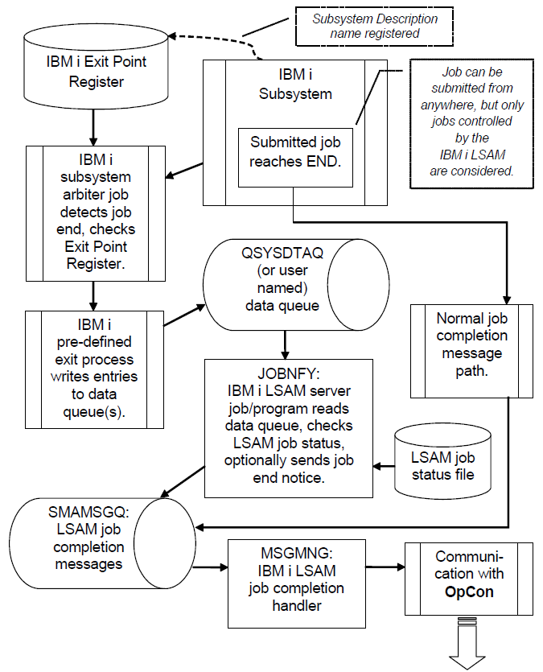

# Operating the LSAM

## Entering the LSAM Environment

There are two commands that can be used to enter the LSAM green screen workstation menus: STRSMA and LSAMENU.

The STRSMA command may be used when the LSAM environment library list is not in effect because it will set the interactive job's library list before the LSAM menu is displayed. Depending on how the SMAGPL utility library support has been configured, it may be necessary to qualify the STRSMA command with the library name: SMAGPL/STRSMA. This requirement can be eliminated either by choosing to copy some LSAM commands into the QGPL library, or by adding SMAGPL to the IBM i default user library list.

The command LSAMENU is more direct because it skips the splash display, and it may also be a convenient tool for programming or scripting since it supports an optional parameter that allows an LSAM sub-menu to be specified for direct access. From outside of the LSAM library list, the LSAMENU command requires that the LSAM Environment name be specified using its ENV() keyword parameter.

Throughout the **IBM i LSAM** documentation, wherever the STRSMA command is specified, in most cases it will be acceptable to replace that with the command LSAMENU, as long as the differences in the command parameters are observed and the LSAM environment library list is available when the LSAMENU command is used.

### The STRSMA Command

There are two optional parameters associated with the STRSMA command. In order to view the parameters and change their values, press <**F4**> (Prompt) after typing the command (and before pressing <**Enter**>). The parameters may also be typed as in the example below.

#### Syntax
```
SMAGPL/STRSMA ENV(my_environment_name) ANIMATE(*YES|*NO)
```

- **ENV**: This parameter is the LSAM Environment name. This parameter specifies the library list that will be used by the LSAM.
  - The default value is SMADEFAULT, or another environment that has been created and selected as the default. The default library list distributed by SMA contains the SMADTA, SMAPTF and SMAPGM installation libraries.
  - Do not change this parameter unless the IBM i LSAM has been installed to a different set of libraries or an additional environment has been created that uses a different library list.
- **ANIMATE**: This parameter is no longer used. It is retained in order to remain compatible with existing product installations that might have used it.

:::info example
The ENV parameter can be specified by position without the keyword:

```shell
SMAGPL/STRSMA SMADEFAULT
```
**- or -**
```shell
SMAGPL/STRSMA <alternate_environment>
```
:::

:::tip
When specifying an alternate LSAM environment it may be necessary to use an alternate name for the SMAGPL library, unless the alternate environment's library list has been stored in the LSAM Environment master files in the SMADEFAULT LSAM environment (which uses library name SMAGPL).
:::
### The LSAMENU Command

There are two optional parameters associated with the LSAMENU command. In order to view the parameters and change their values, press <**F4**> (Prompt) after typing the command (and before pressing <**Enter**>). The parameters may also be typed as in the example below.

#### Syntax
```
SMAGPL/LSAMENU ENV(my_environment_name) MENUNBR([0])
```
- **ENV**: This parameter is the LSAM Environment name. This parameter specifies the library list that will be used by the LSAM. 
  - The default value is \*CURRENT. This special value means that if the current job already has its library list set to the LSAM environment, the command driver program will assume that the request for an LSAM menu applies to the environment indicated by the job's library list. If this default value is used with the LSAMENU command in a batch job, it will be replaced by the special value \*DEFAULT, therefore, it may be better to specify n LSAM environment name when using the LSAMENU command in a batch job.
  - Other values that can be used for this parameter include:
    - \*DEFAULT = the LSAM environment that was indicated as the default environment by the SMALIBMGT command function.
    - \*SELECT = a list of LSAM environments will be presented asthe command is executed so that the user may select the desired LSAM environment.
    - IBM i LSAM patch instructions
    - Name = a specific LSAM environment may be indicated by its name, such as SMADEFAULT.
- **MENUNBR**: Specifies the LSAM main menu when the default value of zero (0) is used, otherwise, values 1 - 6 and 8 may be used to enter directly to one of the LSAM sub-menus.
  - When a sub-menu is specified, pressing F3=Exit from the sub-menu does NOT return to the LSAM main menu, but instead returns the user or program to the calling program where the LSAMENU command was issued; this may be the Command entry screen.

:::info example
The following command enters an alternate LSAM environment going directly to the Events and Utilities sub-menu:

```shell
SMAGPL/LSAMENU ENV(alternate_environment) MENUNBR(3)
```

Additionally, the parameters can be specified by position without the keywords, but with the environment value:

```shell
SMAGPL/LSAMENU *DEFAULT 3
```
**- or -**
```shell
SMAGPL/LSAMENU <alternate_environment> 3
```

If the environment value is not specified, the current library list will be used to determine the LSAM environment, or in a batch job the \*DEFAULT environment will be used. If the current library list of an interactive job does not support an LSAM environment, the command will assume \*SELECT for the environment and will present a list of available LSAM environments.

##### SMAGPL/LSAMENU

When no menu number is specified, the LSAM Main Menu will be shown. It is not necessary to use the SMAGPL/ library qualifier if the current library list includes the LSAM libraries.
:::

### Start the LSAM Interactive Menu System

1. In the command line, enter **SMAGPL/STRSMA**. The LSAM Menu system welcome screen appears.
:::tip
This display will show Load source: LI181027U PTF181027 when the LI181027U install file is used.
:::

#### LSAM Welcome Screen
```
 SYSTEMNAME    W E L C O M E   T O   T H E   I B M  i   A G E N T      MM/DD/YY 
 USERNAME       Env: SMADEFAULT  SMA Default                           HH:MM:SS 
                                                                                
  Press Enter to continue to the main menu.                                     
                                                                                
                                                                                
                                                                                
                   OOO           CCC                                            
                  O   O         C   C                     x 0   x               
                 O     O       C                           x  x                 
                 O     O pppp  C       ooo  n nn            x                   
                 O     O p   p C      o   o n   n         x  x                  
                 O     O p   p C      o   o n   n       xx   xx                 
                  O   O  p   p  C   C o   o n   n      xx    xx                 
                   OOO   pppp    CCC   ooo  n   n     xx     xx                 
                         p                           x       x                  
                         p                                                      
                               by SMA Technologies                                 
                                                                                
                                                            Version: 18.1       
 Load source:  LI181027U PTF181027                          PTF LVL: 109        
                                                             DB LVL: 003        
 F3=Exit   F5=Animate   F12=Cancel   Enter=Menu                                 
 Copyright (C) SMA Technologies 1995, 2018. ARR.                                
```

1. Press the <**Enter**> key to continue to the IBM i LSAM Main Menu.

#### LSAM Interactive Menu
```
 SYSTEMNAME         I B M  i   L S A M   M A I N   M E N U             MM/DD/YY 
 USERNAME                                                              HH:MM:SS 
                                                                                
  Select one of the following:                                                  
                                                                                
                                                                                
      1. Job Track menu                                                         
      2. Message Management menu                                                
      3. Events and Utilities menu                                              
      4. Operator Replay menu                                                   
      5. Restricted Mode and Multi-Step Job menu                                
      6. LSAM management menu                                                   
      7. LSAM parameters                                                        
      8. SMA File Transfer menu                                                 
      9. PTF and Security menu                                                  
                                                                                
                                                                                
                                                                                
 Selection or command                                                           
 ===> __________________________________________________________________________
 ______________________________________________________________________________
                                                                                
 F3=Exit   F4=Prompt   F9=Retrieve   F12=Cancel                                 
 F13=Information Assistant  F16=System main menu                                
```
## LSAM Management Operations

### Starting the LSAM Server Jobs

Begin processing OpCon jobs by starting the LSAM using either of the two following methods:

#### Option One: Start the LSAM through SMA Menus

1. Log in to the IBM i as **QSYSOPR** or a user profile with privileges to access the LSAM menu and to use the LSAM startup program.
2. Start the LSAM through the menu system with the following steps.

    a.  At the command line, enter **SMAGPL/STRSMA**.
    :::tip
    If using multiple environments, refer to The STRSMA Command.
    :::

    b.  Enter **6** to choose the **LSAM management menu**.

    c.  Enter **1** to choose the **Start LSAM (STRSMASYS)** option.

#### Option Two: Start the LSAM Manually

1. To start the LSAM manually, enter **SMAGPL/STRSMASYS** in the command line. Optionally, specify the name of the LSAM environment in the ENV parameter. 
:::tip
The STRSMASYS command driver program temporarily sets the job's library list to match the specified LSAM environment, so it is not necessary to manually manage the job's library list when using this command.
:::
2. The optional ENV parameter enables the copy of the command in library SMAGPL to be used from the IBM iSeries Navigator to start the LSAM without having to log on to a green screen workstation.

### Stopping the LSAM Server Jobs

Stop the LSAM using either of the methods below.

:::tip
For either option, please verify the Subsystem SMASBS has ended. Do this by using the IBM i command WRKSBSJOB, using the correct name for the LSAM subsystem (the default name is SMASBS), or by using the LSAM menu function. Refer to [Check LSAM Subsystem Status](../operations/lsam.md#check-lsam-subsystem-status) described below.
:::

#### Option One: Stop the LSAM through SMA Menus

1. Log in to the IBM i as **QSYSOPR** or a user profile with equal privileges.
2. Stop the LSAM through SMA menus with the following steps.
    
    a.  In the command line, enter **SMAGPL/STRSMA**.
    :::tip
    If using multiple environments, refer to The STRSMA Command.
    :::

    b.  Enter **6** to choose the **LSAM management** menu.

    c.  Enter **2** to choose the **End LSAM (ENDSMASYS)** option.

#### Option Two: Stop the LSAM Manually

1. To end the LSAM manually, enter **SMAGPL/ENDSMASYS** in the command line. Optionally, specify the name of the LSAM environment in the ENV parameter. 
:::tip
The STRSMASYS command driver program temporarily sets the job's library list to match the specified LSAM environment, so it is not necessary to manually manage the job's library list when using this command.
:::
2. The ENDSMASYS command supports an optional parameter that may be used to specify the LSAM environment name. This parameter enables the copy of the command in library SMAGPL to be used from the IBM iSeries Navigator to stop the LSAM without having to log on to a green screen workstation.

### LSAM Communication Idle Timeout

The IBM i LSAM sockets communications program actively monitors TCP/IP communications. When the LSAM does not receive communication from OpCon for a specified amount of time (according to the communications timing parameters described above), the LSAM sends a warning message to the IBM i Operator Message queue.

:::info example
The following is a warning message to the IBM i Operator Message queue when communication between the LSAM and OpCon is idle:

Message ID: SMA0009

Message file: SMAMSGF

Severity: 40

Message . . . . : OpCon LSAM communications idle time exceeded on port &1. Lost connection? The OpCon IBM i LSA sockets communications program has not received any data or any request to connect for longer than the idle time specified in the LSAM Parameters control file. This warning usually occurs when the TCP/IP connection has been interrupted. The communication program will continue to monitor for a connection on the specified port, however, under some circumstances it might be necessary to stop and restart the LSAM communications program.
:::

Upon receiving this warning message, contact the OpCon system administrator to check data communications between OpCon and the IBM i LSAM.

This message repeats at the end of every idle interval until data communications has been restored.

The IBM i LSAM sockets communications program will remain in a state that is ready for communications with OpCon. When OpCon is able to resume communications, the connection will be automatically restored without needing to stop and restart the IBM i LSAM server programs. 

## LSAM Management Screens and Windows

### LSAM Management Menu

```
 SYSTEMNAME                   LSAM MANAGEMENT MENU                     MM/DD/YY 
 USERNAME                                                              HH:MM:SS 
                                                                                
  Select one of the following:                                                  
                                                                                
                                                                                
      1. Start LSAM (STRSMASYS)                                                 
      2. End LSAM (ENDSMASYS)                                                   
      3. Check LSAM subsystem status                                            
      4. Manage LSAM logging                                                    
      5. View LSAM logs                                                         
      6. Work with LSAM Servers (WRKSMASVR)                                     
      7. LSAM Parameters configuration                                          
      8. Alternate Job Notify menu                                              
      9. Job Status Monitor menu                                                  
                                                                                
                                                                                
                                                                                
 Selection or command                                     (C) SMA 1995,2021  
 ===> ________________________________________________________________________
 ___________________________________________________________________________                                                                                
 F3=Exit   F4=Prompt   F9=Retrieve   F12=Cancel                                 
 F13=Information Assistant  F16=System main menu                                                               
```
### Menu Pathways

Main Menu > LSAM management menu (#6)

#### Fields

Selection or command: Type the menu item number and press <**Enter**> to start the function.

#### Options

- 1=Start LSAM (STRSMASYS)
- 2=End LSAM (ENDSMASYS)
- 3=Check subsystem SMASBS status (the actual subsystem displayed depends on the settings of the LSAM Parameters).
- 4=Manage LSAM logging
- 5=View LSAM Logs
- 6=Work with LSAM Servers (WRKSMASVR)
- 7=LSAM Parameters configuration *(same as on LSAM Main Menu, option 7)*
- 8=Alternate Job Notify menu 
- 9=Job Status Monitor menu  

The options displayed on this menu are explained in the following sections of this document. Type an option number in the Selection or command line and press <**Enter**> to begin using any of the options.

#### Functions

- **F3=Exit**: Returns to the master menu
- **F4=Prompt**: Prompts for keywords for any command entered in the Select or command line.
- **F9=Retrieve**: Retrieves the previous command that was entered on the Select or the command line. If it is pressed multiple times, the system goes further and further back to previous commands.
- **F12=Cancel**: Returns to the master menu.
- **F13=Information Assistant**: Displays the IBM i general help screen.
- **F16=System main menu**: This is always shown on any system-generated menu screen. It branches to the general command entry menu for IBM i. Return to the previous menu by pressing <**F3**> or <**F12**>. This function is not commonly used, and can be restricted for certain user profiles.

### Start LSAM (STRSMASYS)

The Start LSAM option starts the IBM i LSAM subsystem (default name SMASBS) and the LSAM server programs. Use the LSAM management function "Check LSAM subsystem status" to verify the results.

### End LSAM (ENDSMASYS)

The End LSAM option stops the IBM i LSAM server programs and the LSAM subsystem. Use the LSAM management function "Check LSAM susbsystem status" to verify the results.

### Check LSAM Subsystem Status

The Check LSAM Subsystem Status option executes the IBM i command WRKACTJOB (i.e., Work with Active Jobs). The command displays the jobs active in the LSAM subsystem defined in the LSAM configuration parameters. From the WRKACTJOB display, press the Help key to view a complete description of all the data displayed.

:::caution
Unless directed by SMA Support, do not execute any of the options on this screen that affect the job status. Options 5 and 8 are allowed. If option 7 is required, please contact the Support team at SMA for help with determining the cause of the MSGW status.
:::

Work with Active Jobs Screen
```
                             Work with Active Jobs                   SYSTEMNAME 
                                                         MM/DD/YY  HH:MM:SS CDT 
 CPU %:      .9     Elapsed time:   00:04:00     Active jobs:   237             
                                                                                
 Type options, press Enter.                                                     
   2=Change   3=Hold   4=End   5=Work with   6=Release   7=Display message      
   8=Work with spooled files   13=Disconnect ...                                
                     Current                                                    
 Opt  Subsystem/Job  User        Type  CPU %  Function        Status            
      SMASBS         QSYS        SBS     2.6                   DEQW             
  __    JORCMN       SMANET      BCH     2.2  PGM-JORCMNR00    DEQA             
  __    LSAJOR       SMANET      BCH     2.4  PGM-LSAJORR00    DEQW             
  __    LSAMNG       SMANET      BCH     2.2  PGM-DLTLOGR00    DEQW             
  __    MSGMNG       SMANET      BCH     2.6  PGM-LSARCMR00    DEQW             
  __    SKTCMN       SMANET      BCH     2.4  PGM-CMNSKTR00    SELW
  __    SMAFTS       SMANET      BCH     2.6  PGM-SMAFTSR00    DEQW
  __    TRPMSG       SMANET      BCH     2.5  PGM-TRPMSGR00    DEQW
  __    TXMMNG       SMANET      BCH     2.7  PGM-LSASCHR00    DEQW             
                                                                                
                                                                                
                                                                         Bottom 
 Parameters or command                                                          
 ===>                                                                           
 F3=Exit   F5=Refresh       F7=Find      F10=Restart statistics                 
 F11=Display elapsed data   F12=Cancel   F23=More options   F24=More keys       
```

#### Menu Pathways

Main Menu > LSAM management menu (#6) > Check LSAM subsystem status (#3)

### Manage LSAM Logging

The IBM i LSAM supports active control over its logging capabilities. Logging is a local function useful to system administrators, IT auditors, programmers and support technicians. For a complete description of how to use the logging features, refer to [Log File and Database Management](../logs-database/overview).

### View LSAM Logs

This menu option provides direct access to the list of available LSAM log viewers. For more information about how to use the log views, refer to [Log File and Database Management](../logs-database/overview). This menu function supports viewing the general debug log files associated with most types of jobs that the LSAM controls. However, there are certain specialized debug log file viewers that do not appear on this menu, but are supported from other LSAM sub-menus because they are specifically associated with the LSAM features on those menus.

### Work with LSAM Servers (WRKSMASVR)

This menu option presents a convenient display that shows the actual running status of each LSAM server job. Options at the top may be used to start or end individual server jobs or groups of jobs. This is not the normal method recommended for managing the LSAM server jobs. Therefore, this Work With function is not documented here.

However, the groups of server jobs correspond to the categories of LSAM server jobs that are managed by the LSAM PTF application process. Use option 5 to view the details of a PTF control record (LSAM sub-menu 9, option 1) to see the LSAM processes that must be stopped in order to apply a given PTF. In most cases, PTFs are applied cumulatively and the management of the LSAM server jobs is automatic.

It may be helpful to view this display in case there is any question about whether the LSAM server jobs are performing normally. However, better detail, such as an indication of a job being stuck in a MSGW (message wait) error status, is available from this same menu using option 3.

### LSAM Parameters Configuration

This is the same function that is documented in detail in the Configuration topic. It appears on this sub-menu for convenience.

### Alternate Job Notify Menu

This option provides access to a sub-sub-menu of functions that support a different method for the LSAM to detect when any jobs in the IBM i system have started or ended. The Alternate Job Notify feature is provided for special purposes only, including supporting the True Passive mode of Job Tracking and for use by SMA Support to perform exceptional diagnostic procedures. User instructions are provided in the following section of this document.

### Job Status Monitor Menu

This option provides access to a sub-menu of functions that support the optional LSAM server named JOBSTS.  This server is able to watch for any jobs in IBM i subsystems that the user may select that are stuck in the MSGW (message wait) status.

Details about the purpose and management of this optional server job are found in [Monitoring for IBM i Jobs in MSGW Status](/operations/tips#monitoring-for-ibm-i-jobs-in-msgw-status) under the Operation Tips and Techniques of this chapter about IBM i Components and Operations.

## Alternate Job Notify Service

This optional feature of the IBM i Agent for OpCon (also called the IBM i LSAM) is not required for normal operation of the Agent, unless the Job Tracking feature will be configured with any records using the Passive mode.

The Job Notify service was originally designed for some SMA clients who have third-party applications running in their IBM i system that interferes with the normal operation of the LSAM's job completion message processing. In those cases, the Alternate Job Notify server may be useful for restoring the LSAM's communication with OpCon to 100% accuracy about completed jobs.

The symptom of the problem that the full operational mode of the Alternate Job Notify service will solve is an IBM i job still showing as active on an OpCon schedule after it has been confirmed (for example, by a human operator) that the job has already completed. This same symptom can occur in rare situations when some of the LSAM server jobs might encounter an error condition and are stuck in the MSGW (message waiting) status. If an operator confirms that the LSAM servers are operating normally, and other IBM i jobs are being reported as complete, then this might be a situation that would benefit from using the Alternate Job Notify server. The final confirmation of this symptom is when it is always the same job (or only certain jobs) that are not being reported to OpCon as completed.

SMA suggests the client should consult with SMA Support before considering implementing the Alternate Job Notify service. There is no need to impose this additional overhead on system capacity unless the specific problem it fixes has been confirmed, or unless the client needs to use the Passive mode of job tracking. It is important to understand the multi-step procedure for activating Job Notification, which is done separately for each IBM i subsystem where jobs must be monitored.

Following the [Alternate Job Notify - Job End Process](../operations/lsam.md#alternate-job-notify---job-end-process) illustration, there is an outline of the steps required to implement the Alternate Job Notify service. There are multiple steps that must be carefully complete in the correct sequence in order for the Job Notify server to operate correctly. Also, many of the configuration steps require a high level of security permission. The implementation steps should be completely reviewed first before attempting to execute any of the steps. The [Alternate Job Notify - Job End Process](../operations/lsam.md#alternate-job-notify---job-end-process) flow chart may help with understanding each of the configuration steps.

The Job Notify service is actually comprised of two different IBM i LSAM server jobs. The JOBNFY server job handles the Job End messages, as illustrated in the [Alternate Job Notify - Job End Process](../operations/lsam.md#alternate-job-notify---job-end-process) figure. The other JOBNFY4 server job is not illustrated in that figure. It handles a separate message type generated by IBM i that is generated whenever a job enters a job queue that is attached to a subsystem which has been configured for job notify services.

### Job Notify Service for Passive Job Tracking

The JOBNFY4 job uses the job queue entry messages to update the LSAM Job Tracking master log file with the actual IBM i full job ID, after that job has already passed through the Job Tracking exit program in "passive" mode. Just after the job enters a job queue, the system notification message is able to provide critical detail about the job being tracked. This IBM i system information is combined with OpConschedule and Job Master information that enables the full operation of OpCon automation, but without interrupting the native IBM i job submission process (as would be the case with this LSAM's standard Job Tracking and Job Queuing methods).

The Job End message processing of the JOBNFY server is also critical for Passive Job Tracking. This is because the LSAM job start services were not used to initiate the IBM i job, and therefore the standard IBM i job completion message will not be sent to the job completion message queue that the LSAM is monitoring. Instead, the Job Notify service forwards the IBM i Job End message to the LSAM job completion message queue.

More information about Passive Job Tracking may be found in [Job Tracking and Queuing](../job-tracking/overview).

### Flow Chart of Alternate Job Notify Processing

The Alternate Job Notify server job processes transactions put into the data queue specified in the Exit Program Register. The Job Start message management works similar to the following Job End process.
 
### Alternate Job Notify - Job End Process



### Instructions for Configuring the Alternate Job Notify Service

SMA recommends that all of these steps be studied and fully understood before beginning the procedure. This procedure assumes the PTF has been successfully applied. Some steps require a high level of security
permission.

### Procedure to Add Job Notify Subsystem Records

1. Navigate to the IBM i LSAM sub-menu 6: LSAM Management menu, then select option 8: Alternate Job Notify menu.
2. Execute option 7: Job notify configuration, to set the control values for this new feature. Do NOT set the first flag, "Use Alt Job Notify Server" on at this time, leave it set to 'N' = No. Refer to Screens and Windows, below, for more information.
3. Execute option 1 from the Alternate Job Notify Menu and then use F6=Add to create one or more Job Notify Subsystem control records. Add one record for each IBM i subsystem where a job may start that has demonstrated a problem with notifying OpCon about the job end. Do not add more subsystems than are needed to solve the job end notification problem. Refer to Screens and Windows, below, for more information about using this function.

    ***Authority:*** This function requires data authority to add records to the file JOBNFYF00 in the SMADTA library. Prompting with function key F4 in the subsystem name field also requires read authority to all the subsystem descriptions in the IBM i partition. However, F4 is not required, as long as the user knows the exact subsystem name and the library location of each subsystem description.
4. From the same Work with function, type option 1 next to each subsystem control record in order to add its Exit Program number to the IBM i exit point registry.

    ***Authority:*** This function requires authority to the IBM i command ADDEXITPGM and to the exit point registry.
5. To use the new exit points, each IBM i subsystem must be stopped and then restarted. This operation can be performed from outside of the LSAM menu system, using the commands ENDSBS and STRSBS. However, the Work with Alternate Job Notify function provides options 6 and 7 as   a convenient way to perform these functions.

    ***Authority:*** This function requires authority to the IBM i commands ENDSBS and STRSBS. It also requires execution authority to the subsystem descriptions named in each record.
6. Now it is time to set the Alt Job Notify Configuration flag that says to use the new feature. From the sub-sub-menu 8: Alternate Job Notify Menu, select option 7: Job notify configuration. Type a "Y" or a "T" in the first field, called "Use Alt Job Notify Server," then press <**Enter**> to complete this update.
7. If the other LSAM server jobs are already started, execute sub-sub-menu 8 option 3: Start job notify server. (This new LSAM server jobs, called "JOBNFY" and "JOBNFY4" will be stopped and started automatically the next time all the LSAM server jobs are stopped or started, after the control flag is set in step 6, above.)
8. Now it is possible to confirm that the exit point is properly registered and the Job Notify server is working correctly. There is no convenient way to view a subsystem's status in order to confirm if it is ready to use the IBM i exit point. Instead, SMA has provided option 8=TestNtfy to perform a test of each subsystem that is listed in the Work with Job Notify Subsystem list display. Type option 8 next to each subsystem and press <**Enter**> to start the test process. 

  As option 8 is executed, a message will appear at the bottom of the display naming the ID of the submitted test job (the job name will always be SMANTFYTST). The list display will show a test status of "Pending," and after the test job completes it will be possible to press F5=Refresh to see the final confirmation status of "Verified." There should be log information  vailable about this test job in the log viewer, option 2 on this sub-sub-menu 8.

  ***Authority:*** The testing job is submitted with the name of the user profile who starts the test. The test procedure requires the starting user to have authority to put jobs in the job queue that is named on the Job Notify control record for each subsystem. The user must also have authority to read the LSAM default job description, SMADTA/SMALSAJ00. The test job executes the WRKREGINF command, producing a useful report, therefore the user must have authority to use the WRKREGINF command. The output queue used for the report will be the *CURRENT output queue of the interactive job that is submitting the test.

9. If the test notify job does not quickly result in a Verified status, first check to be sure the named subsystem is active and then view the job queue (WRKJOBQ) that is named in the Job Notify subsystem control record to see if the job is still waiting for execution. If the job has already completed execution, then it may be necessary to review these procedures and confirm that each step was completed correctly.

  Finally, please contact SMA Support for assistance if the test notify job cannot be completed successfully. This Alternate Job Notify procedure cannot be relied on unless the test notify job has completed successfully.
10. After the Job Notify subsystems are each verified, the Alternate Job Notify feature does not require any special attention. It will be stopped and restarted along with the other LSAM server jobs. The Job Notify message log will be automatically purged at the same time as the LSAM job status master records.

### Procedure to Change Job Notify Subsystem Records
All the general rules for the Add procedure, above, still apply. But to change the control values for any subsystem, this is the order in which steps must be executed. References to "options" are from the Work with Job Notify Subsystems list display.

1. Remove the exit program entry (option 9).
2. Change the LSAM control record for the subsystem (option 2).
3. Add the revised exit program entry (option 1).
4. After making sure no jobs are currently executing in the subsystem, End the subsystem (option 6).
5. After a brief pause, Start the subsystem (option 7).
6. Re-test the subsystem to make sure that the exit program registration is active (option 8).

The procedure for removing subsystems from participating in the LSAM Job Notify process is to remove the exit program entry (option 9) and then end and restart the subsystem (options 6 and 7). Optionally, the LSAM control record for this subsystem can be deleted from the list, unless the details should be saved for resuming processing in the future.

### Alternate Job Notify Screens and Windows

#### Alternate Job Notify Menu

Alternate Job Notify Menu
```
 SERNUMBER                  ALTERNATE JOB NOTIFY MENU                  MM/DD/YY 
 USERNAME                                                              HH:MM:SS 
                                                                                
  Select one of the following:                                                  
                                                                                
      1. Work with job notify subsystems                                        
      2. View job notify message log                                            
      3. Start job notify server                                                
      4. End job notify server                                                  
      5. Check LSAM subsystem status                                            
                                                                                
      7. Job notify configuration                                               
                                                                                
                                                                                
                                                                                
                                                                                
                                                                                
                                                                                
 Selection or command                                     (C) SMA 2013          
 ===>                                                                           
                                                                                
 F3=Exit   F4=Prompt   F9=Retrieve   F12=Cancel                                 
 F13=Information Assistant  F16=System main menu                                
                                                                                
```

#### Menu Pathways

Main Menu > LSAM management menu (#6) > option 8

#### Options

- 1=Work with Job Notify subsystems.
- 2=View job notify message log.
- 3=Start job notify server. Use this option to separately start just the JOBNFY server. The LSAM subsystem must already be active to use this option.
- 4=End job notify server. Use this option to separately stop the JOBNFY server job, without affecting other LSAM server jobs.
- 5=Check LSAM subsystem status. This view of the LSAM subsystem uses the IBM i command WRKACTJOB to view all jobs that are active in the LSAM's subsystem. This view can be used to verify when the JOBNFY server job is active.
- (Option 6 is reserved for future use.)
- 7=Job notify configuration.

Options 1, 2 and 7 are described in the following sections of this document.

Type an option number in the Selection or command line and press <**Enter**> to begin using any of the options.

#### Functions

- **F3=Exit**: Returns to the LSAM Management menu.
- **F4=Prompt**: Prompts for keywords for any command entered in the Select or command line.
- **F9=Retrieve**: Retrieves the previous command that was entered onthe Select or the command line. If it is pressed multiple times, you go further and further back to previous commands.
- **F12=Cancel**: Returns to the master menu.
- **F13=Information Assistant**: Takes you to the IBM i general help screen.
- **F16=System main menu**: This is always shown on any system-generated menu screen. It takes you to the general command entry menu for IBM i. Return to the previous menu by pressing <**F3**> or <**F12**>. This function is not commonly used, and can be restricted for certain user profiles.

#### Fields

##### Selection or command

Type the menu item number and press <**Enter**> to start the function.

### Alternate Job Notify Configuration

### JOBNFYD301 - Alternate Job Notify Configuration

#### Menu Pathways

Main Menu > LSAM management menu (#6) > Alternate Job Notify menu(#8) > option 7

#### Functions

- **F3=Exit**: Returns to the Alternate Job Notify menu without updating the control file.
- **F12=Cancel**: Returns to the Alternate Job Notify menu without updating the control file.

#### Fields

- **Use Alt Job Notify Server**: This control flag turns on or off all of the LSAM Alternate Job Notify functions, including automatically start or stop the JOBNFY server with the other LSAM server jobs.
  - VALUES: Y = yes, N = no, T=Tracked only
  - This control flag does not affect the IBM i exit point register and it does not affect the operation of IBM i subsystems.
  - Option "T" will limit the operation of these server jobs to only those jobs classified as Passive Tracked Jobs in the LSAM Job Tracking master file. Option "Y" will generate signals via the LSAM to OpCon for all jobs that are registered in the LSAM's OpCon Job Master log file, including support for Passive Job Tracking.
- **Default notify data queue/library**: The name of the data queue and the library location of that data queue which will be registered in the IBM i exit point registry for all registered subsystems to use when generating job ending transactions.
  - The data queue name is not important; SMA has recommended using the same name as an optional system default data queue that would be used for jobs ended from a job queue before they start (a function that is ignored by the LSAM in this application). This may help to make the purpose of this data queue more obvious.
  - The library location may be any library, but the LSAM database library is recommended since this object is created for use by the LSAM server jobs. The library must be located in a system ASP and not in an auxiliary ASP (a rule that applies to all LSAM objects).
- **Signal OpCon when job ends**: This control flag enables the optional function of the LSAM using the exit point signal about a job end to notify OpCon that the job has ended.
  - VALUES: Y=yes, N=no.
  - This operation will only be performed if the LSAM has not already received and processed the normal job completion message. Also refer to the Delay value in the next field, and please review the flow chart above to compare this method with the normal path of a job completion message.
  - This flag should normally be set to Y=yes, since the Alternate Job Notify server is only recommended for use when there is a problem with the normal LSAM job completion message function, or when Passive Job Tracking will be used.
  - When this flag is set to N=no, the JOBNFY server will only convert job completion messages from the data queue and store then in the LSAM Job Notify message log, for historical purposes. Using the JOBNFY server for this limited function might be helpful when trying to diagnose problems with the normal LSAM job completion message path.
- **Delay job end notify proc**: Set this value to the number of seconds that the JOBNFY server should wait after receiving a Job End notify message from the exit point processing, but before checking the LSAM job status master file.
  - This delay allows time for the LSAM to receive and process the Job Queue message received by the JOBNFY4 server job. When very short jobs are controlled by Passive Job Tracking, it is typical for the Job End message to arrive before the Job Queue message processing can complete the task of registering the complete IBM i job ID information in the LSAM Job Master log file. When the Job End message process fails to find the completed Job ID information, an error will be logged in the LSAM submitted job log file (LSALOGF30), which may be viewed using the LSAM sub-menu 6, option 5, log viewer 4. Also, the Passive Job Tracking function will not complete normally, so the tracked job will not appear on the OpCon schedule.
  - Choose the shortest value that does not cause short Passive Job Tracking to fail when looking for the LSAM job master log record. It appears that 1 second is not enough, but 2 seconds may be long enough. Try a longer wait value if there are still failures in Passive Job Tracking. If a longer wait time still does not work, please contact SMA Support for assistance.

## Work with Job Notify Subsystems

### JOBNFYR1 - Work with Job Notify Subsystems

#### Menu Pathways

Main Menu > LSAM management menu (#6) > Alternate Job Notify menu (#8) > option 1

#### Options

- **1=ADDEXITPGM**: Add an entry to the IBM i exit point registry. The type of registry used for this feature actually registers a data queue name and an associated IBM i subsystem description. A built-in IBM i function performs the operation of generating entries in the data queue for each job that uses the registered subsystem. The IBM i command WRKREGINF can be used instead of this menu option. The list display will be accurate after external maintenance is completed and the list display is refreshed. However, this option 1 offers the advantage of correctly formatting the exit point registration, which is critical for correct operation of the LSAM Job Notify feature.
- **2=Change, 3=Copy**: Use these options to maintain or create individual subsystems that can be supported by the LSAM job notify feature. Option 3 works like function key F6=Add.
- **4=Delete**: Type this option and press <**Enter**> to add one or more records to a list of pending delete requests. After the Enter key is pressed, a confirmation list will appear requesting confirmation of all delete requests before subsystem control records are actually removed. Note that the Delete action is also accompanied by a forced RMVEXITPGM command, although the named subsystem will not be stopped and restarted, which is required to completely stop the exit point's function.
- **5=Display**: Branches to a display of all the fields defining one subsystem control record.
- **6=ENDSBS**: This option is the same as using the ENDSBS command from IBM i command entry. A subsystem must be stopped and restarted (using option 7 or STRSBS) before the exit point registration will take effect.
  :::caution
  Be sure to confirm if there are any active jobs in a subsystem before executing this option. Jobs that are incomplete can be ended by this option, leading to possible data corruption.
  :::
- **7=STRSBS**: Refer to option 6, above. This is the same as using the IBM i command STRSBS.
- **8=TestNtfy**: Use this option to submit a predefined job that will test the LSAM Job Notify feature for each subsystem. This option is offered because there is no convenient way to confirm that a subsystem has been stopped and restarted with its exit point properly registered, and the Job Notify feature will not work unless proper registration procedures were followed (as outlined in an earlier section of this document).
- **9=RMVEXITPGM**: Refer to option 1, above. Use this option to disable the LSAM Job Notify feature for a subsystem. Deleting the LSAM control record for the subsystem will also perform this option. However, using this option does not stop and restart the subsystem, which is required in order to completely disable the effect of this exit point's function.

#### Functions

- **F3=Exit**: Returns to the Alternate Job Notify menu without updating the control file.
- **F5=Refresh**: The display program updates all the information about every control record. This refresh option is important when trying to verify the results of the option 8 Test Notify job.
- **F6=Add**: Press this function key to add a new subsystem control record.
- **F12=Cancel**: Returns to the Alternate Job Notify menu without updating the control file.
- **F16=Search next**: When a value was typed in the Search Content key, after the Enter key is used to find the first match, this function key F16 will continue the search to find the next matching record.
- **F17=Top**: Move directly to the top of the list display.
- **F18=Bottom**: Move directly to the bottom (last record) of the list display.
- **F21=WRKREGINF**: Authorized users can use this function key to get direct access to the IBM i exit point registry. Maintenance performed by the WRKREGINF command has the same effect as options 1 and 9 from this list display. Either method may be used to complete exit point registration, however, the options 1 and 9 offer the advantage of correctly formatting the exit point registration, which is critical for the correct operation of the LSAM Job Notify feature.
- **F24=More keys**: Toggles the function key legend on line 23 of the display to show more of the supported function keys.

#### Fields

- **SBS Name**: The name of the subsystem description that is registered for monitoring by the LSAM Job Notify server, in cooperation with an IBM i exit point registry entry.
- **SBSD Lib**: The name of the library where the subsystem description is stored. A subsystem may be described in more than one library location, however, only one subsystem of that name may be active in the system.
- **STS**: The active or inactive status of each subsystem. Use F5=Refresh to see the immediate status of a subsystem. This list is not automatically refreshed unless a maintenance function has been performed.
- **ExitPgmNbr**: The number of the exit point assigned to each subsystem. Exit points are automatically calculated during Copy and Add operations, but the user may override the exit program number in case there is a conflict in an IBM i partition.
- **ExitSts**: The list display program checks the IBM exit point registry to show whether each exit point is currently registered or unregistered.
- **Test Status**: The status of the last Test Notify job is displayed. If the exit point is ever removed, this field is set back to an untested status (blank). The status is shown as of the date listed in the next column.
- **MMDDhhmm**: The Month, Day, hour and minute of the last Notify Test job. Use option 5=Display to see the complete date stamp from the last update of the Test Status field. This field is set back to a default null date value (01010000) when no test has been performed, or when removing an exit point registration makes the last test status irrelevant.

### Job Notify Subsystem Details Display

#### Display Job Notify SBS Record
```
 JOBNFYR5               Display Job Notify SBS Record                 MM/DD/YY 
 USERNAME                                                                        
                                                                               
 Subsystem name  . . . : SMASBS                                               
   SBSD library  . . . :   SMADTA                                             
 Notify level  . . . . : 0006            0002 = Job end                        
                                         0006 = JOBQ+Job end (passive tracking)
                                          (Other values not supported)         
 Exit program number . : 2147483646      1-2147483647                          
                                                                               
 Test job queue  . . . : SMALSAQ00                                                      
   Job queue library . :   SMADTA                                                      
 Last test job number  : 123456                                                      
 Notify test status  . : Verified                                                      
 Last test status time : 2013-03-01-12.30.01.123450                           
                                                                               
                                                                               
 F3=Exit   F12=Cancel   F22=WRKACTJOB                                          
                                                                               
```

The display example above is used to illustrate the Display, Change, Copy and Add functions.

#### Menu Displays

- Main Menu > LSAM management menu (#6) > Alternate Job Notify menu (#8) > option 1 > option 2=Change
- Main Menu > LSAM management menu (#6) > Alternate Job Notify menu (#8) > option 1 > option 3=Copy
- Main Menu > LSAM management menu (#6) > Alternate Job Notify menu (#8) > option 1 > option 5=Display
- Main Menu > LSAM management menu (#6) > Alternate Job Notify menu (#8) > option 1 > function key F6=Add

#### Functions

- **F3=Exit**: Returns to the Alternate Job Notify menu without updating the control file.
- **F4=Prompt**: Appears only for the Copy and Add functions. Press this function key to view a list of all available subsystem descriptions throughout the entire IBM i partition, from which one may be selected to fill the Subsystem Name and Library fields.
- **F5=Refresh**: Appears only for Change, Copy or Add. Restores the field values to their original settings as they first appeared when this display format was accessed.
- **F12=Cancel**: Returns to the list display without updating the control file.
- **F22=WRKACTJOB**: Authorized users can use this function key to get direct access to the IBM i display of all jobs active in the subsystem named by this control record.

#### Fields

- **Subsystem name**: The name of the subsystem description that is registered for monitoring by the LSAM Job Notify server, in cooperation with an IBM i exit point registry entry.
- **SBSD library**: The name of the library where the subsystem description is stored. A subsystem may be described in more than one library location, however, only one subsystem of that name may be active in the system.
- **Notify level**: The LSAM currently supports only values 0002 and 0006. The choice of the value depends on the purpose.
  - Option **0002** causes only Job End messages to be generated by a subsystem. This type of message is the only type needed for the basic Alternate Job Notify feature of the LSAM, when the purpose is to catch the end of jobs that are not being detected by the LSAM's normal job completion message processor.
  - Option **0006** (actually a combination of 0002 and 0004) causes both Job End messages and Job Queue Entry messages to be generated by the subsystem. The LSAM depends on both message types to support the Passive Job Tracking feature.
- **Exit program number**: The number of the exit point assigned to each subsystem. Exit points are automatically calculated during Copy and Add operations, but the user may override the exit program number in case there is a conflict in an IBM i partition.
- **Test job queue**: The name of a job queue that is linked to this subsystem, which should be used whenever option 8=TestNtfy is selected from the list display. This field recognizes that more than one job queue can be connected to the same subsystem, and that one particular job queue may be the most appropriate one to use for the specialized test job. The maintenance program does NOT verify that this job queue is defined for use with the named subsystem description.
- **Job queue library**: The name of the library where the Test job queue is located. The program will verify that the test job queue exists before permitting the subsystem control record to be updated.
- **Last test job number**: Display only. Used by the notify test job only, this value is recorded by the list program as a test job is submitted, and then the value is used by the Notify Job server program to store the Verified status when the job end has been detected by the IBM exit point registry function.
- **Notify test status**: Display only. The status of the last Test Notify job is displayed. If the exit point is ever removed, this field is set back to an untested status (blank). The status is shown as of the date listed in the next column.
- **Last test status time**: Display only. The time stamp from the last update of the Test Status field. This field is set back to a default null date value (01010000) when no test has been performed, or when removing an exit point registration makes the last test status irrelevant.

### F4=Prompt: List Subsystem Descriptions

#### Prompting List of Subsystem Description
```
JOBNFYR3                  Select Subsystem Description               MM/DD/YY  
USERNAME                                                             HH:MM:SS  
                                                                               
Type 1 next to selected subsystem and press Enter to return.                   
                                                                               
Opt  SBS Name    SBSD Lib   
 _   QSNADS      QSYS
 _   QSPL        QINMEDIA
 _   QSPL        QSYS
 _   QSYSSBSD    QINMEDIA
 _   QSYSSBSD    QSYS
 _   QSYSWRK     QINMEDIA
 _   QSYSWRK     QSYS
 _   QUSRWRK     QINMEDIA
 _   QUSRWRK     QSYS
 _   QZSNDPR     QDP4
 _   Q1ABRMNET   QBRM
 _   SFTSMASBS   SUP033120D
 _   SMASBS      ISMADTA
 _   SMASBS      ISMADTAB
 _   SMASBS      LD040003
                                                                       More... 
F3=Exit  F12=Cancel                                                            
                                                                               
```

The display example above is used to illustrate the Display, Change, Copy and Add functions.

#### Menu Pathways

- Main Menu > LSAM management menu (#6) > Alternate Job Notify menu (#8) > option 1 > option 3=Copy > F4
- Main Menu > LSAM management menu (#6) > Alternate Job Notify menu (#8) > option 1 > function key F6=Add > F4

#### Functions

- **F3=Exit**: Returns to the Alternate Job Notify menu without updating the control file.
- **F12=Cancel**: Returns to the master record display without updating the subsystem name or library.

#### Fields

**SBS Name**: The name of the subsystem description.

**SBSD Lib**: The name of the library where the subsystem description is stored. A subsystem may be described in more than one library location, however, only one subsystem of that name may be active in the system.

### View Job Notify Message Log

Three different examples are presented to illustrate the effect of using function key F11 to change the sort order of the display. Notice the changes in the column headings. There will be some special log entries
when the JOBNFY servers start and stop. 

#### Alternate Job Notify Log - View 1 of 3 (F11=Sort)
```
JOBNFY20R1             Display Alternate Job Notify Log       00/00/00  00:00:00
USERNAME
  Type option, press Enter to continue.
    Opts:   5=Display   9=WRKJOB                  Search content: __________       
         Log entry time
  Opt  CCYY-MM-DD-HH.MM.SS  Job Name   Job User   JobNbr  Job Queue  JOBQ Lib       
   _   2013-03-26-09.57.42  SMANTFYTST JSMITH     079864
   _   2013-03-26-09.58.31  ANYJOBNAME JSMITH     079865
   _   2013-03-26-09.59.53  ZJOBLAST   JSMITH     079866

                                                                           Bottom
F3=Exit   F5=Refresh   F11=Sort   F12=Cancel   F17=Top   F18=Bottom
```

#### Alternate Job Notify Log - View 2 of 3 (F11=Sort)

```
JOBNFY20R1               Display Alternate Job Notify Log       00/00/00  00:00:00
USERNAME
  Type option, press Enter to continue.
   Opts:   5=Display   9=WRKJOB              Search content: __________
           Log entry time
  Opt  CCYY-MM-DD-HH.MM.SS  Job Name   Job User   JobNbr Job Queue  JOBQ Lib       
   _   2013-03-26-09.58.31  ANYJOBNAME JSMITH     079865
   _   2013-03-26-09.57.42  SMANTFYTST JSMITH     079864
   _   2013-03-26-09.59.53  ZJOBLAST   JSMITH     079866

                                                                           Bottom
F3=Exit   F5=Refresh   F11=Sort   F12=Cancel   F17=Top   F18=Bottom
```

#### Alternate Job Notify Log - View 3 of 3
```
JOBNFY20R1              Display Alternate Job Notify Log       00/00/00  00:00:00
USERNAME
Type option, press Enter to continue.
  Opts:   5=Display   9=WRKJOB          Search content:
        Job end time (DESC)
Opt  CCYY-MM-DD-HH.MM.SS] Job Name   Job User   JobNbr  Job Queue  JOBQ Lib       
 _   2013-03-26-09.59.53  ZJOBLAST   JSMITH     079866
 _   2013-03-26-09.58.31  ANYJOBNAME JSMITH     079865
 _   2013-03-26-09.57.42  SMANTFYTST JSMITH     079864

                                                                            Bottom
F3=Exit   F5=Refresh   F11=Sort   F12=Cancel   F17=Top   F18=Bottom
```

#### Menu Pathways

Main Menu > LSAM management menu (#6) > Alternate Job Notify menu (#8) > option 2

#### Options

- **5=Display**: Shows all the information for a single log entry.
- **9=WRKJOB**: If the user has authority to the IBM i command WRKJOB, this option provides access to details about the job named in the log entry.

#### Functions

- **F3=Exit**: Returns to the Alternate Job Notify menu.
- **F5=Refresh**: Rebuild the list after reading the log file again, may find new records.
- **F11=Sort**: Rotates the sort order of the list display among three  different sort sequences (refer to examples above).
- **F12=Cancel**: Returns to the Alternate Job Notify menu.
- **F17=Top**: Move directly to the top of the list display.
- **F18=Bottom**: Move directly to the bottom of the list display.

#### Fields

- **Opt**: An input field where one of the supported option numbers may be typed.
- **Log Entry Time (CCYY-MM-DD-HH.MM.SS) -- view 1 of 3**: The time stamp when the log entry was written to the file. The list is presented with the Log time stamp in ascending order, with the oldest entry showing first; use F18 to see the most recent log entry at the end of the file. Use option 5=Display to see the microseconds of the time stamp.
- **Job end time (DESC) (CCYY-MM-DD-HH.MM.SS) -- view 3 of 3**: The time stamp when the job actually ended. (DESC) indicates that the date/time values are listed in descending order, with the most recent date first. Use option 5=Display to see the microseconds of the time stamp.
- **Job Name**: The IBM i job name. When the list is sorted in Job  Name order, the Job Number is used as a secondary sort field.
- **Job User**: The user profile name from the IBM i job ID.
- **Job Name**: The IBM i job name.
- **JobNbr**: The IBM i job ID serial number. When the list is sorted  Job Name order, the Job Number is used as a secondary sort field.
- **Job Queue**: The name of the IBM i job queue does not normally appear. This field is included by the IBM i exit point operation, and it becomes important for log entries of jobs that were ended while being held in a job queue, before the job actually started. The IBM i LSAM Job Notify function does not use this type of exit  point transaction, it only uses type 0002 for jobs that end after being active.
- **JOBQ Lib**: The IBM i library name where the Job Queue is located. (Not used by the LSAM Job Notify function at this time.)

## Job Notify Message Log Details

### JOBNFY20R5 - Display Alternate Job Notify Log Entry

#### Menu Pathways

Main Menu > LSAM management menu (#6) > Alternate Job Notify menu (#8) > option 2 > option 5

#### Functions

- **F3=Exit**: Returns to the Alternate Job Notify menu.
- **F12=Cancel**: Returns to the log list display.
- **F21=WRKJOB**: If the user has authority to the IBM i command  WRKJOB, this function key provides access to details about the job named in the log entry.

#### Fields

- **Log time stamp**: The time stamp when the log entry was written to the file, as the data was converted from the original data queue message that the IBM i exit point processing had generated.
- **Primary key number**: An internal database number that uniquely identifies each log entry. This value could be useful for technical support purposes.
- **Job identifier**: The IBM i job ID, including the serial number, user name and job name.
- **Job queue name / library**: The name of the IBM i job queue does not normally appear. This field is included by the IBM i exit point operation, and it becomes important for log entries of jobs that were ended while being held in a job queue, before the job actually started. The IBM i LSAM Job Notify function does not use this type of exit point transaction, it only uses type 0002 for jobs that end after being active.
- **Message identifier / format**: These are internal use only fields `generated by the IBM i exit point processing. The information could be useful for technical support purposes. Format 01 indicates a Job End message, whereas format 02 indicates a Job Queue Entry message.
- **Job type**: The job type value is generated by the IBM i exit point processing. The meaning of each type value is displayed to the right.
- **Job sub-type**: The job sub-type value is generated by the IBM i exit point processing. The meaning of each sub-type value is displayed to the right.
- **Time job entered system**: The time stamp when the IBM i operating system first recognized the job. For most jobs, this is the time when the job was first added to a job queue.
- **Time job started**: The time stamp when the job became active, such as, when it was released from a job queue and the subsystem allowed job processing to begin.
- **Time job ended**: The time stamp when the job completed processing. This would be the same time as reported by the normal job completion message. This is also approximately the time when the exit point processing generated the data queue entry which was later converted by the IBM i JOBNFY server into this log entry.
- **Processing time used**: The number of milliseconds of actual CPU time required to process the job.
- **Job end severity code**: The IBM i message ID CPF1164 in the QCPFMSG message file lists the possible values for this field. A zero value is recognized by the LSAM Job Notify server as a normal job completion, in case JOBNFY discovers it must report the job completion status to OpCon. Non-zero values are reported as job failures to OpCon.