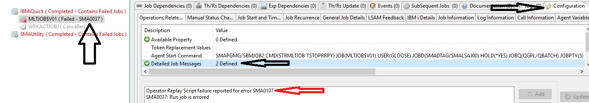

# Additional Information for OR Scripts

## Cursor Control Strings
| String | Description |
| ------ | ----------- |
| Backspace | Moves the cursor one column to the left, erasing a character (destructive backspace).|
|           | **Note**: Backspace must be contained within the confines of a single input-capable field. Attempting to use Backspace to move left from the first column of an input-capable field generates an error (use Cursor Left to accomplish a move to the left outside of a field definition). |
| Cursor Down | Moves the cursor down one row. When the cursor starts from the lowest row of the screen size, the cursor wraps to the same column position in row 1.
| Cursor Left | Moves the cursor one column to the left (without erasing a character like backspace would do). When the cursor starts from column 1, it wraps to the last column of the previous row. From row 1, column 1, the cursor wraps to the last column of the lowest row. 
| Cursor Right | Moves the cursor one column to the right. From the highest column number on a row, the cursor wraps to the first column of the next row. From the last column of the last row, the cursor wraps to row 1, column 1.
| Cursor Up | Moves the cursor up one row. When the cursor starts from row 1, it wraps to the same column position in the lowest row defined for the screen.
| Field Advance | Causes the cursor to move to the first column of the next input-capable field defined for a screen.
| Field Backspace | Causes the cursor to move to the first column of the previous input-capable field defined for a screen.
| Field Exit | Causes the cursor to move to the first column of the next input-capable field defined for a screen, while also clearing any data from the cursor start position to the end of the input-capable field that is being exited.
| New Line | Positions the cursor to the first column of the first input-capable field on a row below the starting location of the cursor. When the cursor starts from the lowest row that has an input-capable field, the cursor wraps to the first column of the first input-capable field from the top of the screen.

## Functions to Send
| Function Key | Description |
| ------------ | ----------- |
| ATTN | Sends an interrogative Attention signal to the display manager program in IBM i, causing whatever response has been defined for the Attention key. The Attention key usually suspends the screen dialog that was in progress. It interrupts screen dialog by presenting another screen's format that would not have been part of the defined dialog. Attention keys have a default action provided by IBM i (typically presenting a menu of options), but they may be changed using system control values and job attributes. They may also be overridden within a specific job by using the SETATNPGM command within that job. |
|      |  **Note**: SETATNPGM only takes effect for programs at, or lower in the invocation stack than the level where the command is issued. If the program returns to a higher level in the invocation stack, the system or job default setting for the attention key takes effect and the setting performed by the SETATNPGM command is abandoned. |
| ENTER | The default keyboard action that causes the input buffer contents to be returned to the IBM i program, usually without requesting any other special function. |
|       | **Note**: The action caused by the following function keys (F1-F24) may vary, depending on how the IBM i display format was  defined: User-created display formats can specify whether each function key returns the input buffer contents along with the function key command, or just return the function key command without returning any data that might have been entered by the display user (or display user intercept program). Some typical assignments that are made into function keys, such as by IBM i command entry/prompt screens, are listed in Function Keys. |
| F1 | Command/function key F1 (aid byte hexadecimal value '31')
| F2 | Command/function key F2 (aid byte hexadecimal value '3C')
| F3 | Command/function key F3 (aid byte hexadecimal value '31')
| F4 | Command/function key F4 (aid byte hexadecimal value '32')
| F5 | Command/function key F5 (aid byte hexadecimal value '33')
| F6 | Command/function key F6 (aid byte hexadecimal value '34')
| F7 | Command/function key F7 (aid byte hexadecimal value '35')
| F8 | Command/function key F8 (aid byte hexadecimal value '36')
| F9 | Command/function key F9 (aid byte hexadecimal value '37')
| F10 | Command/function key F10 (aid byte hexadecimal value '38')
| F11 | Command/function key F11 (aid byte hexadecimal value '39')
| F12 | Command/function key F12 (aid byte hexadecimal value '3A')
| F13 | Command/function key F13 (aid byte hexadecimal value '3B')
| F14 | Command/function key F14 (aid byte hexadecimal value '3C')
| F15 | Command/function key F15 (aid byte hexadecimal value 'B1')
| F16 | Command/function key F16 (aid byte hexadecimal value 'B2')
| F17 | Command/function key F17 (aid byte hexadecimal value 'B3')
| F18 | Command/function key F18 (aid byte hexadecimal value 'B6')
| F19 | Command/function key F19 (aid byte hexadecimal value 'B7')
| F20 | Command/function key F20 (aid byte hexadecimal value 'B8')
| F21 | Command/function key F21 (aid byte hexadecimal value 'B9')
| F22 | Command/function key F22 (aid byte hexadecimal value 'BA')
| F23 | Command/function key F23 (aid byte hexadecimal value 'BB')
| F24 | Command/function key F24 (aid byte hexadecimal value 'BC')
| HOME | The Home function key may be user-assigned to a specific location on the screen, or it may return the cursor to the first column of the first input-capable field on the screen.
| PAGEDN | Page Down (formerly known as Scroll Up) requests that the screen host program (or the system function that manages a display subfile) present the next available page of information available for a list that is on the screen (aid byte hexadecimal value 'F5'). |
|        | If Page Down is returned when the end of a list is already on the display, there may be a non-fatal error message returned.          |
| PAGEUP | Page Up (formerly known as Scroll Down) requests that the screen host program (or the system function that manages a display subfile) present the previous available page of information available for a list that is on the screen (aid byte hexadecimal value 'F4'). |
|        | If Page Up is returned when the beginning of a list is already on the display, there may be a non-fatal error message returned. |
| RESET  | This special function instructs the IBM i display manager to reset from an error condition that has previously set the input-inhibited indicator along with the screen error indicator (a low-level 5250 device status instruction). This function key has no effect and does not generate an error if the screen is not in a reset able condition. It should only be issued when the appropriate circumstances have been detected. Reset has no effect if the input-inhibited indicator has been set during the wait period after <**Enter**> or another function key has been used to return control of the screen to the IBM i display manager (and/or the program that presented the screen). |

## Operator Replay Script Exit Codes

One of the codes in the following table will be displayed as part of the completion information of an Operator Replay job in the OpCon Schedule view of the job status.

### Operator Replay Script Exit Codes
| Return Code | Description |
| ----------- | ----------- |
| SMA0100 |       Job completion successful
| SMA0101 |       Unable to find Telnet host
| SMA0102 |       Cannot open socket error
| SMA0103 |       Unable to connect to socket
| SMA0104 |       Failed to set socket attribute
| SMA0105 |       Error reset required (e.g., sent value is in error)
| SMA0106 |       Timeout (waiting for response from system)
| SMA0107 |       Comparison string error
| SMA0108 |       Invalid script name
| SMA0109 |       Script has no step records
| SMA010A |       Operator Replay failed: Technical failure at startup, see driver job loG
| SMA010B |       Operator Replay failed: STROPRRPY command incorrect DEVICE or IPADDR. Both must either specify a user-selected value, or both must be left set to '*DEFAULT'.
| SMA010C |       Operator Replay failed: OpCon job master not found
| SMA010D |       Operator Replay failed: Script user not provided to driver program
| SMA010E |       Operator Replay failed: Dynamic variable replacement error, see script log.
| SMA010F |       Operator Replay failed: SMAFAILJOB command in response rules, or general failure - see program dump report and driver job log.

## Managing Operator Replay Exit Codes via Multi-Step Job Scripts

This topic uses the Agent's [Multi-Step Job Scripting](/restricted-mode/multi-step-scripting#multi-step-job-scripting-1) tool as a likely example of how to detect failures of the Operator Replay start command STROPRRPY and how to retrieve and forward an Operator Replay failure message ID on to the OpCon server that has started the Multi-Step job.

The techniques described in this topic were introduced to the IBM i Agent version 18.1 in LSAM PTF # 181140.  (A similar enhancement was added at the same time to the newer LSAM version 21.1, via a different LSAM PTF.)

### STROPRRPY Command Parameter JOBTYPE(L)

A new value has been added to the STROPRRPY parameter JOBTYPE: value ‘L’ = Local.  This value engages enhance routines whenever an Operator Replay script is ending with one of its abnormal exit codes (SMA010*).  

The term "Local" refers to the control point where the STROPRRPY command is executed.  The JOBTYPE value is "O" when an OpCon server job directly starts an Operator Replay Script.  Other JOBTYPE values are used for testing Operator Replay from an IBM i command line or from an IBM i batch job (that was not submitted by the OpCon server).  Some of the new Operator Replay exit code management features are provided for test jobs (JOBTYPE values "A" or "T"), but JOBTYPE(L) is specially tuned to the purpose of redirecting exit codes from a Locally started STROPRRPY command, to return a job failure report and the Operator Replay exit code to an indirectly related OpCon IBM i job.

### Data Area QTEMP/OPRRPYERR Contains Operator Replay Exit Code

The Operator Replay script driver program is enabled for JOBTYPE(L) (and for the Test Job types A and O) with two means of reporting whenever the script execution may fail: 
- A data area “OPRRPYERR” is created in the job’s QTEMP library to hold the 7-character exit code from the Operator Replay script driver program.
- The script driver program OPRRPYR00 forces an abnormal end with the unique error message RNX0233, reporting that the program ended with “Halt indicator 1 on.”
    - The legacy method of ending a program with a Halt Indicator (\*INH1) on is used rather than the simpler \*PSSR subroutine with a \*CANCL action, which reports a generic forced program failure, so that the H1 indicator can be distinguished from an unexpected general program failure that needs programmer attention.  The H1 halt indicator will be documented in the IBM i job log of the script driver job. It will also appear in the LSAM steps log of a Mult-Step Job Script Job, (for JOBTYPE(L), since the Operator Replay script driver program will end with the unique error code of RNX0233 whose text is designed to report Halt indicators.

:::tip TECHNICAL TIPS
To start with, remember that the Operator Replay Script driver job is a separate job from the interactive workstation job that is being automated.  Any communication between those two jobs is accomplished via Workstation Display Output and Workstation Keyboard Input. It is also important to remember that the STROPRRPY command executes the Operator Replay Script driver program, which means that this is the program that an OpCon job for IBM i, job type Operator Replay, will monitor.

Put another way, the Script driver program does all the heavy lifting, including managing translation of Dynamic Variable {TOKENS} and execution of screen data capture and Data Capture Response Rules.  All this work is designed to support a virtual workstation's interactive job just as if there were a human operator reading the screen and typing on the keyboard.  The script driver job takes the place of the human operator.

The Operator Replay Script driver job does the work of creating the OPRRPYERR data area in the QTEMP library that belongs to the script driver program's job.  IBM i rules about the temporary QTEMP library created automatically for each job declare that other jobs are not allowed to view or update content of another job's QTEMP library.

So, it is not possible to retrieve an Operator Replay Exit code from the QTEMP/OPRRPYERR data area except from within the same IBM i job.  For example, if a Multi-Step Job Script uses the IBM i command SBMJOB to cause the STROPRRPY command to execute in a separate batch job, the QTEMP library for that job (where the data area will be created) is not accessible to any other job, including the submitting job.

As a result, communication between the interactive workstation job and a completely separate job that has submitted the Operator Replay Script driver job would require a complicated set of user-defined commands and OpCon Agent automation techhniques.  Some of these techniques become more possible with the OpCon Agent for IBM version 21.1 (and newer).

If it appears necessary to support communication among these three different jobs, SMA recommends re-evaluating the job flow and possibly separating the Operator Replay jobs from other work, relying on OpCon automation and data sharing techniques such as storing values into OpCon Properties and/or sharing OpCon Property values with the Agent's Dynamic Variables.  (Again, please refer to the Agent version 21.1 (and newer) for access to the more powerful Multi-Instance Dynamic Variables that can span a variety of inter-related jobs.)
:::

### Configuration of Multi-Step Scripts for Sending Operator Replay Exit Codes to OpCon Detailed Job Messages

This example configuration assumes that the OpCon server has submitted an IBM i batch job that will execute the STRMLTJOB command, and that a Step with the Script will execute the STROPRRPY command to spawn an interactive workstation job. 

In many cases, it might be simpler to confine Multi-Step Job Scripts and Operator Replay Scripts each to their own job within an OpCon Schedule.  But combining them offers the convenience of sharing job attributes by various methods within just one IBM i job.

Assuming the goal is to combine the features listed above for Operator Replay JOBTYPE(L), here is one way to configure components of the Multi-Step Job Scripting feature to send an Operator Replay exit code to the Detailed Job Messages of the original OpCon job that had started the Multi-Step Job Scripting.

- In case of an error in the Operator Replay script execution, the MLTJOB script will be triggered into error management mode by the RNX0233 error message ID.
    - This IBM i message ID is available to the Multi-Step script driver Steps via the $-System variable $ERRMSGID, if it is desired to trap and manipulate this message ID. But the $-System variable is not being used in this current example.
- An ON_ERROR pre-step should redirect the Multi-Step Job Script to a separate error handling sub-script using the SMAGOTO pseudo-command. (An example of this type of sub-script is provided below.)
    - In fact, the characters "SMAGOTO" comprise a reserved word recognized by the Multi-Step Job script driver, so there is no actual IBM i command called "SMAGOTO" that is part of the Agent software.
    - The sub-script can use the SMAJOBMSG command to forward the Operator Replay failure code (e.g., SMA0107) to the Detailed Job Messages of the OpCon MLTJOB job.
- Before any execution of this combination job, the LSAM Administrator must use Dynamic Variable maintenance from any of the LSAM Menus that support this function to pre-define a variable with a Function Code of \*DTAARA.
    - See the example below of how a variable with the suggested name of GETOPRERR (Get Operator replay Error) is configured for data area retrieval.
- The sub-script gets access to the Operator Replay exit code value by using an LSAM Dynamic Variable token such as {GETOPRERR} to fetch the value from the data area QTEMP/OPRRPYERR.
    - This is possible for the sub-script as long as the Multi-Step Job script driver program is part of the same IBM i job where the STROPRRPY command was executed; that is, the Operator Replay script driver program shares the same QTEMP library as the Multi-Step Job script driver program.
    - The sub-script first uses the SMAJOBMSG command to deliver the Operator Replay exit code to the OpCon job's Detailed Job Message.
    - The sub-script forces a complete abnormal job end by executing the Agent's utility command SMAFAILJOB.

Using the above implementation method, here is an image of the results in an OpCon Enterprise Manager user interface (where similar data is also accessible from the newer Solution Manager User Interface), showing how the failure of an embedded Operator Replay Script is reported to the OpCon job that started a Multi-Step Job script.



In the example above notice these results:
- The main job status shows the general LSAM job failure code of SMA0037.
    - Although this is only a general IBM i job failure message, it is much better than having the Multi-Step Job appear to end normally even though an embedded Operator Replay script has failed.
- Branching to the Job Information, use the Configuration Tab to find and click on Detailed Job Messages.
    - The first Detailed Job Message shown above was generated by the SMAJOBMSG command, and it reports the actual Operator Replay Script error.

In summary, this solution produces the expected trigger within the OpCon server that the Multi-Step Job has failed, and it provides the specific error code that points to the Operator Replay Script failure for a specific reason (as documented in the exit codes list above).

#### Examples supporting the Multi-Step Job Scripting solution outlined above.

##### Multi-Step Job Script Executes an Operator Replay Script with a Pre-Registered ON_ERROR Method
```
 MLTJOBR10-2              Multi-Step Job Script Steps                 00/00/00  
 USERNAME                                                             16:12:17  
              Script name..: TSTOPRRPY       Type..: STEPS                      
              Description..: Test failing Operator Replay Script                
 Type options, press Enter.                          Search content:            
   2=Change  3=Copy  4=Delete  5=Display  6=DspSrc                              
 Opt  Seq# S F Label      CNT Command text or LIBRARY/FILE(MEMBER)     View: 1  
        10     ON_ERROR       SMAGOTO SCRIPT(OPRRPYERR)                         
        20                    STROPRRPY OBJNAME(FORCEFAIL) JOBTYPE(L)           
                                                                        
```
In the example above, notice that neither step is coded with the "F" flag indicating that failure of a step should cause the whole script to fail.  This is because the local Step Failure management flag overrides the ON_ERROR scripted error management.

##### Multi-Step Job Sub-Script for Operator Replay Exit Code Management
```
 MLTJOBR10-2              Multi-Step Job Script Steps                 00/00/00  
 USERNAME                                                             16:29:20  
              Script name..: OPRRPYERR       Type..: STEPS                      
              Description..: Manage failing Operator Replay Script              
 Type options, press Enter.                          Search content:            
   2=Change  3=Copy  4=Delete  5=Display  6=DspSrc                              
 Opt  Seq# S F Label      CNT Command text or LIBRARY/FILE(MEMBER)     View: 1  
        10   F                SMAJOBMSG TEXT('Operator Replay Script fail **
        20   F                SMAFAILJOB                                        


**  Full description of the SMAJOBMSG text:
MLTJOBR10-5       Display Multi-Step Job Script Step Detail          00/00/00
USERNAME       Script Name: OPRRPYERR   Script Key #: 000000007      16:29:59
                                                                             
Step sequence nbr:    10                   Label  . :                        
Error Fail/Ignore: F     F,I,blank=I       Status . :    blk/A=Active,I=Inact
Description  . . : Handle failure of STROPRPRY command                       

 Command  . . . . : SMAJOBMSG TEXT('Operator Replay Script failure reported for 
error {GETRPYERR}') STSMSGID('{GETRPYERR}') JOB(*)                              

```
Sub-script details:
- **STEP # 10** 
    - The Dynamic Variable token {GETRPYERR} is used both within the the message TEXT( ) and for the STSMSGID( ), although in this example (as illustrated above in the Enterprise Manager user interface image), the Status Message ID is not actually displayed because the Multi-Step Scripting job final status message overrides it.  But this exmaple illustrates a technique that could prove useful for sending a Detailed Job Message to an OpCon IBM i job that is dedicated to an Operator Replay Script.
    - In the JOB(*) parameter the asterisk refers to the current job, which in this example is the same combination job that has executed both the Multi-Step Job script and the Operator Replay job script.

- **STEP # 20**
    - The SMAFAILJOB command is useful among many different IBM i Agent automation tools.  Its specific purpose is to support an immediate "stop now" action during the current Agent job and to report the failed job to either the OpCon server or to a higher-level Agent automation tool.
        - Some of the Agent's higher level automation tools are programmed to execute specialized job control actions and logging procedures when an SMAFAILJOB command is detected.

##### Definition of the Suggested GETOPRERR Dynamic Variable

```
 LSAVARR5                  Display Dynamic Variable                   00/00/00  
 USERNAME                                                                      
                                                                                
 Variable name . . . . : GETRPYERR     Sequence: 000                            
 Variable type . . . . : V             L=LDA, V=general variable                
 Char trim/LDA Str,Len : 0000  0000                /PGM+LIB, *HEX *DB2 *DTAARA  
 Value calc pgm/Fn Code: *DTAARA                  /*DATE *TIME *SYSVAL:FLD2=Name
 Description . . . . . : Fetch error Msg from OPRRPYERR dtaara                  


 LSAVARR7                                                             00/00/00  
 USERNAME                                                             16:43:27  
                                                                                
 Variable name . . . . : GETRPYERR     Sequence: 000   Type: V  LPos: 0000 0000 
                                                                                
 Data area name  : OPRRPYERR                                                    
 Library location: QTEMP                                                        
 Trim Strt,Length:    0     0          Optional trim returned value             
                                                                                       
```
The definition of the Dynamic Variable above does not reveal that the Agent's reserved data area is a Character data area that is only 7 characters long.  The fact that there is no Character Trimming specified in the LSAVARR5 master record definition implies that the value retrieved from the data area will be trimmed of all leading and trailing space characters whenever the {GETOPRERR} token is replaced with the data area value.  So an Operator Replay exit code of SMA0107 will occupy only 7 positions as it completely replaces the variable token.

##### Example Operator Replay Script Step to Force Failure
```
Control strings         If no match: F S=Skip, F=Fail   Comp numeric:   Y/N  
Top      Rule: EQ  Val: #                               R:  1  C:  1  L:  1  
```
An easy way to simulate failure of an Operator Replay Script is to include a Step that tries to compare Row 1, Column 1 of any screen display for some odd character.  Row 1, Column 1 is always reserved for a screen formatting character, so this Control String test would always fail, returning an exit code of SMA0107.

In the example above, these are the critical field values used to force error SMA0107:
- If no match: **F**
- Rule: **EQ**
- Value: **#**
- R (row): **1**
- C (column): **1**
- L (length): **1** (this field is optional)


